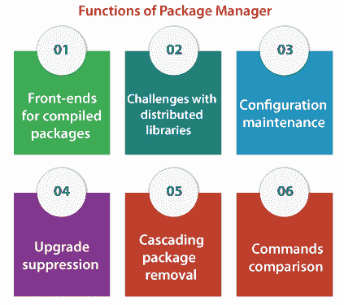
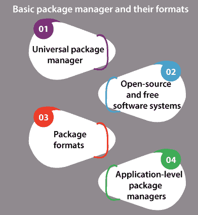

# Linux 包管理器

> 原文：<https://www.javatpoint.com/linux-package-manager>

## 介绍

一个 ***包管理系统或者包管理器*** 就是一组软件工具。它以高效的方式自动执行计算机操作系统的计算机程序的安装过程、升级过程、配置过程和删除过程。一个 ***包管理器*** 处理包、存档文件中的数据和软件分发。

软件包包括元数据，如软件名称、 ***、目标描述、校验和*** (最好是加密散列函数)、d ***依赖列表、供应商、*** 和 ***版本号*** 等，这些都是软件正常运行所必需的。

*   元数据在安装时保存在本地包的数据库中。
*   通常，包管理器管理版本信息和软件依赖关系的数据库，以防止缺少先决条件和软件不匹配。
*   他们与应用商店、二进制存储库管理器和软件存储库紧密合作。
*   开发包管理器是为了消除手动更新和安装的需求。
*   特别是，对于那些操作系统通常结合了数百个或更多不同软件包的大型组织来说，这可能很有帮助。

## 包管理器的功能

软件包可以定义为*档案文件，它结合了计算机程序和开发所必需的元数据。系统程序可能在必须首先构建和编译的源代码中。*

 *包元数据包含包版本、包描述和依赖项(需要预先安装的包)。许多软件包管理器拥有在用户的命令下安装、卸载、维护或查找软件包的动作。

*包管理系统包含一些典型的*功能，具体如下:**

 ***   处理文件归档器以提取包归档。
*   通过分别验证数字证书和校验和来确保包的真实性和完整性。
*   通过应用商店或软件仓库更新、安装、下载或查找现有软件。
*   通过功能组合包，减少用户的困惑。
*   维护依赖关系，以确保包已经和它需要的每个包一起安装。所以，忽略**“依存地狱”。**

### 编译包的前端(本地)

***系统管理员*** 可能会借助包管理软件以外的一些工具来安装和管理软件。 ***例如，*** 本地管理员可能会下载源代码(未打包)，进行编译，然后安装。

这可能会导致本地系统状态与包管理器状态的数据库脱离同步。需要本地管理员采取一些额外的措施，比如手动将修改集成到包管理器中，或者管理一些依赖项。

有一些工具可以确保编译包 ***(本地)*** 是用包管理开发的。

***检查安装*** 可用于 ***。rpm*** 或 ***。deb 基于文件的发行版*** 和***Slackware Linux***也是如此。对于 ***混合*** 系统，如[***Arch Linux***](https://www.javatpoint.com/aur)和 ***基于配方的系统*** 如 ***Gentoo Linux，*** 可以最初指定配方，然后确认包适合本地包数据库。

### 分布式库面临的挑战

依赖于动态库链接而不是静态库链接的各种计算机系统在应用和包之间分发机器指令的库(可执行)。

在这些类型的系统中，需要库版本的不同包之间的典型关系导致了一个被称为 ***“依赖地狱”的挑战。*T3】**

动态处理链接库时在微软 Windows 上也被称为***【DLL 地狱】*** 。良好的包管理对这些系统至关重要。

从***【OPENSTEP】***开始，框架系统就是解决这个问题的一次尝试，它允许同时安装多个库版本，并允许许多软件包描述它们链接到哪个版本。

### 配置维护

软件升级时，配置文件的升级尤其成问题。至少在 Unix 上是这样，因为包管理器起源于文件存档工具扩展。

通常，它们只保留或覆盖配置文件，而不是对它们使用规则。当配置文件格式修改时，可能会出现几个问题。例如，如果旧的配置文件没有显式禁用必须显示的新选项。一些包管理器，如 Debian 的 dpkg，允许在安装时进行配置。在其他一些情况下，最好使用默认配置安装软件包，并在安装时覆盖大量系统的配置(无头)。dpkg 也支持这种类型的安装(预配置)。

### 升级抑制

传统上，如果用户与包管理软件合作进行升级，则用户可以使用要运行的动作列表(通常是要升级的包列表，并可能提供新的和旧的版本号)。

它允许用户选择单个升级包或批量升级。各种包管理器可以被配置为从不升级许多包，或者仅当在旧标准中检测到严重的不稳定性或漏洞时才升级它们，如软件包所规定的。有时，这个过程被称为版本锁定。

### 例如:

yum 使用 **exclude=openoffice*** 语法来支持它

语法为**的 pacman Ignore = openoffice**(在这两种情况下，用于禁止升级 open office)

dselect 和 dpkg 通过包选择中的 hold 标志部分支持它。

资质有 ***【不许】*** 和 ***【执】*** 旗。

portage 通过配置文件支持，即***【package . mask .***

APT 通过复杂的**【牵制】**方法扩展了标志，即 ***持有*** (用户也可以将包裹列入黑名单)。

### 仓库

为了给用户提供对他们允许安装在他们系统上的软件类型的额外控制(有时是因为分销商方面的便利和法律原因)，软件有时是使用许多软件库下载的。

### 级联包删除

一些更发达的包管理方面促进了 ***【级联包移除】*** 其中依赖于目的包的每个包和目的包依赖的每个包也被移除。

### 命令比较

但是，这些命令对于所有特定的包管理器都是唯一的。这些命令在很大程度上是可翻译的，因为大多数包管理器都支持相同的功能。

## 包管理器的流行

像 dpkg 这样的包管理器早在 1994 年就有了。面向二进制包的各种 Linux 发行版都非常依赖包管理系统，因为它们是维护和管理软件的主要手段。

许多移动操作系统，如 Windows Phone、iOS(类似 Unix)和安卓(基于 Linux)几乎都依赖于各自的供应商应用商店。因此，他们使用他们的包管理系统(专用)。

## 与安装程序的比较

通常，包管理器被称为 ***“安装管理器”。*** 会引起安装人员和包管理人员的混乱。一些主要区别如下:

| 标准 | 包管理器 | 安装程序 |
| **随**一起发货 | 通常，操作系统 | 所有计算机程序 |
| **安装信息位置** | 用于安装的中央数据库 | 完全由安装人员决定。它可以是应用文件夹中的文件，也可以是操作系统文件夹和文件中的文件。他们可能会将自己注册到卸载程序列表中，而不公开安装信息。 |
| **维修范围** | 可能是系统上的每个包 | 只是包装的产品 |
| **显影剂** | 单一包管理器供应商 | 多个安装商 |
| **包装格式** | 一些公认的格式 | 格式可以和应用的号码一样多 |
| **包格式的兼容性** | 只要包管理器使用它，就可以使用它。要么用户不升级包管理器，要么新的包管理器版本继续支持它。 | 如果安装程序使用任何存档格式，那么安装程序总是与其兼容。尽管如此，安装程序可能会像每台计算机一样受到软件腐烂的影响。 |

## 与自动化实用程序的比较

几乎所有的软件配置管理系统都将部署软件和构建软件表示为独立的。通常，构建自动化实用程序获取系统中已经存在的人类可读格式的源代码文件，并加速将它们转换为类似系统上的可执行包(二进制)的过程。

通常，稍后在一些其他系统上运行的包管理器会在互联网上下载这些可执行包(预构建的二进制文件)，然后安装它们。

尽管如此，这两种工具都包括以下提到的几个常见因素:

*   依赖图拓扑排序应用于包管理器中，用于处理许多二进制组件之间的依赖关系。
*   此外，它应用于构建管理器内部，用于处理许多源组件之间的依赖关系。
*   各种 makefiles 提供了它们的支持，不仅仅是构建可执行文件。
*   此外，它们支持使用 make install 安装。
*   所有包管理器都支持将源代码(人类可读的)翻译成二进制可执行文件，然后将其安装到基于源代码的发行版中，如家酿、巫术、Portage 等。

开发了一些工具，如***【A-A-P】******【Maak】***来管理部署和构建。它们还可以用作包管理器或构建自动化实用程序，或者两者都可以。

## 基本包管理器及其格式

### 通用包管理器

也叫 ***二进制库管理器。*** 这个包管理器是一个软件工具，用于优化软件开发过程中产生和使用的二进制文件、包和工件的存储和下载。

***万能套餐经理*** 专注于规范时尚用户对待每一类套餐。它们为用户提供了围绕每种类型的工件使用法规遵从性和安全性度量的能力。他们被分配到一个 ***DevOps 工具链的中间。***

### 开源和自由软件系统

通过开源和自由软件的行为，兼容和类似许可证上的软件包已经存在，可以在多个操作系统上使用。

可以使用内部复杂且可配置的打包系统来分发和组合这些包，以管理几个特定于版本的冲突和依赖以及软件排列。

此外，一些开源和自由软件的打包系统本身也作为开源和自由软件发布。

像 Windows 和 Mac OS X 这样的操作系统以及像 Linux 这样的开源和自由软件中的软件包管理之间的一个区别是，开源和自由软件系统允许从类似的机制升级和安装第三方软件包。而 Windows 和 Mac OS X 的很多包管理器会分别升级微软和苹果给出的软件。

通过在包管理的配置文件中包含相应的存储库网址，增加了持续升级第三方软件的能力。

### 包格式

所有包管理器都依赖于它们可以管理的包的元数据和格式。包管理器要求为特定的包管理器对文件组进行分组，并具有适当的元数据，如依赖关系。

实用程序的核心集合通常通过这些包来管理一般安装，并且不止一个包管理器应用这些实用程序来提供附加功能。

**示例:**

1.  yum 依赖 rpm 作为后端。Yum 通过添加简单配置等方面来维护系统网络，从而开发后端功能。
2.  突触包管理器通过应用依赖于 dpkg 的高级打包工具库给出一个图形用户界面。

***【异形】*** 可以定义为在不同 Linux 包格式之间转换的程序。支持**和*休闲服之间的转换。tgz，。tlz，。tbz，。txz)*** 包、 ***Solaris(。pkg)，踩踏事件(。slp)，。黛比。rpm 包、*** 和 ***符合 Linux 标准基础*** (LSB)。

在***等多个移动操作系统中，****利用了 ***安卓应用包*** (简称***【APK】***)的包格式，而 ***Windows Store*** 使用了***【XAP】***和 ***APPX 的格式。******Windows Store***和 ***Google Play*** 都包含同名的包管理器。*

 *### 应用级包管理器

对于面向编程语言的操作系统，有一些包管理器(附加组件)，在开发人员需要当前库的情况下，这些包管理器具有受限的功能。与系统级包管理器相比，应用级包管理器专注于软件系统的小部分。

通常，它们位于目录树中。它不是由像 ***/usr/local/fink*** 或 ***这样的系统级包管理器组织的。*** 虽然，这可能不是包管理器与编程库一起工作的条件，但这可能会导致冲突，因为两个包管理器都可能中断升级并请求 ***【拥有】*** 文件。

* * *****