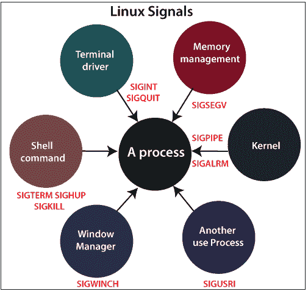
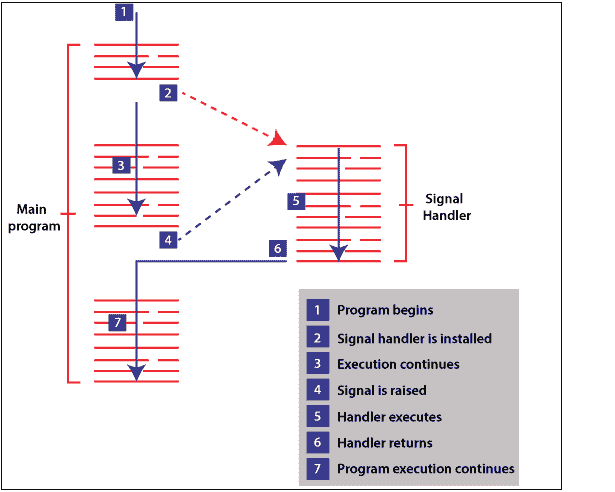
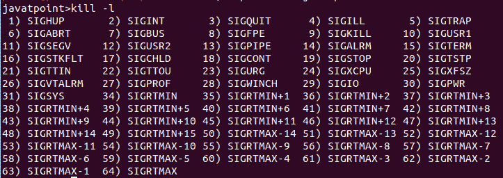

# Linux 信号

> 原文：<https://www.javatpoint.com/linux-signals>

在 Linux 中，信号是发送给程序的中断，用来指定一个重要事件已经发生。事件可以从用户请求到无效内存访问错误不等。各种信号，如中断信号，意味着用户已经要求程序执行用户控制流中不存在的事情。

有两种信号:

1.  可屏蔽的
2.  不可屏蔽
    ***可屏蔽:-*** 可屏蔽信号是用户可以改变或忽略的信号，例如 **Ctrl +C.**
    ***不可屏蔽:-*** 不可屏蔽信号是用户不能改变或忽略的信号。不可屏蔽信号主要发生在用户收到不可恢复硬件错误的信号时。



在 Linux 计算机系统中，不同的状态下有不同的进程。所有这些进程都属于操作系统或用户应用程序。内核和这些进程需要一种机制来协调它们的活动。在这个过程中，执行这一操作的一个方法是，如果有任何重要的事情发生，通知其他人。这就是我们有信号的原因。

基本上，信号意味着单向通知。内核将信号发送给进程，一个进程发送给自己，或者另一个进程。
Linux 信号的起源可以追溯到 Unix 信号。在后来的 Linus 版本中，添加了实时信号。信号间处理是一种简单且轻量级的通信形式，因此与嵌入式系统兼容。

## 信号的典型生命周期是什么？

信号经历三个阶段:

1.  产生
2.  交货
3.  处理



### 1.产生

信号由进程通过内核生成。无论哪一个产生信号，都将进程寻址到一个特定的进程。在进程号的帮助下，信号被表示出来，它不包含任何额外的数据或参数。所以，信号很轻。但是，我们可以用 POSIX 实时信号传递附加信号。能产生信号的函数和系统调用包含 **kill、sigqueue、raise、pthread_kill、kill、**和 **tgkill。**

### 2.交货

我们说过，信号在发出之前一直悬而未决。基本上，在很短的时间内，信号由内核传递给进程。如果进程阻止了信号，进程将挂起，直到被解除阻止。

### 3.处理

当信号被传递时，它以各种方式被处理。每个信号都包含一个默认操作，如终止进程、忽略信号、停止进程、继续进程。对于非默认行为，可能会调用处理函数。通过**信号激活**功能，可以准确地说明这些情况中的哪一种。

## 有意义的信号列表

下表显示了信号列表及其含义:

| 没有 | 信号名称 | 意义 |
| 1. | 嘘嘘嘘 | **HUP** 是**“挂断”的简称**在控制进程死亡时定位待控制或挂机的终端。当进程从终端运行时，该信号被接收，并且该终端突然停止。 |
| 2. | 信号情报 | 每当用户发送中断信号 **(Ctrl + C)时，该信号被释放。** |
| 3. | 继续走 | 当用户发送安静信号 **(Ctrl + D)时，发出信号退出信号。** |
| 4. | -是啊 | 这是一个非法指令。程序中包含一些机器代码，CPU 无法理解这些代码。 |
| 5. | SIGTRAP(陷阱) | 大多数情况下 **SIGTRAP** 是从内部调试器和程序跟踪程序中使用的。 |
| 6. | 西格布 | 程序调用名为 **abort ()** 的函数。这是紧急停车。 |
| 7. | 西格布斯 | SIGBUS 是一种不正确访问内存的尝试。在内存访问中，它可能会导致对齐错误。 |
| 8. | 西格弗 | **SIGFPE** 是程序中出现的浮点异常。 |
| 9. | SIGKILL(消歧义) | 当进程收到 **SIGKILL** 信号时，它必须立即退出，并且不能执行任何清理操作。 |
| 10. | 西格 1 号 | 留给程序员去做他们需要的任何事情。 |
| 11. | 西格尔瑟夫 | 试图使用进程中未分配的内存。这是由于阵列等的最终读数。 |
| 12. | 西格玛瑟鲁瑟鲁瑟鲁瑟鲁瑟鲁瑟鲁瑟鲁瑟鲁瑟鲁瑟鲁瑟鲁瑟鲁瑟鲁瑟鲁瑟鲁瑟鲁瑟鲁瑟鲁瑟鲁瑟鲁瑟鲁瑟鲁瑟鲁 | 留给程序员去做他们需要的任何事情。 |
| 13. | SIGPIPE(烟斗) | **信号管道**信号用于当一个过程产生输出，该输出通过管道**(“{生产者&#124;消费者)”)**供给其他过程消费，然后消费者死亡，该信号随后被发送给生产者。 |
| 14. | 跟着我 | 在这种情况下，通过调用名为**报警()的函数，该过程最终可能会在将来向操作系统请求一个**“唤醒呼叫”**。**当该时间到来时，该信号包含在唤醒呼叫中。 |
| 15. | 是 SIGTERM | 这个过程显然是由杀死程序的人完成的。 |
| 16. | 西格奇 | 该进程先前使用 **fork ()** 函数创建了一个或多个子进程。 |
| 17. | 继续数 | *(可结合 SIGSTOP 一起阅读)*
当一个进程因发送 **SIGSTOP** 信号而中断时，我们必须接着给它 **SIGCONT** 信号来重新启动它。 |
| 18. | 停下来 | (可结合 **SIGCONT 阅读。** )
如果一个 **SIGSTOP** 信号被发送到进程，那么它被操作系统停止。所有这些，状态都准备好重启它了(通过 **SIGCONT** ，但在此之前它会得到另一个 CPU 周期。 |
| 19. | 西格特普 | **SIGSTP** 是“终端止损”的简称基本上，**信号与**信号相同。当用户按下终端上的 **Ctrl +Z** 时，发送 **SIGTSTP** 信号。**** |
| 20. | -坐下 | **SIGTSTP** 和 **SIGSTOP** 唯一的区别是暂停只是 **SIGTSTP** 的默认动作，但却是 **SIGSTOP** 需要的动作。这个过程可能会选择以不同的方式处理 **SIGTSTP** ，但是没有找到关于 **SIGSTOP 的选项。** |
| 21. | 西图 | 当后台进程试图将输出写入其终端时。 **SIGTOU** 信号由操作系统发出。典型的反应是基于 **SIGTTIN。** |
| 22. | SIGURG | 借助网络连接，每当发送“紧急”带外数据时，操作系统都会发送 **SIGURG** 信号。 |
| 23. | SIGXCPU | **SIGXCPU** 信号是操作系统发送给进程的，超过了它的 CPU 限制。使用 shell 命令(“ulimit -t unlimited”)，我们可以在运行之前取消 CPU 限制，尽管如果您在 make 中达到 CPU 限制，出现问题的可能性会更大。 |
| 24. | SIGXFSZ | 如果有一个进程试图创建一个高于文件格式的文件，那么操作系统会发送一个 **SIGXFSZ** 信号。我们还能够通过使用 shell 命令(“ulimit -t unlimited”)取消文件大小的限制，尽管如果我们在运行前达到文件大小限制，更有可能出现问题。 |
| 25. | 发送 | **SIGVTALR** 和 **SIGALRM** 信号都是相同的，除了 **SIGALRM** 信号是在经过一定时间的实时后发送的，而 **SIGVTALRM** 是在运行该过程一段时间后发送的。 |
| 26. | 西格教授 | **SIGPROG** 就像 **SIGVTALRM** 和 **SIGALRM** 一样，而 **SIGALRM** 是在经过一定量的实时后发送的， **SIGPROG** 是在花费一定量的时间运行进程后发送的，系统代码代表进程运行。 |
| 27. | 西格温奇 | 当进程的任何窗口调整大小时，进程会使用**信号。** |
| 28. | 一个世纪 | ( **SIGIO** 也叫 **SIGPOLL** )。当某个输入进程或某个输出通道同意写入时，可以安排发送该信号的进程就可以这样做了。 |
| 29. | 电源故障信号 | 一个电源管理服务将此信号发送给进程，以显示电源已被更改为短期应急电源。 |
| 30. | 西格 SYS | 不用的 |

## 信号列表

有一个简单的方法可以列出我们系统支持的每个信号。我们必须在终端上输入 kill -l 命令，然后它会向您显示所有支持信号的列表:



## 默认操作

每个信号都有一个默认操作。对于信号，默认动作是指程序或脚本在收到信号时执行的动作。

有多种可能的默认操作:

*   停止这个过程。
*   终止进程
*   继续停止的过程。
*   忽略信号
*   转储核心:这个默认操作生成一个名为 core 的文件，当进程收到信号时，该文件包含进程的内存映像。

## 发送信号

方法数量用于向脚本或程序发送信号。对于用户来说，最基本的方法就是在脚本执行时按下 ***中断键*** 或 ***CONTROL-C*** 。

当我们进入 ***Ctrl+C、*** 时， **SIGINT** 信号被发送到脚本，根据定义的默认动作，脚本终止。

通过使用 kill 命令，我们还可以发送信号。

我们也可以使用另一种方法来传递信号，在这种方法中，我们可以使用 ***kill 命令；*** 以下是 kill 命令的语法:

```

$ kill -signal pid

```

在 kill 命令的上述语法中，信号表示必须发送的信号名称或编号，***【Pid】***表示必须发送信号的进程 ID。举个例子-


上述命令向程序发送名为挂机或 HUP 的信号，该程序以 1001 进程 ID***运行。*** 为了向类似的过程发送杀伤信号，我们必须使用下面的命令——


上述 ***流程 ID 1001。*** 命令将杀死正在运行的进程，进程号为**1001。**

## 俘获信号

在 shell 程序执行过程中，当我们在终端输入 Ctrl +C 或 break 键时，那个程序通常会立即终止，我们的命令提示符会返回。它可能不是每次都令人满意。例如，我们可以留下一组不会被清理的临时文件。

捕捉这些信号非常简单，下面是 trap 命令的语法:

```

$ trap commands signals

```

这里，命令可以是任何有效的 Linux 命令，也可以是用户定义的函数，信号包括我们需要捕获的任何信号。

在 shell 脚本中，陷阱有两种基本用途:

*   清理临时文件
*   忽略信号

## 零信号

发送信号的一个有趣的用例是调查过程的存在。当 **kill()** 系统被调用时，信号参数为 0，这是一个空信号，那么没有信号被发送，但是它可以只执行错误检查，以检查进程是否可以被发送信号。这意味着我们能够使用这个过程来观察这个过程的存在。此时，发送一个空信号，则可能出现以下任何响应:

1.  如果出现错误 ESRCH，这意味着目标进程不会退出。
2.  如果调用成功，这意味着目标进程存在，并且允许调用者向它发送信号。
3.  如果出现错误 EPERM，则意味着目标进程存在，但是我们没有足够的权限向该进程发送信号。

## 信号到达时会发生什么？

此时，当信号接近传递时，根据信号，会发生以下任何默认操作。

1.  信号被忽略，也就是内核丢弃了它，对进程有影响。(流程不知道事件仍在发生。)
2.  进程终止，即异常进程终止，这与正常进程终止相反，正常进程终止是在程序使用 exit()函数终止时出现的。
3.  生成一个核心转储文件，过程终止。
4.  进程的执行被恢复或暂停。
    不是接受特定信号的默认动作，而是过程可以通过修改在传递信号时出现的动作来设置信号的动作。一个程序可以设置以下任一动作:有两个信号 **SIGSTOP** 和 **SIGKILL、**不能被阻止、忽略或捕捉。
    1.  默认操作必须出现。这有助于将信号的第一次修改撤销为默认值以外的值。
    2.  这个信号没有被注意到，而不是结束这个过程的默认动作。
    3.  可以执行已建立的信号处理程序。信号处理器是指根据信号传递执行正确功能的定制功能。通知内核，如果信号到达，必须调用处理函数，称为安装或建立信号处理程序。在这些信号中的一个具有默认配置之前，我们无法确定该信号的配置以终止或转储内核。There are two signals

* * *