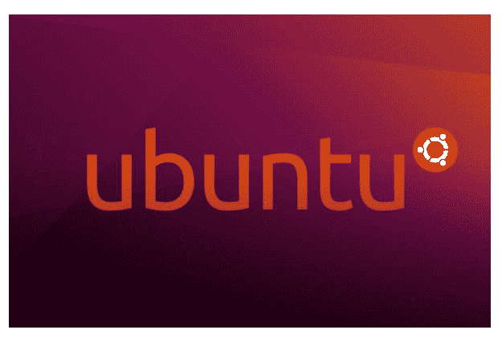

# Ubuntu 特性

> 原文：<https://www.javatpoint.com/ubuntu-features>

## 什么是 Ubuntu？

Ubuntu 是一个基于 Linux 的操作系统。Ubuntu 是为智能手机、网络服务器和计算机设计的。由总部位于英国的**Canonical Ltd .**开发。所有用于创建 Ubuntu 软件的原则都基于开源软件开发原则。

Ubuntu 在大学和研究团体中很受欢迎，因为它将 Unix OS 的所有功能与可定制的图形用户界面相结合。

Ubuntu 包括很多软件程序，例如 **LibreOffice** 和 **Firefox。**也可以在 Ubuntu 上运行专有软件。

GNU 通用公共许可证用于许可 Ubuntu 的许多软件产品。这允许用户通过复制、更改、开发和再分发来创建他们自己的程序版本。

**GNOME (GNU 网络对象模型环境，发音为 gah-NOHM)**一个图形用户界面(GUI)，并作为一套 Linux 桌面应用。GNOME 是一个适用于 Linux 的桌面环境，与 Windows 桌面界面相当。它旨在让非程序员的人可以访问 Linux。

## Ubuntu 特性

以下是 Ubuntu 的一些基本特性:

1.  办公软件
2.  开源操作系统
3.  网页浏览
4.  电子邮件
5.  照片
6.  录像
7.  赌博
8.  应用的整个世界
9.  由 Canonical 支持
10.  没有防病毒软件
11.  硬件自动配置
12.  软件仓库
13.  多个桌面
14.  ssh 客户端

### 1.办公软件

在 Ubuntu 中，我们有一个名为 **LibreOffice、**的软件，通过它我们可以创建专业的文档、电子表格和演示文稿。 **LibreOffice** 是一款兼容微软 Office 的开源办公套件。这意味着我们可以打开和修改文件，如 **Word 文档、PowerPoint、**和 **Excel 电子表格**，并轻松快捷地与其他人共享。谷歌文档也可以直接从我们的桌面使用。

### 2.开源操作系统

在 Ubuntu 中，我们的代码在开发周期中是公开共享的。我们对未来版本的计划是透明的，所以作为开发人员、硬件制造商或原始设备制造商，我们可以立即开始开发 Ubuntu 应用和系统。

### 3.电子邮件

**雷鸟，** Mozilla 著名的电子邮件应用包含在 Ubuntu 中，因此我们可以从桌面快速访问我们的电子邮件。无论我们使用什么电子邮件服务，电子邮件都可以工作，例如**微软交易所、Hotmail、Gmail、POP 3、**或 **IMAP。**

### 4.网页浏览

**Ubuntu** 和**Firefox**都以速度和安全性著称，让浏览网页再次成为一种乐趣。Ubuntu 现在支持 Chrome 和其他浏览器，我们可以通过 Ubuntu 软件中心获得。

### 5.照片

Ubuntu 有太多的免费应用可以让你欣赏、编辑、管理和分享照片——无论你用什么相机拍照。有了对相机和手机的出色支持，我们不需要任何额外的驱动程序来开始。

在 Ubuntu 中，我们可以使用 **Shotwell 轻松快速地导入、编辑、整理和查看我们的照片。**我们还可以在任何知名网站和社交媒体平台上分享我们最喜欢的照片。

像 **Gimp** 和 **Krita、**这样的工具都可以在 Ubuntu 软件中心访问，我们可以使用这些工具来编辑图像或创建专业的插图和设计。

### 6.录像

在 Ubuntu 上，我们可以在浏览器中观看高清视频，或者在快照商店中使用默认的电影播放器 **VLC、**和 **OpenShot** 观看高清视频。使用 **Shotcut** 或 **kdenlive** 编辑我们的视频，然后在电影播放器中观看。

### 7.赌博

在 Ubuntu 中，从**数独到第一人称射击游戏，**我们有很多游戏会让我们投入数小时。有成千上万的游戏，包括来自 Unity 和 Steam 平台的标题。从《T2》dota 2、《克尔巴太空计划》、《反击战:全球攻势》和《T4 边境:续集》等广受好评的电影中选择。

### 8.应用的整个世界

Ubuntu 上有成千上万的应用可供下载。他们中的大多数人只需点击几下鼠标就可以免费下载和安装。比如 **VLC 播放器、火狐、Chromium、Telegram、PyCharm、Skype、Spotify、Atom、Slack 等。**

### 9.由 Canonical 支持

**Canonical** 是一家跨国软件公司，为 Ubuntu 的项目提供商业、设计和工程支持。世界各地的 Ubuntu 硬件支持团队已经为数百台笔记本电脑和工作站预装了 Ubuntu。

### 10.没有防病毒软件

在 Windows 环境中，安全实践是极其矛盾的。编写视窗软件的大多数公司也通过提供独占应用来保护视窗应用免受安全问题的影响，从而赚取了数百万美元。虽然 Ubuntu 没有恶意软件保护，但它对大多数用户来说是开箱即用的，即使没有添加任何昂贵的防病毒扫描仪，也是安全的。

### 11.硬件自动配置

Ubuntu 的另一个特性是硬件自动配置。大多数硬件驱动程序已经包含在 Ubuntu 中。任何安装了通用版本的视窗系统的人(也就是说，没有被电脑厂商预先配置为使用特定硬件的人)都知道，在安装操作系统后，不花几个小时寻找驱动程序是多么方便。

### 12.软件仓库

只需点击几下鼠标，就可以从 Ubuntu 的存储库中安装大量应用，这是一个巨大的优势。除了这个软件比。exe 包，这是从随机网站下载的，从集中位置安装程序要方便得多。

### 13.多个桌面

虚拟桌面类似于选项卡式的网页浏览——在我们使用它们之前，我们不知道它们有多大的好处。有各种第三方工具可以在 Windows 上实现相同的功能，但根据我们的经验，很少有第三方工具可以在 Vista 和更高版本上正常运行。

### 14.ssh 客户端

在操作系统中嵌入 ssh 客户端对我们来说是一个显著的优势。Windows 有几个 ssh 客户端，比如 Putty，但是没有一个是预装在 Windows 中的，即使是最好的也不如 gnome-terminal 那么好用。

## Ubuntu 的优势

以下是 Ubuntu 的一些基本优势:

1.  Ubuntu 是免费的和 T2 开源的操作系统
2.  Ubuntu 更安全
3.  Ubuntu 无需安装即可运行
4.  Ubuntu 支持窗口平铺
5.  Ubuntu 更**资源友好**
6.  Ubuntu 完全**可定制**
7.  全面的桌面计算操作系统
8.  最低硬件或系统要求

## Ubuntu 的缺点

以下是 Ubuntu 的一些缺点:

1.  商业化和开源软件的问题。
2.  软件和硬件的兼容性问题。
3.  还有其他更好的 Linux 操作系统。
4.  有少量无趣的游戏标题。
5.  由于应用数量少，功能有限。

* * *