# 在 Linux 中检查操作系统版本

> 原文：<https://www.javatpoint.com/check-os-version-in-linux>

Linux 是一个开源的免费操作系统。有各种 Linux 版本可供他们的用户使用。通常，它们被称为 Linux 发行版。 ***RHEL、Fedora、Arch、CentOS、Ubuntu、Debian、OpenSUSE、Suse*** 都是 Linux 发行版的基本名称。了解我们的 Linux 发行版的名称和版本对于许多安全补丁非常有帮助。

对于 Linux 的用户和管理员来说，知道他们的操作系统版本是很重要的。知道我们操作系统的版本号可能有很多原因。如果我们要安装任何新程序，验证几个功能的可用性并进行故障排除，这将非常有用。

我们有很多方法可以获得我们操作系统的版本。此外，我们将讨论**命令行**和**图形**两种方法来检查我们的 Linux 系统的操作系统版本。

## 按终端检查操作系统版本

下面是一些命令行方式，我们可以从中查看我们系统中的操作系统版本。打开终端，在搜索栏中找到 ***终端应用*** 。出现时，按下 ***终端*** 图标打开。

## 如何检查 Linux 版本

要在 Linux 中找到操作系统的版本和名称，步骤如下:

*   打开命令行应用程序(终端)
*   我们可以使用以下命令为远程用户登录:

```

ssh user@server-name

```

*   输入以下任一命令来查找操作系统的版本和名称:

```

hostnamectl
lsb_release -a
cat /etc/os-release

```

*   输入以下命令查找 Linux 内核版本:

```

uname -r

```

让我们解释一下基本 Linux 发行版的每个例子。

### /etc/OS-发布文件

该文件可以定义为 ***配置文件。*** 它是系统包的一部分，包括操作系统的识别数据。我们会发现 **/etc/os-release** 命令只存在于当前的 Linux 发行版中。

使用这个命令，我们可以获得操作系统版本的信息。我们可以运行以下命令来显示 os-release 文件的内容:

```

$ cat /etc/os-release 

```

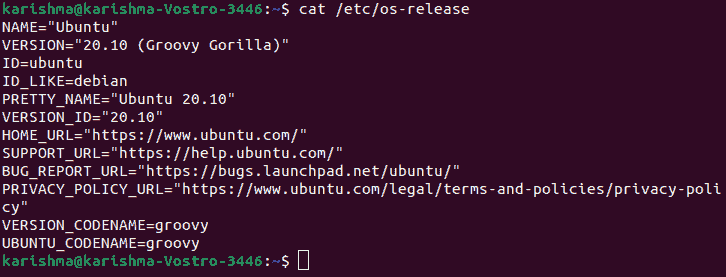

另外，我们可以借助 ***白鹭*** 命令或 ***grep*** 命令过滤出操作系统的名称和版本等细节，如下所示:

```

$ egrep '^(VERSION|NAME)=' /etc/os-release

```

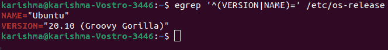

```

$ grep '^VERSION' /etc/os-release

```


上述值也解释如下:

**名称:**是一个分布。但是如果没有设置，可能只会显示***“Linux”。***

**版本:**是操作系统的版本。

**ID:** 是操作系统的小写字符串版本。

**ID_Like:** 如果一个分布是另一个分布的导数，该字段将包括父分布。

**俏丽 _Name:** 是简单直白的字符串中分布的版本和名称。

**Version_ID:** 是发行版的版本号。

**Home_URL:** 是发行项目的首页。

**Support_URL:** 是发行版的主要支持页面。

**Bug_Report_URL:** 是发行版的主要 Bug 报告页面。

**Privacy_Policy_URL:** 是本次发布的主要隐私政策页面。

**Version_Codename:** 是版本的外部代号。

**Ubuntu_Codename:** 它是一个特定于 Ubuntu 的部分，包含了版本的内部代码名。

### lsb_release 命令

该命令在 CLI 上提供分发和 ***Linux 标准基础*** 基础(简称 ***LSB*** )细节。 ***lsb_release*** 命令允许我们找到关于 Linux 发行版的 lsb 详细信息，其中包含发行版号、发行者 ID 和代码名。

在一些 Linux 发行版中，由于操作系统的最小安装或任何其他原因，这个命令可能会从我们的系统中丢失。在这种情况下，如果我们执行这个命令，我们可能会得到类似 ***“没有可用的 LSB 模块”的错误消息。*T3】**

首先，我们需要在 ***的帮助下安装 ***lsb_release*** 包来解决这个问题:***

```

$ sudo apt-get install lsb-release

```

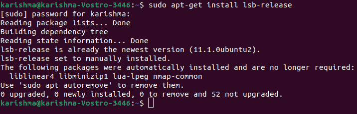

然后，我们可以运行下面的命令来查看操作系统版本以及其他详细信息:

```

$ lsb_release -a

```

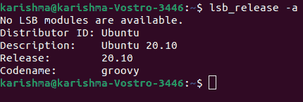

如果我们希望打印出版本的信息，而不是 LSB 的全部信息，我们可以将 lsb_release 与-d 选项一起应用。例子如下:

```

$ lsb_release -d

```

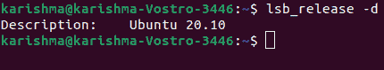

上述命令将只打印代表版本号的描述行:

### hostnamectl 命令

此外，该命令是 systemd 包的一部分。它通常用于检查和修改主机名。但是，我们也可以应用它来检查我们的操作系统版本。

与 ***/etc/os-release*** 命令相同，该命令也适用于当前的 Linux 发行版。它可用于更改和查询系统主机名和设置。

要使用 hostnamectl 命令查看操作系统的版本，我们可以运行以下命令:

```

$ hostnamectl

```

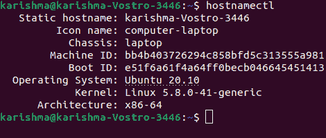

### /etc/发行文件

在该文件中，存储了系统标识的文本。它显示在登录提示之前。通常情况下， ***/etc/issue*** 文件包含 Linux 版本的信息，我们可以借助 ***cat*** 命令查看这些信息。

```

$ cat /etc/issue

```

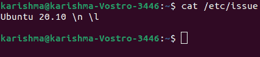

该命令仅显示我们的操作系统版本号。但是，如果我们想知道我们的操作系统版本以及发布点，我们可以键入以下命令:

```

$ cat /etc/debian_version

```

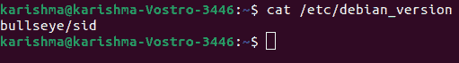

### /etc/*发布文件

在这种情况下，如果上面的命令对我们不起作用，很可能我们运行的是一个非常过时和陈旧的 Linux 发行版。在这种情况下，我们可以应用一个命令来打印版本文件和发行版本的信息。该命令如下所述:

```

$ cat /etc/*version

```

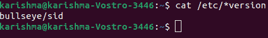

```

$ cat /etc/*release

```

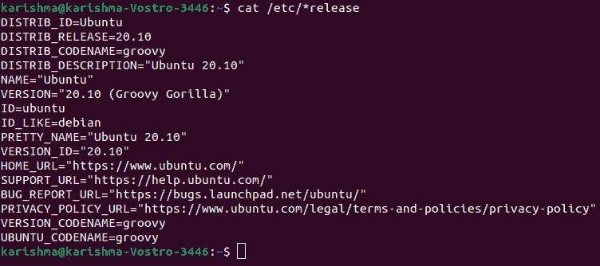

## 检查内核版本

如果我们希望用操作系统版本搜索我们系统的内核版本，下面提到了几个命令行方法:

### uname 司令部

如果我们想查看更多细节(例如，关于计算机体系结构)，那么我们可以键入下面提到的命令:

```

$ uname -a

```

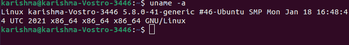

该命令用于显示系统的公共信息。我们可以应用 **-r** 选项来查找内核版本，如下所示:

```

$ uname -r

```

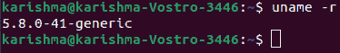

我们将得到如下相同的结果:

从上面我们运行的结果可以看出 Linux 的内核是 4.19.0-5-amd64。

其中，

*   4 是内核的版本。
*   19 是重大修订。
*   0 是小版本。
*   5 是一个补丁号。
*   Amd64 是架构的信息。

### dmesg 命令

一般来说，*命令用于检查内核启动的消息和调试硬件相关的问题。但是，我们也可以用它来检查内核版本。我们需要将 ***dmesg*** 与一个命令(即***【grep】***命令)一起管道化，以查看内核的信息，如下所述:*

```

$ sudo dmesg | grep Linux

```

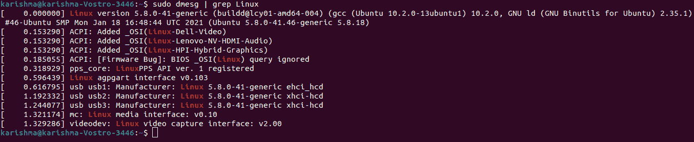

我们将在输出的第一行找到内核版本:

### /proc/版本

此外，该文件包括关于 Linux 内核的信息。我们可以使用以下命令在终端中查看该文件:

```

$ cat /proc/version

```

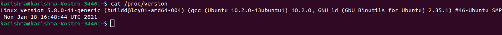

此外，我们将在输出的第一行找到内核版本:

## 通过图形用户界面检查操作系统版本

我们需要按照以下步骤使用图形用户界面检查操作系统的版本:

**第一步:**我们首先需要进入系统中的 ***设置实用程序*** 。要做到这一点，我们需要在桌面上点击右键，选择 ***设置*** ，如下图截图所示:


另外，我们可以通过 ***应用菜单找到 ***设置工具*** 。*** 按下我们键盘上的超级键，在搜索栏内进入 ***设置。*** 出现时点击 ***设置*** 图标打开。

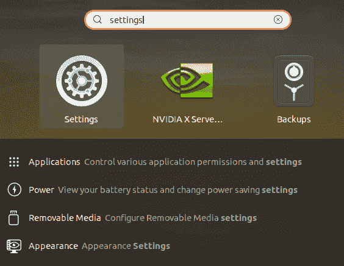

**第二步:**选择 ***关于*** 选项卡，如下图所示 ***设置实用程序:***

默认情况下，当我们按下 ***详情*** 标签时，下方窗口将出现在 ***关于*** 视图中。在这里，我们将搜索我们的操作系统版本。此外，除了版本的详细信息之外，我们还会找到任何其他详细信息，如磁盘大小、操作系统类型、图形、处理器、内存等。

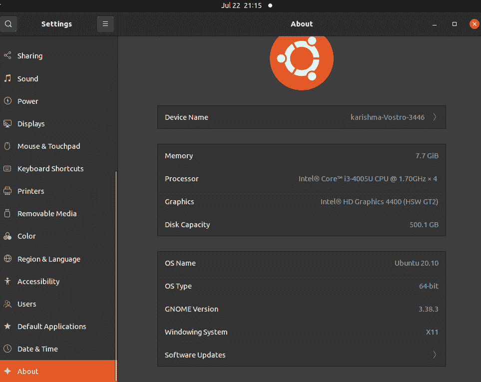

* * **