# Linux 更改时区

> 原文：<https://www.javatpoint.com/linux-change-timezone>

在本文中，我们将讨论如何在 Linux 中更改或修改 ***时区*** 。在所有的 Linux 发行版上，我们可以在终端的帮助下修改时区，或者我们可以在终端内部为不同的 Linux 发行版应用选择菜单。

时区可以定义为包含类似标准时间的地理区域。时区通常是在安装操作系统时设置的，但稍后可以轻松修改。对于一些与系统相关的流程和任务，使用准确的时区是必要的。 ***例如，***cron 守护程序应用系统的时区来执行 cron 作业。此外，时区用于许多日志时间戳。

如果我们使用***【Ubuntu】【薄荷】*** 或任何其他发行版以及通用设置菜单或用户界面，那么我们也可以从那里更改 ***时区*** 的设置。

## 检查时区(当前)

命令行工具，即*允许我们查看和修改系统的时间和日期。它存在于每一个最新的基于系统的 Linux 系统中。*

 *我们将需要调用没有参数和选项的命令，即 ***timedatectl*** 来查看我们当前的时区。

```

$ timedatectl

```

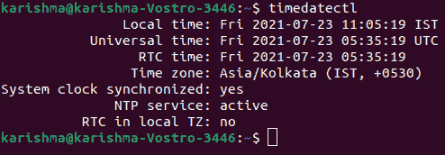

系统的时区是通过将一个文件，即 ***/etc/localtime*** 符号链接到一个目录内的二进制时区标识符，即 ***/usr/share/zoneinfo 来构建的。***

## 改变时区的技巧

我们可以使用一些基本技术来更改系统的时区。下面列出并讨论了这些技术:

### 技术 1:使用终端

**1。**从我们的 Linux 程序打开命令行或者我们可以点击我们键盘上的 ***Ctrl+Alt+T*** 键。

**2。**进入 ***日期*** 命令在终端看到我们的 ***最新时区*** 并点击 ***进入*** 按钮。终端会以 ***【工作日月日时间时区年】的格式显示日期。***

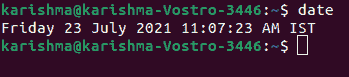

***例如*** 我们可能会看到 ***美国东部时间 2021 年 7 月 2 日 07:38:23***(其中，EDT 代表 ***美国东部夏令时*** 并定义了最新时区)。

**3。**输入命令，即***CD/usr/share/zoneinfo***目录查看 ***可用时区，*** 并点击 ***进入*** 按钮。然后，输入 ***tzselect*** 命令，点击 ***进入*** 按钮，显示位置列表。

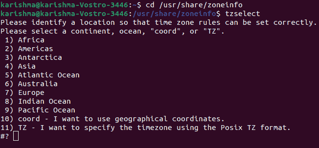

#### 注意:根据我们的 Linux 发行版，目录 cd /usr/share/zoneinfo 可能会有所不同。

**4。**输入属于我们正常位置的选择号选择一个 ***海洋*** 或 ***大陆，*** 然后点击 ***进入*** 按钮。

**5。**使用屏幕列表输入选择号码，选择一个 ***国家*** ，点击 ***进入*** 按钮。

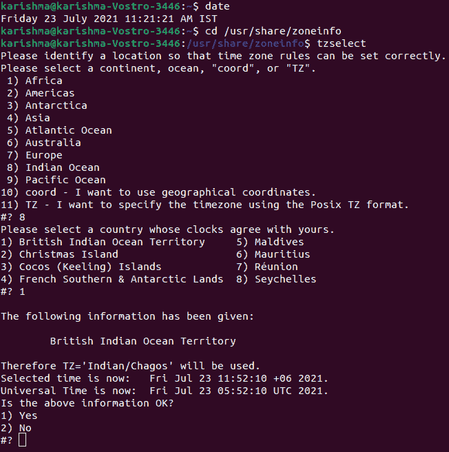
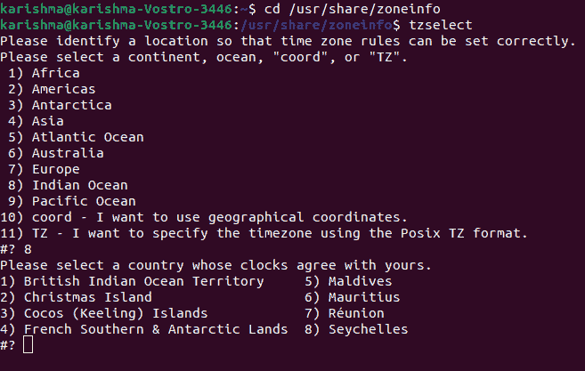

**6。**输入选择号码选择**时区**的首选地区选择时区，点击**输入**按钮。

#### 注意:如果时区列表中没有提到我们选择的城市，请从我们相似的时区中选择一个不同的城市。

**7。**在下面的提示中，输入 1 确认当地时间，确认当地时间准确，点击 ***进入*** 按钮。

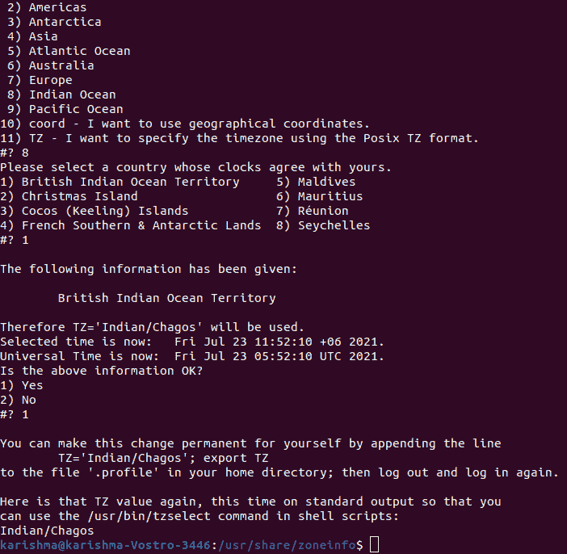

#### 注意:如果时间不准确，请键入 2 并单击输入。然后，选择一个新的海洋，重复这个过程。

**8。**再次执行 ***日期*** 命令，验证时区是否与我们刚刚修改的时区相关，以验证我们的时区是否已设置。如果我们看到列出了新的时区，这意味着我们已经成功修改了计算机的时区。

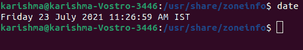

**9。大多数最新的发行版已经在他们的系统上安装了*。如果我们的 Linux 发行版没有，我们将要求安装 ***NTP 服务器*** 的包，以设置我们的时钟与我们喜欢的 ***【互联网】*** 的 ***时间服务器*** 同步。基于我们的 Linux 发行版，我们可以使用以下命令来安装它:***

 **   **Debian/Mint/Ubuntu:** 如果我们正在使用这些 Linux 发行版中的任何一个，那么我们可以使用下面的命令:

```

sudo apt install ntpdate

```

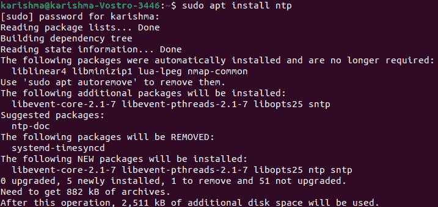

*   **红帽/Fedora:** 如果我们正在使用这个 Linux 发行版，那么我们可以使用下面的命令:

```

sudo yum install ntpdate

```

*   **CentOS:** 如果我们正在使用这个 Linux 发行版，那么我们可以使用下面的命令:

```

sudo apt install ntpdate

```

### 技巧 2:时区选择菜单

**1。**通过我们的 Linux 程序选择终端程序打开终端或者按下我们键盘上的 ***Ctrl+Alt+T*** 键。

**2。**我们需要进入时区菜单的命令。该命令可能会因我们的 Linux 发行版而异:

*   **Mint** 和 **Ubuntu:** 如果我们正在使用这个 Linux 发行版，那么我们可以使用下面的命令:

```

sudo dpkg reconfigure tzdata

```

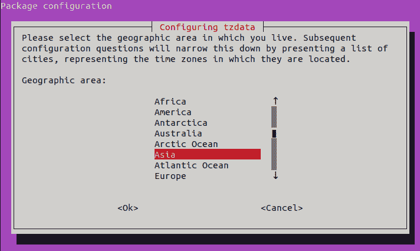

该命令后面应该跟有用户或管理员密码。

*   **红帽:**红帽-配置-日期
*   **软呢帽**和**中心:**系统配置日期
*   **休闲服**和 **FreeBSD:** tzselect

**3。**我们可以使用 ***向上*** 和 ***向下*** 箭头键选择 ***地理*** 所在地区，点击 ***进入*** 按钮。

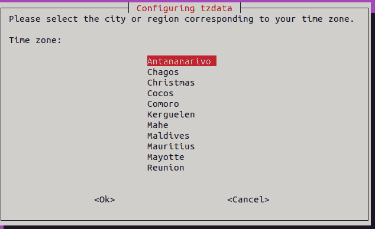

**4。**我们可以选择与我们时区相关的地区或城市，点击 ***进入*** 按钮。它将修改我们系统上的时区。

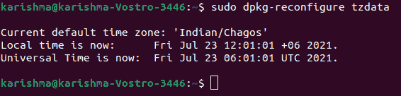

### 技术 3:在 Ubuntu 中使用图形用户界面

**1。**选择一个图标，即 ***“系统菜单”。*** 它是我们屏幕右上角的一个三角形(面朝下)。然后，将出现下拉菜单。

**2。**按一个图标，即 ***【设置】。*** 这个螺丝刀和扳手形状的图标在下拉菜单的左下角。但是，在某些发行版中，此图标将不可用。在这种情况下，我们可以简单地选择 ***【设置】*** 选项。

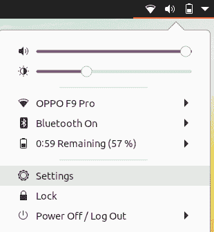

**3。**选择**日期&时间**选项。我们会在窗口的左上角找到这个选项。

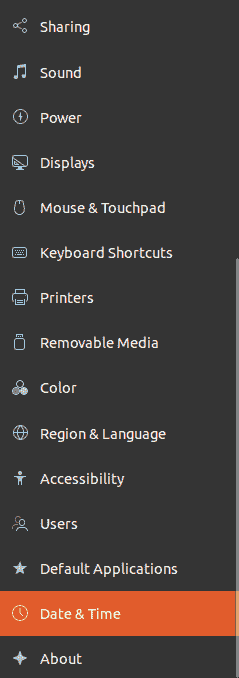

#### 注意:确保我们的鼠标在滚动时在左手边栏上。

**4。**我们需要关闭 ***自动时区*** 选择蓝色开关，即 ***【自动时区】*** 在页面中间这样做。

#### 注意:如果开关，即“自动时区”为灰色，则跳过此过程。

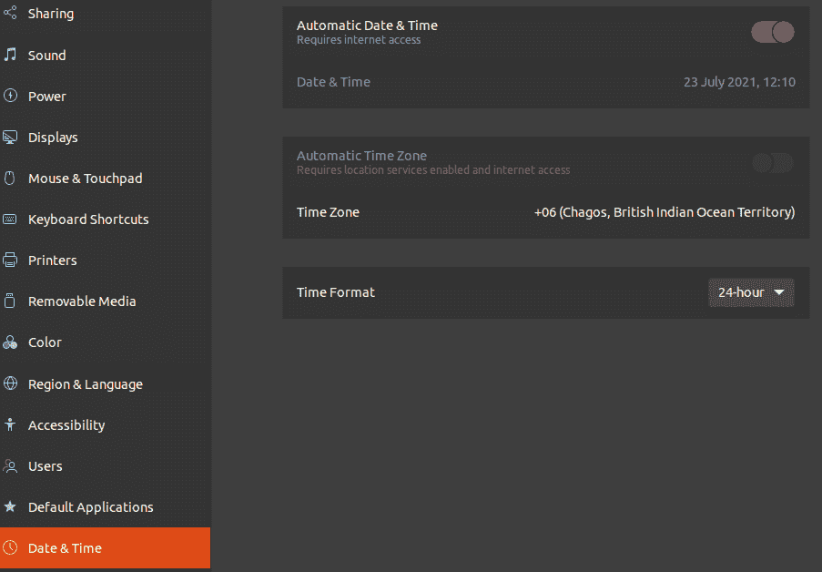

**5。**按 ***时区。*** 靠近窗户底侧。将打开 ***时区菜单。***

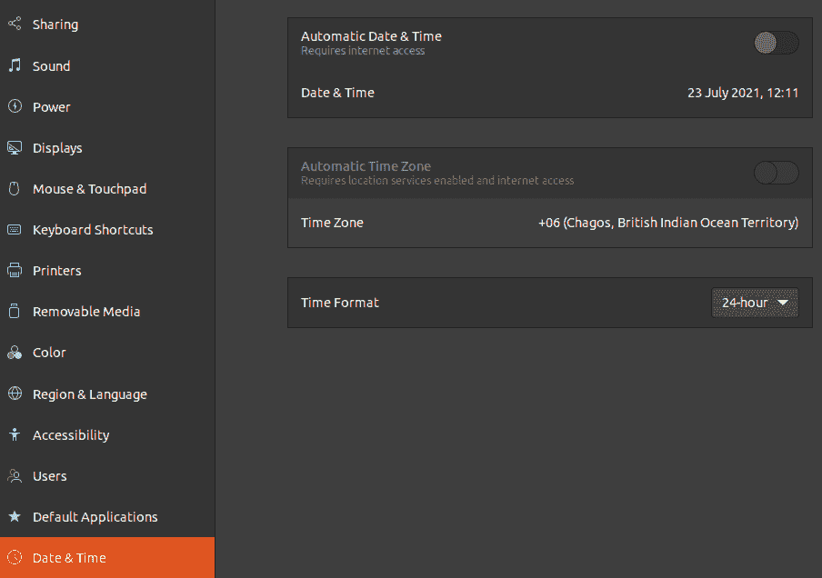

**6。**选择一个**时区。**在**世界地图**上选择我们的**大概位置**进行操作。我们应该检查时间修改，以匹配该地区选择的时区。

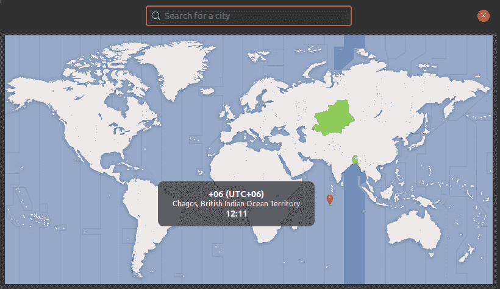

**7。**我们接下来将需要 ***关闭*** 那个 ***窗口。*** 它会保存我们的 ***设置*** 并相应地 ***更新*** 我们的 ***时区。*T21】**

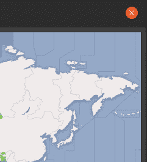

### 技术 4:在薄荷中使用图形用户界面

1.  在这一部分，我们需要 ***打开菜单。*** 在屏幕左下角按 ***菜单*** 。
2.  按下一个图标，即 ***【系统设置】。*** 它由两个灰色的齿轮组成。我们会在菜单窗口的左侧找到它。
3.  按下 ***日期&时间*** 选项。我们会在选项组里面找到，即 ***【喜好】。***
4.  按 ***解锁。*** 我们会在窗户的右侧找到它。
5.  当被询问时，我们需要输入我们的 ***用户密码*** 。在**里面输入我们用来登录系统的*密码*** 。
6.  按 ***认证。*** 在提示的下方。完成这一步后，会解锁 ***日期&时间的菜单。***
7.  选择一个**时区。**按地图的垂直切片选择时区。我们应该检查页面右侧的时钟，并立即修改它以反映时区的选定时间。
8.  按下**锁定。**在窗户右侧。它会保存我们时区的喜好并锁定菜单，即**日期&时间。**

**提示:**

*   在 Linux 的几个版本的 Ubuntu、Debian、SuSE、Gentoo、Slackware 以及任何其他的 ***【正常】*** 上，显示和改变时区的命令不是 ***【时钟】*** 命令，而是 ***【日期】*** 命令。
*   在手机和其他运行 Linux 的设备上，时区的存储方式是不同的。在 ***/etc/TZ*** 文件里面有描述。我们可以手动编辑该文件或应用 echo 命令(例如，设置英国时区的***echo GMT0BST>/etc/TZ***)。

**警告:**

*   少数应用(如***【PHP】***)包含时区与系统时区的单独设置。
*   在一些系统上，有一个系统实用程序会要求提供准确的时区，并对系统配置进行正确的修改。例如，Debian 给出了***【tzconfig】***和***【tzsetup】***实用程序。

* * ***