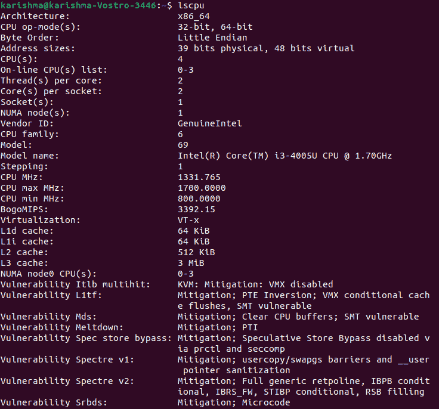
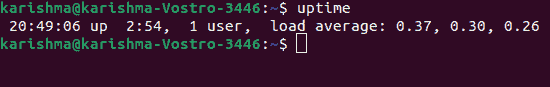
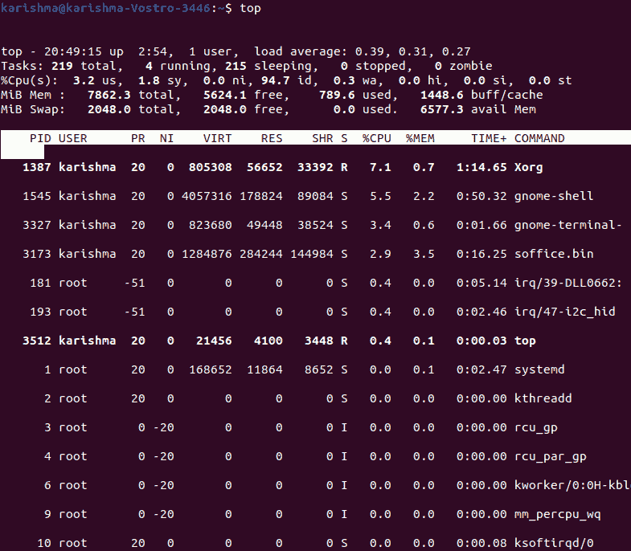

# Linux 平均负载

> 原文：<https://www.javatpoint.com/linux-load-average>

如果我们使用任何 Linux 服务器，我们都熟悉系统负载或负载平均术语。测量系统负载或负载平均值是了解我们的服务器如何工作的典型方法；如果过载，我们需要优化或终止消耗大量资源的进程，或者提供其他资源来平衡工作负载。

那么问题来了，我们如何确定我们的服务器是否有足够的负载能力，什么时候我们必须担心？

在本文中，我们将讨论典型的 Linux 系统管理操作之一——关于负载平均和 CPU/系统负载的性能监控。

在我们讨论任何事情之前，让我们了解每个类似 Unix 的系统中的这两个基本术语:

1.  **负载平均值:**负载平均值是在规定的 15、5 和 1 分钟时间内测量的平均系统负载。
2.  **CPU 负载/系统负载:** CPU 负载/系统负载是对 Linux 系统中 CPU 利用率不足或过度的计算；处于等待状态或通过中央处理器运行的进程。

Linux 中的负载平均值在技术上被假定为进程在其被标记为不间断或正在运行的执行队列中的运行平均值。

**注:**

*   每个系统(如果不是大多数的话)都是由 Unix 或类似 Linux 的系统驱动的，可能会在某个地方显示用户的平均负载值。
*   一个彻头彻尾的 Linux 系统(空闲)可能有一个零平均负载，不包括一个空闲进程。
*   每个类似 Unix 的系统几乎只计算处于等待或运行状态的进程。但是，它不是 Linux 的情况，它包含不间断睡眠状态的进程；这些正在等待系统的一些其他资源，如磁盘 I/O 等。

## 平均负载简介

负载平均值可以定义为特定时间内 Linux 服务器上的平均系统负载。此外，服务器的 CPU 需求包含等待线程和运行线程的总和。

正常运行时间或 top 命令通常会提高我们服务器的平均负载，结果如下所示:

这些数字是十五分钟、五分钟和一分钟内系统负载的平均值。在继续讨论如何测量系统负载平均值的输出以及所有值的含义之前，我们应该提供一个简单的示例，即 ***一台使用一个核心处理器的服务器。*T3】**

### 负载分解

一台使用一个核心处理器的服务器就像一个个体顾客在杂货店里排队等待购买他们的产品一样。通常，高峰时间会排很长的队，而且所有人的等待时间都很长。

如果我们希望节省等待时间，一个重要的指标将是在特定时间内等待的人。当没有人等待时，等待时间将为零。此外，当顾客排长队时，等待时间会很长。

将此用于系统负载结果(0.5、1.5、3.0):

*   0.5 定义了在计数器处的等待时间(最小值)。0.00 到 1.0 之间我们不用担心。我们的服务器是安全的。
*   1.5 定义了队列已满。当平均值变高时，事情将开始放缓。
*   3.00 定义了相当长的等待队列，需要额外的计数器/资源来更快地清理队列。

### 多处理器和多芯片救援

相对来说，一台服务器和一个四核处理器加四个处理器是一样的。多处理器和多核之间的主要区别在于，前者将一个 CPU 定义为具有多个内核。此外，后者定义了多个中央处理器。两个双核相当于单个四核，相当于四个独立的内核。

系统负载与服务器内部的内核相对应，也与它们在 CPU 上的分布方式无关。它定义了最大利用率范围:单核为 0 到 1，双核为 0 到 2，四核为 0 到 4，八核为 0 到 8，等等。

**多处理器:**是两个以上的物理 CPU 可以开发成一个计算机系统的地方。

**多核处理器:**是一个物理 CPU。它至少有两个以上并行实现的独立内核。

此外，还有一项处理器技术，最初是由 ***【英特尔】*** 推出的，用于改进并行计算。它被称为 ***超线程。***

在超线程技术下，一个物理中央处理器内核表示为操作系统的两个逻辑中央处理器内核。然而，现实中只有一个物理硬件元素。

#### 注意:一个 CPU 内核一次只能执行一个任务。因此，诸如超线程、多核处理器、多处理器/中央处理器等技术应运而生。

各种程序可以用多个中央处理器同时运行。当今的英特尔处理器使用一套超线程和多核技术。

我们可以使用 lspu 或 nproc 命令来查找系统上的处理单元编号:

```

$ lscpu

```



```

$ nproc

```


### 监控系统负载/平均负载(站点 24*7)

为更高的负载值增加资源可能会增加基础架构的成本。高效处理负载并管理最佳水平以避免服务器性能下降问题是理想的选择。在 Linux 中， ***Site24*7*** 监控功能监控 60 多个性能指标中的系统负载，并在易于理解和直观的图形中给出 15、5 和 1 分钟的平均值。

此外，如果有任何违规，我们可以接收通知并设置阈值。Site24*7 为故障解决(自动)提供了 IT 自动化设置。

例如，如果双核处理器的平均负载阈值设置为 2.90，我们可以添加服务器命令，并上传一个服务器脚本，以便在超过阈值时利用 CPU(最高)来终止进程。

通过这种方式，可以解决问题，大大减少 **MTTR** (平均维修时间)。

## 如何计算平均负载

有几种方法可以监控系统的平均负载，包括 ***【正常运行时间】*** 命令，该命令说明了系统已经执行了多长时间，用户总数以及平均负载:

```

$ uptime

```



从左侧到右侧考虑这些数字。高平均负载表明系统过载。这意味着各种进程会因 CPU 时间而延迟。

**顶部命令**

```

$ top

```



该命令用于显示 Linux 的运行过程。

**扫视工具**

它是一个 Linux 的系统监控工具。

## 系统性能的其他命令

评估系统性能的一些命令如下:

1.  **vmstat:** 此命令将报告有关阻塞或可运行进程、CPU、陷阱、块 I/O、分页和内存的详细信息。
2.  **htop:** 它是一个交互式的流程查看器。
3.  **dstat:** 它有助于关联进程、CPU 活动、陷阱、块 I/O、分页和内存的每个可用资源信息。
4.  **iftop:** 它是每个接口的网络流量的交互式查看器。
5.  **网猪:**它是每个进程的网络流量的交互式查看器。
6.  **iotop:** 它是一个交互式 I/O 查看器。
7.  **iostat:** 用于存储 I/O 统计。
8.  **netstat:** 用于网络统计。
9.  **mpstat:** 用于 CPU 统计。
10.  **tload:** 它代表一个终端的平均负载图。
11.  **xload:** 它代表 x 的平均负载图。
12.  **/proc/loadavg:** 它是一个具有平均负载的文本文件。

## 中央处理器利用率与中央处理器负载

Ferrari 等人提供的对不同负载指数的研究表明，基于 CPU 队列长度的 CPU 负载信息在负载平衡过程中比 CPU 利用率做得更好。

CPU 队列长度做得更好背后的原因是可能的，因为如果主机负载很重，CPU 利用率接近 100%，它不能反映负载量的水平。相比之下，中央处理器队列的长度可以直接反映中央处理器的负载量。

例如，两个系统(一个使用队列中的 3 个进程，一个使用队列中的 6 个进程)的利用率可能接近 100%。然而，它们明显不同。

### 包扎

包含更多核心可能会提高我们服务器的性能，但也可能会增加我们的基础架构支出。一直以来，监控系统负载以保持对可用设置的有效管理可能是一个不错的选择。

此外， ***Site24*7 服务器监控*** 不仅监控系统负载，还提供补充故障解决工具，以便在高系统负载影响服务器性能之前采取行动。

* * *