# Linux 更改主机名

> 原文：<https://www.javatpoint.com/linux-change-hostname>

在讨论如何在我们的系统中更改主机名之前，我们需要知道主机名的含义。在这里，我们将简要解释主机名的介绍。

## 什么是主机名？

当我们访问任何网站时，我们会在浏览器中键入该网站的网址。URL 是由一些我们能理解的常规词组成的，比如***【javatpoint . com】。*** 域名系统服务器将该名称与服务器的 IP 地址联系起来。这个系统可用由于 IP 地址有点困难，没有人会做。主机名的运行方式类似，只是在本地网络上。

如果我们为我们的计算机提供一个主机名，这是一个我们理解的常规单词，我们可以很容易地输入来识别我们网络上的计算机。类似地，我们可以用一个网址替换主机名，这样我们就可以定期应用一个 IP 地址。

它包括浏览各种本地网页和应用 SSH。除非我们使用任何本地域名系统服务器，否则需要一些设置才能使其顺利运行。

### 查看我们的主机名

查看我们的主机名非常容易。为此，我们需要遵循以下步骤:

1.  打开终端。
2.  只需键入一个命令，即 ***主机名。*T3】**

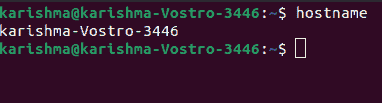

该命令将在终端窗口中显示我们计算机的当前主机名。

## 主机名命令中的选项

主机名命令中有很多选项可用于不同的目的。下面提到并讨论了一些选项:

**1。-a:** 用于获取主机名的别名(如果有)。当别名的名称不固定时，此选项返回一行(空)。它还列举了每个网络接口上的每个配置地址。我们可以使用 ***-别名*** 或***-一个*** 选项来显示一个固定主机的别名(也称为 ***替代主机名*** )。在某些情况下，别名选项是有帮助的，不再建议使用它。

**语法:**

该命令如下所示:

```

hostname -a

```

或者，

```

hostname --alias

```

输出如下:

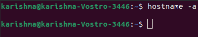

**2。-A:** 用于获取一个主机名的每个***FQDN***(代表 ***全限定域名*** )。此选项枚举每个网络接口上的每个已配置地址。重复地，输出可能显示类似的条目。

**语法:**

```

hostname -A

```

输出如下:

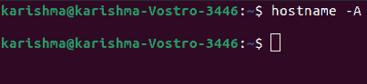

**3。-b:** 用于始终设置主机名。如果未定义，则将使用默认主机名。

**语法:**

```

hostname -b

```

输出如下:

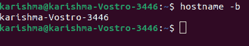

**4。-d:** 用于在本地域固定时获取 ***域*** 。如果没有固定的本地域，该选项不返回任何内容(甚至不返回任何空白行)。

**语法:**

```

hostname -d

```

输出如下:

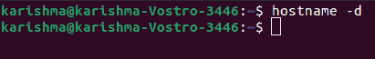

**5。-f:** 用于获取***FQDN。*** 该选项包括 DNS 域名和短主机名。

**语法:**

```

hostname -f

```

输出如下:

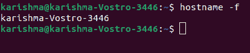

**6。-F:** 用于设置文件中定义的主机名。该选项只能由 ***根用户(超级用户)实现。*** 我们可以使用 ***-文件*** 或 ***-F*** 选项搜索特定文件(如 ***【主机】*** 或 ***主机名*** )并修改我们计算机的主机名以匹配文件内容。

**语法:**

该命令如下所示:

```

$ sudo hostname -F [path of the file]

```

或者，

```

$ sudo hostname --file [path of the file]

```

输出如下:

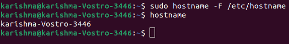

#### 注意:我们还需要提到在使用- file 或-F 选项时我们希望检查的文件路径。

**7。-i:** 用于获取网络(IP)地址。它只在主机名是可分解的情况下工作。

**语法:**

```

hostname -i

```

输出如下:

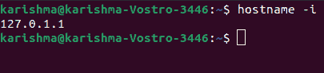

**8。-I:** 用于获取各个网络(IP)地址。它不取决于主机名的可解析性。

**语法:**

```

hostname -I

```

输出如下:

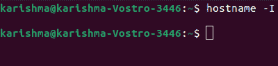

**9。-s:** 用于获取主机名(简称)。短主机名可以定义为第一个 ***点/句点()之前的主机名部分。).*** 如果主机名不包含句点，将显示完整的主机名。我们可以使用 ***-短的*** 或 ***-s*** 选项来显示主机名的短版本。它在第一个路口被切断了。

该命令如下所示:

**语法:**

```

hostname -s

```

或者，

```

hostname --short

```

输出如下:

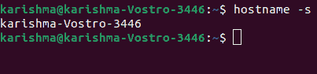

**10。-V:** 该选项提供版本号作为输出。

**语法:**

```

hostname -V

```

输出如下:

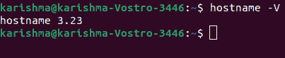

**11 时。- help，-h:** 用于显示结果帮助消息。

**语法:**

```

hostname -h

```

输出如下:

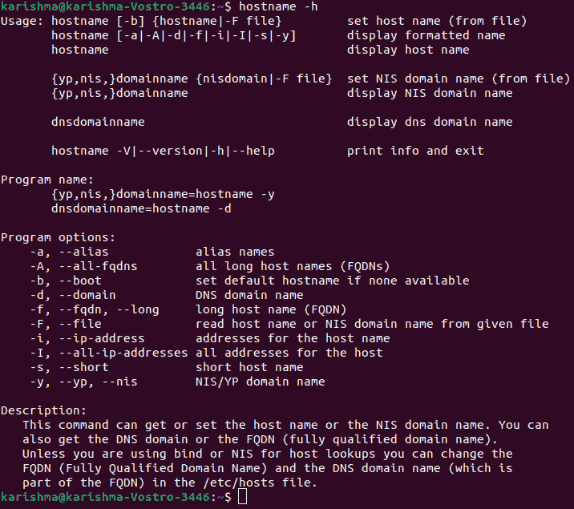

**12 时。- nis，- yp，-y:** 此选项用于显示 nis 的域名。

**语法:**

```

hostname -y

```

输出如下:


## 如何更改主机名

以下是我们如何在 Linux 中更改计算机名称的一些步骤。我们需要遵循这些简单的步骤来更改我们系统的主机名或计算机名。这些步骤如下:

**1。**我们可以使用 ***vi*** 或 ***nano*** 文本编辑器输入以下命令来编辑 ***/etc/hostname*** 文件:

```

$ sudo nano /etc/hostname

```

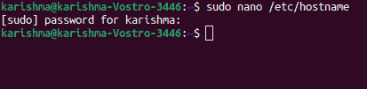
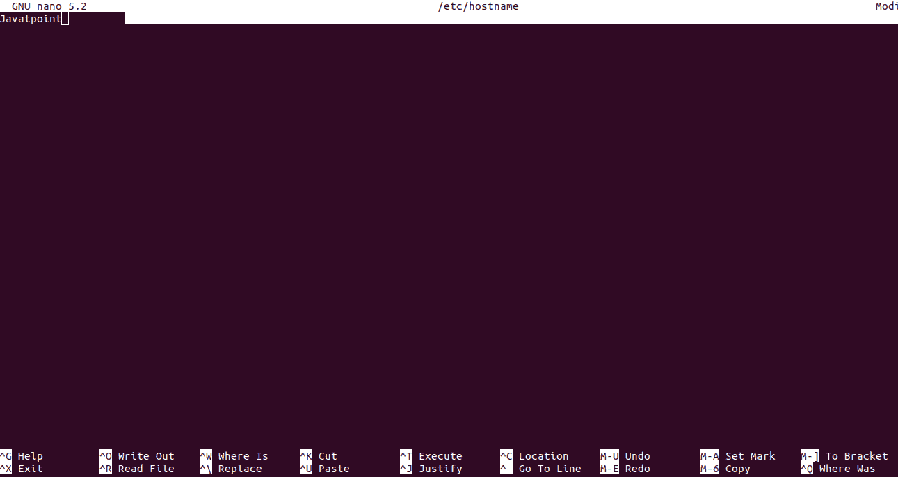

删除以前的主机名，并输入新的主机名。

**2。**第一步后，输入以下命令编辑 ***/etc/hosts*** :

```

$ sudo nano /etc/hosts

```

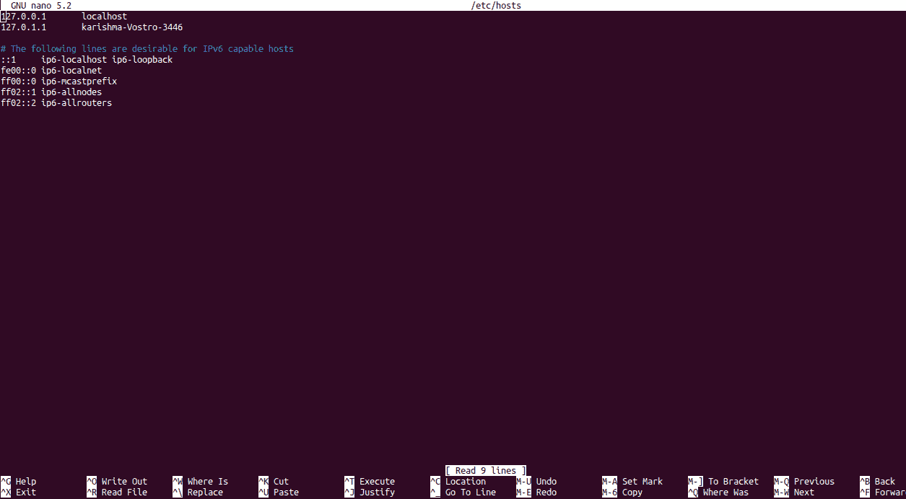

用我们的新名称删除现有的计算机名。

**3。**键入以下命令查看更改:

```

$ hostname

```

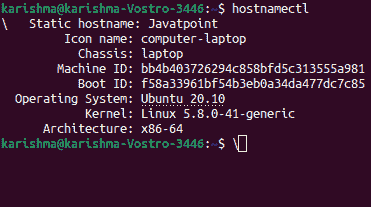

## 设置我们的主机名

也许，我们在安装操作系统时设置了计算机的主机名，但是我们可以随时修改它。有各种不同的方法来设置 Linux 计算机的主机名。systemd 大大简化了这个过程。

### 系统

我们可以在运行 systemd 的系统上执行下面的命令来更改计算机的主机名。

该命令如下所示:

```

$ sudo hostnamectl set-hostname

```

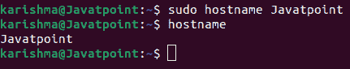

Systemd 会小心翼翼地为我们重置一切。

### 老式技术

最传统和最通用的技术之一是更改两个文件，然后重新启动我们的计算机。初始文件被称为 ***“主机名”。*** 是一个纯文本文件，里面有一个单词。系统会读取这个单词，并将其作为我们的主机名。因此，在这里输入我们喜欢的任何内容，使其成为我们系统的主机名。该文件位于 ***"/etc/hostname"*** 文件中。

第二个文件被称为 ***【主机】*** 文件。它告诉我们的系统哪个主机名与 IP 地址连接。我们需要指定它来将我们的主机名与本地计算机相关联。本文件位于***"/etc/hosts；"*** 文件。一旦找到它，我们需要打开它。

我们必须关注两行内容，如下所示:

我们只需要修改具有当前主机名的第二行。完成后，保存、退出并重新启动计算机。

## 什么是主机文件？

这个文件的操作有点像超简化的域名系统服务器。它是一个文件，让我们的计算机匹配我们网络上的主机名和 IP 地址。我们可以在***“/etc/hosts”获取文件。*** 一旦我们找到它，就打开它。

该文件分为两部分。顶部管理我们习惯的 IPv4 地址，底部是 IPv6。当我们采用传统技术时，我们将主机名设置在顶部。

为了在我们的网络上添加其他设备的主机名，我们需要在这两个主机名下为我们的计算机创建新的线路，并采用类似的格式。

最初，添加设备的本地 IP。然后，提供它的主机名。

完成后，重新启动计算机网络。它必须像重新启动网络服务一样简单。

要重新启动网络，命令如下:

```

$ sudo systemctl restart network

```

我们现在可以通过新条目的主机名来访问它。

我们也应该试着和 SSH 相处。命令如下:

```

$ ssh user@hostname

```

* * *