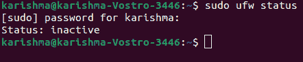
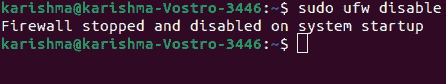
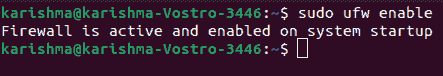

# Ubuntu 禁用防火墙

> 原文：<https://www.javatpoint.com/ubuntu-disable-firewall>

Ubuntu 自带防火墙配置工具***【UFW】***(意思是 ***【不复杂防火墙】*** )。这个工具是 ***前端*** 和 ***用户友好的*** 来管理 iptables 防火墙的规则，这个工具的主要目标是使处理防火墙的规则变得更容易或者像它的名字定义的那样 ***不复杂。***

建议保持防火墙启用。但是，在某些情况下，比如测试，我们可能需要禁用或停止我们系统中的防火墙。在本文中，我们将说明如何在 Ubuntu 系统上停止或禁用防火墙。

在深入解释之前，让我们先了解一下什么是 UFW。

## 什么是 UFW？

***【UFW】(简单防火墙)*** 是一个管理 ***网络过滤防火墙*** 的程序，开发出来就是为了方便使用。它应用由少量通用命令组成的 ***命令行界面*** ，并应用 ***iptables*** 进行配置过程。默认情况下，在 ***8.04 LTS*** 版本之后的每一次 Ubuntu 安装中都存在这个 Netfilter 防火墙。

### 乌班图的 UFW

8.04 版本的 Ubuntu 引入了 UFW。默认情况下，它在 Ubuntu 的每个安装中都可用。

### 可用版本

*   0.31.1-1: Ubuntu 12.04 ESM
*   0.34-RC-0 Ubuntu 2:Ubuntu 14.04 ESM
*   0.35-0 Ubuntu 2:Ubuntu 16.04 lt
*   0.36-0 Ubuntu 0 . 18 . 04 . 1:Ubuntu 18.04 lt
*   0.36-6: Ubuntu 20.04
*   0.36-7: Ubuntu 20.10
*   0.36-7.1: Ubuntu 21.04
*   0.36pre: Ubuntu 内核

### UFW 的吉塞

GFW 的图形用户界面旨在成为管理简单防火墙的直观、简单的图形用户界面。此外，它支持基本任务，如阻止或允许预配置的、单独的或公共的 P2P 端口。Gufw 是为 Ubuntu 开发的。但是，它也可以在基于 Arch Linux 和 Debian 的发行版中获得；GTK、Python 和 UFW 存在的任何地方。

### UFW 的高级功能

UFW 应用可以做任何 iptables 可以做的事情。这是通过使用各种规则文件集来实现的。与兼容的文本文件相比，这些文件只不过是些小东西，即 ***iptables-restore。*** 微调 UFW 或/和添加其他 iptables 命令不由 UFW 命令提供:

*   **/etc/default/ufw:** 这个文件是一个高级配置，像内核模块、Ipv6 支持和要使用的默认策略。
*   **/etc/ufw/after[6]。规则:**此文件中的规则在 UFW 命令添加规则后进行分析。
*   **/etc/ufw/before[6]。规则:**在 UFW 命令添加规则之前，会分析该文件中的规则。
*   **/etc/ufw/sysctl.conf:** 此文件为内核网络提供可调参数。
*   **/lib/ufw/user[6]。规则**或 **/var/lib/ufw/user[6]。规则:**在这些文件中，规则是通过 ufw 命令添加的。
*   **/etc/ufw/ufw.conf:** 它修复了 ufw 应用是否在引导时启用。在 9.04 版本或更高版本中，它修复了 LOGLEVEL。
*   **/etc/ufw/before.init:** 在此文件中，自定义初始化脚本在初始化 ufw 应用之前执行(ufw 版本 0.34 及更高版本)。
*   **/etc/ufw/after.init:** 在此文件中，自定义初始化脚本在初始化 ufw 应用后执行(ufw 版本 0.34 及更高版本)。

## 先决条件

确保我们以 root 用户身份登录，并具有 sudo 权限。

## 检查防火墙的状态

要检查最新的 UFW 防火墙状态，我们可以使用以下命令:

```

$ sudo ufw status

```



默认情况下，UFW 防火墙未启用。如果我们以前从未启动过 UFW，那么结果将如下所示:

```

Status: inactive

```

此外，如果防火墙已经启用，那么我们将看到如下内容:

```

Status: active

```

## 禁用防火墙

我们可以使用以下命令来禁用 Ubuntu 系统中的 UFW 防火墙:

```

$ sudo UFW disable

```

结果如下所示:



上述命令将禁用或停止防火墙。但是，它不会删除防火墙的规则。每当我们希望启用此防火墙时，就会加载类似的规则。

## 删除防火墙规则

如果我们希望停止防火墙并删除防火墙的每个规则，那么我们可以使用以下命令:

```

$ sudo ufw reset

```


我们将被问及是否希望继续这项行动。

当我们希望恢复我们的每个修改并重新开始时，重置 UFW 防火墙是有帮助的。

## 启用防火墙

在启用防火墙之前，确保 ***SSH 端口*** 对任何连接都是开放的。

我们可以运行以下命令来启用防火墙:

```

$ sudo ufw enable

```



如果出现提示，输入 ***y*** 继续操作。

* * *