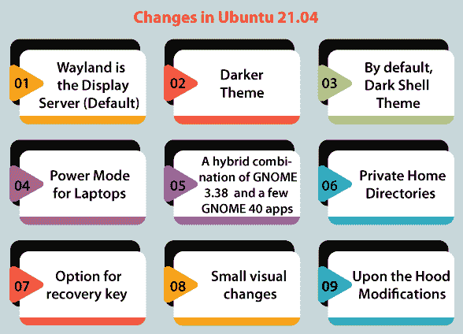
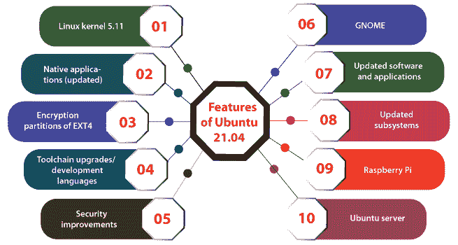

# Ubuntu 的最新版本

> 原文：<https://www.javatpoint.com/latest-release-of-ubuntu>

Ubuntu 最新发布的是 ***21.04*** ，发布于***2021***4 月 22 日*。它代表了世界上最著名的开源桌面操作系统的最新稳定出版物。这个乌班图版本被称为 ***【多毛河马】*** 。*

 *开发的六个月投入到整合 ***Ubuntu 21.04*** 中。然而，版本中也有一些令人惊讶的 bug(Ubuntu 的开发者称之为 ***【多毛河马】*** )。有几个较小的开发使 Ubuntu 比以前更加用户友好和易于访问。

这个版本的 Ubuntu 从发布之日起 9 个月内支持*以及关键的应用更新、安全补丁和错误修复。这一支持将于 2022 年 1 月结束。Ubuntu 的 ***21.04 版本建议的‘升级’路径是 Ubuntu*** 的 ***21.10 版本。****

 *Ubuntu 的 21.04 版本是 Ubuntu 的第 24 个版本，也是 Ubuntu 的第 3 个版本，因为其代号以***【H】***字母开头。

### 要点:

Ubuntu 21.04 版本的一些关键点将在下面讨论和解释:

*   Ubuntu 21.04 带来了对 ***稳定性*** 和 ***自动化*** 战线的必要改进，以及对 ***阶段性更新*** 和 ***的新集成 ***APT*** (代表 ***高级包工具*** )。***
*   此外，开发周期还提高了企业应用的可用性，并为 LTS Ubuntu 的每个版本提供了对更新的硬件支持高级网络堆栈上的微软结构化查询语言服务器的基本支持，以及对 Ubuntu 20.04 的长期支持。

## Ubuntu 21.04 的发布日期

21.04 Ubuntu 版本的发布日期为 2021 年 4 月 22 日和。发布日期是在 Ubuntu 开发的主页 Launchpad 上提到的。

其他重要事件在 ***【多毛河马】*** 的发布时间表中提到如下:

2021 年 2 月 25 日(***特征冻结*** )

182021 年 3 月(**T3】UI 冻结 T5)**

12021 年 4 月 ***Ubuntu 21.04 Beta***

82021 年 4 月(***仁冻*** )

152021 年 4 月(***发布候选人*** )

## Ubuntu 21.04 的变化

首先，它是一个临时出版物。不要期望在这里有突破性的修改，尤其是如果我们将其与 Ubuntu 的 20.10 版本进行比较的话。

这里和那里有一些微妙的视觉修改，性能上的一些改进，新的流行库，以及包含一些新方面的软件版本。

### 1.威兰德是显示服务器(默认)

在经历了 17.10 版本 Ubuntu 的失败后， **Canonical** 将再次作为 21.04 版本 Ubuntu 中的**显示服务器(默认)**搭载 **Wayland** 。

Wayland 作为旧的几个版本的替代选项而存在。它只是成为这个版本的默认版本。

**Wayland** 在属于 **HiDPI 屏幕处理**和**多显示器**类别时，性能稍微好一点。

但是，我们会发现许多应用在韦兰内部运行不佳或根本不起作用。不利于**录制应用和**截屏。

更好的是**使用韦兰**切换回 Xorg 是一些点击的情况。我们只需要弄清楚什么时候不使用 **Xorg 服务器**就不能很好地工作。

### 2.黑暗主题

在 Ubuntu 21.04 版本中， **Yaru 黑暗主题**与 Ubuntu 21.04 版本相比，包含了稍微暗一点的阴影。其实它给我们的操作系统提供了一个**更好的外观**。

这个版本还提供了移动滑块来检查 Ubuntu 两个版本的暗色调之间的差异的能力。

### **3。默认情况下，暗壳主题**

默认情况下，Ubuntu 20.10 有经典的 **Yaru 主题**，我们不得不选择这个黑暗模式。此外，它在 Ubuntu 21.04 中保持相似，除了外壳主题被更改为**默认雅鲁藏布江**。

这意味着我们的系统默认会有一个浅色主题，系统托盘、消息托盘和通知会应用深色主题。

### 4.笔记本电脑的电源模式

这是对电源选项设置的微小修改。如果我们使用任何笔记本电脑，那么现在我们可以从系统设置中选择电源模式选项。

我们有以下几种选择:

1.  **性能:**该选项消耗大量的电池电量。然而，它提供了高性能。此外，它还可以保持屏幕的高亮度、蓝牙活跃等。
2.  **节电器:**该选项用于集中节省电池电量。
3.  **均衡功率:**该选项提供经典的性能以及合理的电池使用。

### 5.GNOME 3.38 和一些 GNOME 40 应用的混合组合

**GNOME 40** 连同布局的**非正统横**在 21.04 版本的 Ubuntu 中并不存在。乌班图团队没有装备**布局修改**和 **GTK 4** 。他们正在努力使其在今年 10 月份达到 Ubuntu 21.10 版本。

虽然一些核心组件如**鹦鹉螺文件管理器站在 3.38** ，GNOME 的一些其他应用如**磁盘实用程序、主显节浏览器**等包括最新版本。

**6。私有主目录**

到目前为止，主目录拥有 755 权限。Ubuntu 21.04 全新安装将包括对 750 的这一修改。这一变化使主目录成为私有目录。因此，如果我们在系统上创建一个新用户，那么这个新用户将不会查看或访问该用户的另一个主文件夹的详细信息，除非被授权这样做。

### 7.恢复密钥选项

如果我们在安装 Ubuntu 版本时选择加密磁盘，我们将直接在安装程序中生成恢复密钥。

### 8.微小的视觉变化

这些绝不是突破性的修改。到目前为止，这只是我们在 21.04 版本的 Ubuntu 中注意到的事情。

我们将注意到右键菜单上的许多项目已经被更多颜色的线分类(对比)。我们认为是出于**可达性**的原因。

此外，我们注意到桌面右上角显示了各种安装的驱动程序。当我们正确回忆时，它曾经在旧版本中的**垃圾桶**和**主页**图标上。

一系列软件的**雅茹图标** ( **默认**)已经被激活。显然，我们可以注意到几个**图书馆**图标。

### 9.引擎盖改装后

我们应该知道的一些其他修改如下:

*   Ubuntu 21.04 版本支持使用 **PAM** 对**智能卡**进行认证。
*   Ubuntu 21.04 版本的**拖放交互**提供了在桌面视图中使用软件的支持。
*   支持 Ubuntu 21.04 版本的 Pipewire，支持在屏幕录制和沙盒应用中处理音频设施。
*   Ubuntu 版本的 Nftables 替代了 iptables。

该软件有一些较新的版本:

*   Firefox 87
*   书店 7.1.2
*   g 编辑 3.38.1
*   Python 3.9
*   Linux 内核 5.11

## Ubuntu 21.04 的特性

Ubuntu 21.04 版本的一些重要特性如下:

### 1.Linux 内核 5.11

5.11 版本的 Linux 内核在 21.04 版本的 Ubuntu 中被默认添加。由于 5.10 版本的 Linux Ubuntu 已经发布，5.11 版本的 Linux Ubuntu 也已经准备好了，Ubuntu 21.04 将在 2021 年 2 月完成方面冻结。

5.11 版本的 Linux 内核吹嘘支持增强的 AMD Zen 2/Zen3 CPU 性能、英特尔 Iris Xe GPU 支持、RISC-V 改进、Wi-Fi 6E 和其他功能。

此外，Ubuntu 为 ***【英特尔】*** 的 ***软件卫士扩展*** 提供支持，并开发对 AMD GPUs 和 CPU 的支持。

### 2.本机应用(已更新)

许多应用的 Ubuntu 版本都存在于 21.04 版本的 Ubuntu 中。其他功能必须添加最新的 GNOME 原生应用版本，如预加载的应用 ***【火狐】*** 和 ***雷鸟*** 。此外，还有 GNOME 图像查看器、系统监视器、磁盘使用分析器、字符应用等新版本。

### 3.加密 EXT4 的分区

Ubuntu 的无处不在的安装程序可能允许用户加密他们的 EXT4 分区，而不需要使用 LVM 分区方案。如果发生这种情况，正常用户可以默认随 EXT4 分区方案一起呈现完整的磁盘加密。

### 4.工具链升级/开发语言

一些 ***工具链*** (预装)如***【PHP】【Ruby】【Perl】******【Python】***随着 21.04 版本的 Ubuntu 获得了一些升级。其中最重要的是 ***Python 3.9*** 因为它是默认安装的。

### 5.安全性改进

Ubuntu 的 21.04 版本默认应用了 nftables 作为后端防火墙的概念，以确保我们系统的安全性。它负责过滤和分类网络数据包。

### 6.土地神

默认情况下，GNOME 外壳在提供黑暗主题的 Ubuntu 21.04 版本上可用。但是，支持浅色 GTK 主题和深色标题栏的软件和应用就不同了。

### 7.更新的软件和应用

*   78.8.1 版本的雷鸟
*   87 版火狐浏览器
*   7.1 版本的 LibreOffice

### 8.更新子系统

*   网络管理器 1.30
*   蓝兹 5.56
*   脉冲星 14

### 9.树莓皮

21.04 版本的 Ubuntu 为著名的小板系统提供了相当多的更新，即 ***【覆盆子 Pi】***。它包括:

*   对 OpenGL 的各种腐败应用的额外支持。但是，为此，用户将需要通过运行下面提到的命令来手动完成:

gsettings set org . gnome . mutt 实验特性“[kms-修饰符]”

*   它在计算机的 4 个模块上提供了对蓝牙和 WiFi 模块的额外支持。
*   它通过 libgpiod 为 GPIO 提供了额外的支持。

### 10.Ubuntu 服务器

此外，21.04 Ubuntu 服务器( ***【多毛河马】*** )具有出色的升级和功能。这些升级和功能讨论如下:

*   **微软 SQL Server**
    Ubuntu 21.04 版本的**开发包含了对 **20.04 LTS 版 Ubuntu** 上的 **SQL Server** 的支持。通过优化 **Ubuntu 映像**，现在 **Azure** 上支持**数据库管理系统**(简称 **DBMS** )及其 **CLI** 。
    现在，系统管理员可以很容易地使用普通打包的工具来执行内部部署，或者使用默认情况下与 SQL server 一起安装的 Ubuntu 映像来部署在**微软 Azure** 上，以快速设置命令行界面和数据库管理系统。这为云环境带来了非常强大、维护良好和长期的数据库，其**安全维护**长达十年。
    由于**微软**和**规范**将携手合作，为 Ubuntu 与**微软 SQL Server** 的部署提供更好的支持。它将为性能带来一些额外的增强。它们支持 **XFS 文件系统**上的 **FUA** (代表**强制单元访问**)。此外，它们使用**持久存储设备**(**pmem**)而不需要实现配置。**
*   **Rails 6**
    21.04 版本的 Ubuntu 带来了 Rails 6。迁移到 21.04 版本的 Ubuntu 的 20.04 LTS 版本的用户现在可以在 6.0.3.5 Rails 上享受当前版本的 Ruby 了。此次更新中出现的一些主要方面如下所述:
    动作电缆测试
    并行测试
    **动作文本:**它是 Rails 丰富的文本和编辑材料。此外，它包含从编辑到图库、照片、脚注、列表项和链接的所有内容。
    **操作邮箱:**在此选项中，邮件(传入)将被路由到类似控制器的邮箱。
*   **Nginx lua 模块**
    在 Ubuntu 21.04 服务器上最引人注目的修改就是删除了 Nginx lua 模块。因此，这个模块的当前上游版本已经不再像 bug 1893753 中看到的那样直接与 Nginx 一起工作。
*   **需要重启服务器**
    21.04 版本的 Ubuntu 服务器预装了一个名为**需要重启**的软件包。 **needrestart** 包检查在库升级和更新后哪些守护程序需要重新启动/重启。
*   **Ubuntu 服务器包更新**
    1.  Docker.io 包已更新到 20.10.2 版。
    2.  Runc 包已经更新到版本 1.0.0-rc93。
    3.  容器包已更新到版本 1.4.4。
    4.  Rsyslog 包已更新到 8.2102.0 版。
    5.  网络 SNMP 包已更新到 5.9 版。
    6.  SSSD 软件包已更新到 2.40 版本。
    7.  Samba 包已经更新到版本 4.13.3。
    8.  Postgresql 包已更新到 13.2 版。
    9.  Virt-manager 包已更新到 3.2.0 版。
    10.  OpenVPN 包已更新到版本 2.5.1。
    11.  Strongswan 软件包已更新到 5.9.1 版。
    12.  Chrony 软件包已更新到 4.0 版。
    13.  开放式虚拟开关包已更新到 2.15 版本。
    14.  DPDK 包已更新到 20.11.1 版。
    15.  Libvirt 包已经更新到 7.0 版本。
    16.  QEMU 包已经更新到 5.2 版本。

* * ***