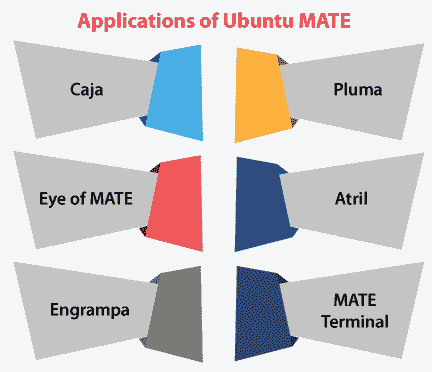

# 乌邦图杀戮

> 原文：<https://www.javatpoint.com/ubuntu-mate>

Ubuntu MATE 是一款*和 ***免费发布的***Linux 和 ***Ubuntu 的官方衍生。*** 其与 Ubuntu 的主要区别在于 Ubuntu MATE 应用 ***MATE 桌面平台*** 作为其用户界面(默认)，其基于***【GNOME 2】***而非 ***GNOME 3 桌面平台*** 即 Ubuntu 的用户界面(默认)。*

 *Ubuntu MATE 代表了标准桌面环境的简单性。它是 GNOME 2 桌面的延续版本。GNOME 2 桌面在 2010 年 10 月之前一直是 Ubuntu 的默认桌面。

MATE 的桌面环境为 Unix 和类似 Linux 的操作系统提供了一个吸引人和直观的桌面环境。MATE 正在积极开发，以便在保留经典桌面体验的同时增加对新技术的支持。

Linux 是一个开源的操作系统。它包括 Linux 内核、广泛的应用以及内核的实用程序。有几种 Linux 发行版在呈现这些组件和包的格式上是不同的。

在这个 Linux 发行版(MATE)中，图形桌面被称为 MATE。Mate 被认为来自 GNOME 2，GNOME 2 是一个高效的 Linux 接口。

## Ubuntu MATE 的工作站

*   工作站执行 Ubuntu MATE 16.04。
*   这是 Ubuntu 操作系统的最新 LTS 版本。
*   Ubuntu Mate 是 Ubuntu 的衍生产品，它的开发是为了方便安装和使用。
*   本质上，Linux 是健壮和安全的，不需要防病毒保护。
*   Ubuntu MATE 非常便携，它在实验室工作站上具有 3D 图形功能。
*   然而，它也将在不太强大的图形处理器上执行。
*   Mate 包括一个基于菜单的用户界面，用户可以在其中查看类别中提到的已安装应用。
*   它使安装的应用相对容易搜索。
*   Mate 是 Linux 最伟大的软件经理之一。
*   如果找不到应用，我们可以使用软件管理器来查找它。

## 这个术语从何而来？

术语***【MATE】***来源于 ***耶尔巴 mate*** ，这是一种原产于南美洲(亚热带)的冬青。这种植物的叶子含有咖啡因，可以用来制作输液，这种饮料被称为“T8”伴侣。

## 哪些发行版支持 MATE？

MATE 是 Linux 发行版的官方存储库，下面会提到:

*   Void Linux
*   矢量 Linux
*   Uruk Linux/GNU
*   乌邦图杀戮
*   人的本质
*   Linux/GNU 三位一体
*   Solus
*   斯林
*   柳属
*   Sabayon
*   PLD Linux
*   PCLinuxOS
*   鹦鹉安全操作系统
*   大蜥蜴
*   曼哈罗
*   Mageia
*   Linux 造币厂
    哈马拉 Linux
*   GNU GuixSD 和 GNU Chalk
*   巴布亚企鹅
*   一种男式软呢帽
*   一种自由操作系统
*   Arch Linux
*   AOC 足球俱乐部
*   Antergos
*   阿尔卑斯 Linux

MATE 是由非官方的 Linux 发行版存储库存在的，如下所述:

*   斯拉克语

也许我们更喜欢 UNIX:

*   OS108
*   TrueOS
*   开放印第安纳州
*   操作系统
*   GhostBSD

## Ubuntu MATE 的历史

这个项目，即 ***【乌班图 MATE】***被 ***艾伦·波普*** 和 ***马丁·温普斯*** 探测到，并作为 ***乌班图的官方衍生产品*** 开始使用 14.10 版本的乌班图作为它的第一个版本(14.04 LTS 版本的乌班图紧随其后)。

截至 2015 年 2 月，根据 ***15.04 Beta 1*** 发布，Ubuntu MATE 从 ***Canonical*** 有限公司获得了 Ubuntu 官方风味状态。除了最早支持的 ***x86-64*** 和 ***IA-32*** 外。另外，Ubuntu MATE 支持***【arm V7】***和 ***PowerPC*** (在 ***ODROID XU4*** 和 ***树莓 Pi 2*** 和 ***3*** 上也有)。

在 ***2015 年 4 月，*** Ubuntu MATE 公布了与 ***英国电脑经销商 Entroware 的合作关系。*** 它使 Entroware 的客户能够使用预装的 Ubuntu MATE 版本购买笔记本电脑和台式电脑，并获得完整的支持。其他各种各样的硬件交易后来也出版了。

***重要:*** *在 **18.10** 发布的 Ubuntu MATE 中，对 **32 位**的支持被撤销。*

## Ubuntu MATE 的发布

| 版本 | 出厂日期 | 代号 | 支持至 | 评论 |
| 14.04 lt | 2014-11-11 | **值得信赖的塔赫尔** | 2019 年 4 月 | 在 14.10 版本之后发布，为 LTS 提供支持，直至 2019 年。 |
| **14.10** | 2014-10-23 | **自动独角兽** | 2015 年 7 月 | Ubuntu MATE 的初始版本。 |
| **15.04** | 2015-04-23 | **活着的 Vervet** | 2016 年 1 月 | 官方 Ubuntu 版本的初始版本。 |
| **15.10** | 2015-10-22 | **狡猾的狼人** | 2016 年 7 月 | 搭载 1.10 版 MATE，默认情况下不安装***Ubuntu 软件中心****。* |
| 16.04 lt | 2016-04-21 | **仇外的薛西斯** | 2019 年 4 月 | 最初的官方 LTS 版本。它具有 1.12.x DE 版本的 MATE 扩展软件和欢迎应用精品。默认情况下，它内置了 ZFS。 |
| **16.10** | 2016-10-13 | 就用同样的方法弄了 1231 个个案 | 2017 年 7 月 | 完成 MATE 桌面的 GTK3+实现。大多数默认应用是 ***【建议】*** ，因此可以毫无问题地卸载。 |
| **17.04** | 2017-04-13 | **【zesty zappos】** | 2018 年 1 月 | 旧的非 LTS Ubuntu MATE 版本以及 9 个月的支持。包括迁移到 **GTK3+。** |
| **17.10** | 2017-10-19 | **巧手土豚** | 2018 年 7 月 | 旧的非 LTS 版本。17.10.1 版本于 2018 年 1 月 12 日发布。此外，它还修复了一个阻止 ***BIOS*** 和 ***UEFI*** 固件的问题。 |
| 18.04 lt | 2018-04-26 | **仿生海狸** | 2021 年 4 月 | 老 LTS 发布。支持 ***覆盆子皮 B2/B3/B3+*** 和**T5】口袋 2 & GPD 口袋。** |
| **18.10** | 2018-10-18 | **宇宙墨鱼** | 2019 年 7 月 | 结束对 32 位版本和旧的非 LTS 64 位版本的支持。它采用了 1.20 版本的 MATE。 |
| **19.04** | 2019-04-18 | **迪斯科丁果** | 2020 年 1 月 | 旧的非 LTS 64 位版本。它搭载了 ***英伟达驱动*** 和 ***MATE 1.20。*** |
| **19.10** | 2019-10-17 | **Eoan 约会** | 2020 年 7 月 | 非 LTS 64 位版本。它将***【VLC】***和 ***GNOME MPV*** 替换为默认媒体播放器，并搭载了 1.22.2 版本的 MATE。 |
| 20.04 lt | 2020-04-23 | **焦窝** | 2023 年 4 月 | 最新的 LTS 64 位版本。它采用了 1.24 版本的 MATE。 |
| **20.10** | 2020-10-22 | **超常规大猩猩** | 2021 年 7 月 | 它采用了 1.24.1 版本的 MATE。 |
| **21.04** | 2021-04-22 | **多毛河马** | 2022 年 1 月 | 最新版本，64 位。它采用了 1.24.2 版本的 MATE。 |

## Ubuntu MATE 的应用

***MATE*** 是由广泛的应用组成的。重命名对于避免与 ***GNOME 的组件冲突至关重要。*** 下面列出并讨论了其中一些应用:

*   盒子盒子盒子盒子盒子盒子盒子盒子盒子盒子盒子盒子盒子盒子盒子盒子盒子盒子盒子盒子盒子盒子盒子盒子盒子盒子盒子盒子盒子盒子盒子盒子盒子盒子盒子盒子盒子盒子盒子
*   普卢玛
*   MATE 之眼
*   阿特里尔
*   雕刻
*   MATE 终端

### 盒子盒子盒子盒子盒子盒子盒子盒子盒子盒子盒子盒子盒子盒子盒子盒子盒子盒子盒子盒子盒子盒子盒子盒子盒子盒子盒子盒子盒子盒子盒子盒子盒子盒子盒子盒子盒子盒子盒子

Caja 是 MATE 桌面的 ***文件管理器(官方)*** 。它允许 ***浏览目录*** 以及预览文件，并启动与其相关的应用。此外，它很容易处理 MATE 桌面上的图标。该应用在*和 ***本地文件系统上工作。Caja*** 的应用也可以描述为一个 ***鹦鹉螺叉。****

 *### 普卢玛

pluma 应用用作 ***文本编辑器。*** 它支持编辑器的大多数经典功能。此外，它使用一般文本编辑器中通常检测不到的其他方面来扩展这一常见功能。

Pluma 应用可以描述为一个 ***图形应用*** ，它支持在单个窗口中编辑多个文本文件(有时称为***【MDI】***或 ***选项卡*** )。Pluma 完全支持 ***文本(国际)*** 通过其 ***Unicode UTF-8 编码*** 在编辑文件中使用。

pluma 的核心特征集包含 ***的 ***语法高亮*** 打印支持、自动缩进、*** 和 ***源代码*** (使用 ***打印预览*** ) ***。*普卢玛**的应用也可以描述为一个 ***格迪特叉。***

### MATE 之眼

MATE 之眼也可以称为 ***EoM。***eom 的 MATE 之眼是 MATE 桌面的通用 ***图形查看器*** 。它应用了一个库，即 ***gdk-pixbuf。*** 它还可以处理大图像，并且可以随着内存的不断使用而滚动和缩放。

MATE 之眼的目标是****的标准符合性和简约性。*** 这个应用也可以用一个***GNOME 叉之眼来形容。****

 *### 阿特里尔

Atril 是一个通用的 ***多页文档查看器。*** 该应用可用于显示和打印 ***可移植文档格式(PDF)、XPS、DVI、DJVU、封装后记(EPS)***和 ***后记(PS)。***

此外，它允许在剪贴板上复制文本，查找文本，目录书签，以及通过文档支持的超文本导航。 ***Atril*** 也可以用一个***evision fork 来形容。***

### 雕刻

这个应用是 MATE 桌面环境的 ***档案管理器*** 。它允许我们创建和更改档案，显示档案的内容，通过档案提取文件，以及显示档案中的文件。这个应用也可以描述为一个 ***档辊叉。***

### MATE 终端

它被指定为 ***终端仿真应用*** ，我们可以使用它来访问 MATE 桌面环境中的 UNIX-shell。我们可以使用它执行任何为在 ***xterm、VT220、VT102 终端上运行而创建的应用。***

此外，***【MATE 终端】*** 包含在一个选项卡(窗口)中使用多个终端的功能，并支持不同的配置文件(配置)管理。 ***MATE 终端*** 应用也可以描述为一个 ***GNOME 终端叉。***

* * ****