# Ubuntu Nvidia 驱动程序

> 原文：<https://www.javatpoint.com/ubuntu-nvidia-drivers>

英伟达图形处理单元 ***(图形处理器)*** 与中央处理器相比，具有更高的并行计算*的非凡潜力。这些处理单元用于工作空间和游戏中的专业用途。此外，各种数据中心都使用英伟达驱动程序。因此，GPU 正成为 ***高性能工作负载的首选。****

 *除了游戏之外，Nvidia GPU 还用于挖掘、3D 渲染、AI、机器学习、可视化。

默认情况下，***X.org X 服务器*** 对所有英伟达驱动程序使用 ***新***libre/自由软件驱动程序。一般来说，新驱动程序为游戏和专业用途的英伟达专有图形设备驱动程序提供了出色的性能。

**英伟达驱动的一些要点讨论如下:**

*   ***英伟达公司*** 是美国跨国科技公司*的一家公司，在特拉华州 ***注册成立。****
**   它为专业和游戏市场开发***【GPU】***(代表 ***【图形处理单元】*** )、为汽车和移动计算市场开发***【SOCs】***(***代表片上系统单元*** )。*   英伟达驱动程序与盾形平板电脑、手持游戏机盾形便携、云游戏服务 GeForce Now、 及其 ***盾形安卓电视一起发展了其在 ***游戏行业的存在。*******   GPU 的专业系列 ***英伟达驱动程序*** 在工作站内部使用，用于建筑和工程、建筑、娱乐和媒体、制造设计、汽车和科学研究等领域的许多应用。*   ***英伟达*** 方便了 ***API*** (代表 ***【应用编程接口】*** )被称为***【CUDA】***，允许建立 ***应用 GPU 的并行程序*** 。*   英伟达系列包括汽车软件/硬件、个人电脑处理器、无线通信和显卡。下面提到一些家庭:*   **GeForce***   **Nvidia RTX***   **NVS***   完整*   **特斯拉***   **nForce***   **英伟达网格***   **英伟达神盾***   **英伟达驱动汽车解决方案***   **蓝田***   **服务器级中央处理器/英伟达数据中心***

 *## 先决条件

*   拥有 Ubuntu 20.04 版本的系统。
*   具有 root/sudo 权限的帐户。
*   英伟达图形处理器

## 了解有关我们的图形处理器的详细信息

当我们的系统中有 Nvidia GPU 时，我们可以自然地安装 Nvidia 驱动程序。我们可以输入 ***lshw 命令*** 或 ***hwinfo 命令*** 来了解我们 GPU 的详细信息。

第一个命令选项如下:

如果我们没有 hwinfo，那么我们可以使用以下命令安装它:

```

$ sudo apt-get install hwinfo

```

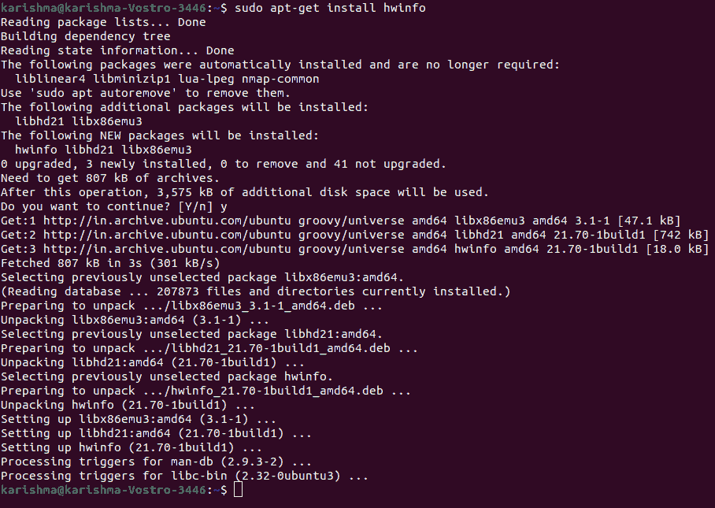

```

$ hwinfo --gfxcard --short

```

第二个命令选项如下:

```

$ sudo lshw -C display

```

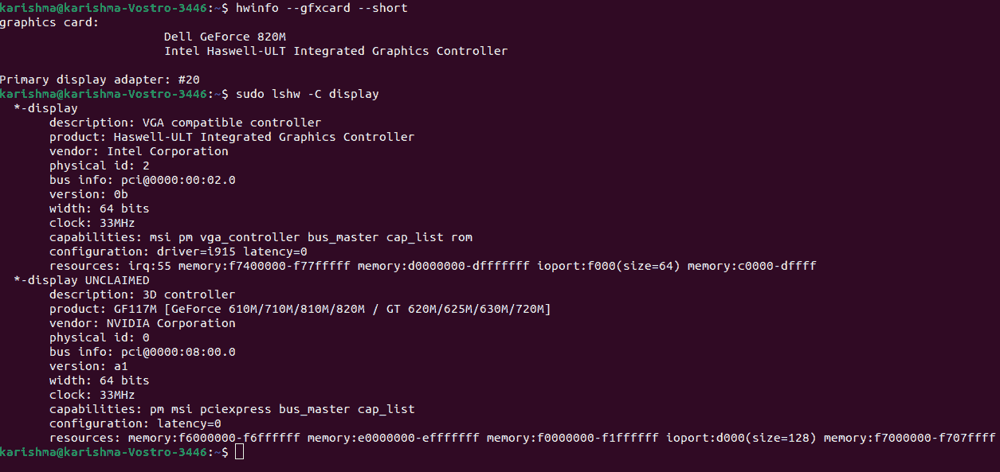

## 用图形用户界面安装英伟达驱动程序

Ubuntu 系统带有针对英伟达图形处理器的新驱动程序(开源)。新驱动程序没有充分利用图形处理器的能力，有时工作更差，甚至导致系统不稳定。英伟达专有驱动程序更加稳定可靠。

安装英伟达驱动程序的最初方法是借助图形用户界面更新和软件应用。

### 1.使用应用菜单打开软件和更新应用

1.  打开 ***【应用】*** 菜单，进入 ***“软件及更新”。***
2.  选择一个应用，即 ***软件和更新。*T3】**


### 2.选择附加驱动程序选项卡

我们需要等待这个应用下载为我们的图形处理器存在的额外的驱动程序列表。

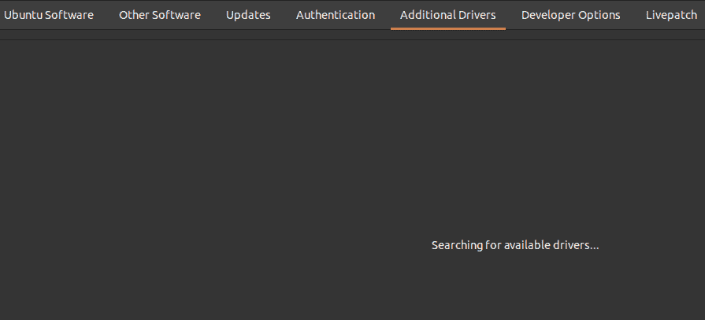

我们机器上安装的驱动程序是默认选择的。通常，它是一个新显示驱动程序(开源)。

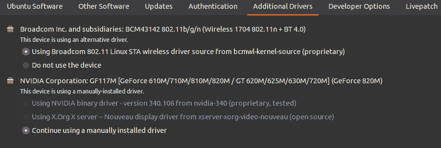

### 3.选择驱动程序

1.  从该列表中选择当前的英伟达驱动程序，该列表标记为 ***已测试且专有。*** 是目前英伟达为我们 GPU 发布的稳定驱动。
2.  选择 ***应用更改*** 选项。
3.  输入我们的 ***密码*** 然后等待安装过程完成。

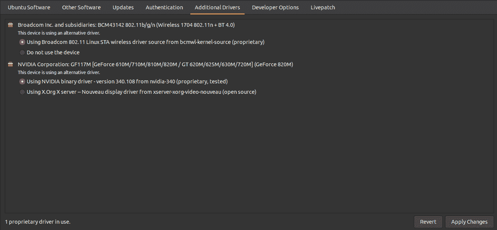

### 4.重新启动系统

重新启动系统以使修改生效。

## 使用命令行安装英伟达驱动程序

这是第二种安装英伟达驱动程序的方法，我们将在终端的帮助下安装这个驱动程序。

### 1.查找英伟达驱动程序

1.  通过点击 **Ctrl+Alt+T** 打开命令行窗口，或者在我们的**“应用”菜单中找到**“终端”**。**
2.  执行下面提到的命令:

```

$ sudo apt search nvidia-driver

```

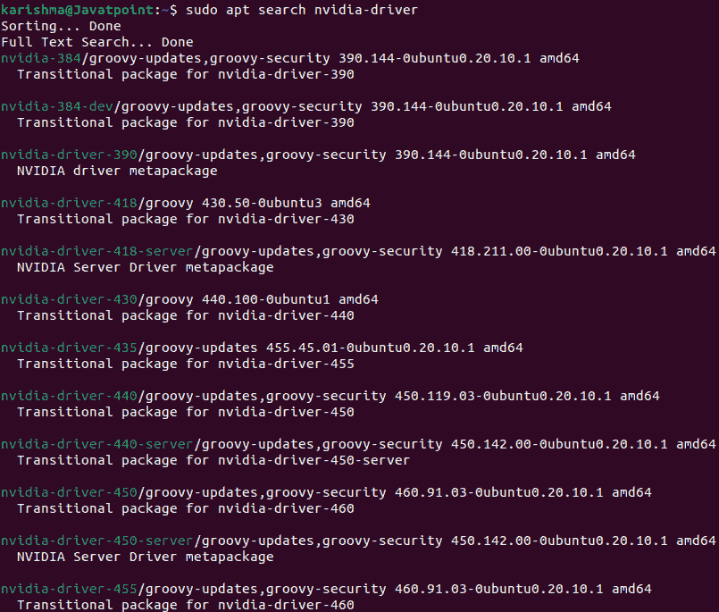

## 2.更新我们的系统包存储库

请确保在安装驱动程序之前更新系统软件包存储库。

执行下面提到的命令:

```

$ sudo apt update

```

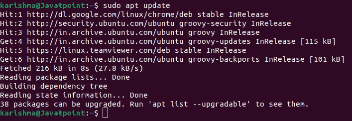

```

$ sudo apt upgrade

```

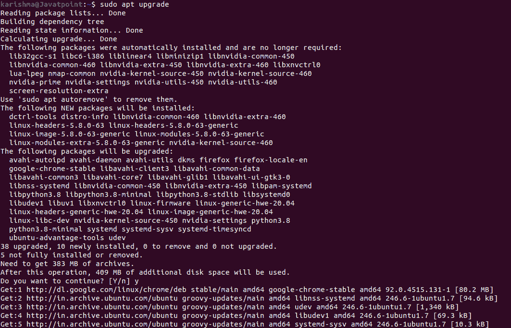

### 3.为我们的图形处理器安装精确的驱动程序

1.  从可用的图形处理器驱动程序列表中选择要安装的驱动程序。
2.  以下是安装驱动程序的语法:

```

$ sudo apt install [driver_name]

```

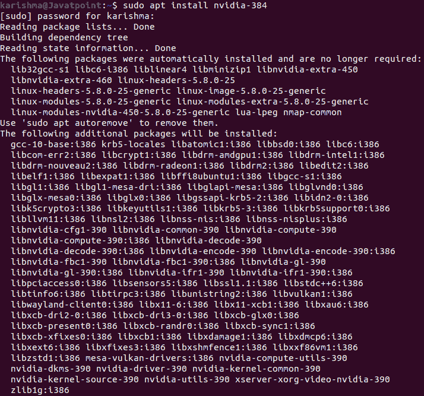

### 4.重新启动系统

使用以下命令重新启动系统:

```

$ sudo reboot

```

## 使用 PPA 存储库安装英伟达测试版驱动程序

PPA 存储库允许开发人员共享 Ubuntu 官方存储库中不存在的软件。这意味着我们可以安装当前的 ***beta 驱动程序、*** 但有一个 ***不稳定系统的机会。***

我们需要遵循下面提到的一些步骤，使用 PPA 存储库安装当前的英伟达驱动程序。

### 1.在我们的系统中包含 PPA 图形处理器驱动程序库

**即**使用以下命令将图形驱动程序库添加到我们的系统中:

```

$ sudo add-apt-repository ppa:graphics-drivers/ppa

```

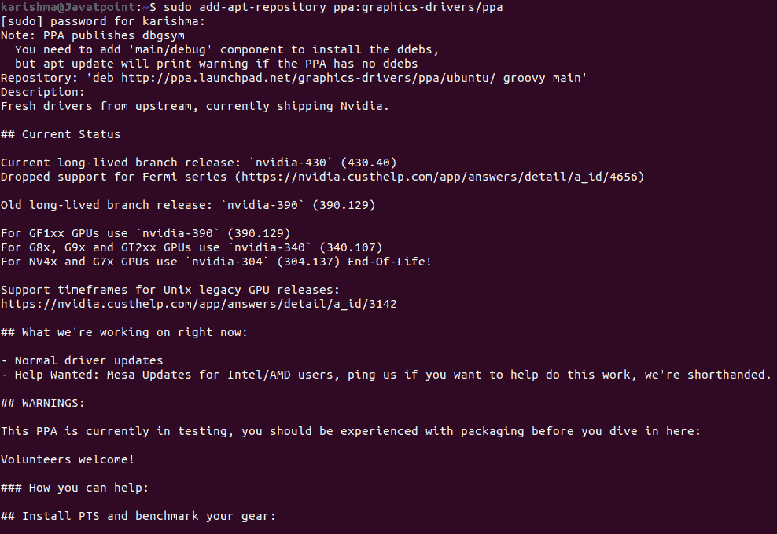

**二。**输入我们的密码，当提示我们是否希望包含回复时，按下 ***进入*** 按钮。

### 2.识别图形处理器模型和已有驱动程序

我们可以执行以下命令来验证我们使用的是哪种型号的 GPU，并检查现有驱动程序的列表:

```

ubuntu-drivers devices

```

结果将显示我们的图形处理器的模型，以及该特定图形处理器的任何现有驱动程序。

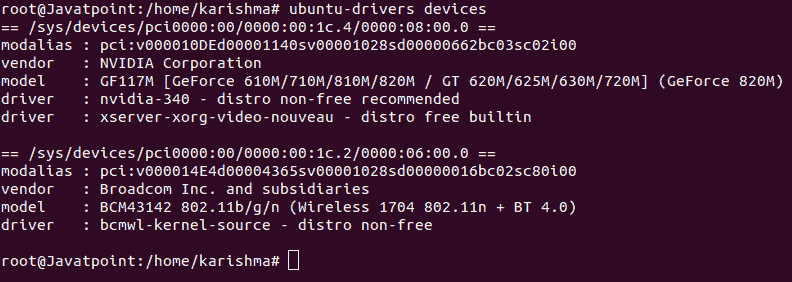

### 3.安装英伟达驱动程序

1.  我们可以使用语法来安装特定的驱动程序。语法如下:

```

$ sudo apt install [driver_name]

```


### 4.重新启动系统

使用命令重新启动系统以使修改生效。该命令如下所示:

```

$ sudo reboot

```

## 卸载英伟达驱动程序

在这种情况下，我们需要卸载英伟达驱动程序，那么 ***移除-清除*** 选项是最好的。

### 1.检查已安装的软件包

要查看我们的系统上安装了哪个 Nvidia 软件包，我们可以执行下面提到的命令:

```

dpkg -l | grep -i nvidia

```

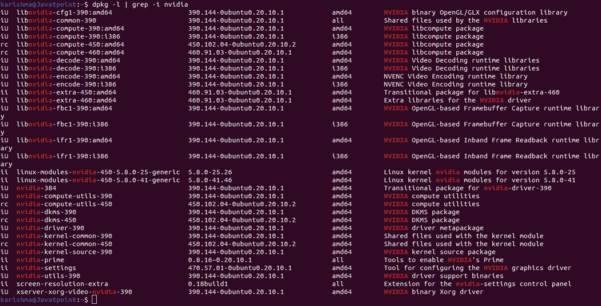

结果是在我们的系统上显示了每个英伟达包的列表。

***重要提示:***Ubuntu 桌面的一个包也可以被清除，因为它是英伟达通用包的依赖。因此，当软件包被删除时，我们可能不得不重新安装它。

### 2.清除英伟达的包装

**即**我们需要执行下面提到的命令:

```

$ sudo apt-get remove --purge '^nvidia-.*'

```

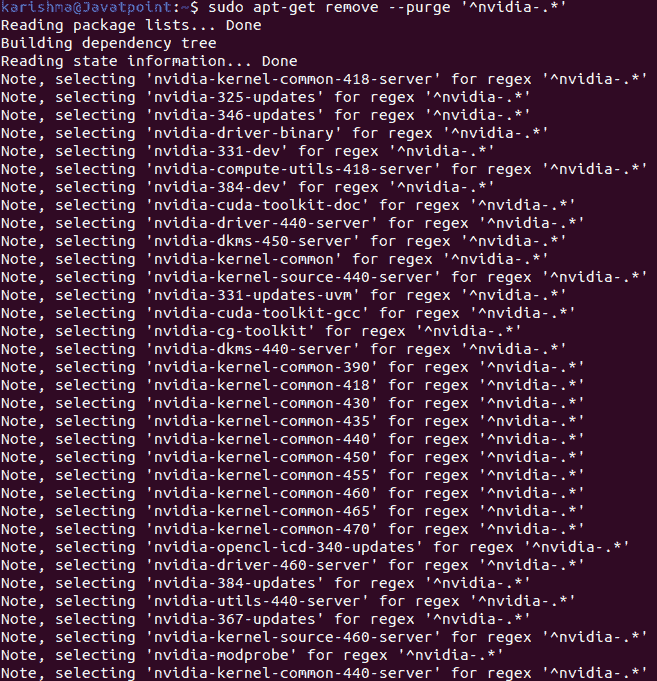

上述命令将通过系统清除所有 Nvidia 软件包。

**二。**如果 ubuntu-desktop 的一个包被删除，那么使用下面提到的命令重新安装它:

```

$ sudo apt-get install ubuntu-desktop

```


### 3.重新启动系统

通过执行以下命令重新启动系统:

```

$ sudo reboot

```

默认情况下，系统将在引导期间加载一个新驱动程序(开源)。

## 确认

打开命令行应用，输入 nvidia-smi 命令，检查使用 Nvidia GPU 的进程和 GPU 信息:

```

$ nvidia-smi

```

上面的命令是命令行的一个实用程序，它为来自更高和费米架构系列的英伟达、GeForce 和网格设备的每个特斯拉提供了各种管理和监控功能。我们可以检查 GPU 上正在运行的应用以及 GPU 的温度。

## 我们如何配置 NVIDIA 图形驱动程序？

一个命令，即 ***【英伟达-设置】*** 用于启动图形用户界面工具来配置英伟达图形驱动程序。检查 GPU 的所有信息并配置多个链接到我们系统的外部监视器/屏幕是有帮助的。

打开命令行窗口，然后输入下面提到的命令:

```

$ nvidia-settings

```

如果我们希望保存设置，请如下所示启动此命令:

```

$ sudo nvidia-settings

```

## Ubuntu 驱动程序

此外，我们可以在不使用 Windows 桌面或 X GUI 的情况下切换驱动程序。对于这些类型的目标，Ubuntu 提供了一个特定的命令，称为 ***ubuntu 驱动程序。*** 这些驱动程序用于管理英伟达驱动程序和其他类型设备的驱动程序(二进制)。它是对我们前面使用的 ***apt-get 命令*** 或 ***apt 命令*** 的替代。

### 显示我们当前系统使用的每个驱动程序包

```

$ sudo ubuntu-drivers list

```

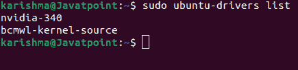

### 显示系统使用的每个原始设备制造商支持包

```

$ sudo ubuntu-drivers list-oem

```

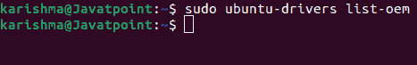

### 显示每个需要驱动程序和软件包的硬件英伟达设备

```

$ sudo ubuntu-drivers devices

```

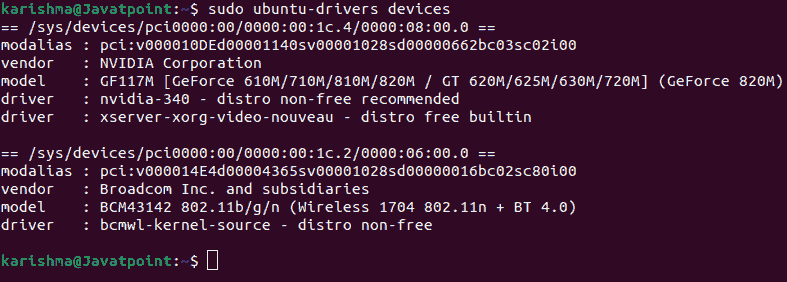

* * ***