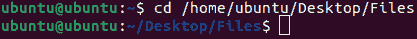
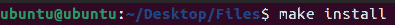

# 安装 tar.gz Ubuntu

> 原文：<https://www.javatpoint.com/install-tar-gz-ubuntu>

如果我们使用的是 Ubuntu Linux，我们迟早会发现自己面临着需要安装 tar.gz 文件的操作。在本文中，我们将讨论如何在最新的 Ubuntu 版本上安装 tar.gz 文件。

## tar.gz 档案简介

Tar 可以定义为计算中的一个软件实用程序，用于将几个文件收集到一个归档文件中。通常，它被称为 tarball，用于备份和分发目标。焦油这个术语是通过细香葱来理解的。通常，焦油档案包括 ***。tar*** 文件后缀即 ***package.tar.bz2、package.tar.bz、package.tar.xz、*** 或***package.tar。*** 同样，tarball 这个词用来指代 tar 文件。

包含扩展名(即 tar.gz)的文件可以描述为归档文件。这意味着该文件包含单个或多个文件，这些文件可以压缩成一个归档文件。各种 tar.gz 文件与 ZIP 文件相同。

本质上，并不是我们在 Ubuntu 上触发的所有 tar.gz 文件都包含一个可安装的应用。许多 tar.gz 文件可以用于其他类型的目标，如存储一组文档。那么，不要以为仅仅因为我们有一个 tar.gz，我们就可以安装它的软件。

同样值得注意的是，有时应用被打包成许多文件，使用与 tar.gz 相同的扩展名(然而，并不完全相同)。

### 下面讨论一些要点:

*   ***Tar*** 不是安装包。它是一个系统 ***软件实用程序*** 将几个文件收集成一个单一的 ***存档文件。***
*   通常，tar 使用类似于***【gzip】***的压缩技术来创建压缩的归档文件，还使用 ***file.tgz*** (或***【file.tar.gz】***)来一起使用。
*   Tarballs 用于分发应用的源代码，或者可能是用于执行程序的二进制文件。
*   我们应该在安装 tar.gz 软件包之前找到一个替代品，因为有时这个过程会更艰难、更漫长。
*   基本示例包括 tar.xz 和 tar.bz2 文件。这些类型的文件的工作方式几乎与 atr.gz 文件相似。
*   但是，它们之间的主要区别是用于压缩其中数据的工具。
*   我们将重点讨论 tar.gz 文件，因为 tar.gz 文件可能是 Ubuntu 上最著名的归档文件格式之一。

## 如何在 Ubuntu 中安装 tar.gz 文件？

在 Ubuntu 中没有一种方法可以安装 tar.gz 文件，因为 tar.gz 文件中的数据可能采用各种不同的格式。相反，我们应该考虑几种方法。

我们将解释下面的所有方法，从安装 tar.gz 文件的最简单方法开始。

### 使用一个 Debian 包

在 Ubuntu 中安装 tar.gz 文件最简单的方法就是根本不安装这些文件。但是，我们希望借助 ***Debian 包的文件，而不是安装应用。*T3】**

***Debian packages*** (文件名以 ***结尾。deb*** )是为 Linux Ubuntu 和相同操作系统打包各种应用的另一种方法。出于某些原因，最好使用 Debian 包而不是 tar.gz 文件来安装应用:

*   我们安装和执行应用所需的一切都将内置在 Debian 包中。我们不需要过度考虑编译源代码，这是我们在处理 tar.gz 文件时通常需要做的。
*   Debian 包可以轻松安装。我们通常可以在各种图形工具的帮助下使用一些点击来安装它们。
*   如果我们从一个存储库中将 Debian 软件包安装到 Ubuntu 软件中心，那么 Ubuntu 将在新版本发布时自动为我们更新该应用。

因此，在开始安装我们的 start 文件之前，检查一下我们是否可以使用 Debian 包。首先，找到 Ubuntu 软件中心。如果应用在那里不可用，那么检查应用的官方网站，看看它是否提供了一个 Debian 包来下载。

一旦我们下载了一个 Debian 包，那么我们需要在应用上右键*，选择一个选项，即 ***【用软件中心打开】*** 从软件中心安装。另外，我们可以使用 ***终端*** 和 ***dpkg*** 命令安装应用。*

 *### 有关安装的说明，请参见 tar.gz

我们的下一步是查看 tar.gz 文件，检查它是否包含如何安装应用的说明。我们可以通过在 Ubuntu 中打开一个存档管理器应用来实现。此外，这个应用有时被称为 ***【文件滚轮】*** ，如果我们找不到任何图形启动器，我们可以通过输入 ***文件滚轮*** 从终端执行它。

例如，如果我们下载一个 tar.gz 安装包(恰好是一个创建和打开 tar.gz 文件的程序)，我们将会看到这样的内容。

我们会注意到它包含一个名为 ***INSTALL 的文件。*** 如果我们打开这个文件，它会为应用提供详细的安装说明。如果没有类似 ***INSTALL、*** 这样的术语的文件，那就找一个文件，即 ***自述文件*** 来代替。在这种情况下安装应用的效率与下面的说明一样高。

根据我们处理的代码类型，安装 tar.gz 文件的步骤可能会有很大的不同。不过，在大多数情况下，我们需要执行两个常见步骤，然后才能执行任何其他安装说明。

*   将 tar.gz 文件提取到我们计算机上的任何文件夹中。我们可以通过按一个按钮来完成，即【档案管理器】左上角的 ***提取*** 。
*   在 Ubuntu 上，安装一个构建必备包。我们可以在命令行中使用***sudo apt-get install build essential***命令来完成。这个包包括我们编译源代码所需的软件，这通常是(虽然不总是)在 Ubuntu 中安装 tar.gz 文件所需要的。

### 使用 Make 安装应用

有时，我们会发现 tar.gz 文件，其中包括源代码，没有安装说明。在这种情况下，我们可以尝试执行通用命令，即 Make installation。通常，源代码旨在为 Ubuntu 编译，并安装一个名为 ***Make 的程序。*** 因此，无论是谁制作了 tar.gz 文件，都有机会被 Make 安装，即使它没有附带说明。

首先，确保我们已经提取了一个 tar.gz 文件，并安装了一个用于 Make 安装的构建必需包。打开命令行窗口，输入命令，即 ***cd*** 导航到存储 tar.gz 文件提取数据的文件夹。

例如，如果我们将 tar.gz 文件数据提取到桌面上名为**“我的文件”**的任何文件夹中，我们将执行以下命令:

```

cd /home/ubuntu/Desktop/Files

```



从这里，输入以下内容:

```

./configure

```


上面的命令将配置源代码。因此，它可以在我们的系统上编译。我们可能会被提示一些关于我们希望如何创建应用的问题，也可能不会，这取决于创建什么类型的源代码。

输入以下内容:

```

make

```


它将编译源代码。如果我们要处理任何大型应用，完成该过程可能需要时间。

最后运行以下命令:

```

make install

```



上面的命令将复制我们在 Ubuntu 中编译的代码，以便我们可以运行它。

同样，不要指望它能适用于我们可能希望安装的所有 tar.gz 文件。然而，总的来说，这是我们可以期待的过程。

### 如果失败了...

如果我们已经尝试了所有方法，仍然无法获得我们的 tried 文件，那么我们建议查看为我们的应用量身定制的在线指南。

此外，请记住，在 Ubuntu 或其他操作系统中使用 tar.gz 文件安装应用并不完全是初学者的任务。它很复杂，并受几个变量的影响，即使对许多有经验的用户来说，这也可能是一个令人恼火的过程。

幸运的是，现在的 Ubuntu 生态系统非常丰富，包括使用 tar.gz 安装各种软件在内的事情现在已经很少了。几乎每一个在 Ubuntu 中执行的应用都以 Debian 包的形式存在。然而，当我们在 Ubuntu 中触发任何 tar.gz 文件时，上面编译的指南，如果运气好的话，会给我们安装它所需要的东西。

* * **