# Ubuntu 屏幕记录器

> 原文：<https://www.javatpoint.com/ubuntu-screen-recorder>

## 介绍

我们经常需要为几个目标记录我们桌面的屏幕，例如 ***【创建视频教程】【在线播放游戏会话】*** 等。在本文中，我们将列出 Linux 中屏幕录制的一些应用。

我们将使用*工具和其他一些应用程序来实现这个目标。然而，***SimpleScreenRecorder***是 Linux 中最棒的屏幕录制工具之一，它是开源的自由软件。*

 *首先，我们来看看如何在 Ubuntu 16.04、18.04、20.10 等基于 Ubuntu 的 Linux 发行版中安装***SimpleScreenRecorder***工具，比如 Linux Lite、Elementary OS、Linux Mint 等。

## 简易屏幕记录器的特点

SimpleScreenRecorder 工具有一些重要的特性。这些特征如下所述:

*   它支持多种格式的视频输出。
*   它用于通过适用的信号源进行录音。
*   它支持所选屏幕的录制区域。
*   它便于记录时的统计。
*   它支持热键。
*   它支持录制时的实时预览。
*   它用于平稳地优化慢速机器上的工作。

**优势:**

*   足够多的调整选项可用于微调生成的视频。

**劣势:**

*   不支持内置网络摄像头录制
*   UI 不是很有前途。

## 在 Ubuntu 中安装简单屏幕记录器

在 ***【乌班图软件中心】*** 可以使用这个工具。因此，我们可以通过 ***软件中心*** 或通过在我们的终端中执行下面提到的命令来轻松安装它:

```

$ sudo apt install simplescreenrecorder 

```

另外，我们可以应用官方的***【PPA】***来安装基于 ***Ubuntu 的***Linux 发行版中***SimpleScreenRecorder***工具的 ***最新版本*** 。我们可以在终端中运行以下命令:

```

$ sudo add-apt-repository ppa:maarten-baert/simplescreenrecorder

```

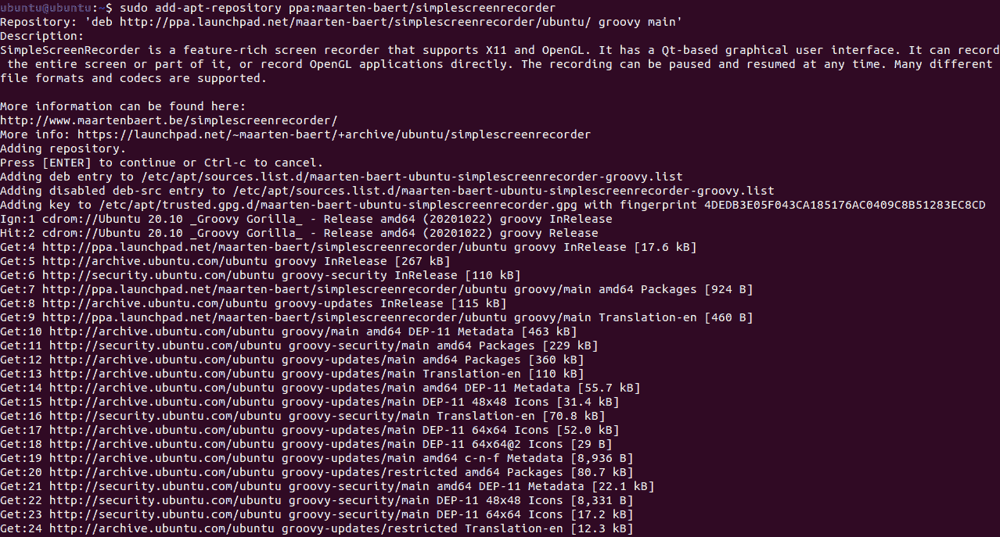

```

$ sudo apt update

```

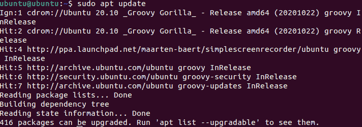

```

$ sudo apt install simplescreenrecorder

```

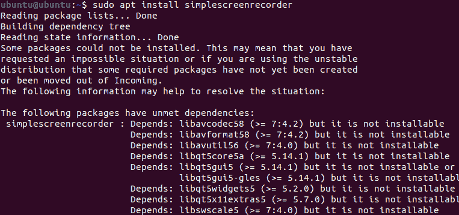

## 修复用于录制屏幕的简单屏幕录制工具

一旦我们安装了简单屏幕记录器，我们可能希望根据我们的需要对其进行配置。让我们看看如何做到这一点。

*   在***【Gnome】***或 ***Unity Dash 中找到打开软件。***
*   在即将到来的屏幕上设置我们的选项。如果我们想要一个矩形区域，或者想要记录我们的光标，这些包含诸如视频屏幕大小的选项。我们还可以在此屏幕上设置是否希望录制音频。
*   按下 ***继续*** 一旦我们对这些设置没有意见。选择我们是否希望在下一个屏幕上保存文件，以及视频的音频比特率。
*   只要进入 ***开始录制*** 一旦我们完成设置，它就会开始为我们录制画面。
*   如果我们希望停止录制，那么我们只需要打开应用程序，点击 ***停止录制。*** 我们的视频会保存在指定路径内。

## Linux 最佳屏幕记录器应用

### 1.开放广播软件工作室

毫无疑问，开放广播软件工作室是 Linux 中最先进和功能最丰富的屏幕播放应用程序。

### 光突发交换演播室的主要特点

*   多个场景通过自定义过渡无缝切换。
*   视频源的过滤器
*   音频混音器和滤波器
*   易于使用且功能强大的配置选项
*   调整配置的设置面板(流线型)
*   支持直播

### 赞成的意见

*   可能，我们需要的一切都在这个应用程序中。

### 骗局

*   我们需要一段时间来弄清楚它的术语。

### 装置

开放广播软件工作室可以在 PPA 的 Ubuntu 获得。我们可以在终端中键入一个命令来安装它。该命令如下所述:

```

$ sudo add-apt-repository ppa:obsproject/obs-studio

```

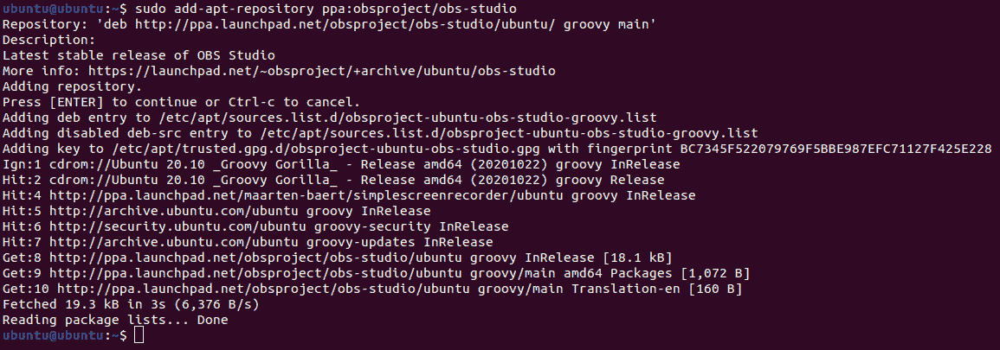

```

$ sudo apt update

```

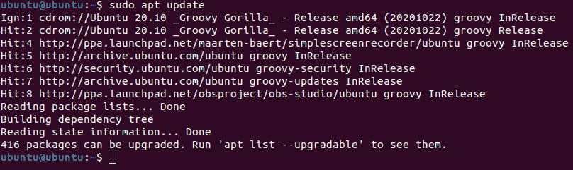

```

$ sudo apt install obs-studio

```

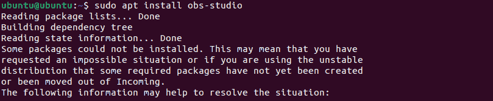

### 2.喀山

Kazam 可以被描述为一个俏皮的和极小的电影演员。它也支持截图。Kazam 是最适合初学者的工具之一，可以快速完成操作，而不会在不同的选项中过于混乱。

### 喀山的主要特征

*   简洁明了的用户界面
*   支持多种格式的视频输出
*   通过适用的来源(扬声器或麦克风)录音
*   支持录制一个选定的或窗口屏幕区域
*   支持延迟定时器

### 赞成的意见

*   易于使用，最小，简单。

### 骗局

*   缺乏对网络摄像头录制的支持
*   调整配置设置的最少选项

### 装置

打开终端，键入以下命令:

```

$ sudo apt-add-repository ppa:sylvain-pineau/kazam

```

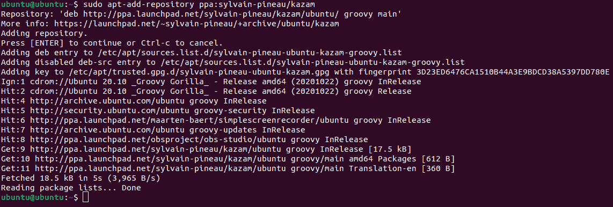

```

$ sudo apt update

```

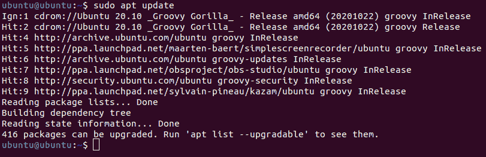

```

$ sudo apt install kazam

```

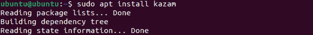

### 3.recordMyDesktop

首先， ***recrodMyDesktop*** 应用程序是一个命令行工具，用于在 ***C 语言中指定的屏幕录制。*** 它包含两个独立的 ***基于 GUI 的*** 在 ***QT4*** 和 ***GTK 上。***

它已经被终止了，但我们仍然可以给它一个实验的机会。

### recordMyDesktop 的主要功能

*   这是一个轻量级的工具。
*   它支持录制一个窗口。
*   它提供了视频输出调整的选项。

### 赞成的意见

*   我们可以借助一个命令，使用终端使用它，即 ***recordmydesktop。*T3】**

### 骗局

*   recordMyDesktop 应用程序的界面没有得到很好的修饰。
*   它不提供网络摄像头录制功能。
*   它不提供视频输出格式选项(可选)。
*   不再积极开发。

### 装置

recordMyDesktop 应用程序可以通过 Ubuntu 存储库(官方)安装。我们只需要执行下面提到的命令来安装这个应用程序:

```

$ sudo apt install gtk-recordmydesktop

```

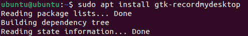

### 4.ScreenStudio

***【screen studio】***应用可以用 ***跨平台*** 工具来描述，该工具是在 ***Java 语言中指定的。*** 即使从 2017 年开始不再管理，但我们仍然可以给这个应用一个机会来检查它是否适合我们。

### ScreenStudio 的主要功能

*   它支持多种格式的视频输出。
*   它用于使用适用的信号源进行音频录制。
*   为***【twitch . TV】【Hitbox】***等多项服务提供流支持。
*   它为高级配置提供了各种选项。
*   它支持网络摄像头录制。
*   它在记录时为覆盖层(文本和图像层)提供支持。

### 赞成的意见

*   我们可以到处使用 ***ScreenStudio*** 应用作为跨平台应用。

### 骗局

*   不再积极开发。
*   ***ScreenStudio*** 的依赖规模反而比较大，需要 ***JRE 8.0。***

### 装置

在 Ubuntu 上，我们可以使用它的 PPA 安装这个应用程序。我们需要在命令行窗口中键入一个命令来安装这个应用程序，如下所述:

```

$ sudo add-apt-repository ppa:soylent-tv/screenstudio

```

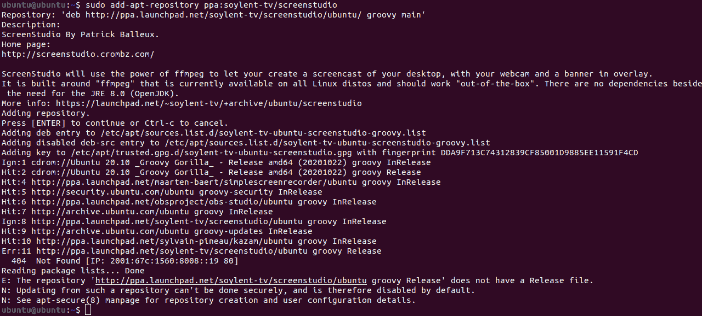

```

$ sudo apt update

```

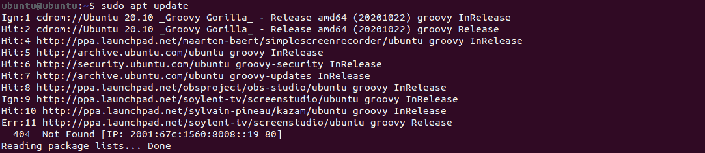

```

$ sudo apt install screenstudio

```


### 5.VokoscreenNG

***Vokoscreen*** 应用程序已重新设计为 ***VokoscreenNG (NG*** 是 ***新一代的简称)。*** 它也满足了它的新。该应用程序包括一组必要的功能和最新的 ***基于 QT 的用户界面。***

### 视屏的主要特点

*   它用来记录整个桌面。
*   它用于记录屏幕的一部分。
*   出于记录目的，它包括一个延迟定时器。
*   出于记录的目的，它设置了时间限制。
*   它包括使用网络摄像头进行录制的功能。
*   它可以调整输出的格式，管理帧率和其他几个基本参数。

### 赞成的意见

*   它很容易与船上的高级功能一起使用。
*   它提供了大量有用的功能。

### 骗局

*   它不提供 ***rpm/deb 包*** 和***applimage 文件。***

### 装置

我们可以在 Fedora 和 OpenSUSE 上轻松安装这个应用程序，但是对于一些基于 Ubuntu 的发行版，我们需要通过 Ubuntu 手册使用一个非官方的存储库。我们可以使用以下命令来安装它:

对于 ***开放:***

```

$ sudo zypper install vokoscreenNG

```

***软呢帽:***

```

$ sudo dnf install vokoscreenNG

```

对于基于 Ubuntu 的发行版:

```

$ sudo add-apt-repository ppa:ubuntuhandbok1/apps

```

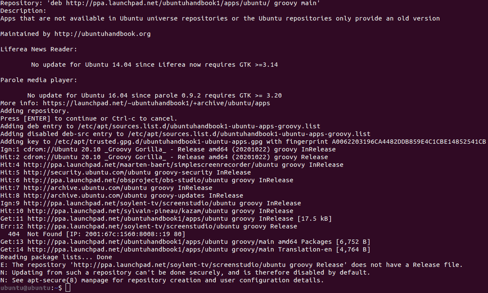

```

$ sudo apt update

```

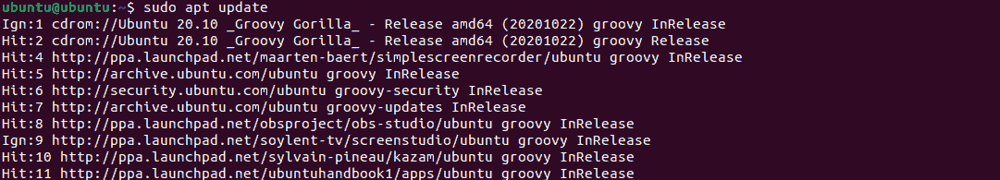

```

$ sudo apt install vokoscreen-ng

```

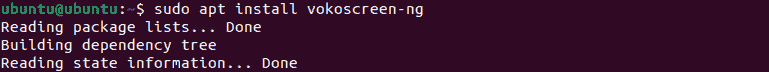

### 6.绿色记录器

***【绿记录器】*** 应用程序界面正常，使用方便。该应用程序是 Linux 中最古老的屏幕录制工具之一，用于提供 ***【韦兰】*** 支持。它是用 ***GTK3*** 构建的，在后台使用 ***Ffmpeg*** 。

如果我们使用的是 ***Wayland，这或许会是 Ubuntu 屏幕记录器的一个很好的选择。*** 该项目不幸通过 GitHub 存档，不再整合。然而，它适用于各种用户。

### 绿色记录仪的主要特点

*   它支持多种视频格式，如 webm、mp4、mkv、avi 等。
*   此外，它可以以 gif 格式录制屏幕。
*   它支持 ***【韦兰】*** 和 ***Xorg。***
*   使用 ***绿色记录器*** 工具，可以保存首选项(默认)。

### 赞成的意见

*   它支持 ***【韦兰】***
*   支持 ***GIF***
*   它有一个正常的界面，具有基本的功能

### 骗局

*   不再积极开发。
*   它不支持网络摄像头录制。

### 装置

在 Ubuntu 上，我们可以用它的官方 PPA 安装 ***绿色记录器*** 应用。我们只需要输入以下命令来安装它:

```

$ sudo add-apt-repository ppa:fossproject/ppa

```

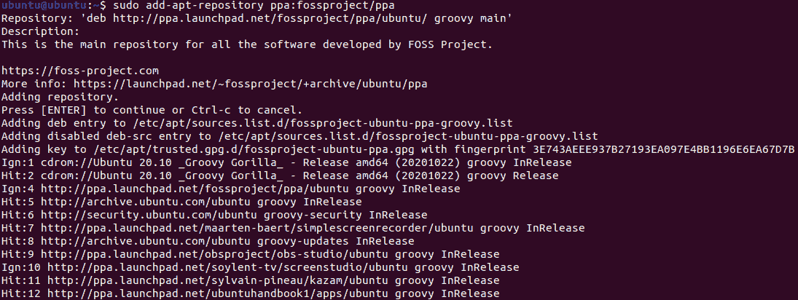

```

$ sudo apt update

```


```

$ sudo apt install green-recorder

```

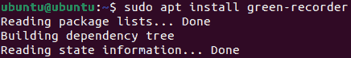

### 7.偷看

***【Peek】***应用程序是一个使用我们桌面的屏幕来记录动画 gif 的普通工具。

### 聚醚醚酮的主要特性

*   它支持延迟定时器。
*   帧率设置在此应用程序中可用。

### 赞成的意见

*   它有一个光滑而现代的界面。

### 骗局

*   目前只支持使用 X11 的 Linux。

### 装置

DEB 包在 GitHub 项目的发布页面上提供安装。另外，我们可以通过使用它的 PPA(官方)在下面提到的命令的帮助下安装 ***Peek*** 应用程序:

```

$ sudo add-apt-repository ppa:peek-developers/stable

```

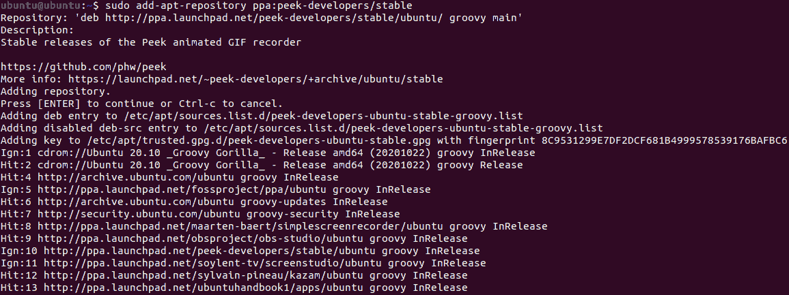

```

$ sudo apt update

```

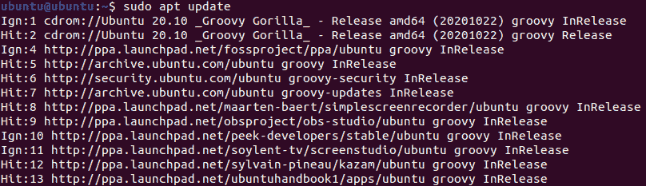

```

$ sudo apt install peek

```

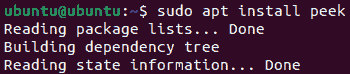

### 8.吉芬

***Gifine*** 应用是 Linux 中 gif 录制的工具。我们可以使用这个工具来记录和拼接短视频和 gif。

### 吉芬的主要特征

*   它支持在保存前修剪和编辑输出视频或 gif。
*   它支持 mp4 和 gif 视频输出格式。

### 赞成的意见

*   与 ***Peek 相比，它提供了额外的功能。*T3】**

### 骗局

*   ***吉芬*** 的界面不如 ***Peek。***

### 装置

安装*工具可能是一个漫长的过程。我们需要打开命令行窗口，小心地键入一个命令，以便在 Ubuntu 上安装这个工具。该命令如下所述:*

 *```

git clone --depth 1 https://github.com/lolilolicon/xrectsel.git 
cd xrectsel 

```

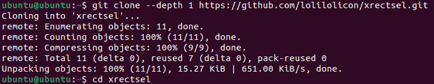

```

$ sudo apt install gifsicle luarocks libgirepository1.0-dev

```

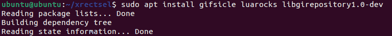

### 9 .拜占庭

它可以被描述为一个基于 Linux 中命令行界面的屏幕播放应用程序。 ***拜占庭*** 应用程序用于录制 FLV 和 OGG 格式的音频和视频。此外，它还可以用于创建动画 gif。

### 装置

我们需要输入一个命令来安装下面提到的这个应用程序:

```

$ sudo add-apt-repository ppa:fossfreedom/byzanz

```

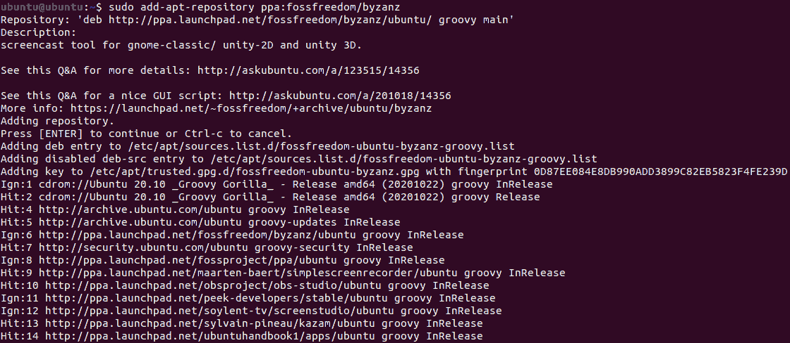

```

$ sudo apt update

```

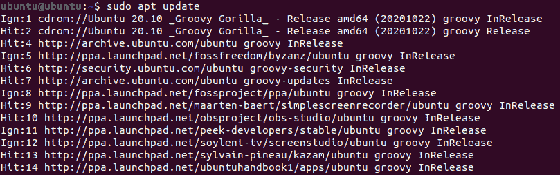

```

$ sudo apt install byzanz

```

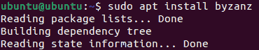

### 10.可见光通讯

***【VLC】***应用是 Linux 最受欢迎、功能最强大的多媒体播放器。它有几个预先包装好的功能，屏幕播放功能就是其中之一。我们需要在选项设置中将捕获模式修改为桌面模式。此外，我们可以保存任何录制视频和在线直播。

### 装置

我们需要输入一个命令来安装下面提到的这个应用程序:

```

$ sudo apt-get install vlc

```

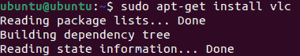

### 11.眨眼

*应用程序主要用于为 ***互动教程创建内容。*** 这款 Linux 的截屏软件自带了极具竞争力的画面录制方面。此外，它支持操作系统的每个主要平台，包括 ***Linux、Windows、*** 和其他基于 ***Linux 的系统。****

 *### 装置

我们需要输入一个命令来安装下面提到的这个应用程序:

```

$ sudo apt-get install wink

```

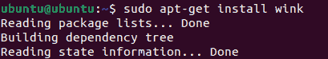

### 12.自由预言家

创建 ***Freeseer*** 应用程序是为了使 ***远程会议流*** 简单易行。同时支持音频和视频流。这是一个免费的应用程序，为跨平台提供资源。

### 自由先知的主要特征

*   它支持音频和视频录制。
*   它支持音频和视频流。
*   它方便了配置工具。
*   它应用了一个插件系统。因此，开发人员可以很容易地包含新的方面。
*   它提供了一个谈话编辑器来管理谈话。
*   它支持常见的键盘快捷键。
*   它有助于配置配置文件。
*   它提供了一个报告编辑器来报告录制谈话的问题。
*   它提供不止一个音频输入。

### 13.快门

***【快门】*** 应用是一款非常棒的 Linux 屏幕记录器。它很简单，并提供了最新的用户界面。此外，它还提供了一个图像编辑工具，可用于定制捕获的图像。我们可以捕捉桌面的整个屏幕部分，或者只捕捉选定的区域。

### 装置

我们需要输入一个命令来安装下面提到的这个应用程序:

```

$ sudo add-apt-repository -y ppa:shutter/ppa

```

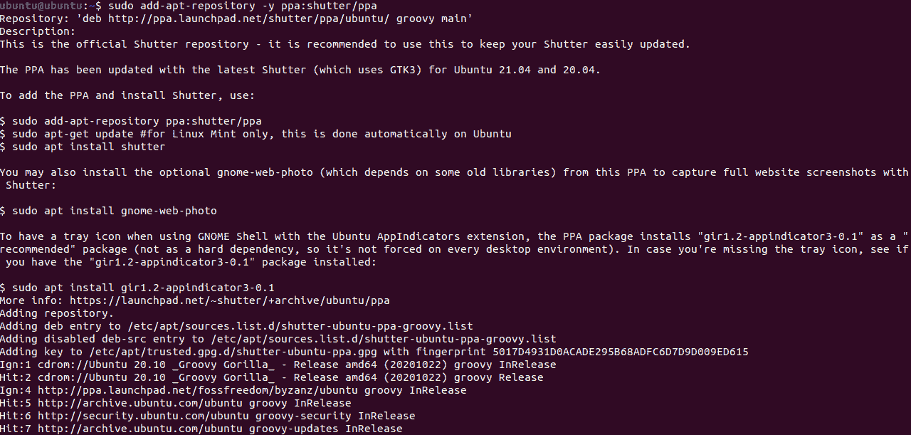

```

$ sudo apt update

```

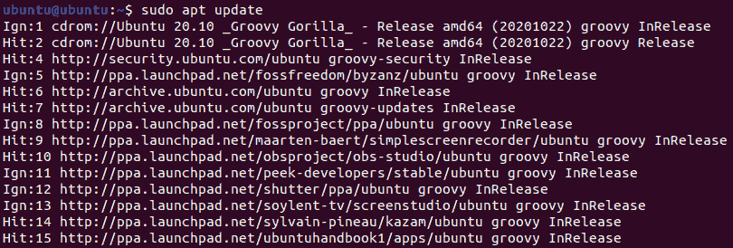

```

$ sudo apt install shutter

```

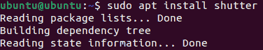

### 14.火药，火药

***【Krut】***应用的界面看起来并不好看，但却是目前市面上针对 Linux 的 ***最轻的屏幕记录器*** 。这款 Linux 的截屏软件是用 ***Java*** 语言设计的，所以在另一个系统上使用 既简单又便携***。***

我们可以毫无问题地完成 Linux 成熟的屏幕记录器应该完成的每一项任务。

### 克鲁特的主要特征

*   它允许用户在录制时移动选定的区域。
*   *软件允许用户记录鼠标移动。*

 ** * *****