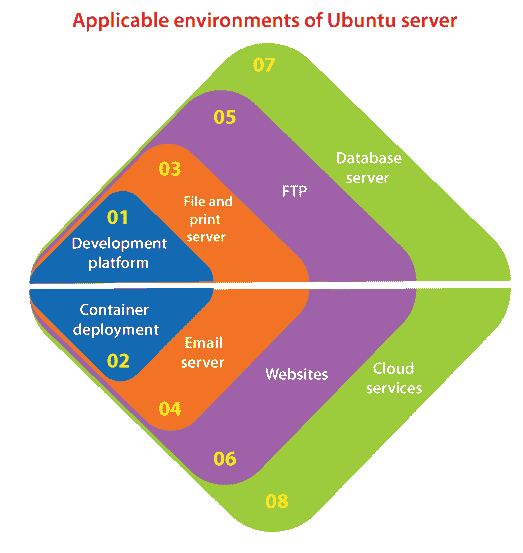
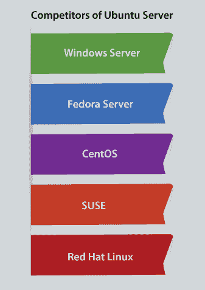

# Ubuntu 服务器

> 原文：<https://www.javatpoint.com/ubuntu-server>

## 介绍

Ubuntu server 可以被描述为一个开源环境，它做的比我们想象的要多。这种操作系统可以通过其作为内部企业服务器的能力或者通过各种方式扩展以满足企业级需求来实现这一切。

Ubuntu Server 是 ***Canonical 集成的服务器操作系统。*** 它通过 LinuxONE 执行 POWER8、ARM64、ARM v7、x86-64、x86、IBM System z 大型机等各种主要架构。Ubuntu OS 是一个服务器环境，每个人都可以使用它来完成以下任务和其他任务:

*   数据库服务器
*   云服务
*   容器部署
*   开发平台
*   文件和打印服务器
*   电子邮件服务器
*   文件传送协议
*   网站

## 系统需求

Ubuntu server 为各种类型的服务器应用(如打印/文件服务、电子邮件托管、网络托管等)提供了一个极简且通用的基础。此版本的 Ubuntu 服务器支持 64 位架构:

*   s390x (LinuxONE 和 IBM Z)
*   ppc64el (POWER8 和 POWER9)
*   arm64 (64 位 arm)
*   amd64（AMD/Intel 64 位）

Ubuntu 服务器包括以下要求:

*   **存储:** 1 GB 磁盘空间(每个要安装的方面 1.75 GB)
*   **CPU:** 1 GHz
*   **帧:**512 MB

Ubuntu 服务器非常吸引人的一个特点是它的性价比很高。因此，任何人都可以轻松下载 Ubuntu 服务器当前版本的副本，并以零成本将其扩展到各种必要的机器上。

当前版本包括平台的必要升级功能。现在，Ubuntu 服务器支持***【ZFS】***(文件系统使用内置快照的功能)，并包括 ***DPDK(数据平面开发工具包)*** 的初始生产版本，这是一组用于更快处理数据包的驱动程序和库。

如果我们经营一家公司，我们正在寻找一个网络服务器或文件服务器来部署，那么 Ubuntu 服务器可以管理它。如果我们是一个企业级组织，正在寻求扩展一个大规模渲染场、一个 Hadoop 集群或一个 OpenStack 云，那么 Ubuntu 已经涵盖了我们。此外，Ubuntu 服务器已通过 HPE 云、IBM、Joyent、Microsft Azure 和 AWS 认证，适用于那些希望在虚拟平台上以来宾身份使用 Ubuntu 的人。

几家企业不必仅仅因为 Ubuntu 服务器是开源软件就担心支持不足。

## 桌面和服务器的区别

Ubuntu 桌面和 Ubuntu 服务器使用类似的 apt 存储库，使得在桌面上安装服务器应用和在服务器上安装服务器应用一样容易。

一个重要的区别是，应用于桌面的图形平台不是为服务器安装的。它本身包括一个图形服务器、图形应用和实用程序，以及所有桌面用户所需的若干用户支持服务。

## Ubuntu 服务器的重要性

以下是一些要点:

*   过去几年，云是用户和信息技术关注的焦点，这一转变对*和 ***Canonical 来说是一大福音。*** 自从 ***Iaas*** (代表 ***基础设施即服务*** )起飞以来，Ubuntu 是使用云执行这些服务的最伟大玩家之一。*
**   Ubuntu 是 ***DevOps 工程师*** 和 ***管理员*** 寻找扩展 ***OpenStack 的初始选择。****   还有 ***Docker*** ，是市场上著名的集装箱调配平台之一。*   Ubuntu 服务器令人难以置信地使修复 Docker 变得容易，因此信息技术专业人员可以使扩展容器成为一种现象。*   集装箱可以在很大程度上支持我们部署公司，为客户、客户和员工提供便利。*   Ubuntu 服务器相对于同类平台的另一个优势是更新的快照包。*   Snap 包是一个通用包，包含了所有基本的依赖项，可以通过一个普通的命令来安装(比如***sudo snap install next cloud***)。*   此外，可以使用一个命令更新快照包，即 ***sudo 快照刷新。*** 因此，有几个行政任务。*

 *## Ubuntu 服务器的影响

Ubuntu 服务器影响着每一个人，从开发人员、IT 专业人员、最终用户到首席财务官。得出的结论是，Ubuntu 服务器不仅仅统治着云。然而，它将继续成为引领信息技术的强大力量。

一些用户和组织已经开始依赖云。因此，Ubuntu 服务器将变得更加必要。幸运的是，该平台为所有信息技术专业人员创建了极其简单的云和容器。

## Ubuntu 服务器的发布

最初，Ubuntu 服务器于 2010 年 6 月 1 日发布，版本被称为 Ubuntu 6.06 (Dapper Drake)。Ubuntu 映像可以下载到服务器平台或桌面上，就像后来的所有版本一样。

服务器版本使用类似桌面的存储库。因此，从一开始，两个版本之间就有稳定性。Ubuntu 服务器总是发布 sans GUI，因为存储库共享(安装一个图形平台是可行的)。

服务器已经从礼貌的开始走了很长一段路。Ubuntu 服务器最初发布时，被广泛视为网络服务器、文件传输协议和邮件的选项。

## Ubuntu 服务器的竞争对手

在 Ubuntu 服务器平台上，随着专有和开源解决方案的出现，竞争非常激烈。市场份额的主要竞争如下:

*   操作系统
*   Fedora 服务器
*   CentOS
*   注意
*   Red Hat Linux

#### 注意:以上服务器只有 Fedora 和 CentOS 服务器是免费的。

## 我们如何开始使用 Ubuntu 服务器？

如果我们打算裸机安装和使用 Ubuntu 服务器(或通过虚拟主机，如***【Vmware】***或***【Virtualbox】***)，我们需要下载 Ubuntu 服务器的 ISO 映像，并将该映像刻录到 DVD/光盘上或制作一个可引导的闪存驱动器(USB)。

将介质放入所需的硬件中，然后重新启动系统。与其他操作系统一样，操作系统的安装是一个简单的过程。

如果云部署是我们选择的路线，我们将希望登录到我们的部署仪表板(如 ***【亚马逊 EC2 控制台】*** )并继续进行云服务的部署过程。

无论我们采取哪种方式，从 Ubuntu 服务器开始都是相当无痛的。我们还将使用命令行。因此，使用像 apt-get 这样的工具来加快速度。

## 回投

在安装 Ubuntu 服务器之前，我们应该确保系统上的每个数据都已经备份。

如果不是第一次在我们的电脑上安装操作系统，我们可能不得不重新划分磁盘来为 Ubuntu 腾出空间。

我们应该做好准备，以便在任何时候对磁盘进行分区时，都可以丢失磁盘上的所有内容。有可能我们会做一些错误或者在分区的时候会出问题。

在安装中，所使用的程序相当可靠，大多数看起来已经使用多年。然而，他们也实施破坏性的行动。

* * **