# Ubuntu 壁纸

> 原文：<https://www.javatpoint.com/ubuntu-wallpaper>

## 介绍

Ubuntu 的默认壁纸选择不是开源操作系统中最典型的组件之一。然而，它是最理想的。

Ubuntu 包括大约 2200 万用户 和一个 ***背景图片*** ，承认他们对初始引导的要求看起来不错。它需要打动。它需要传达什么是 Linux 发行版以及它是关于什么的。

因此，所有 Ubuntu 版本都包含其独特开发的桌面背景。在本文中，我们将列出并解释几乎所有 Ubuntu 版本的壁纸。

各种 Ubuntu 版本的所有壁纸如下所示:

### 疣猪疣 （Ubuntu 4.10）

当用户在过去的版本中抱怨 Ubuntu 的*时，我们经常希望回到 Ubuntu 的第一张壁纸——疣猪。因此，这些用户的意见可以在所谓的 ***“背景”中自行调整。****

 *事后来看，沃蒂疣猪壁纸只不过是一个完全沮丧的棕色块，使用了一个标志。梯度当然包括一点活动。然而，苍白的棕色给 Ubuntu 的桌面设计带来了一个毫无灵感的开端。

### Hoary Hedgehog (Ubuntu 5.04)

“白头刺猬”最初的印象是一种微妙的、几乎看不见的渐变，后来变成了一些微弱的灯光效果和一种暗棕色的家常色调。

这是使用 Ubuntu 偏离中心标志的两张壁纸中的第一张。整个语气更令人满意，是一种日益增长的个性。《白头刺猬》的壁纸代表了 Ubuntu 壁纸形象最初的真实设计。

### 微风獾(Ubuntu 5.10)

Ubuntu 5.10 默认壁纸中使用了更浅的棕色。它为桌面提供了一种美好的感觉，以及优雅的光线折射，包括一些 ***波凯式的*** 魅力。

这款壁纸是使用 Ubuntu 标志的最终默认壁纸。

### Dapper Drake (Ubuntu 6.04)

***【黑暗】*** 这个词概括了德雷克衣冠楚楚的壁纸。

曲线和漩涡线条与巧克力和丰富的棕色相结合，使这款 Ubuntu 壁纸成为 Ubuntu 中最令人愉快的添加之一。它绝不是标志性的或平淡无奇的。

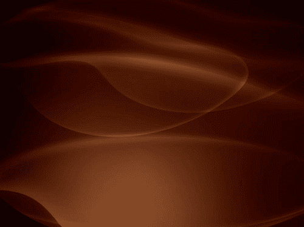

### Edgy Eft (Ubuntu 6.10)

麦克的恶毒仇恨者无论转向哪里，他们的目光都会回到苹果身上。Ubuntu 6.10 的 Edgy Eft 的默认壁纸肯定会被讨厌。

它通过当时默认的 Mac OS X 壁纸‘Aqua’10.04 代表了一个明显的影响。

浅色的皮肤在这里真的很好用，创造了一个光滑舒适的桌面。

### 活泼的小鹿(Ubuntu 7.04)

人们有时会注意到，Ubuntu 的活泼小鹿壁纸除了淤青的皮肤补丁之外，什么也不像。

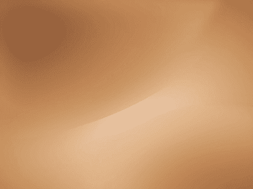

### Gusty Gibbon (Ubuntu 7.10)

回到前两个版本的肉色调，7.10 版本的 Ubuntu 看到了 Dapper 时代回归的浓郁棕色。

同样，这张壁纸呼应了操作系统 X 的标志性 Aqua 壁纸的陈旧线条。但是，它在颜色的选择上足够独特，可以感受到 Ubuntu。

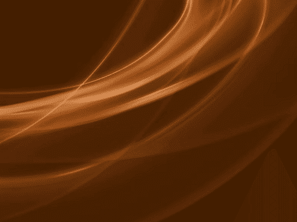

### Hardy Heron (Ubuntu 8.04)

哈代的壁纸被广泛认为是迄今为止最好的壁纸之一(默认)。很容易在操作系统本身出现的变化和壁纸当时的外观之间找到相似之处。

用户之间有一种认同感。此外，Ubuntu 对自己的目标感到足够自信，能够站得高，以自己的方式实现事情。

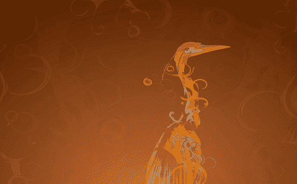

### 勇猛的 Ibex (Ubuntu 8.10)

为了庆祝 Ubuntu 8.04 壁纸的成功，Ubuntu 8.10 壁纸以哲学风格展示了其名义上的吉祥物。

结果不如它的前身出名。然而，这种设计仍然在世界各地的许多 Ubuntu 桌面上展现出个性。不管建议如何，Ibex 的壁纸愉快地展示了它的身份，这将是默认桌面选择所缺失的。

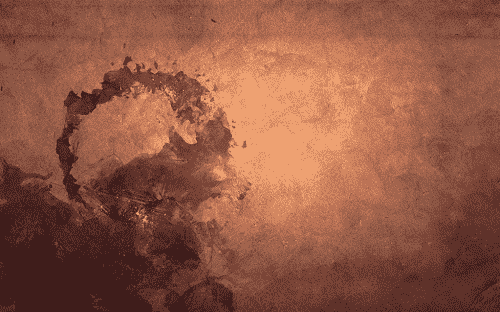

### Jaunty Jackalope (Ubuntu 9.04)

带着 Jaunty 的褶皱，它回到了公地:外面是吉祥物，后面是渐变。这张壁纸提供了旋转灯光效果。

旧两种设计的独创性和想象力大打折扣。

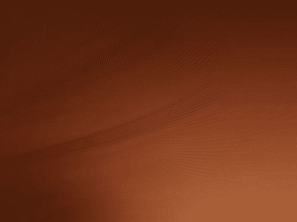

### 业力考拉(乌班图 9.10)

许多用户在第一次启动业力壁纸时的最初反应，即“棕色去哪里了？”。业力考拉壁纸用舒适的橙色调取代了清晰的土色调。

Karmic 考拉壁纸或许比其他壁纸给 Ubuntu 提供了更多诱人而温暖的最初印象。此外，壁纸的纹理让每个人都感到困惑。

### Lucid Lynx (Ubuntu 10.04)

当然，在 ***Lucid Lynx*** 壁纸中没有检测到棕色，因为新的 ***视觉标识*** 和 ***配色方案*** 的引入标志着 Ubuntu 桌面的感觉和外观开始了。

Lucid Lynx 的默认壁纸中使用的紫色渐变、模糊伪像和镜头眩光是温和的，并且符合**“Lucid”**的绰号。许多人认为这种壁纸不引人注目，是以个性为代价的。

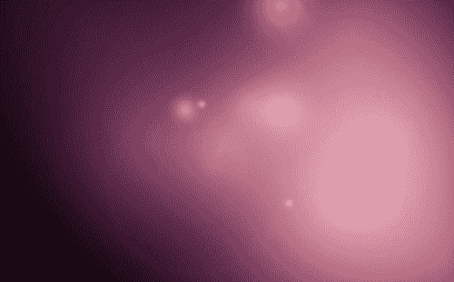

### 特立独行的猫鼬(Ubuntu 10.10)

最初的战略背景是*与结果相比，有些野心勃勃。遗憾的是时间不多了，他们因为提出了这个替代方案而受到了惩罚。*

 *消息是，结果是一个适当的褶皱，加上无形的频闪，换句话说，借出一个质量。

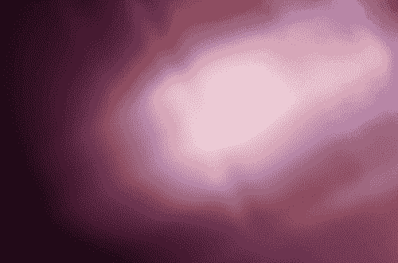

### 纳豆 Narwhal (Ubuntu 11.04)

如果把之前壁纸色调的修改作为 ***【微妙的进化】*** 来考察，那么***Natty narwhale***向壁纸正面的靠近就可以考察得相当灭绝了。

从这里到 12.04 版本的 Ubuntu，通过迭代和一致的方法来修改壁纸，这个设计注定会出错，从 10.10 版本开始，这个设计只是进行了一些微小的显著修改。

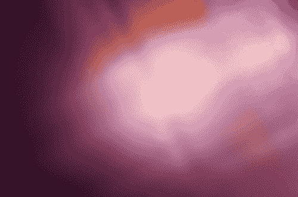

### oneiric oclot(Ubuntu 11.10)

Oneiric 豹猫是通过 11.04 Ubuntu 壁纸更新的壁纸。这只是一个非常复杂的升级。

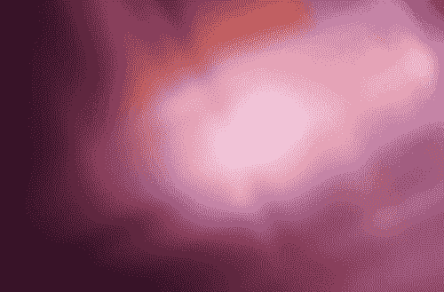

### 精准穿山甲(Ubuntu 12.04)

设计师们将 3 个作品中的冷紫色换成了橙色，因为 Ubuntu 12.04 LTS 壁纸的默认背景将播放五年之久。

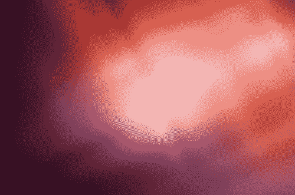

### Quetzal (Ubuntu 12.10)如何

在 5 年难以区分的窗帘之后，Quantal Quetzal 出现了相同主题但明显不同的壁纸。有人建议这种壁纸像鼻孔的微距镜头。

### 渴望铃声(Ubuntu 13.04)

拉灵铃声壁纸的默认背景比往常更早被曝光。一些人确信，这次和之前发布的壁纸之间的单一修改是 180 度垂直翻转。

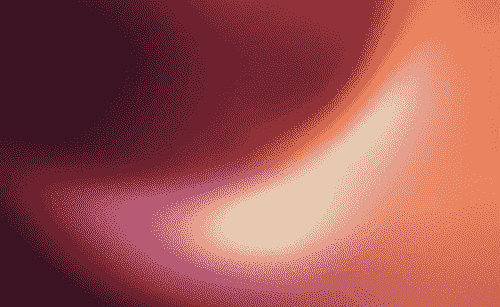

### 无礼的蝾螈(乌班图 13.10)

最新要收录的壁纸(默认)是 ***【骚娃娃鱼】。*** 与老版本相比，它更具紫色。然而， ***【黑灰】*** 依然存在，尽管形式更加疲惫。

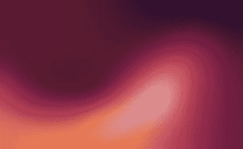

### Trusty Tahr (Ubuntu 14.04)

第一张壁纸融合了之前桌面的外观和感觉，以及新的面向移动的苏茹设计风格。

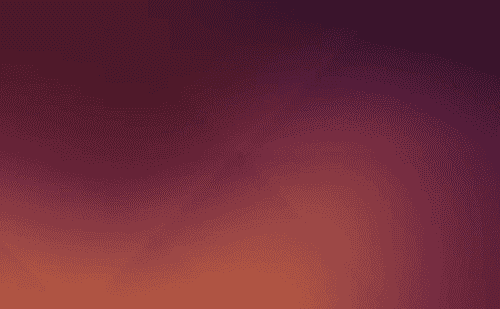

### Utopic 独角兽(Ubuntu 14.10)

Ubuntu 14.10 壁纸没有随更新后的壁纸一起发货。Ubuntu 的 14.04 LTS 设计仍然是默认的。

### Vivid Vervet (Ubuntu 15.04)

恰如其分地为一个被称为 ***【生动】的版本。*** 这张桌面壁纸是在影响力下制作的，看起来出人意料的黑暗。更新的 ***【苏茹】*** 设计定义了年代久远的遗迹。

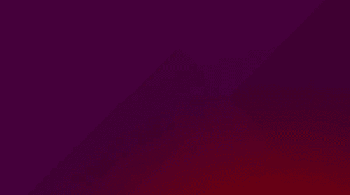

### 狡猾的狼人(Ubuntu 15.10)

狡猾狼人的壁纸保留了较新的苏茹设计的语言。然而，它使先前紫色渐变的黑暗变得平静。结果是一个较轻的整体出现，一些角块抵消了角落的折叠。

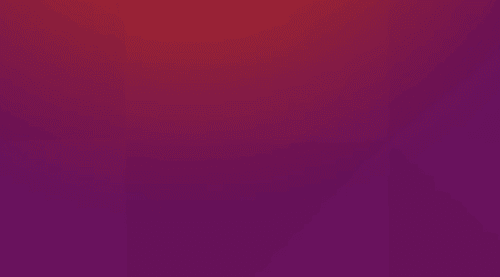

### Xenial 薛西斯(Ubuntu 16.04)

Ubuntu 16.04 的 Xenial Xerus 壁纸是很长时间以来最轻最亮的词条。它为创建 ***【网状】*** 外观提供了更多橙色和新的几何剖切。

### yakety yak(Ubuntu 16.10)

Ubuntu 16.10 壁纸采用了更橙色的渐变颜色，主题更加明亮明亮。旧壁纸中定义的棱角几何形状也延续了这张壁纸。这种壁纸覆盖了屏幕上更坚固的部分。

### zesty zabu(Ubuntu 17.04)

Zesty Zapus 壁纸实际上与之前的壁纸完全相同。这种默认壁纸保持橙紫色渐变。但是，它会将感兴趣的区域向右翻转。

### 巧妙的土豚(Ubuntu 17.10)

Ubuntu 17.10 的艺术土豚壁纸是最初的 Ubuntu 背景，提供了 2008 年的吉祥物代号。

### 默认壁纸(Ubuntu 18.04 LTS)

***【仿生海狸】*** 的背景保留了在设计中应用吉祥物艺术品的传统。

### Ubuntu 18.10 壁纸

在这张壁纸中，使用了橙色和紫色的渐变，版本吉祥物再次居中和靠前。

### Ubuntu 19.04 壁纸

这张壁纸贴着紫色的背景，它描绘了一只精心设计的野狗。

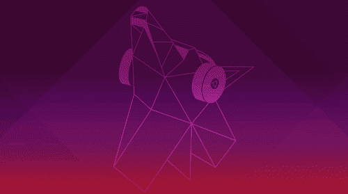

### Ubuntu 19.10 壁纸

Ubuntu 19.10 壁纸正在温暖的野狗壁纸的招待会上搭建。它有一个圆形的白鼬图案(这个版本被称为 Eoan Ermine)和一个橙色的渐变。

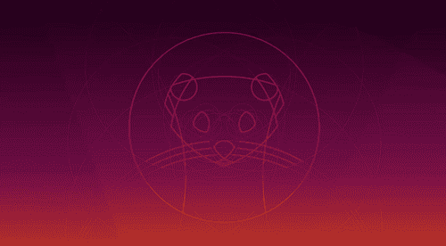

### Ubuntu 20.04 壁纸

这张壁纸的代号是 ***“焦窝”。*** 它的推出是为了发布其目前的长期支持(LTS)版本。Ubuntu 的设计团队还包括了其他 flairs，包括 ***【焦点线】。***

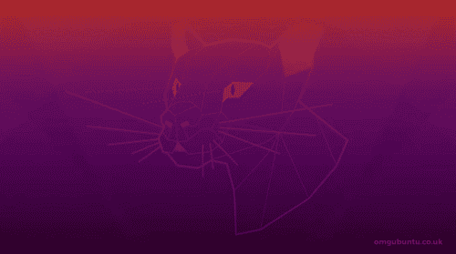

### Ubuntu 20.10 壁纸

这张壁纸被称为 Groovy 大猩猩。这个丰富多彩的代号需要一个有特色的吉祥物，而 Canonical 的设计也带来了这个版本。

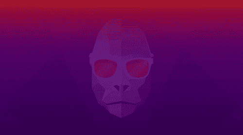

### 多毛河马(Ubuntu 21.04)

Ubuntu 21.04 壁纸包含了一个毛茸茸的代号。这意味着乌班图的设计师们在 ***【多毛河马】*** 壁纸中一直关注的东西。

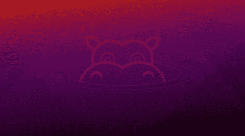

* * ***