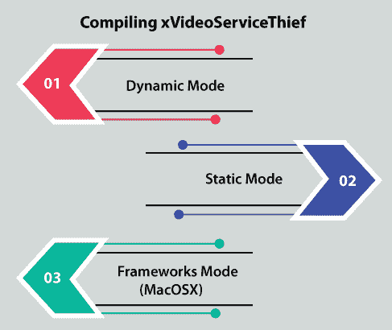
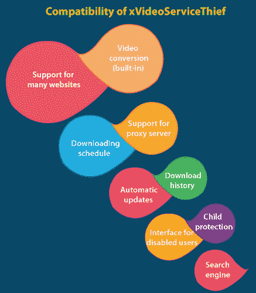

# xvideservicehief Ubuntu Linux free

> 哎哎哎:# t0]https://www . javatppoint . com/xvideservicehief-Ubuntu-Linux-free

## xVideoServiceThief 贼王介绍

***xvideoservice 贼王*** 可谓是利用各种网站的视频下载几个 ***视频片段*** 的工具。此外，该工具还为我们提供了一个将视频转换为最著名格式的机会，如 ***MP3、3GP、MP4、WMV、MPEG2、MPEG1、*** 和 ***AVI*** 文件格式。

xVideoServiceThief 贼人 Ubuntu 的桌面镜像让我们可以在不修改系统的情况下尝试 Ubuntu，并在以后永久安装。大多数人都希望使用这种形象。我们将需要至少 384 兆内存空间来安装这个图像。

这个程序总是允许我们使用不同的视频托管网站下载视频，如***【YouTube】【Vimeo】【Dailymion】***和许多其他网站，以进一步查看我们的个人库。

该工具适用于 Linux、Mac 和 Windows。它是一个使用通用公共许可证的开放软件工具。它很容易使用，我们可以使用 xVideoServiceThief 贼王软件下载视频。

与其他工具不同，它可以处理多个下载，并忽略错误或中断。

*   **开发商:** XESC &科技
*   **语言:**英语
*   **版本:** 2.5.1
*   **许可:**免费软件
*   **更新时间:**2019 年 3 月 5 日
*   **尺寸:** 10.5MB
*   **兼容性:**Windows 8/Windows 7/Windows 10/Mac/Linux
*   **系统:** Linux

## XvideoServiceThief 小偷功能

下面列出并解释了 xVideoServiceThief 小偷工具的一些重要功能:

*   它是跨平台的(Mac OS X、Linux 和 Windows)。
*   各种服务由 ***【谷歌视频】【Youtube】***等 xVideoServiceThief 贼王工具支持。
*   该工具基于插件工作。
*   它可以将任何视频转换成著名的格式。
*   这是一个简单明了的界面。
*   它适用于各种类型的网站，我们可以免费下载几个视频。
*   该工具可用于转换格式，如 MP3、3GP、MP4、WMV、MPEG2、MPEG1 和 AVI。
*   在下载过程中，它为我们提供了超高速的便利，因为一个文件可以通过多个连接下载。
*   我们可以毫无问题地继续不完整的下载。
*   还包括一个用于阻止或取消阻止成人视频和网站的选项。
*   使用 70 多个网站下载视频资料。
*   它用于同时下载多个文件。一次下载多个视频可以节省我们的时间。
*   xVideoServiceThief 小偷工具使用拖放方法。
*   它支持代理并在后台工作。
*   它可以计划下载时间表。
*   它可以在网络中搜索多个文件。
*   它可以恢复或停止下载过程。
*   它支持 RTMP 协议和 HTTP 协议。xVideoServiceThief 贼王软件使用 RTMP 和 HTTP 协议通过互联网下载几乎每一个视频。
*   最重要的是，它可以保护儿童不使用色情网站。

## xVideoServiceThief 的重要性

*   xVideoServiceThief 计算机软件的 ***Para Ubuntu 14.04 版本*** 允许我们使用像 Youtube 这样的网站下载。它使用 Metacafe、谷歌视频、雅虎、Youtube 等多种网络视频服务下载视频。
*   xVideoServiceThief 贼王电脑软件的 ***时间表结构*** 配置我们的下载时间表，让 xVST 在我们不用电脑的情况下下载视频。
*   基于插件的核心***【XvideoServiceStepher】***计算机软件可以用我们的 JavaScript 插件扩展一个 xVST 副本。
*   ***【XvideoServiceStepher】***计算机软件的 ***暂停*** 和 ***恢复*** 功能也是可用的，如果 w 需要其他连接来实现其他必要的操作，那么我们可以取消、恢复或暂停下载。
*   ***自动更新*** 功能的***xvideoservice 贼王*** 电脑软件可以自动更新我们的 xVST 副本，所以我们不需要担心新版本。
*   ***【XvideoServiceStepher】***计算机软件的 ***Bug 报告*** 功能允许我们使用 Bug 跟踪器发送报告，以改进未来的版本。
*   xVideoServiceThief 小偷电脑软件的 ***托盘图标功能*** 可以在后台模式下运行 xVST。
*   本电脑软件的 ***可定制网站*** 功能可以选择我们希望允许的网站和我们必须屏蔽的网站。
*   该软件的 ***下载日志*** 可以将每次下载保存在历史文件中，这样我们就可以随时查看下载的视频。
*   ***【XvideoServiceStepher】***计算机软件的 ***会话管理器*** 可以自动恢复和保存下载列表。
*   *的***XvideoServiceStepher***软件的多语言功能使用我们的语言 xVideoService。XVST 目前支持 14 种以上不同的语言。*
**   有了 xVideoServiceThief 小偷电脑软件的 ***语言管理器*** ，我们不需要安装和卸载语言，也不需要手动下载和安装更新的语言。*   xVideoServiceThief 小偷电脑软件可以保护我们免受病毒的侵害。*   这个工具的界面简单易行。*   我们可以轻松恢复不完整的下载。*

 *## xVideoServiceThief 的工作原理

学习如何使用该工具下载视频，我们不需要计算机技术学位、指导或说明。它很简单，可以类似于其他这类工具使用。

下面提到了使用 xVideoServiceThief 小偷程序的一些步骤:

### 第一步:

一旦我们执行了程序，我们会看到界面底部的框，在那里我们可以配置下载的文件夹来存储我们的音频和视频。

### 第二步:

我们会在界面右侧找到一个选项，即 ***添加视频*** 。一个窗口会打开，提示我们粘贴相关的网址，当我们点击它。

### 第三步:

点击 ***接受*** 选项，耐心等待我们的视频下载(时长取决于服务器和我们的连接)。

在 ***【更多选项】*** 中，我们将准确找到这些额外选项，用于配置结果格式、音频质量、分辨率、下载时间表、语言等。

## 正在编译 xVideoServiceThief

STATIC_BUILD(一个编译器指令)必须分开，这样才有可能获得授权的 xVST 编译。

*   **动态模式:**
    如果我们希望在动态模式下编译这个软件，我们应该实现:>qmake-set build _ Mode Dynamic _ build>qmake>make
*   **静态模式:**
    如果我们希望在静态模式下编译这个软件，我们应该实现:qmake-set build _ Mode Static _ build>qmake>make
*   **框架模式(MacOSX):**
    如果我们希望在框架模式下编译这个软件，我们应该实现:qmake-set build _ Mode framework _ build>qmake>make
*   如果我们使用的是 Windows 操作系统，那么我们可以使用一些自动化脚本来编译 xVideoServiceThief 小偷软件:
    >编译-工具/编译-vc++。bat(静态+ VC++2010) >编译-工具/编译-mingw.bat(动态+ mingw)

## 下载和安装 xVideoServiceThief

我们需要考虑在我们的系统中下载 xVideoServiceThief 小偷软件的一些步骤。这些步骤如下:

*   首先，我们需要借助***-xvf xVST _ 2 _ 5 _ 1 _ x64-Linux-dynamic . tar***命令提取我们的系统。
*   使用上述命令后，我们将被要求键入***CD xVST _ 2 _ 5 _ 1 _ x64-Linux-dynamic***命令。
*   然后，添加***chmod+x install . sh***命令，允许安装过程开始。
*   添加 ***开始安装过程。*命令。**
*   它将开始安装过程。

## 如何使用 xVideoServiceThief 贼王下载视频？

我们需要按照以下步骤使用 xVideoServiceThief 小偷应用下载视频:

*   下载后需要打开 ***xVST*** app。我们已经确定了下载位置。我们可以在这个应用窗口的左下角做。
*   之后，我们需要在 app 的右上角选择 ***【添加视频】*** 选项。
*   我们需要在下一个标签中输入希望下载的 ***视频的网址*** 。xVideoServiceThief 小偷应用会自动识别我们从中下载视频的视频网站。
*   然后，点击 ***【确定】*** 选项，视频将简单地开始下载。如果我们愿意，我们可以通过取消选中一个选项来选择不自动开始视频，即***‘自动下载视频’。***

## xVideoServiceThief 的兼容性

准确地说，***xvideoservice 贼王*** app 的主要力量是种类繁多的 ***网络服务。*** 它将允许我们掌握每一种视频。这一点和其他一些方面使它成为许多用户最喜欢和最受欢迎的视频下载程序之一。

*   **对许多网站的支持**
    xvideoservice 贼王软件在当前更新后兼容了 90 多个网络服务(但其中一些可能已经关闭)，包括像 Metacafe、LiveLeak、Vimeo 和 Youtube 等内容相同的网站。
*   **视频转换(内置)**
    它包括一个转换器，这样我们就可以将视频转换成与 iPhone 或 Android 设备兼容的其他著名格式。
*   **下载时间表**
    这个兼容性方面提供了一个下载时间表的功能，这样我们就可以在不在系统上的时候使用互联网的带宽。
*   **搜索引擎(内置)**
    xvideoservice 小偷软件与搜索引擎(内置)兼容。它使我们能够开始下载过程或在程序中简单地播放它。
*   **自动更新**
    它为所有新版本提供自动更新(如果我们在防火墙上授权的话)。
*   **对代理服务器的支持**
    xvideoservice 小偷软件与代理服务器兼容。它支持与代理服务器的许多连接。然而，这是一个处于测试阶段的功能。
*   **残障用户界面**
    该电脑软件提供了一个为所有残障用户准备的界面。
*   **儿童保护**
    它保护孩子们不使用错误的内容，这样我们的孩子就不会下载贾斯汀比伯视频或阿森纳比赛等不当内容。
*   **下载历史**
    xvideoservice 小偷工具使我们能够查看和检查我们的下载历史。

此外，这个著名的下载管理器已经登陆了其他环境，如苹果操作系统和 Linux，尽管目前安卓设备还没有 APK。或许，我们最好的选择是下载 Tubemate 作为智能手机和平板电脑的替代品，因为它看起来永远不会有移动设备的发布。

## xVideoServiceThief 小偷的源代码

我们可以使用***GitHub.com 下载 xVideoServiceThief 小偷电脑软件的源代码。*T3】**

每个文件都将其源代码移动到了*网站，因为我们希望为社区提供更加互动和直接协作的机会。 ***GitHub*** 是实现这一目的的最佳选择之一。*

 ** * ***