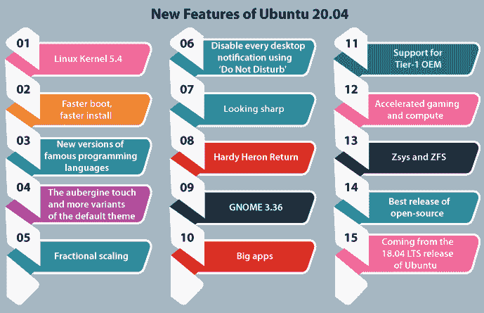

# Ubuntu 20.04 lt

> 吴奇珍:t0]https://www . javatppoint . com/Ubuntu-20-04-lt；

## 介绍

***Ubuntu 操作系统*** 是世界上最著名的 ***开源*** 桌面。Ubuntu 的 ***20.04 LTS 版*** 是一款面向家庭用户和组织的 ***【高性价比、企业级、*** 和 ***安全的*** 操作系统。

这个 Ubuntu 版本的代号是 ***“焦窝”。*** 术语 ***【焦点】*** 定义 ***【最重要的部分】*** 或 ***为“中心点”。*** 除此之外 ***【窝窝】*** 这个名词可以形容为马达加斯加岛的一种类似猫的本土掠食者。

这个版本是 LTS(长期支持)版本。它延续了 2018 年发布的 Ubuntu 18.04 LTS 版本，并一直支持到 2023 年。

所有 LTS 版本在服务器和桌面上都支持 ***五年*** 。因此，该版本也支持到**2025 年*。***

企业和商家的用户可以获得 ***十年的***ESM***支持。*** 现在，它在 Ubuntu 的存储库中包含了每 3 万个包的许多安全更新。然而，ESM 状态不是免费的，它是为 Ubuntu 优势的用户量身定制的。

### 以下是一些要点:

Ubuntu OS 已经达到了组织 Linux 安全独立排名的巅峰。

***【焦点窝】*** 版本是一个连贯、免费、可定制的操作系统，易于安装。

Ubuntu 20.04 版本应用了*内核自我保护的多种措施，包括堆栈冲突保护，确保系统企业安全的控制流完整性。*

 *此外，该版本还提供了 ***【安全引导】*** 来防止低级根工具包和攻击，通常通过 ***【高级持久威胁组】*** 来使用，并限制 ***【爆炸半径】*** 或攻击扩散，重点公开了应用在服务器上的快照限制和类似桌面的 ***本地 Kubernetes 包 MicroK8s。***

20.04 LTS 版的 Ubuntu 解决了 ***FIDO(快速 ID Online)*** 的问题，以缓解社交工程对无密码认证和通用多因素的攻击。

Canonical 与环境合作伙伴合作，在最新的硬件功能中以最大可能的方式锚定操作系统的安全性。

这个版本包括***【wire guard】***，为了支持广泛的组织采用，它将被反传到 18.04 LTS 版本的 Ubuntu。

***【AI】***和 ***机器学习*** 来自各种厂商的工具存在对于 Ubuntu 20.04 LTS 用***6000***app 里面的 ***Visual Studio Code、JetBrains 组合、Spotify、Plex、Skype、*** 和 ***Slack。***

在 ***窗口、*** 这个版本的 Ubuntu 允许我们使用***【Ubuntu 终端】*** 并执行 Ubuntu 的命令行工具，包括 apt、git、ssh、bash 和许多其他工具。

***稳定*** 是这个版本最重要的特性之一。**T5【典范】T6**的团队不会在这里做任何激进的修改。

这个版本并没有通过上一个版本带来多少惊天动地的修改。尽管如此，迁移到 Gnome 桌面环境和 Linux 内核的新版本(结合了对界面的许多开发)只是初步更新。

## 先决条件

1.  推荐系统要求:

    *   USB 端口或 DVD 驱动器
    *   25 GB 磁盘空间用于存储(安装最低版本时最低)
    *   4 GB 内存
    *   2 千兆赫双核处理器
2.  4gbu 盘(至少)

## Ubuntu 20.04 LTS 发布日期

2020 年 4 月 23 日星期四 ***发布了 20.04 LTS 版本的 Ubuntu。*** 发布日期最早在***launch pad***(Ubuntu development 的主场)上披露，并在之后的 ***Ubuntu wiki*** 上回响。

在 ***焦窝*** 发育周期中发生的其他重要里程碑包括:

2020 年 1 月 9 日:**测试周**

2020 年 3 月 19 日: **UI 冻结**

2020 年 4 月 2 日: **Ubuntu 20.04 Beta**

2020 年 4 月 9 日:**仁冻**

2020 年 4 月 16 日:**发布候选人**

## Ubuntu 20.04 的新特性

### Linux 内核 5.4

20.04 版本的 Ubuntu 采用了现代的 ***LTS 内核 5.4 版本。*** 这意味着我们获得了对 ***ExFAT、*** 每隔一段时间性能提升的原生支持，以及随之而来的对硬件的新支持。它包括对各种处理器的支持。此外，它还包含对各种安全功能的改进，如 USB-C、节能和启动速度。

### 更快的引导，更快的安装

Ubuntu 20.04 版本支持较新的压缩算法。因此，安装 20.04 版本的 Ubuntu 只需要很少的时间。此外，这个版本比 18.04 版本的 Ubuntu 启动得更快。

### 著名编程语言的新版本

这个版本的 Ubuntu 包含了 ***Golang 1.13、Perl 5.30、Rustc 1.41、Glibc 2.31、PHP 7.4、OpenJDK 11、Python 3.8、*** 等一些著名的编程语言。

### 茄子的触感和默认主题的更多变体

又是 Ubuntu 主题的典范实验。在 19.10 版本的 Ubuntu 中， ***Yaru 主题(默认)*** 解决了 darl 版本。此外，20.04 LTS 版本的 Ubuntu 采用了雅鲁藏布江主题的三种变体(默认): ***标准、黑暗、*** 和 ***光明。***

我们甚至不需要安装 ***GNOME Tweaks*** 来切换默认的主题变体。该功能已经嵌入到 ***设置*** 应用中。

此外，这个 Ubuntu 版本有一点不同的外观，重点是茄子作为第二种颜色的口音(而不是常规的绿色和蓝色)。

### 分数缩放

最后，Ubuntu 带来了一个特性，即 ***分数缩放。*** 如果我们总是检测到 100%的图标在 200%时看起来很小很大，那么我们可以利用分数缩放。

启用后，我们可以将缩放比例固定为 200、175、150 和 125。

### 使用“请勿打扰”禁用每个桌面通知

有时，我们会被桌面上的几个通知分散注意力。因此，我们可以利用一个选项，即 ***【请勿打扰】*** 来禁用桌面通知。

### 看起来很犀利

我们不能错过通过启动飞溅到桌面的 Yaru 主题。对于操作系统的几个供应商来说，对操作系统有不同的看法对于发展他们的品牌至关重要。Canonical 与 Ubuntu design thems 以及桌面和 Yaru 社区团队的成员一起主持了一场设计冲刺。

首先，Yaru 已经宣布了 Ubuntu 的 18.10 版本，所以如果我们从 Ubuntu 的 18.04 LTS 版本升级，这将是我们第一次检查这种新的、明确无误的、大胆的外观。

Yaru 包括一个声音主题和三个不同的变体。此外，设计 sprint 认识到了我们完成桌面开发所需的一些用户界面改进。

现在，设置面板“外观”可以在窗口的“暗”、“亮”、“标准”颜色之间切换，并且可以恢复雅鲁藏布江警报声音(默认)。

此外，Yaru 主题还扩展到启动启动和安装幻灯片放映。Yaru 的团队通过桌面的主题将旋转器动画化为靴子的主题。

*   如果我们选择启用完整磁盘加密，引导主题中密码短语的输入框将与桌面主题完美匹配。
*   现在，Ubuntu 默认情况下，如果引导到任何活动会话，就会看到介质完整性在使用。可以通过按***Ctrl+c***跳过
*   由于安装失败，我们启用了它，因为安装介质的损坏下载是许多用户遇到的最常见的错误情况。
*   Ubuntu 的所有版本都有一个更新的动物吉祥物，已经有几年了。
*   通常情况下，*的设计团队会提供一个精心制作的生物作为乌班图的主题。这个版本没什么不同。*
**   尽管如此，这个版本附带了一个术语 Ubuntu 20.04 LTS 吉祥物(费利西蒂)。*   费利西蒂在默认壁纸中提供了许多新的东西，因为这是 Ubuntu 桌面新版本的惯例。*   虽然，我们富有创造力和热情的用户喜欢拉动股票的体验。*   Canonical 团队策划了一组漂亮的原型，作为额外的壁纸包含在吉祥物壁纸中。所有这些都是从照片分享和免版税的网站上挑选出来的。*

 *### 哈迪苍鹭归来

在过去的几年里，我们用一个账号，即 ***【乌班图推特】*** 组织了 ***【壁纸世界杯】*** 享受 ***十五*** 年的乌班图发布，与它们一起的还有桌面背景图。一个专家团队挑选了一些最有争议、最受欢迎和最具标志性的壁纸作为默认桌面。

然后，我们让他们和 ***【推特】*** 的追随者们互相较量，决定所有回合的结果。壁纸 ***【哈代鹭】*** 出人意料地登上了榜首。因此，为了庆祝，Ubuntu 团队也为了旧时光偷偷安装了 4000 张壁纸。

### GNOME 3.36

Ubuntu 从 17.10 版本开始就将 GNOME shell 作为默认桌面平台发货。Ubuntu 的桌面团队已经与 GNOME 的许多上游开发人员和更广泛的社区合作，为我们的用户提供强大的 GNOME 桌面体验。

GNOME 的 ***3.36 版本既有 ***用户可见的修改*** 增加了许多功能并开发了用户工作流程，又在引擎盖上进行了修改，将稳定性和性能结合在一起。***

新的切换，即 ***【请勿打扰】*** 对于那些正在检查是否专注于工作的人来说是一个补充。新的锁定屏幕和登录既美观又简单，在用户桌面背景模糊的顶部位置加入了清晰的用户界面。

现在，一个选项，即 ***暂停*** 是在状态菜单内快速按开。在这个新版本中，许多喜欢托管应用网格的用户可以受益于对应用的更好的文件夹管理。

除了更低的 CPU 使用率和更流畅的概览动画和窗口动画、窗口移动(现在也有更低的延迟)、鼠标移动和 JavaScript 执行之外，还有其他几轮性能开发。

### 大型应用

Ubuntu 的桌面集成了 ***【微软交易所】*** 或 ***谷歌 G 套件*** ，还支持许多允许用户忽略供应商锁定的开放标准。这款 Ubuntu 版本出货是有优势的，即 ***火狐 75*** 作为网页浏览器(默认)，继续提供注重隐私的新功能。

雷鸟是一个著名的电子邮件应用，它帮助我们快速访问桌面上的电子邮件。无需担心我们正在使用的电子邮件服务，如 IMAP、POP、Hotmail、Gmail 或微软交换，电子邮件将工作。我们会在这个版本的 Ubuntu 中找到 ***雷鸟 68.7.0*** 方面。

一款生产力应用是 ***LibreOffice 6.4*** ，这是一款功能强大且免费的办公套件，让我们能够更智能、更轻松、更快速地工作。LibreOffice 6.4 功能丰富的工具和干净的界面有助于释放我们的创造力，提高我们的工作效率。

### 对第 1 级原始设备制造商的支持

Ubuntu 广泛应用于教育、公共部门、政府和企业。Canonical 一直致力于与联想、惠普和戴尔密切合作，以满足这些天对硬件(预装)的需求。

以下是我们为原始设备制造商合作伙伴所做的一些工作示例，包括对桌面上每个 Linux 用户的价值。

现在，如果从 20.04 LTS 版本的 Ubuntu 开始，安装基本的 Ubuntu 版本就有可能获得认证设备的体验。

*   当安装在经过认证的硬件上时，启用(特定于设备)将自动配置和安装，就像它在工厂映像中一样(预加载)。
*   我们提到了一个更新的 boot splash，它在早期启动时保留了供应商的徽标，我们在 Ubuntu 中进行的修改是由原始设备制造商的合作伙伴提示的。
*   Ubuntu 正在发布 Sound Open Firmware、PulseAudio 14.0 和 BlueZ 5.53，以及一些支持 SoundWire 和 DMIC 的补丁，这些补丁将用于 OEM 合作伙伴即将推出的设备。
*   现在，几款设备都自带一个功能，即 ***指纹识别器。*** 这已经成为解锁用户会话的常用方式。Ubuntu 已经将 UI 和后端与一个项目(即 libfprint)集成在一起，这使得硬件供应商能够轻松支持更新的生物识别设备。
*   ***X11 分数缩放*** 功能从 19.04 版本的 Ubuntu 就已经存在了。但是，它不是通过用户界面向用户公开的。
*   在 20.04 LTS 版本的 Ubuntu 中，Ubuntu 的开发团队加入了一个切换开关，这样 Ubuntu 的用户就可以在显示设置中轻松启用分数缩放功能。
*   特别是在 OEM 合作伙伴提供的*(一流)HiDPI 笔记本电脑上很有帮助。*

 *### 加速游戏和计算

***【机器学习】******【人工智能】*** 是新的数据工程类，组织内部的采用正在爆炸式增长。因此，Ubuntu 为从许多开发人员工作站到边缘、云和机架的组织提供了人工智能的雄心。

Ubuntu 桌面通过提供现代化的库、驱动程序和工具，加速了工作站和笔记本电脑上的数据科学。数据科学家可以通过在裸机硬件机架或公共云上进行任何培训之前应用 Kuberflow 以及硬件加速，在 Ubuntu 的高端工作站上集成人工智能模型。Ubuntu 操作系统是组织机器学习的标准。

如果我们把我们的图形处理器用于娱乐，这里有一些我们会欣赏的方面。然而，32 位英特尔(i386)不再是版本架构，Ubuntu 保留了一套 32 位英特尔的库，用于满足***【Lutris、Wine、Steam、*** 的需求，同时也是一个标准应用和游戏的大后台目录。

*   在 Ubuntu 中，*软件包也已经针对 Ubuntu 的 20.04 LTS 版本进行了更新，现在它支持各种各样的虚拟现实设备和控制器。*
**   野性互动的游戏模式性能工具默认安装。GameMode 可以被描述为一个守护进程，允许游戏请求一组优化被临时用于游戏进程或主机操作系统。*   GameMode 目前给出了自定义脚本、GPU 超频(NVIDIA)、GPU 性能模式(AMD 和 NVIDIA)、屏保抑制、内核调度器、进程精细度、I/O 优先级和 CPU 调控器的优化。*   现在，混合显卡可以通过一个菜单项，即“在独立 GPU 上启动”，从 GNOME Shell 内部借助独立 GPU 启动应用。*   它适用于 NVIDIA 和 AMD 图形处理器。*   对于视频创作者和直播流媒体，我们会发现 FFmpeg 支持 VA-API 和 nvenc。*   这些是在执行过滤、编码或解码的图形处理器中检测到的方面，用于使用中央处理器卸载这些计算密集型操作。*   许多可以应用 nvenc 的应用，如快捷键和 OBS Studio，也可以从这些硬件编码方面受益。*

 *### 杰西和 ZFS

在 19.10 版本的 Ubuntu 中，我们包含了在 ZFS 格式的文件系统上安装桌面的实验性支持。20.04 LTS 版本的 Ubuntu 附带了一个新的 ZFS，它提供了改进的性能、池修整、设备移除、本机和硬件支持的加密。我们已经在这方面建立了 zsys，同时还在试验中。

Zsys 是 Ubuntu 和 ZFS 之间的集成工具。如果用户更新系统或安装软件，Zsys 会自动拍摄快照。它使用户能够回滚。这些类型的快照在菜单中表示，即 ***GRUB 引导。*** 此外，它为未来备份的额外功能奠定了基础。

### 开源的最佳版本

Ubuntu 操作系统是在最好的开源版本上开发的，Ubuntu 的桌面让所有地方的用户和开发人员都触手可及。

GNOME 的开发者社区使这个 Ubuntu 版本成为一个桌面外壳，开源，友好的环境，高质量的协作。

### 来自 18.04 LTS 发布的 Ubuntu

我们知道我们的几个用户可能对 LTS 版本很反感。那些正在从 18.04 LTS 版 Ubuntu 升级到 20.04 LTS 版 Ubuntu 的用户会注意到一个更大的修改，因为新的 ***长期支持*** 包括了从 18.10、19.04 和 19.10 版本 Ubuntu 中期版本登陆的每个方面的汇总。以下是需要注意的几个要点:

*   GNOME 的 ***磁盘在磁盘格式化时支持开源的 VeraCrypt 磁盘加密。***
*   窗口预览和桌面缩放相对来说性能更高。
*   一个工具，即*bug 报告现在可以自动传输崩溃报告，如果应用冒犯了减少用户中断。*
**   对 ***【侏儒】*** 的 ***设置面板*** 进行了改进，使其更容易操作扬声器和麦克风设备。*   追踪器被包括在内，用于改进桌面的文件搜索。*   在 ***【可用性】*** 中的许多改进都被启用来停靠窗口预览和 ***Alt+Tab*** 以使应用交换更具感知性。*   ***【安全图形模式】*** 用于在出现意外错误时启用调试。*   通过使用最少的中央处理器、几乎所有显卡的输出延迟以及滚动时更低的输入延迟，桌面的性能也得到了提高。*   一直以来，用户现在应该拥有更流畅、更高的帧速率。*   DLNA 分享让用户可以将视频分享给许多智能电视或一些更受支持的设备。*   现在， ***NVIDIA 显卡驱动程序*** 在安装介质上。因此，用户可以直接使用安装程序轻松安装这些驱动程序。*   此外，英伟达驱动程序用户的启动时间也得到了改善。*

 ** * ******