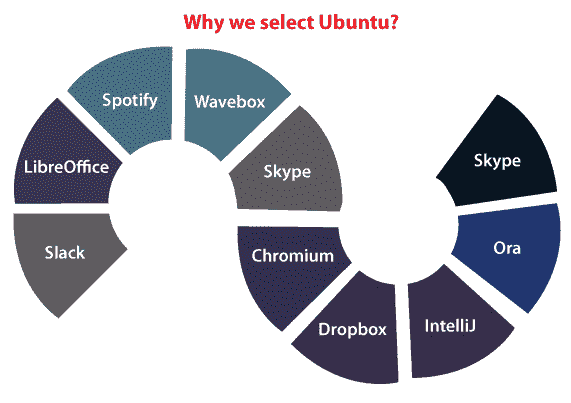

# Ubuntu 可引导 USB

> 原文：<https://www.javatpoint.com/ubuntu-bootable-usb>

## 可引导通用串行总线简介

USB 驱动程序以其**便携性**和**易用性**而闻名。虽然大多数用户发现他们将它们应用于一般任务，例如系统之间的数据传输、备份或存储。但是，只有一些人意识到完整闪存驱动器的潜力。

本文将解释一些释放这种潜力的方法，并发现我们可能不知道的新用途。闪存驱动器除了通过超安全银行业务将我们的照片保存到完全独立的操作系统之外，还用于其他几个用途。

这些类型的使用各有一个单一的基本功能，即**可引导性**。因此，**可引导闪存驱动器**将允许我们通过闪存驱动器而不是硬盘驱动器上的文件系统来引导系统。

我们的系统包含一个**引导扇区**，其中包含了它在硬盘上的使用细节。一份**卷引导记录**将包括如何运行操作系统或任何其他程序的说明。一个闪存驱动器应该有一个**卷引导记录，主引导记录**，并且包括一个**程序**或者一个**操作系统**，可以运行这个程序来引导到一个闪存驱动器。

首先，使用可引导的 u 盘有两个好处。这些内容如下:

### 数据和系统恢复

如果操作系统没有加载到内部存储驱动器上，可引导闪存驱动器可用于恢复故障系统。

## 可引导的 u 盘示例

一些最好的可引导闪存驱动器的例子包括运行操作系统安装程序，如 **OSX、Windows** ，甚至一些 Linux 表单。很可能，这是任何可引导 u 盘最基本的用途之一。这项功能在几年前还仅限于 DVD 和 CD，但随着闪存驱动器存储技术的提高，将这些操作系统安装程序完全放在我们的 USB 驱动器上变得可行。

如果我们的系统是新版本，或者如果我们的系统由于操作系统受损或损坏而变得不可用，那么我们可以使用可引导的 USB 驱动器来安装操作系统。所有文件复制到我们的系统后，我们可以正常重启和使用我们的系统。

有时，如果一个操作系统，如 OSX 或窗口变得岌岌可危，那么我们可以使用一个可引导的安装 USB 只重建损坏或丢失的元素，而不做一个完整的系统重新安装。

#### 注意:创建此操作系统安装程序的过程因操作系统而异。

*   另一个非常有用的，虽然利用率较低的可引导 u 盘，将是一个实用的 u 盘。终极引导光盘和**海人的引导光盘**都是光盘上包含的最佳工具示例，可以测试硬件、诊断问题、对硬盘进行分区，以及从本机操作系统中更换或修复软件。
*   然后，UBCD 和海恩的安装在一个可引导的闪存驱动器上，使这些成为我们工具包中的便携式和耐用的修复工具。此外，它还包括数据修复和病毒扫描工具，这些工具非常全面，因为它们可以从我们硬盘上的信息中转移，而不会运行其中包含的错误命令。
*   如果我们曾经在我们的系统上经历过恶意、间谍软件或恶意软件代码，那么我们知道这些病毒的主要目标是劫持我们的系统并使用操作系统运行许多命令。
*   在这种情况下，可引导实用程序驱动器可以协商并拉出恶意软件，而无需在受影响的磁盘上运行包含的代码。

## 替代操作系统

到目前为止，我们讨论的两种用途都认为我们的系统处于失修状态。在这种情况下，我们可以安装目前可用的 305 plus 发行版中任何一个的 **LiveCD** 版本。

众所周知，Linux 操作系统是一个**开源操作系统家族**，旨在取代私有操作系统，并希望得到公共维护和许可。在闪存驱动器上，一个 Linux 的 **LiveCD** 将允许我们在保持当前设置的同时体验操作系统。

这是发现 Linux 的特定发行版对我们还是对我们的企业来说是一个不错的选择的最佳方式。我们可以通过安装一个 Linux 版本来给以前的硬件注入活力，通过我们现在使用的每一个工具和每一种可用的 Linux 风格来获得一个功能齐全的操作系统。

## 我们为什么选择 Ubuntu？

我们知道视窗是世界上最受欢迎的操作系统之一，仅次于苹果操作系统。于是，一个问题来了，为什么我们要选择 Ubuntu OS 而不是一个众所周知的著名版本？

首先，拥有一个 windows 操作系统并不能阻止我们拥有 Ubuntu。我们可以进行双引导安装，或者在电脑上同时进行这两种安装。它允许我们在每次翻转设备时进行选择。然后，随着时间的推移，我们可能会选择删除我们认为不太有用的那个，对于那些仍然怀疑为他们的系统制作 Ubuntu 操作系统的可引导 USB 的用户来说，这是一个很好的解决方案。

虽然，有很多原因导致大家更喜欢 Ubuntu OS。下面列出并解释了其中一些原因:

1.  **成本:** Ubuntu OS 免费，所以没有成本。这个操作系统是由那些为公共福利工作的人免费制作的。
2.  **安全性:**不允许我们感染任何病毒或恶意软件的操作系统，因为我们希望在电脑上的一个文件中实现的所有更改都应该包含密码。因此，密码与拒绝访问并不相似。
3.  合作经营的最佳团队之一。
4.  它背后的一个组织、一个社区、一个开发团队和一个基金会，他们整天都在操作系统上工作，不断改进操作系统，使其完美工作。
5.  **简单:**Ubuntu 操作系统更容易安装，也更容易使用。经典应用已经统一到系统中。因此，我们有一个不需要支付任何费用的操作系统。因此，Ubuntu USB 可以成为我们问题的解决方案。
6.  **高性能:** Ubuntu OS 为我们的系统提供了高性能，基本安装不需要重启，除非我们正在更新大量的 OS。
7.  如果我们从错误或故障中得到任何问题，那么我们可以请求帮助，由许多程序员组成的 Ubuntu 社区将帮助我们免费解决这个问题。还有，有任何问题我们都可以联系这些程序员。
8.  这个操作系统可以适应我们现有的设备。不管我们有旧电脑还是最新一代电脑，整个软件都会以最好的方式实现。
9.  Ubuntu OS 已经包含了各种预装软件。此外，它还包含允许我们创建 SSH 连接的 SSH 客户端。

## 为什么要建立一个 Ubuntu 可引导 USB？

使它成为一个不寻常的选择肯定是一个好处，因为操作系统的安装不会以任何方式影响我们在系统中找到的主磁盘的分区。

通常已经安装的操作系统保存在其中。通过这种方式，我们可以占据外层空间并拥有高性能。

## 在苹果系统上安装 Ubuntu USB

正如我们所讨论的，Ubuntu 操作系统可以安装和使用在任何类型的系统上，即使是苹果公司生产的系统。所以，这里是我们需要记住的每一步，为苹果系统创建一个可引导的 u 盘。

### 要求:

在检测创建 Ubuntu 可引导 USB 的步骤之前，我们需要了解基本要求，以便用一个运行良好的软件完美地完成操作。

1.  首先，我们需要在笔式驱动器上建立磁盘映像。
2.  官方网站上有一个 Ubuntu 国际标准化组织的副本(我们需要选择 Ubuntu 的版本，因为有许多 Linux 发行版。
3.  我们需要一个笔驱动器，至少一个 2 GB 的闪存驱动器，或者一个 u 盘。

带有 3.0 或 2.0 USB 端口的计算机或 PC。

#### 注:如果我们有 2017 年或 2018 年以后的 Mac，看看它是否包括 T2 芯片。如果存在通过 USB 引导 Ubuntu 是不可能的，我们不能在其他分区安装 Ubuntu 操作系统。

### 看看我们有没有使用 T2 的苹果电脑

自 2017 年或 2018 年以来，苹果开始使用 T2 芯片。根据他们的说法，这种芯片增强了系统的安全性。除了苹果 OSX 之外，无法使用其他操作系统。

## 为安装 Linux 准备我们的通用串行总线

如果我们在苹果系统上执行任务，那么为了确保最大能力，我们最初需要格式化 u 盘。为了做到这一点，我们可以利用苹果公司提供的独特工具 ***【磁盘工具】*** 。但是，如果我们希望使用驱动器作为通用硬件，我们可以跳过这个过程。

1.  我们需要首先打开磁盘工具，我们可以在应用内部和工具上找到它。
2.  插入 u 盘，我们可以通过最近打开的应用自动检查。
3.  选择闪存驱动器，然后在工具栏上再次选择“擦除”。
4.  在格式栏输入***【MS-DOS(FAT)】***，在方案栏输入 ***GUID 分区图*** 。
5.  一旦我们已经验证了所有的步骤，那么我们可以选择 ***擦除*** 选项。

## 蚀刻师

这是一个开源的免费应用，允许我们指定国际标准化组织文件，我们将注意到我们需要在通用串行总线上安装 Linux。

这个程序很简单，通过官方网站我们可以下载应用并执行它。如果我们愿意，我们也可以把它放在我们电脑上应用的文件夹里，或者放在它原来的位置。

#### 注意:同样，鲸鱼蚀刻机也适用于 Linux 和 Windows。

要忽略通过苹果操作系统被阻止，我们可以从控制面板打开一个选项，即 ***【应用商店和指定开发者】*** 。之后，我们需要选择 ***【安全与隐私】*** 选项，我们将在 ***系统偏好设置*** 中找到该选项。当出现警告时，我们需要选择 ***“无论如何都要打开”*** 选项。

我们现在需要处理配置。它将在三个不同的步骤中向我们的 USB 设备指定，我们需要选择何时执行此操作:

1.  **选择图像:**在这种情况下，我们需要选择我们之前下载的 ISO 文件，我们会在一个文件夹内看到，即 Downloads。
2.  **选择驱动器:**它允许我们选择目标文件。我们必须选择我们的 u 盘。万一不够大，我们会得到警告。
3.  一旦选择了驱动器和映像，此步骤就会开始。

我们将被要求输入蚀刻机的密码才能继续。

我们设备的写入将从这一点开始，我们可以随时监控和检查它。

在编写过程之后，我们的 USB 中会有一个验证许多内容的阶段。蚀刻机将披露，该工艺在该工艺之后成功完成。

在这个过程之后，我们将使我们的 Ubuntu 可引导 USB 在我们的 Mac 上使用。如果我们想在苹果电脑上使用我们的 u 盘，那么我们需要打开或重启系统，保持 u 盘不动，同时按下 alt/Option 键。

它将启动 ***【启动管理器】*** ，我们的 u 盘将代表 ***电喷启动*** 名称，一旦选择该菜单将与 Ubuntu 一起启动。我们现在可以用通过 USB 安装的操作系统引导(启动)我们的系统。

## Ubuntu 可引导 USB 的第二个选项

首先要注意的是，我们需要通过 u 盘来固定引导模式，用于使用 PC bios 内部的 ***笔驱*** 来引导操作系统。

以前我们用的是影碟和光盘，但现在 u 盘经久耐用。它们内存更大，体积更小。我们将下载以下软件，用于在 USB 上安装 Linux Ubuntu 操作系统:

1.  一个软件，即*允许我们在 u 盘上的一些步骤中创建磁盘映像。*
**   Ubuntu 官方网站上有 Ubuntu ISO 映像副本(我们需要选择 Ubuntu 的版本，因为有许多 Linux 发行版)。*

 *第一步是开始 ***UNetbootIN*** 软件，然后点击 ***YES*** 进入首页。

在此页面，我们需要选择 ***磁盘映像*** 选项，并从下拉菜单中选择 ***ISO*** 。

我们将在右侧看到一个 ***按钮*** 以及 3 个点。

按下按钮选择我们应该在不久前从 Linux Ubuntu 网站下载的国际标准化组织文件。

选择后，通过 ***类型*** 菜单选择 u 盘。然后，我们需要将闪存驱动器插入系统的 USB 端口。之后，找到系统，点击 ***确定*** 开始。

我们只需要等待这个过程完成。现在，我们需要重新启动系统并插入 u 盘来开始 Ubuntu。

请注意，如果我们没有将 bios 中的 USB 设置为主引导，Ubuntu OS 将不会启动。如果我们还没有实现，我们必须重新启动系统，验证 bios，并在操作系统对应的部分选择 USB 作为主引导。

## 如何为 Windows 操作系统和其他操作系统建立一个 Ubuntu 闪存驱动器

如果我们希望建立一个 Ubuntu 可引导的 USB，并且我们有一个 Windows 操作系统，那么这个过程将非常相似，因为我们上面描述的程序也存在于 Windows 中。

如果我们希望建立一个 Ubuntu 可引导的 USB，以便在许多使用 Windows 操作系统的设备上使用，这是实现的正确过程。

### 第一步

在这种情况下，验证是我们创建 Ubuntu 可引导 USB 的所有基本要求的第一步。

因此，让我们继续:

1.  拥有带 3.0 或 2.0 USB 端口的系统。
2.  验证我们是否有 u 盘以及至少 2 GB 的可用空间。

当我们已经验证了上述步骤后，我们现在可以开始建立一个 Ubuntu 可引导的 USB 了。

### 程序

正如我们看到的相应的 Mac 电脑，甚至 Windows 电脑都不需要几个步骤。实际上，它是相同的，程序简单。

因此，第一步是将我们的 u 盘输入电脑的 USB 端口。

现在，一旦使用搜索引擎完成，我们将检查 Ubuntu 官方网站。

此外，我们将在下载部分选择我们希望下载的 Ubuntu USB 版本。选择它，我们只需要按一个按钮，即 ***下载*** 。此时，我们将进入一个新的页面，我们可以为整个团队捐款或继续下载。

### 将国际标准化组织文件移动到 u 盘

一个文件被称为国际标准化组织文件，可以和 Ubuntu 的副本一起下载。我们所需要做的就是将文件转移到我们的 u 盘上。

我们可以按照上面提到的 ***【鲸鱼蚀刻机】*** 的步骤进行这个操作。

但是，我们需要小心，因为 u 盘上的文件会被删除。因此，我们需要确保在开始安装过程之前保留备份。

### 最后的程序

我们所需要做的就是弹出我们的 u 盘，并确保安装过程完成后，所有内容都已保存并呈现出来。如果一切顺利的话，我们将需要进入最后的程序，那就是重启操作系统。

现在，让我们把 u 盘输入电脑，然后启动电脑。我们需要反复点击 logo 屏幕上的***【F12】***键，选择我们的键，开始这个过程。

不同计算机的密钥可能不同。如果 F12 键不起作用，我们可以 ***谷歌*** 使用我们电脑模型的哪个键。

如果我们希望在设备上安装 Ubuntu 操作系统，系统会提示我们。如果我们希望操作系统只保留在 u 盘上，我们需要选择 ***【尝试 Ubuntu】***选项，这意味着我们可以尝试 Ubuntu 操作系统，而不需要安装它。

现在，我们正式在 USB 上使用我们新的 Ubuntu 操作系统。

* * **