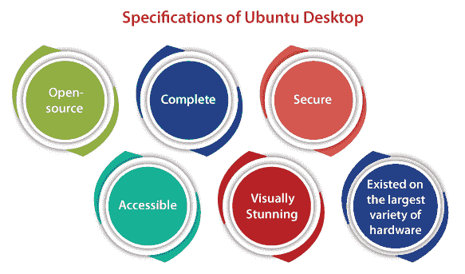
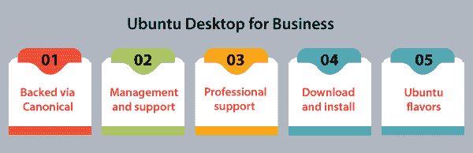
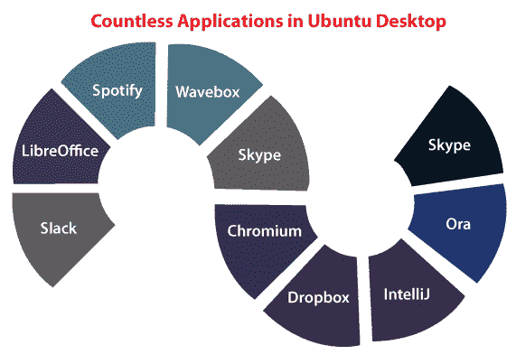

# Ubuntu 台式机

> 原文：<https://www.javatpoint.com/ubuntu-desktop>

Ubuntu 桌面是一个开源操作系统，为世界各地的几台笔记本电脑和个人电脑提供动力。

## Ubuntu 桌面的规格

1.  **开源:** Ubuntu 桌面一直都是可以自由分享、使用、下载的。我们信任开源软件的力量；Ubuntu 离不开其遍布全球的各种开发者社区。
2.  **Complete:** Ubuntu 提供了我们执行组织、企业、家庭或学校所需的一切。每一个必要的应用，如媒体、电子邮件、浏览器和办公套件应用都是预先安装的，还有更多的应用和游戏存在于 Ubuntu 软件中心。
3.  **安全:** Ubuntu 是目前最安全的操作系统，拥有病毒防护软件和内置防火墙。LTS(长期支持)版本为我们提供了 5 年的安全更新和补丁。
4.  **可访问:**计算对每个人都是可访问的，无论残疾、性别或国籍。Ubuntu 被完全翻译成 50 种语言，而且它还包括必要的技术。
5.  **视觉惊艳:** Ubuntu 凭借触摸屏支持和高清晰度，将我们的屏幕发挥到极致。20.04 版本的 Ubuntu 包括默认的 Yaru 主题以及集成的深色和浅色主题，从而使 Ubuntu 在保持其标志性感觉的同时带来了新的外观。
6.  **存在于最大的硬件种类上:** Canonical 与惠普、联想和戴尔密切合作，认证 Ubuntu 在他们的各种工作站和笔记本电脑上工作。这意味着 Ubuntu 的无缝体验开箱即用，硬件选择比以往任何时候都多。
    Ubuntu 在世界各地的各种数据中心中使用，它不仅仅用于桌面。它为所有类型的服务器提供动力，可理解性是迄今为止云中最著名的操作系统之一。

## 面向企业的 Ubuntu 桌面

### 通过 Canonical 支持

***Canonical Ltd*** 是一家全球软件企业，也是 Ubuntu 的顶级服务商。许多公司可以免费选择接受咨询、支持和专家培训，以继续改进 Ubuntu。

### 管理和支持

在 Canonical，Ubuntu 的优势是来自许多专家的专业支持包。我们可以获得 24*7 的支持，还可以利用我们问题的第一手经验联系各种工程师。

在我们的 Ubuntu 桌面上用于合规性、修补、管理和监控报告的系统管理和环境工具。

### 专业支持

Canonical 为管理我们的 Ubuntu 桌面、服务器部署和云提供专业支持。

### 下载和安装

我们可以下载 Ubuntu 桌面，并更改我们当前的操作系统。它很容易在苹果操作系统或视窗系统上为每个人安装，或者用它执行 Ubuntu。

### Ubuntu 口味

所有风格的 Ubuntu 都提供了一种体验 Ubuntu 的特定方式，以及由 Ubuntu 更新和软件包档案支持的不同的默认设置和应用选择。

## 组织中的 Ubuntu 桌面

Ubuntu 受到大小团队的支持，因为它高度安全，易于使用，应用种类繁多，拥有成本低。

### 所有必要的内置

1.  LTS 版本提供 5 年的安全更新和补丁
2.  只添加了必要的软件包，减少了安装时间和磁盘空间
3.  通过许可限制实现免费和开源
4.  与微软兼容的办公生产力套件
5.  提供现场培训和咨询服务
6.  完全翻译成百余种语言
7.  高度安全且无病毒

## Ubuntu 桌面中无数的应用

### 松弛的

Slack 是面向 21 世纪的团队对话应用

### 书店老板

这是一套与微软办公兼容的办公生产力。此外，Ubuntu 免费提供。

### Spotify

它用来免费流式播放我们最喜欢的专辑和歌曲。

### 波盒

Wavebox 是一个网络通信客户端，它将 Slack、Trello、O365、Outlook、收件箱和 Gmail 整合在一起。

### 网络电话

这是一项即时免费信息、视频或语音通话服务。

### 铬

这是一个安全、简单、快速的网络浏览器。它是为最新的网络开发的。

### 收纳盒

Dropbox 是全球最受欢迎的文件共享和云备份服务。

### Intellij

它是一个符合人体工程学的、有能力的语言统一开发环境，即***【Java】***。

### 奥拉

Ora 用于可视化团队协作和敏捷任务管理。它是我们团队的指挥中心。

## 为什么我们更喜欢 Ubuntu 桌面？

下面提到一些基本原因:

### Ubuntu 桌面是可靠性和安全性的巅峰

我们的 Ubuntu 桌面是以高安全性开发的，从我们安装它的那一刻起，它就是安全的，并且会一直如此，因为 Canonical 的安全专家团队将确保 Ubuntu 上的安全更新和补丁最初总是存在的。

### 通过认证硬件预安装

Ubuntu 台式机运行在来自联想、惠普和戴尔等众多合作伙伴的全球最佳硬件上。很容易检测出对我们的业务有用的硬件，并且 90%(接近)的计算机来自已经通过 Ubuntu 认证的主要计算机公司。

### 开发者的最爱

Ubuntu desktop 被世界上数百万的开发团队使用，仅仅是因为它拥有广泛的开发人员库、不断更新的特性、可靠性和多功能性。

Ubuntu desktop 是提高我们团队生产力的一个好方法，如果我们是开发人员，它保证了从开发到生产的顺利过渡。

### 最新的升级和更新

每两年都会有一个新的 LTS 版本的 Ubuntu 桌面。此 LTS 版本支持 5 年。将有定期的安全修复和其他复杂的更新，这将是免费的。

## Ubuntu 桌面的特点

我们可以享受 Ubuntu 直观界面的完整性。它安全、快速，有许多应用可供选择。Ubuntu 桌面包含了我们想要做的所有事情所需的东西。

### 整个应用的世界

Ubuntu 桌面提供了数百万个可供下载的应用。有些应用是免费的，只需点击几下鼠标即可安装。Ubuntu 桌面支持的一些流行应用如下所示:

### VLC 选手

其他视频播放器不兼容各种不同格式的文件。

### 火狐浏览器

现在，火狐量子比 Chrome 轻 30%，快 2 倍。

### 铬

这是一个安全、快速、简单的网络浏览器，是为最新的网络而创建的。

### 原子

这是一个 21 世纪的文本编辑器。

### 电报

这是一个安全、快速的桌面消息应用。它与我们的手机完美同步。

### PyCharm

它方便了我们对 Python 进行高效编码所需的每一个工具。

### 办公软件

使用 LibreOffice 软件，我们可以在 Ubuntu 上制作演示文稿、电子表格和专业文档。这个软件是一个兼容微软办公的办公套件(开源)。

这意味着我们可以打开和更改文件，如 PowerPoint 演示文稿、Excel 电子表格和 Word 文档，并与任何用户一起轻松快速地分发它们。另外，我们可以直接从桌面应用谷歌文档。

### 电子邮件

Ubuntu 桌面附带了著名的电子邮件应用 Mozilla 和雷鸟，所以我们将有更快的桌面访问我们的电子邮件。不管我们使用的电子邮件服务是 IMAP、POP、Hotmail、Gmail 还是微软交换，电子邮件只起作用。

### 网页浏览

Firefox 和 Ubuntu 再次让网页浏览成为一种享受，这种享受以安全性和速度著称。此外，Ubuntu 支持 Chrome 浏览器和其他可以与 Ubuntu 软件中心一起安装的浏览器。

### 照片

Ubuntu desktop 提供了免费的应用来帮助我们共享、编辑、管理和欣赏我们的照片，无论我们用什么来拍摄它们。我们不需要额外的驱动程序来支持手机和相机的启动和运行。

### 图解和编辑

我们可以用 Ubuntu 软件中心提供的工具(如 Krita 和 Gimp)编辑我们的照片或制作专业的设计和插图。

### 整理我们的照片

我们可以使用 Shotwell 轻松快速地查看、编辑、组织和导入我们的图片。我们还可以在所有著名的社交网络和照片网站上分享我们的照片。

### 录像

在 Ubuntu 上，我们可以使用浏览器欣赏高清视频。我们也可以在快照商店中使用 OpenShot、VLC 和默认媒体播放器。我们可以使用 kdenlive 或快捷键编辑我们的电影，然后使用媒体播放器欣赏它们。

### 赌博

从数独到第一人称射击游戏，我们有几款游戏会让我们忙碌很长时间。有数以百万计的游戏呈现给 Ubuntu，标题来自 Steam 和 Unity 平台。从广受好评的书籍中选择，如《边疆》、《全球攻势》、《反击》、《克尔巴空间计划》和《Dota 2》。

### 开源操作系统

Ubuntu 桌面的代码在开发周期中是公开共享的。开发人员和团队对他们未来版本的计划是透明的，所以作为原始设备制造商、硬件制造商或开发人员，他们与所有人合作，现在就开始创建 Ubuntu 系统和应用。

## 面向所有开发人员的 Ubuntu 桌面

Ubuntu desktop 是理想的平台之一，无论我们是移动应用的开发者、工程经理、视频或音频编辑，还是有许多大规模模型要执行的商业分析师，事实上，每个人都需要一个强大的系统来完成我们的工作。

## Ubuntu 桌面用于开发

Ubuntu 桌面对开发至关重要的原因有很多。下面提到了其中的一些:

1.  Ubuntu desktop 提供了一条更快的途径，通过开发过程部署到云、服务器、移动或桌面上。
2.  它拥有最好、最广泛的库和工具。
3.  Snap Store 中提供了各种最著名的生产力应用，如 Discord、Telegram、Skype 和 Slack。
4.  Ubuntu 桌面有 IDEs JetBrains 套件和 Visual Studio Code 的快照(官方)。
5.  它有现成的英伟达图形处理器的支持，可以轻松进行人工智能开发和游戏。
6.  它提供惠普、联想和戴尔提供的经过验证的人工智能和开发人员工作站和笔记本电脑，可获得预装的无缝 Ubuntu 体验。
7.  它是轻量级的，可以在 VMIdeal 中运行，也可以在从数据挖掘到各种大规模商业建模的所有资源密集型平台上运行。
8.  研究表明，有经验的开发人员(66%)更喜欢 Ubuntu 桌面，而不是其他桌面。

**我们和 Ubuntu 桌面**是好伙伴

Ubuntu desktop 因其广泛的开发人员库、不断更新的方面、可靠性和多功能性而被全球数百万开发团队使用。

Ubuntu 是提高我们团队生产力的好方法之一，如果我们是开发人员的话，它保证了从开发到生产的顺利过渡。

Ubuntu desktop 是从数据中心到云和 IoT 的部署和开发方面最著名的开源操作系统。

## Ubuntu 21.04 桌面的特性

Ubuntu 桌面的 21.04 版本有许多功能，如下所述:

1.  这个 Ubuntu 桌面有 5.11 版本的 Linux 内核。
2.  它有一个默认的和重新设计的黑暗 GNOME 外壳主题，即 Yaru。
3.  在 Yaru 主题中，这个 Ubuntu 桌面有 MIME 类型的图标。
4.  它有韦兰，这是一个默认的显示服务器，同时提高了性能和安全性。
5.  在 21.04 Ubuntu 桌面中，目录的主动集成被添加到安装程序中。
6.  它开发了人工智能以及新的动力模式。
7.  它包括一个选项，即所有加密安装的恢复密钥。
8.  此桌面有一个私人主目录。
9.  它有 3.38.5 版本的 GNOME Desktop、87 版本的 Firefox、3.9 版本的 Python 和 7.1.2 版本的 LibreOffice。

## Ubuntu 20.04 桌面的特性

20.04 版本的 Ubuntu 是最新的长期支持版本。此版本包含支持最新硬件的几种开发人员技术和核心应用的新版本。

Ubuntu 桌面 20.04 LTS 版的一些重要特性如下:

1.  这个 Ubuntu 桌面有 5.4 版本的 Linux 内核。
2.  它拥有反应最快的 GNOME 桌面，默认运行 3.36 版本。
3.  全新的 Yaru 深色主题为 Ubuntu 桌面提供了全新清新的外观。
4.  此桌面版本改进了活动概述中应用、壁纸和无线网络组的设置。
5.  它通过系统设置直接在黑暗和光明环境之间切换。
6.  它支持 ZFS 作为我们的根文件系统和 zsys，以及自动快照和快照之间的前滚、后滚和系统快照。
7.  它包括著名网络浏览器的最新版本。

现在，这款 Ubuntu 桌面开箱即用，由 nVIDIA 硬件支持。

### 开发人员需要的每一种工具

无论我们的团队使用 Java、Node.js、Ruby 还是 Python，没有一个操作系统比 Ubuntu 桌面更容易修复。我们的开发人员所需要的一切都只是一个很好的选择。

此外，如果我们希望为 Ubuntu 发布应用，Snapcraft 可以支持我们接触到最新 Ubuntu 版本和其他著名发行版的每个用户。使用 Snapcraft，很容易构建和发布快照，因为它支持通过源和现有包进行构建。

从快照开始很容易，它提供的工具结构清晰，有助于采用。我们发现 Snapcraft 很方便，因为它基于***【YAML】***并方便了关于需要什么类型工件的信息。

### 使用 Snapcraft 更新、分发和打包应用

所有快照都是一些应用，这些应用都打包了各自的依赖项，以便在一个构建中运行每个著名的 Linux 发行版。它们会自动更新并优雅地回滚。很快，发布将让客户了解最新情况，降低系统配置问题的可能性，让我们无论是为物联网、云还是桌面构建，都可以少调试、多编码。

Snapcraft 可以被描述为一个开源工具，用于发布快照，并通过我们现有的构建语言或所选的工件(无论是 Go、Python、)进行挑选。NET、Node.js 或 C/C++。我们可以在 20 分钟内在快照存储中构建并发布我们的第一个应用。

## 快照的特征

下面列出并提到了捕捉工具的一些重要功能:

### 物联网和 Linux 的一种构建方式

Snap 适用于所有版本或发行版的 Linux。它捆绑了我们的资产和依赖。此外，它将安装简化为一个标准命令。快照可以在 Linux 的每个主要发行版上使用，包括 Fedora、Debian、Linux Mint 和 Ubuntu。

以下是一些预装快照的发行版:

1.  KDE 霓虹灯
2.  佐伦·OS
3.  大多数 Ubuntu 口味
4.  仿生海狸(Ubuntu 18.04 LTS)
5.  焦点窝(乌班图 20.04 LTS)
6.  Ubuntu 21.04 和 Ubuntu 20.10
7.  Solus 3 及以上版本
8.  曼哈罗

以下是一些没有预安装 snap 的发行版:

1.  佐伦 os *
2.  徐邦图
3.  Ubuntu*
4.  Solus
5.  Rocky Linux
6.  红帽企业版 Linux (RHEL)
7.  覆盆子皮操作系统
8.  爸爸！爸爸！_ 操作系统
9.  鹦鹉安全操作系统
10.  大蜥蜴
11.  曼哈罗*
12.  卢班图
13.  Linux 作为
14.  库班图
15.  KDE 霓虹灯*
16.  Kali Linux
17.  加里乌莫斯
18.  一种男式软呢帽
19.  基本操作系统
20.  一种自由操作系统
21.  CentOS
22.  Arch Linux

### 向成千上万人展示

对于应用发现，Ubuntu 桌面和其他著名发行版的首页通过 Snap Store 上的一个列表超越了我们现有的用户。

### 衡量用户的增长

我们可以在 Ubuntu 桌面中做出决定(数据驱动)和安装度量。观看尽可能多的自动更新，并将用户迁移到我们的最新版本。它通过版本和地理细分了解我们的受众。

## 对于开发者，由开发者

Ubuntu desktop 是数百万开发人员的各种贡献的结果，他们的动机是渴望创建他们完美的开发人员平台。这就是为什么它被世界上一些最令人兴奋的公司使用，也是为什么 Valve 决定将其最著名的 Steam 虚拟游戏商店移植到 Ubuntu 的原因。

此外，Ubuntu 桌面通过 x86 到 ARM 在许多架构上运行，也通过 OpenStack 到 EC2 和 Azure 在云环境中运行。这种多功能性使 Ubuntu 桌面成为拥有不同硬件基础设施的企业的最佳选择之一。

### Ubuntu 认证桌面

世界上许多最大的个人电脑制造商都在 Ubuntu 认证台式机。

下面提到了一些经过认证的台式机:

| 种类 | 模型 | 小贩 |
| 桌面 | 戴尔沃斯特罗 3670 | 幽谷 |
| 桌面 | 戴尔沃斯特罗 3671 | 幽谷 |
| 桌面 | 戴尔沃斯特罗 3681 | 幽谷 |
| 桌面 | 戴尔沃斯特罗 3881 | 幽谷 |
| 桌面 | 戴尔沃斯特罗 3888 | 幽谷 |
| 桌面 | 惠普 280 G5 微型动力电脑 | 大功率(High Power)ˌ高压(High Pressure)ˌ高性能(High Performance)ˌ高聚物(High Polymer) |
| 桌面 | 惠普 285 G3 微型动力电脑 | 大功率(High Power)ˌ高压(High Pressure)ˌ高性能(High Performance)ˌ高聚物(High Polymer) |
| 桌面 | 惠普 400 G6 台式迷你电脑 | 大功率(High Power)ˌ高压(High Pressure)ˌ高性能(High Performance)ˌ高聚物(High Polymer) |
| 桌面 | 惠普一体机 22-c042la/22-c041la | 大功率(High Power)ˌ高压(High Pressure)ˌ高性能(High Performance)ˌ高聚物(High Polymer) |
| 桌面 | 惠普一体机 22-c042la/c043la | 大功率(High Power)ˌ高压(High Pressure)ˌ高性能(High Performance)ˌ高聚物(High Polymer) |
| 桌面 | 英特尔公司 | 英特尔公司 |
| 桌面 | 联想 ThinkCentre M75q Tiny | 联想（电脑的品牌名） |
| 桌面 | 联想 P340 塔式机 | 联想（电脑的品牌名） |
| 桌面 | Lenovo p430 SFF | 联想（电脑的品牌名） |
| 桌面 | 联想 ThinkCentre EPC300 | 联想（电脑的品牌名） |
| 桌面 | 联想 ThinkCentre M60e | 联想（电脑的品牌名） |
| 桌面 | 联想 ThinkCentre M60e Tiny | 联想（电脑的品牌名） |
| 桌面 | 联想 ThinkCentre M70 TOWER/SFF/TINY | 联想（电脑的品牌名） |
| 桌面 | 联想思维中心 M70aAIO | 联想（电脑的品牌名） |
| 桌面 | 联想 ThinkCentre M70a-第二代 | 联想（电脑的品牌名） |

## 轻松部署

在部署的简单性和速度方面，Ubuntu 桌面没有受到任何影响。

在桌面上获得任何改进的服务，并在云中或服务器上执行它，这种方法很有效。此外，Ubuntu 改进了 Juju，这是一个服务编排工具，它减少了运营团队和开发人员之间经常繁琐的交接。此外，它可以大大加快这个过程。

## 根据开发人员的需求定制的支持

我们可以用 Ubuntu 景观和优势来标准化我们的开发者工作站。它帮助我们管理报告、补丁、安全和更新，同时减少停机时间。它为我们的开发人员提供了他们想要的自由，同时保持了我们需要的控制。

* * *