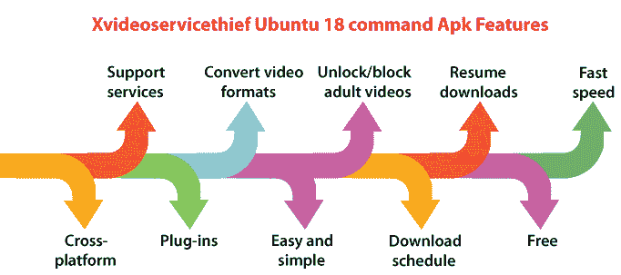
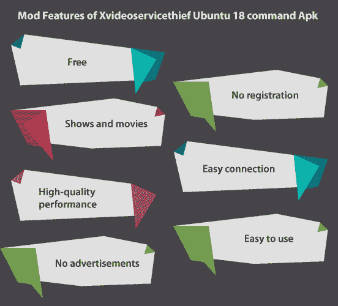
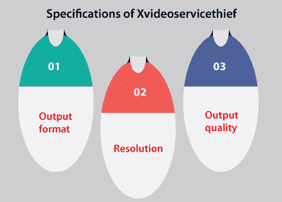
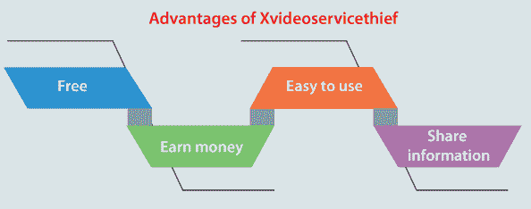
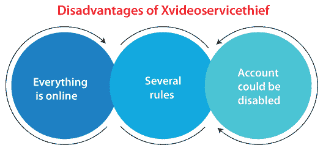

# X videoservicethief 贼人 Ubuntu 18 命令

> 原文：<https://www.javatpoint.com/x-videoservicethief-ubuntu-18-command>

大多数人利用时间欣赏和下载视频。然而，在一些 Ubuntu 系统上下载视频很难。因此，有一个专门为我们的 Ubuntu 系统设计的应用。它将使下载我们喜欢的视频变得容易。一个这样的应用是 xvideoservicethief 贼人 Ubuntu 18 命令 Apk。它很容易安装在系统上，因此任何人都可以轻松下载。

大多数情况下，使用 Ubuntu 系统的人会选择几个命令从不同的平台下载视频。这个应用很容易使用，我们可以轻松地使用它来下载我们喜欢的视频并创建我们的收藏。xvideoservicethief 贼人 Ubuntu 18 命令是一个非常有帮助和免费的软件程序，让用户使用互联网下载视频。

*   该软件程序始终允许我们使用不同的视频网站(如 Vimeo、DailyMotion、YouTube 和其他网站)将视频下载到我们的个人库中，以供进一步查看。
*   这是一个开源的移动软件，适合那些对在手机上下载应用的精彩视频感兴趣的用户。它很容易使用，我们只需点击一下，就可以使用 xvideoservicethief 贼人 Ubuntu 18 命令下载许多视频。
*   与其他应用不同，它可以处理多个下载，并忽略错误和中断。此外，该软件程序可用于将 MP3、3GP、MP4、WMV、MPEG2、MPEG1 和 AVI 等格式转换为下载视频。
*   xvideoservicethief 贼人 Ubuntu 18 命令有印尼语、日语、英语和其他 15 种国际语言版本，PC、iOS 和 Android 的所有用户都可以为自己的手机下载。

### xvideoservicethief 贼人 Ubuntu 18 命令的一些规范如下所述:

*   开发者:Xesc & Technology
*   语言:英语
*   版本:2.5.1
*   大小:10.50 兆字节
*   许可证:免费软件
*   系统:安卓
*   更新:2020 年 5 月 13 日

## x 视频服务小偷 Ubuntu 18 命令功能

xvideoservicethief 贼人 Ubuntu 18 命令的一些重要方面解释如下:

*   它是跨平台的(Mac OS X、Linux 和 Windows)。
*   它支持各种服务(谷歌视频、YouTube 等)。
*   它基于插件。
*   它可以将视频转换成基本格式。
*   xvideoservicethief 贼人 Ubuntu 18 命令的界面简单易行。
*   它与几种类型的网站一起工作，在那里我们可以免费下载许多视频。
*   它可以用于转换格式，如 MP3、3GP、MP4、WMV、MPEG2、MPEG1 和 AVI。
*   它在下载过程中为我们提供了非常快的速度，因为它可以通过多个文件下载一个文件。很容易，我们可以继续不完整的下载。
*   此外，还包括一个选项，即取消阻止或阻止成人视频和网站。
*   它提供了一个选项，即下载时间表，这意味着我们可以在不使用系统时下载任何视频。因此，我们可以安排任何我们希望通过系统下载的视频。
*   下载的视频将自动保存到我们系统中我们希望保存它们的位置。我们可以通过这个软件程序欣赏下载到电脑上的视频。
*   最好的是我们可以阻止孩子看成人视频。这个应用包含一个禁用的方面，我们可以用它来阻止我们的孩子观看成人视频。
*   此外，我们可以节省下载时间，因为我们可以选择从不同的网站同时下载视频。因此，我们可以轻松地使用该系统下载电影和视频。
*   该应用包括其他几个有趣的功能，如恢复下载。因此，即使下载过程完成，我们也可以继续使用它们。
*   我们的系统不支持几个视频，因此该应用将帮助我们将下载的视频转换为不同的格式。这是一个功能，可以支持用户下载每一个媒体支持的视频。

## X videoservicethief 贼人 Ubuntu 18 命令下载安装过程

*   下载后在我们的设备上搜索下载文件。
*   找到文件后选择它。
*   按下按钮，即安装或下载。
*   然后，打开软件程序并注册。
*   跳转到首页，经过以上步骤我们就可以使用了。

## 如何使用 xvideoservicethief 贼人 Ubuntu 18 命令下载视频

基本上，xvideoservicethief 贼人 Ubuntu 18 command Apk 2021 和 2020 Bangladesh 面向 Ubuntu 用户，他们发现安装和下载视频是一项复杂的任务。

Ubuntu desktop 是一个命令提示操作系统，但是支持去掉软件。每个用户需要做的是在他们的系统上安装软件，然后开始从他们选择的平台下载视频。我们需要按照以下步骤下载视频:

*   打开应用，按下选项，即 ***输入网址。*** 在这个字段中，我们可以输入来自 ***DailyMotion、YouTube、脸书、*** 等的任意网址。
*   之后，按下 ***确定*** 选项开始下载过程。下载完成后，下载的视频将保存在指定的位置。
*   我们只需要一个我们希望使用该应用下载的网址。

## Xvideoservicethief 贼人 Ubuntu 18 命令的目的

该应用可用于在 Vimeo、BitChute、YouTube 和 50 多个视频共享环境中下载视频。我们需要将选定的视频链接粘贴到 Xvideoservicethief 贼王应用中，然后按“下载”按钮。视频将在后台下载，下载完成后我们会得到通知。

## 谁会从 Xvideoservicethief 贼王中获利？

在 YouTube 和同样的视频分享环境中，有几个人喜欢基于内容和基于内容对其他人的内容进行一些评论。如果我们希望制作其他人制作的内容的评论视频，那么我们拥有对该内容的完全授权。

我们可以使用任何带有 xvideoservicethief 贼王的视频分享网站免费下载和修改任何内容。但是，我们不建议我们将内容重新上传或窃取到任何网站，无论其名称如何。这可能会导致我们的账户被挂掉。

包含在内，任何喜欢内容(在线)的人都可以稍后离线观看内容。它将非常适合和方便航空旅行和长途旅行。此外，如果我们不希望通过互联网断开连接时过度使用数据，这也很有用。有几个人使用 Xvideoservicethief 小偷应用，并面临缓慢的互联网和网络连接。但是有了 Xvideoservicethief 贼王，我们可以免费下载很多我们需要的视频，直接从我们的系统中观看，而不会出现流、缓冲或延迟的问题。

## Xvideoservicethief 小偷的功能

Xvideoservicethief 小偷包括一个方便的拖放选项。该功能允许我们在下载过程中保留 Xvideoservicethief 贼王，并使其在不中断其他任务的情况下执行。该功能使应用易于使用，并且在多任务处理过程中功能多样。

我们需要复制我们希望下载的视频网址，然后将其粘贴到我们的下载列表中。我们可以指示 Xvideoservicethief 贼人应用立即下载它，或者等到我们准备好下载视频集合时再下载。

它的好处是，我们可以在执行其他任务时下载，而不必单独启动所有步骤。我们可以在状态栏中查看所有下载的进度。

## Xvideoservicethief 贼人 Ubuntu 18 命令 Apk 的 Mod 特性

1.  我们可以免费下载。
2.  我们不需要自己注册。
3.  它有最好的节目和电影收藏。
4.  它有一个牢不可破和容易的联系。
5.  它提供高质量的性能。
6.  它的界面简单易用。
7.  它不包含广告。
8.  这么多其他功能

## 在安卓手机上安装 Xvideoservicethief 贼人 Ubuntu 18 命令 Apk

1.  我们可以通过按下 ***上方的按钮“开始下载”来下载程序。*** 下载过程结束后，我们会在浏览器的 ***【下载】*** 一个版块内搜索 APK。在安装设备之前，我们需要确保设备上允许第三方应用。
2.  大多数情况下，步骤类似如下，以使其成为可能。我们需要遵循标准，即 ***【菜单】>【设置】>【安全】>*** 并查看未知来源，以便我们的设备可以使用谷歌 Play 商店以外的来源安装应用。
3.  当我们完成上述步骤后，我们可以在浏览器中进入 ***【下载】*** 部分，然后在下载时点击想要的文件。将出现一个安装请求，确认许可，我们可以完成安装步骤。
4.  安装过程完成后，我们现在可以像往常一样使用软件程序。

但是，在使用此应用时要小心。连接速度可能会显著降低，并且一些视频可能不会像其他视频那样快，因为有多个视频正在排队等待下载。

这个软件程序提供了一个功能，允许我们转换下载到系统的视频格式。这个过程很容易完成，我们只需要遵循下面提到的一些步骤:

**第一步:**在下载的队列中添加一个视频后，我们可以在主界面屏幕上选择右下角内侧的框。我们可以通过选择此选项来禁用或启用自动转换。

**第二步:**我们需要跳转到更多选项来配置该转换输出的格式。此外，它位于界面的右下角。

**第三步:**每个转换参数都显示在主选项窗口内，标记为 ***“基本”。*** 同样，我们可以在此时禁用或启用自动视频转换。

**步骤 4:** 从输出的格式中选择所选的视频输出格式。

**第五步:**在这一步中，我们将从音频的采样率选项中修改音频的质量。

**第六步:**同样，我们可以修改生成文件的质量，以便在修改格式时维护、缩小和放大文件。后者直接影响转换后视频的大小。

**第 7 步:**我们最后需要检查最后一个选项，它允许我们在转换过程完成后移除实际文件。

#### 注意:请记住，它将以实际格式而不是新格式下载，因为新格式将在以后生成。

在 MP3、3GP、索尼 PSP、苹果 iPod、MP4 高清、MP4、MPEG2、MPEG1、WMV 和 xVideoServiceThief 支持的输出格式中，必须打印出来。

## 如何使用 xVideoServiceThief 贼王添加视频？

我们需要选择一个按钮，即主界面右上角的 ***【添加视频】*** 用***xvideoservice 贼王下载视频。*** 按此按钮打开弹出窗口。我们会在右上角贴上一个图标，指出我们所属的网络( ***Metacafe，Vimeo，YouTube，*** ...).只需点击 ***同意*** 即可开始下载相关视频。

众所周知，它是许多视频流网站(包括成人内容中的页面训练)最兼容的软件程序，因此我们可以添加许多来自不同来源的视频。

虽然，我们需要了解的是，我们可以根据需要使用***【xvideoservice 贼王】*** 应用调整视频的输出格式等参数进行下载。为此，我们需要为视频的复选框选择一个选项，即 ***覆盖原始转换*** 。当选择时，窗口会增大以提供其他选项。

## xVideoServiceThief 贼王的规格

下面列出并解释了 xVideoServiceThief 小偷软件程序的一些规范:

1.  **输出格式:**我们可以选择其他手机设备应用的格式，如 MP3、PSP 或 iPod、智能手机、MPF、MPEG、WMV 和 AVI。
2.  **分辨率:**我们可以在实际分辨率和多个分辨率之间进行选择，以适合我们的项目或想法。
3.  **输出质量:**我们可以从原始、低或高视频和音频质量中进行选择。此外，我们可以从各种视频和音频速率中进行选择。因此，如果我们希望在一个简单的过程中同时下载多个视频，我们可以应用旧的选项来下载所选的视频以及多个下载支持。

我们可以使用这个软件程序下载视频，使用许多多媒体内容网站和多种网站。此外，我们可以将所有格式转换为我们选择的格式。它是一个与庞大的在线流媒体服务和视频兼容的下载客户。它目前支持 90 多个不同的网站。

虽然，这个数字在一天天扩大。

我们需要指出包含 Metacafe、LiveLeak、DailyMotion、Google Video、YouTube 的网络，以及可以下载视频的网络之间的成人内容。此外，除了 Linux 版本之外，xVideoServiceThief 贼王应用还可以在 Windows 和 Mac 等其他平台上下载。

此外，视频下载客户端可以将所有下载的视频转换为下面提到的一些格式，包括音频。我们也可以使用视频提取声音。

*   MP3 文件
*   3GP
*   MP4
*   野型腮腺炎病毒
*   影片格式
*   MPEG1
*   MPEG2

xVideoServiceThief 小偷应用的大部分成功在于几个可用的方面，这使得使用许多网站下载内容非常方便。

当我们不在系统附近时，我们仍然可以安排视频下载时间。

*   它支持同时下载。
*   它能够暂停和恢复下载过程。
*   我们不必访问特定的网站，因为这个软件程序提供了内置的视频搜索工具。
*   我们可以直接拖放下载面板中的任何链接。
*   它会自动更新。
*   它在任务栏中有控制图标和快捷图标。
*   我们可以下载登记表。
*   它支持 14 种不同的语言。
*   它提供儿童保护。
*   还有，我们可能见过**T1【xvideoservice 贼王】T3【被称为 ***xVST。*** 是常用于谈论视频下载这个软件程序的缩略词。**

这是一个消耗很少资源的快速软件程序。它同样可以在互联网上几乎每一个可用的网络上执行，而不会引发几个问题。当它们触发问题时，可能会被阻止，但它们不太常见。

互联网的连接越来越好。

在没有手机数据计划的情况下，找到一个可以浏览我们互联网的免费 Wifi 连接并不复杂，但各种用户仍然使用这种程序下载视频。他们喜欢通过聊天应用和移动消息分享和发送，就像 Whatsapp Messanger 一样。

很明显，它不是这类程序中唯一一个替代 xVideoServiceThief 应用的程序，如 Tube Catcher、WinX YouTube 下载器 Peggo 和 YTD 视频下载器。所有这些软件程序都可以用马拉维达下载。

## xVideoServiceThief 贼王的优势

1.  **免费**
    在 xVideoServiceThief 贼王上观看和上传视频完全免费。它给了我们体验和发现它是否为我们实现的机会，而不必担心任何成本。
2.  **为我们提供了利用视频赚钱的机会**
    有了 xVideoServiceThief 贼王，我们可以为自己的浏览量赚钱。我们将需要在谷歌上有一个 AdSense 账户来使用我们的视频赚钱。
3.  **好用**
    xvideoservice 贼王软件程序对我们来说很好用，即使我们没有任何与电脑相关的技能。
4.  **分享信息**
    我们可以用较少的时间，用 xVideoServiceThief 贼王给几个人分享一笔不错的信息量。此外，我们可以以一种令人惊叹的方式分享信息。它可以通过以下形式完成:
    1.  **视频动画**
    2.  **喜剧小品**
    3.  **音乐**
    4.  **视频**

## xVideoServiceThief 小偷的缺点

1.  **一切都在线**
    xvideoservice 小偷应用是一个在线媒体环境。这意味着人们不需要为看到我们发布的视频付费。任何人也可以发布任何可能导致版权问题的视频，并且可能存在侵犯隐私的问题。
2.  **几条规则**
    xvideoservice 贼王和其他公共社交媒体网站一样，有几条规则限制我们可以做什么。因此，每当我们使用这种应用时，我们都需要遵守条款和条件。
3.  **我们的账户可能被禁用**
    如果我们违反了 xVideoServiceThief 贼王的规则，那么我们的账户可能被禁用。如果:
    我们正在使用的内容仅限于我们在 xVideoServiceThief 应用上创建帐户时需要同意的社区指南和条款&条件，则可能会出现这种情况。
    如果复制某人视频的创意或创建不符合&条件的视频，我们的帐户可能会被禁用。
