# Ubuntu 游戏

> 原文：<https://www.javatpoint.com/ubuntu-games>

有几个游戏是免费的应用，将在 Ubuntu 上本地执行。此外，也有仿真器可以在视窗或经典游戏控制台上执行各种游戏。无论我们喜欢射击游戏还是纸牌游戏，都有适合我们的东西。

每个游戏都是 Linux Ubuntu 的原生版本，这将在下面的章节中讨论。这意味着要么在存储库中有一个 Ubuntu 包，要么通过第三方呈现。

这些部分之间的差异产生了一个问题，即许可。Ubuntu 的理念是，使用 Ubuntu 分发的每个应用都是开源和免费的。

## Ubuntu 游戏列表

Ubuntu 中一些最受欢迎的游戏如下所示:

### 1.Dota 2

***Dota 2*** 是乌班图最著名的 ***MOBA*** 游戏。是一款 ***多人战略游戏。*** 它为电竞 ***电竞*** 提供了一个向往游戏玩家的绝佳机会。

这个游戏完全免费玩。虽然，它单独促进了战斗通行证。如果我们希望获得额外的奖励和完全可选的功能，但有时如果我们想享受 Dota，这仍然是令人兴奋的。

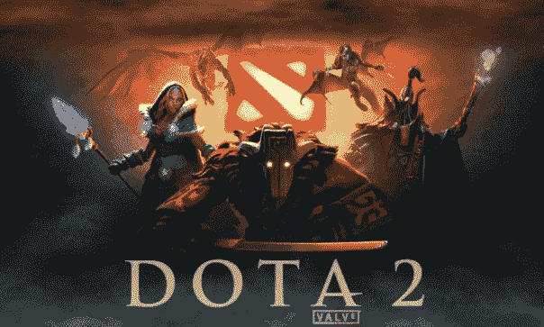

### 2.战雷

这是一款颇具 ***戏剧性的二战再现*** 游戏。《战雷》是一款***【MMO】***游戏(跨平台)，处理来自 ***冷战*** 和 ***世界大战 2 的舰载机、装甲车和航空。***

完全不同，这是对冷战时期的*和二战时期的*的不同看法，集中在所使用的作战车辆的范围上。这可能只是一个普通的多人游戏。然而，它仍然珍惜游戏中图形的最佳细节。**

**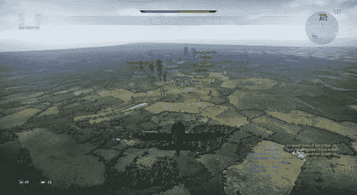

### 3.团队堡垒 2

这款游戏是目前为 Linux 推出的最古老的多人射击游戏*。 ***【团队堡垒 2】***游戏虽然发布在 ***2007*** 上，但依然包含了相当不错的玩家基数，这也让它成为了十大常玩的 steam 游戏之一。*

 *它仍然会定期更新内容。因此，我们不应该感到无聊。这款游戏有几种游戏模式，也让我们可以使用多种武器来创建和定制我们的角色。如果我们想知道的话，这并不是一个双赢的项目，它只是普通的化妆品商品，必须包含对我们性格的个人接触。

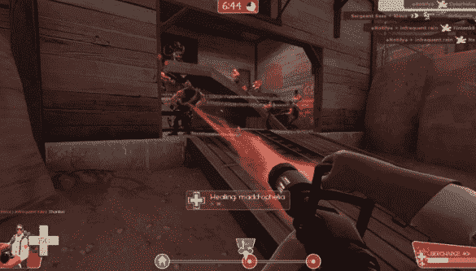

### 4.钓鱼星球

顾名思义就是 ***一款我们可以在线玩的 ***第一人称多人钓鱼*** 再现游戏。*** 这个游戏并不适合所有人，但是如果我们是一个钓鱼者或者我们只是虚拟地希望享受钓鱼，那么它一定是我们必须安装的东西。

钓鱼星球是一个非常常见的复制游戏，带有令人愉快的图形细节，为第一人称提供了很好的体验。我们不需要为基础游戏支付任何费用，但是我们可以在 Steam 上获得许多可选的*DLC。*

*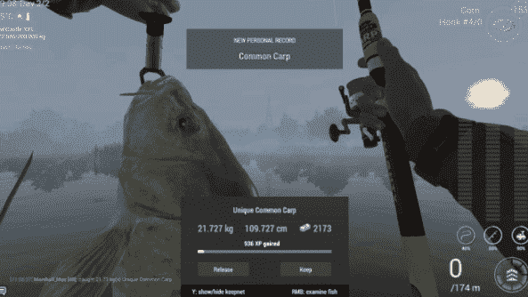

### 5\. 专用

这是一款***【MMORPG】***游戏，是所有动漫迷都想玩的 ***基于网格的*** 。它是一款 ***免费、有趣、*** 以及 ***在线动作 RPG 游戏*** 里面包含了幽默烘焙。这款游戏提供了 18 个不同的职业可供选择，无论我们选择什么角色，一切都依赖于它。

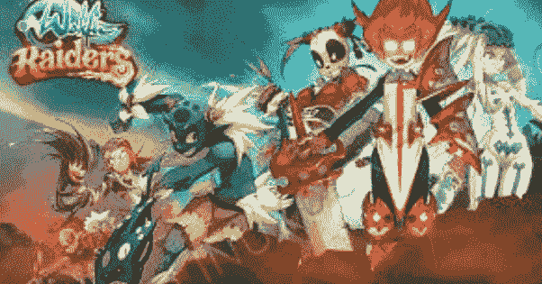

### 6.机械人

如果我们希望玩一个完全 ***定制的战斗机器人游戏。*** 它使我们能够根据自己的喜好设置自己的机器人战斗车辆，可以 ***飞行、行走、悬停、*** 或 ***驾驶*** 。一系列未来武器可供选择，这将使战斗更加有趣。这是我们应该尝试的现代 Linux 免费游戏之一。

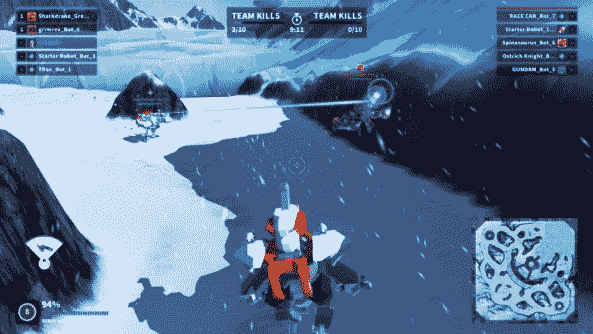

### 7.明星冲突

大概， ***【星际冲突】*** 是一款很棒的 Linux 游戏之一，如果我们希望一款 ***动作驱动的太空再现游戏。*** 它可以是这类事情的最佳游戏。大规模来说，这是一款同时拥有***【PVE】***和 ***PVP 的多人游戏。*** 我们只需要留在外面，确定与敌人交战的最佳方案。

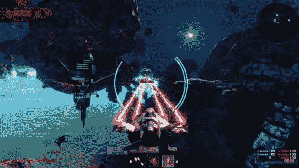

## 8.大脑/输出

这是一款带有后苏联背景的 ***2D 射手多人*** 游戏。我们还可以定制游戏的加载和进度，利用各种强大的记忆武器来击败我们的敌人。

***【BRAIN/OUT】***无疑是 Steam 上目前最棒的 Linux 游戏之一。

### 9.冒险资本家

对于我们的 Linux 系统来说，没有比冒险资本家更好的资本主义模拟器了。我们可以投资、倍增、吸引各种角度的投资者，为我们的企业助力。我们可以雇佣经理，也可以在我们离开后保持企业的稳定。

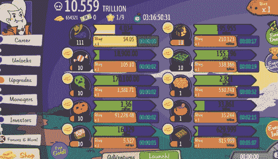

### 10.狂野西部传奇:无所事事的大亨

它围绕着整个狂野西部展开，在这里，我们通过创办许多企业并为企业找到更多机会，获得了成为十亿美元的机会。

我们收集的专利卡越多，它就越能通过新的升级和城镇来支持我们的业务。

### 11.地狱不再有空间

如果我们是真正喜欢动作游戏的玩家，我们肯定会喜欢僵尸射手游戏。这款游戏是一款 ***僵尸射手游戏*** (第一人称)，我们不需要在 Steam 上支付任何费用。

《地狱无间道》不是一款典型的 FPS 游戏，但也有恐怖游戏的感觉(比如经典的***【Left 4 Dead】***游戏，对于 Linux 来说是不存在的)。

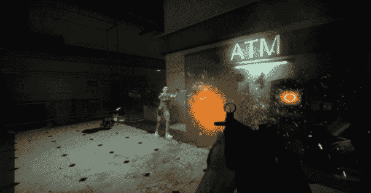

### 12.死亡迷宫

死亡迷宫是另一个有趣的 2D 游戏，但是里面有僵尸。我们需要设计 ***救生物资、扫气、*** 和 ***监控生命值*** 为资源留下僵尸启示录。这款游戏是多人游戏，我们需要加入并与其他玩家合作才能在天启中生存。

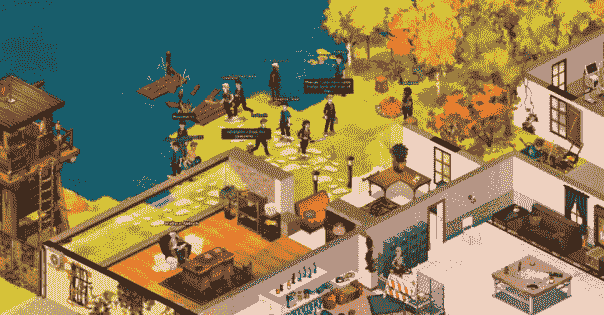

### 13.令人敬畏的人

这是一款基于英雄的侧滚 2D MOBA 游戏，令人印象深刻。毫无疑问，这是我们建议尝试的 Linux 免费游戏之一。我们可以在线加入玩家，也可以在本地分屏播放。

如果说我们喜欢***【2D 动作片】*** 那么***awesome nautes***就不错了。

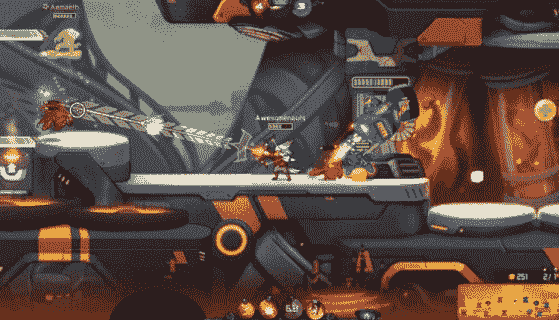

### 14.国王的要求:解剖和生理游戏

它是一款通用的 ***2D 冒险游戏*** ，测试我们对运动、健康科学、药学、护理学、Biomed、医学、解剖学、生理学、生物学和科学的概念，以及人体知识。

所有准确的答案都引导我们赢得并拯救帝国。如果我们得到一个错误的答案，我们将不会得到任何负面的分数。

### 15.粪便

这是一个惊人的纸牌游戏，我们需要在史诗般的战斗中打击我们的敌人。我们可以参加竞技/休闲多人游戏，也可以玩单人游戏。它不像其他卡牌游戏那样使得 ***【仙灵】*** 成为 Linux 上最好的免费游戏之一。

### 16.认知者

***【认知者】*** 是 ***谜题*** 的特定游戏，用颜色和符号挑战我们的大脑。为了让事情变得更容易，我们可以固定时间限制，也可以删除它。

### 17.坦克部队

如果有人正在寻找一款可以在线玩的坦克射手游戏，Linux 中的 ***【坦克部队】*** 游戏是我们 Steam 库的一个相当不错的补充。

这个游戏促进了很多独特的坦克，我们需要解锁，因为我们的水平。从世界各地，我们也可以加入几个争夺权力的玩家。

它为 ***跨平台 10v10 (PvP)*** 战斗以及一系列战斗竞技场和战斗模式提供支持。

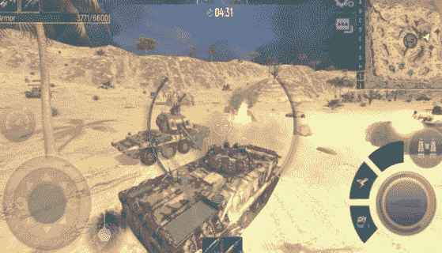

### 18\. 托里Bash

我们可以在线玩 ***是一款独特的 ***回合制挣扎游戏*** 。*** 在这里，我们有能力设计自己的招式。我们可以完全控制我们角色的身体，有数百种力量游戏模式。

如果我们在寻找独特和原创的东西，那么 ***【托里Bash】*** 可能是一个很好的选择。

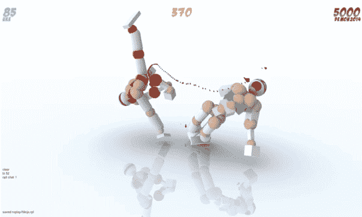

### 19.神的锻造

这是一款 ***多人卡牌程序游戏*** ，在游戏中我们需要尽可能多地聚集和指示野兽，并集合它们进行战斗。我们甚至能够混合不同种类的生物来对传奇战士进行分类。此外，它还提供了 ***boss 战斗*** 。

### 20.枪支世界:枪支拆解

这是另一个惊人的游戏，使我们能够探索各种各样的枪支。此外，还包括组装/拆卸这些枪支。

### 21.海盗:加勒比海狩猎

我们可以从史诗般的战斗中扬帆起航，并因成为无可争议的船长而被捕。海盗游戏有几个机会，我们只需要搜索它们。

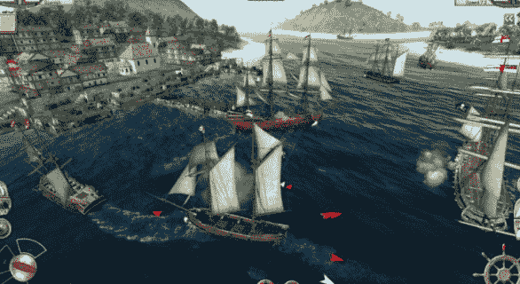

### 22.维斯诺斯之战

这个游戏是免费的，基于回合的计划，开源的。我们可以选择单独玩这个游戏或者加入多人游戏。我们必须保护我们的王国。

我们甚至可以选择沿着冒险的道路去追捕隐藏的恶魔。我们可以在线上玩****线下玩*** 威诺斯之战 。它会给我们一个 ***地图编辑器。*** 我们可以不带任何谜团来到这里。*

*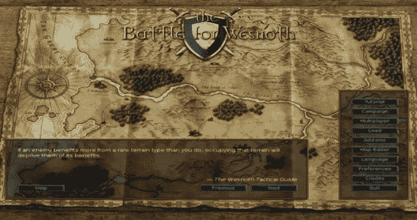

### 23.强心剂

这是一款 ***竞技场快节奏射手游戏。*** 很有可能，如果我们在 Linux 中错过了很多像 Quake Champions 这样的游戏，我们就会喜欢上这款游戏。 ***异界*** 提供了一个相当戏剧性的武器集合，将决定我们在竞技场内的命运。它是不需要 Steam 的 Linux 的伟大游戏之一。我们可能从这个游戏中得到不同种类的弹药和武器。

如果我们喜欢手臂游戏，那对我们来说是个不错的选择。它具有多玩家和单人两种选择。我们将从这个游戏中找到一套地图、火力弹药和模式。

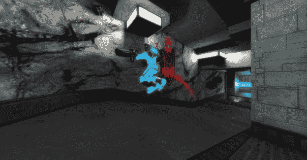

### 24.哇哦！d .非政府组织

这是一款实时、开源、免费的策略游戏。 ***OA。*D**处理古董福利。独立游戏日报的一个开发团队发布了游戏的新 Alpha 版本(最新版本是 23 号)。

我们可以在游戏中下载 mod 来增强我们的游戏性。它包括游戏情节中的文明。然而，所有的文明并不是彼此相同的。

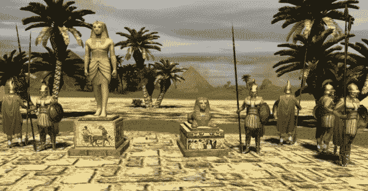

### 25.CAYNE

***CAYNE*** 是一款 ***恐怖点击冒险游戏*** 我们无需付费即可使用***GOG.com***网站下载。它为一些价格提供了额外的可选内容。然而，我们不会要求这样，除非我们喜欢这个游戏。

### 26.秘密马利欧编年史

***《秘密马利欧编年史》*** 是一款 ***超级马里奥免费敲竹杠游戏*** 各有特色。它是 2D 最有趣、最受欢迎的 ***侧滚游戏之一。*** 这个游戏并没有被积极维护，但是我们可以试一试。

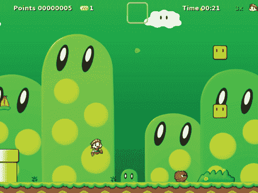

### 27.城市恐怖

这是一款多人免费 FPS 游戏，有相当多的活跃玩家(取决于我们的位置)。在某种程度上， ***【城市恐怖】*** 与一个游戏有关，即 ***反击 1.6。*** 然而，如果我们有一些朋友一起玩得很开心。

### 28.超级 Tux 卡丁车

如果有人喜欢卡丁车赛车游戏，比如任天堂的马里奥卡丁车或者移动平台的沙滩童车闪电战，我们一定会喜欢这款游戏。这是一个超级简单的游戏，有许多优化的控制来操纵我们的卡丁车和比赛。

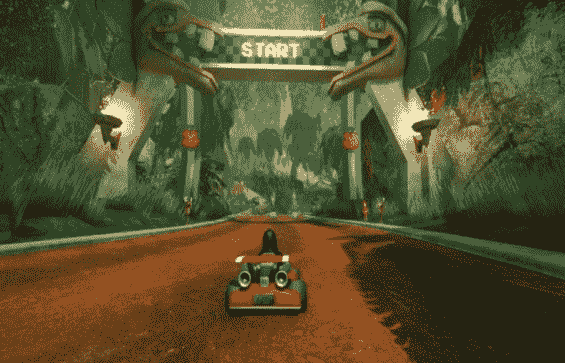

### 29.突击立方体

有点像游戏，即***countertrike 1.6。*** 这款游戏是一款相当不错的 ***FPS 多人游戏*** 如果我们服务器内有足够的玩家。总的来说，这不是一个伟大的 FPS 多人游戏，但它仍然是令人愉快的。

整个游戏设置在一个立方体引擎下，与其他游戏相比更加逼真。我们还可以看到快速的手指运动，他们的弹药战斗，以及其他一切在他们的感觉是真实的东西。

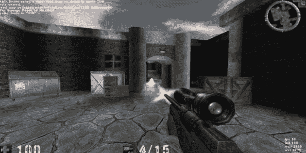

### 30 .对冲战争

***【树篱战】*** 是一款回合制且搞笑的策略游戏。它以 ***粉色刺猬为特色。*** 是集火炮、动作、策略、喜剧为一体的套装。这款游戏是大家都可以玩的 Linux 的最爱之一，非 steam，免费游戏。

一场比赛最多可以有八名球员一起比赛。

一般来说，**刺猬战**玩家被称为**突击队**，收集刺猬后前往战斗区。这场运动让**树篱大战**变得更加有趣。所有开发人员都在根据人们的喜好更新**和**。

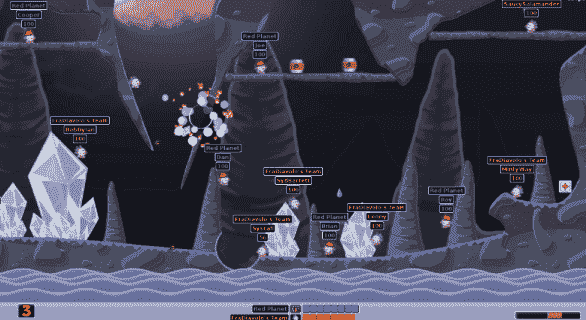

### 31 .瓦尔索乌

这是一款经过深思熟虑的 ***FPS 游戏。*warsow**是一款独特又有趣的游戏。它甚至有一个不和服务器，我们可以加入并搜索其他玩家一起享受。它基于卡通般的环境场景。

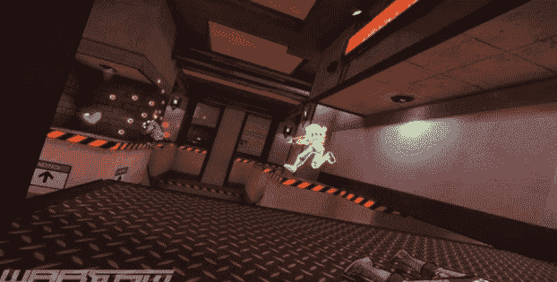

### 32.外星人竞技场:火星勇士

***异形竞技场*T3】是一款 ***射手的死亡竞赛游戏。*** 我们会看到这款游戏负载着惊心动魄的系列和动作题材。我们需要在当前的温暖中做好准备，因为时间过得太快了。**

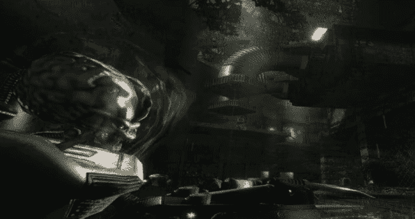

### 33\. 免费活动

***FreeCiv*** 是一款建立帝国且持久的战略游戏。它是目前最具人类文明和可玩性的游戏。它为我们提供了拥有丰富的人类文明未来的机会。我们可以从石器时代开始，带着人类走向最好的未来。

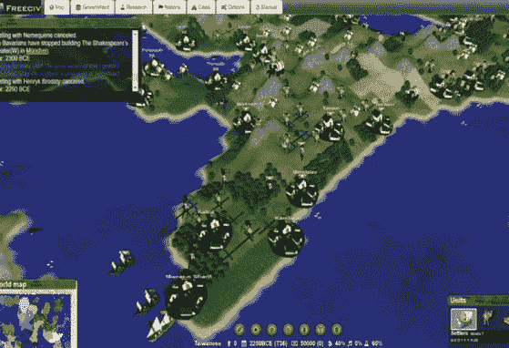

* * ******