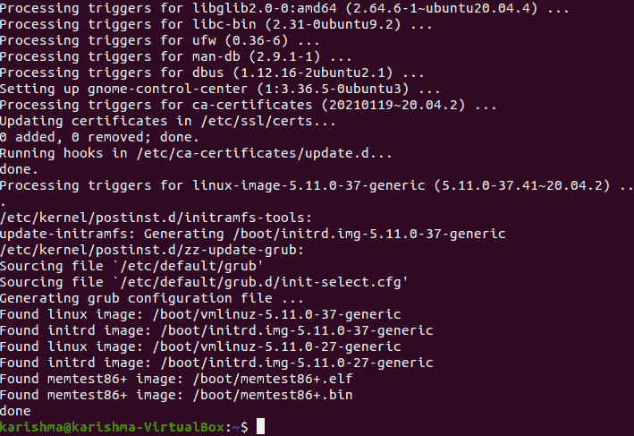
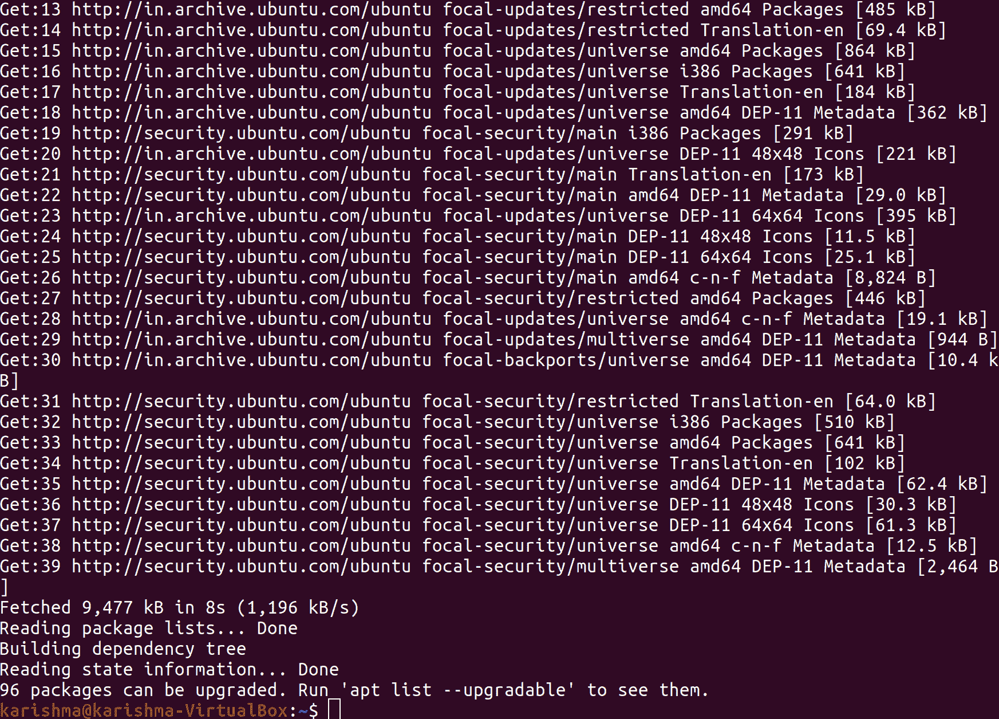
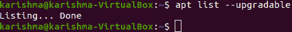

# Ubuntu 更新命令

> 原文：<https://www.javatpoint.com/ubuntu-update-command>

Linux Ubuntu 是基于 Linux 内核和 GNU userland 的开源免费操作系统。Ubuntu 因其易用性而广受欢迎。它在服务器和台式机上都很有名。人们可以在终端 bash shell 的帮助下更新 Linux Ubuntu。如果我们是一个新用户，并使用 Linux Ubuntu 几周或几天，那么我们可能会想知道如何更新我们的 Ubuntu 系统，以进行应用升级、错误修复和安全补丁。

了解更新 Ubuntu 很重要，不是所有的发行版都以类似的方式管理更新过程。事实上，一些发行版在应用于包管理的文件类型上明显不同。

*   Debian 和 Ubuntu 使用。黛比
*   Slackware 使用档案，即。tgz，包括预构建的二进制文件
*   Mandriva、SuSE 和 Fedora 使用。每分钟转数
*   此外，还有从预编译或源代码安装。包装或。bin 文件。

Linux Ubuntu 已经成为 Linux 每个发行版中最著名的。我们应该能够从更新任何系统的过程中准确地判断出是什么情况。Ubuntu 具有非常用户友好的特性。Ubuntu 应用了两种不同的工具来更新系统。

下面将提到这两个工具:

*   图形用户界面工具(更新管理器)
*   命令行工具(apt-get)

## 图形用户界面工具(更新管理器)

几乎，更新管理器是一个 100%自动化的工具。我们不需要定期检查使用此工具是否有任何可用的更新。相反，我们将知道更新是可用的，因为更新管理器会在我们的桌面上打开，只要更新依赖于它们的类型:

*   每周更新(非安全性)
*   每日更新(安全性)
*   如果我们希望手动检查更新，那么我们可以通过单击系统菜单的管理子菜单，然后选择更新管理器的条目来完成。然后，单击一个按钮，即检查更新管理器打开时是否有可用的更新。

## 命令行工具(apt-get)

现在，让我们讨论一下更新系统的命令行工具。一个系统，即 Ubuntu 包管理，被称为 apt。这是一个非常强大的工具，可以完全使用命令行管理我们系统的包。

使用命令行工具的一个缺点是，要检查我们是否有更新，我们需要手动运行它。

本文适用于 18.04、20.04、pr 其他版本的 Ubuntu。此外，命令行的方法对于那些基于 Ubuntu 的发行版是有效的，比如基本操作系统、Linux Lite 和 Linux Mint。

## 第一种方法:用命令行更新 Ubuntu

我们需要按照以下步骤更新我们的 Ubuntu 系统:

*   在 Ubuntu 桌面上，我们需要打开我们的终端或命令行窗口。
*   我们可以使用快捷键 Ctrl+Alt+T 或者在菜单中找到它。
*   如果我们登录了任何 Ubuntu 服务器，我们已经可以访问命令行了。
*   我们只需要在终端中输入以下命令:

```

$ sudo apt update && sudo apt upgrade -y

```

它会提示输入密码。我们可以输入我们账户的密码。当在终端内输入密码时，我们在屏幕上看不到任何字符。因此，继续输入密码并按回车键。它将更新我们 Ubuntu 系统中的所有包。

让我们解释一下上面提到的命令。它实际上不是一个命令，而是两个命令的合并。符号，即&&是一种在 Ubuntu Linux 中运行多个命令的方式，其中只有当第一个命令成功运行时，第二个命令才会执行。

最终，***-【y】***会自动输入 ***【是】*** 同时***【apt 升级】*** 命令会在去安装更新之前询问我们的配置。

#### 注意:另外，我们可以单独使用上述命令，一个接一个:

```

$ sudo apt update

```



而且，

```

$ sudo apt upgrade

```



这需要时间，因为我们需要等待一个命令完成，然后输入第二个命令。

***重要提示:**与 Windows 不同，Linux OS 使用包管理器工作。当我们执行更新时，它会更新 apt 安装的每个包。这意味着更新 Ubuntu 会更新使用**软件中心**(如果这些是 apt 包)或 **apt 命令安装的 Linux 内核、核心操作系统和应用。***

### sudo apt 更新说明

***sudo apt update*** 命令将更新现有包的数据库(本地)。如果我们不执行此命令，数据库(本地)将不会更新，并且我们的系统将无法理解何时有任何更新的软件包版本可用。执行命令时会在结果中看到几个 URL，即***“sudo apt update”。*** 命令将通过各自的存储库获取包的信息。

它会告诉我们有多少包可以升级。我们可以通过执行下面提到的命令来查看包:

```

apt list -upgradable

```



### sudo apt 升级说明

该命令，即***【sudo apt 升级】*** 会将已安装的软件包版本与数据库(本地)进行匹配。它将收集它们中的每一个，然后，它将列出包含可用新版本的包。如果我们希望在此时将软件包(已安装)升级到新版本，它将会提示。

我们可以输入***【y】【是】*** 或者直接点击确认更新安装的回车键。因此，底线是***【sudo apt 更新】*** 将检查包的新版本的存在，而***【sudo apt 升级】*** 命令安装新版本。

更新这个词可能会令人困惑，因为我们可能会期望命令，即***【apt update】***通过安装更新的软件来更新计算机，但这不是它的工作方式。

## 第二种方法:使用图形用户界面更新 Ubuntu

作为一个桌面，如果我们正在使用 Ubuntu，那么我们不需要去命令行/终端更新系统。尽管如此，我们仍然可以使用终端/命令行，但它对我们来说是可选的。

*   搜索 ***【软件更新程序】*** 选项，并在菜单中执行。
*   它会检查我们的系统是否有更新。
*   如果有任何可用的更新，它将为我们提供安装更新的选项。
*   点击 ***【立即安装】*** 选项。它可能会提示我们输入密码。
*   一旦我们输入密码，它就会开始安装更新

在少数情况下，我们可能需要重新启动我们的 Ubuntu 计算机，以便更新(已安装)正常工作。如果我们需要重新启动系统，我们会在更新完成时通知您。

如果我们不想立即重启系统，可以选择稍后重启。

#### 注意:当软件更新程序出现错误时，我们必须在终端中使用“sudo apt update”命令。结果的最后几行将包含原始错误消息。然后，我们可以找到这个错误的互联网并解决问题。

## 更新 Ubuntu 时需要记住的要点

我们只学习如何更新我们的 Ubuntu 系统。另外，如果感兴趣的话，我们应该了解 Ubuntu 更新对应的一些要点。

### 更新后清理系统

我们的系统可能有一些不重要的包，在更新后就不再需要了。我们可以通过输入命令来删除这类包并释放空间。该命令如下所述:

```

$ sudo apt autoremove

```


### 实时修补 Ubuntu 服务器内的内核以忽略重启

在 Linux 内核更新的情况下，我们需要在更新后重新启动我们的系统。如果我们不希望我们的服务器停机，这可能是一个问题。

该功能，即*允许 Linux 内核在运行时打补丁。换句话说，我们不需要重启系统。*

 *如果我们管理服务器，我们可能希望在 Linux Ubuntu 中启用实时补丁。

## 版本升级不同于软件包升级

这里讨论的更新方法使我们的 Ubuntu 安装保持更新和新鲜。它不包括操作系统的版本升级(比如将 16.04 版本升级到 18.04 版本的 Ubuntu)。

Ubuntu 版本的升级完全是另一回事。它们包括更新操作系统的整个核心。在开始这个漫长的过程之前，我们需要进行适当的备份。

* * **