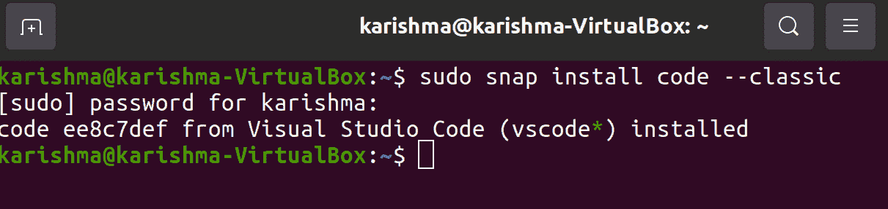
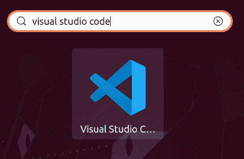
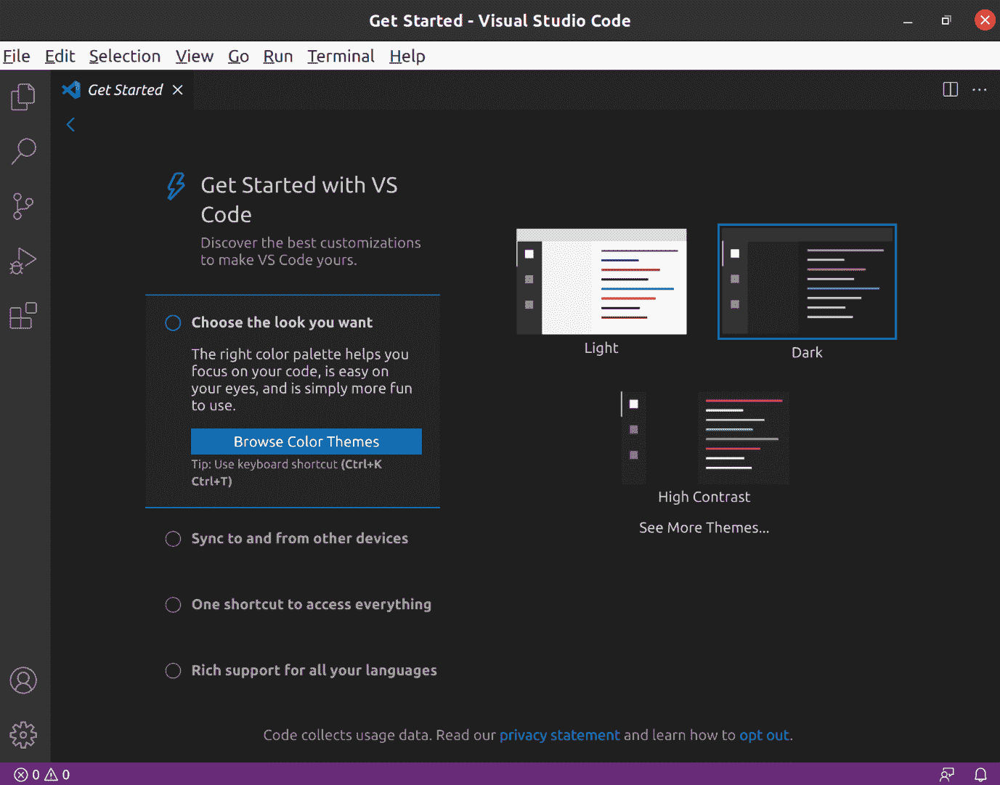

# Ubuntu 的 vscode

> 原文：<https://www.javatpoint.com/vscode-for-ubuntu>

## 什么是 vscode

**vscode** 是 **Visual Studio Code** 的简称。通过**微软开发的**开源**是一个强大的**代码编辑器**。Visual Studio Code** 包含**内置支持**用于调试、代码片段、代码重构、集成终端、代码补全、语法高亮和嵌入式 Git 控件。 **Vscode** 为**跨平台**，在 **macOS、Linux** 和 **Windows** 上均有提供。

我们可以使用**微软存储库**将 **vscode** 安装为 **deb 包**，或者使用 **Snapcraft 商店**安装 **snap 包**。此外，我们可以选择最适合我们环境的安装方法。

在 Ubuntu 系统上安装 vscode 的推荐且最简单的方法是建立 vscode 存储库，并使用命令行或终端安装 vscode 包。

*   Visual Studio 代码的跨平台特性是其声明的主要部分，因为如果交换平台，开发人员不需要更改工具或研究新的用户界面。
*   **vscode** 的所有功能几乎对每个用户都可用，无论其操作系统的功能如何，如集成终端、嵌入式 Git 控制、智能自动完成、语法高亮和调试。
*   此外，编辑器还包括对 Node.js、TypeScript 和 JavaScript 等语言的强大支持。
*   丰富的扩展集合也可用于其他类型的语言，如 Go、PHP、Python、Java、C#和 C++，以及运行时，如 Unity 和. Net

在本文中，我们将展示在 Ubuntu 的 **20.04** 版本中安装 **vscode** 的两种方法。

## 安装 vscode(使用 Snap 包)

**微软**在**规范**的 **Snapcraft 商店**上提供了一个**官方 vscode Snap 包**。Snap 是包含执行应用程序所需的二进制依赖关系的软件包(独立的)。每个快照包都很安全，易于升级。我们可以在命令行或 Ubuntu 软件应用程序的帮助下安装这些快照包。

我们需要打开应用程序，即 **Ubuntu 软件**，使用 **Ubuntu 软件应用程序**找到名称为**【Visual Studio Code】**的 **vscode** 。如果我们更熟悉命令行，那么我们可以使用终端并执行以下命令:

```

$ sudo snap install code -classic

```



这就是我们在系统上安装 **vscode** 所需要实现的。不用担心未来的更新，因为有更新版本的 **vscode** 可以在我们使用电脑时自动下载并安装在后台。

## 安装 vscode (deb 包)

**微软**为 Linux 用户管理一个 apt 存储库，用于使用该存储库安装 **vscode** 。我们可以通过终端或命令行手动添加 **vscode** 的 apt 存储库。然而，在我们的计算机上修复它的一个更快的方法是使用应用程序的网站下载并安装 Visual Studio Code Linux 包。作为安装过程的一部分，apt 存储库将被添加到软件源列表中。

下载完成后，我们需要进入**下载**的文件夹(或者我们选择保存安装程序的位置)，然后双击。黛比文件。Ubuntu 软件将会打开。之后，按下**“安装”**按钮。

当更新版本发布时，我们可以用 Ubuntu 的**软件更新工具**更新 **Visual Studio Code** 的包(以及我们拥有的其他更新)。

## 安装 vscode (Flatpak)

如果我们的系统上安装了 **Flatpak** (或 **Flathub** )，那么我们可以使用 **Flathub** 安装 **Visual Studio Code** 的软件包。Ubuntu 不支持 **Flatpak** 。我们将不得不安装软件包，即 **gnome-software** 以及图形用户界面安装。

#### 注意:Visual Studio 代码的 Flatpak 不是由微软管理的。

## Visual Studio 代码(打开)

在 Ubuntu 系统上打开 Visual Studio Code，我们只需要在 **Ubuntu Dock 底座**上按下图标，即**‘Applications’**(或者按下 **super** 键)。在搜索栏中开始输入**“Visual Studio Code”**，然后在应用程序图标出现时按图标打开应用程序。



我们只需要使用命令行执行打开应用程序的代码。

然后，我们可以自由地安装 Visual Studio Code 的扩展，自定义用户界面，并享受所提供的大量功能。要启用模式，即 ***【双窗格】*** ，我们需要按下靠近标签栏的***“[|]”***图标。



* * *