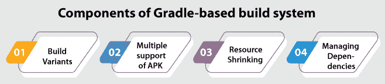
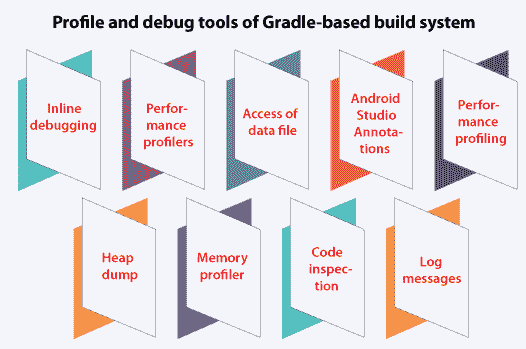
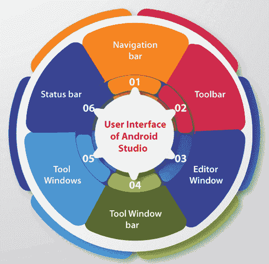
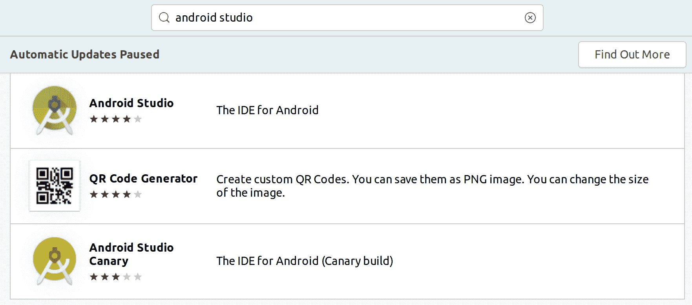
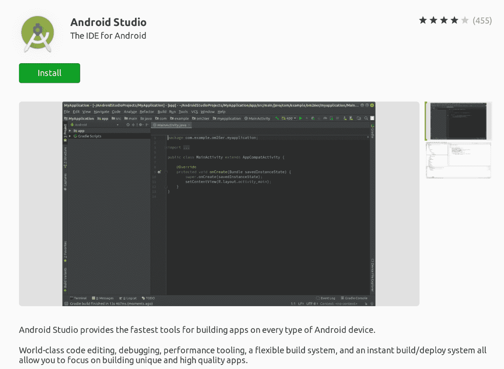
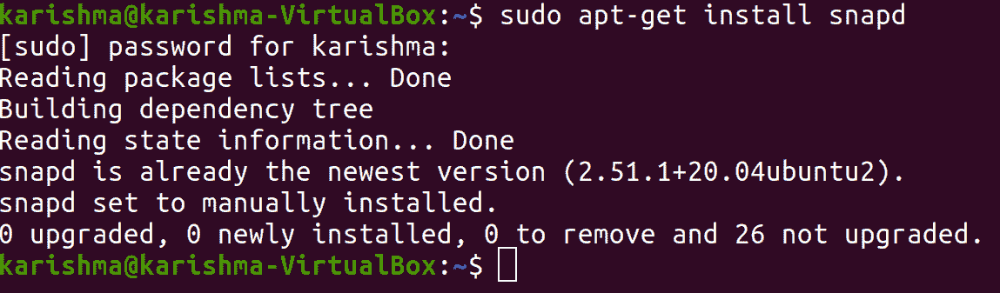
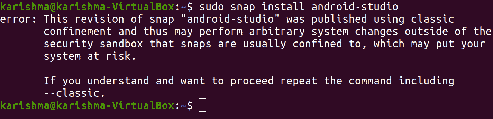
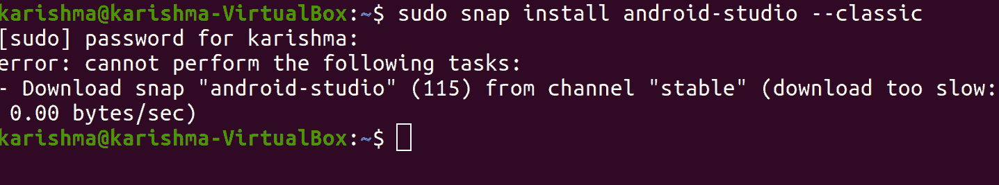
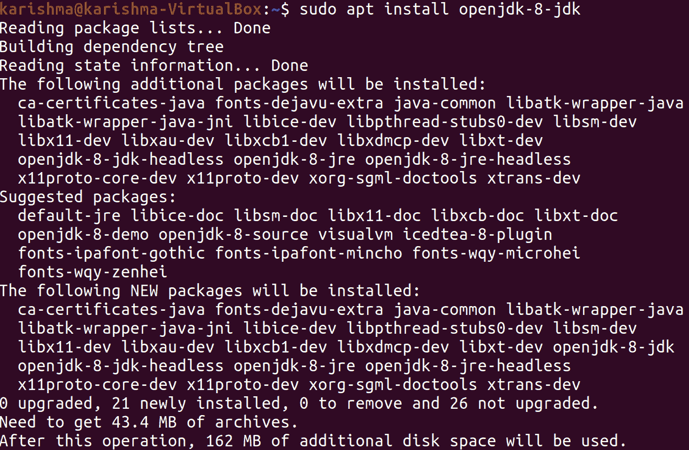
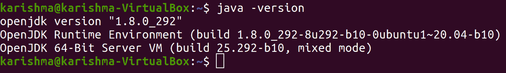

# Android Studio Ubuntu

> 原文：<https://www.javatpoint.com/android-studio-ubuntu>

## 安卓工作室是什么？

***安卓工作室*** 是一个 ***官方 IDE(IDE)*** ，用于开发基于 ***IntelliJ IDEA 的安卓应用。*** 在 ***IntelliJ 强大的代码编辑器之上，Android Studio 提供了更多方面，可以在创建 Android 应用时提高我们的工作效率。***

下面提到其中一些方面:

*   形成性构建系统(基于梯度)
*   功能丰富且快速的仿真器
*   我们可以为每个安卓设备开发的统一平台
*   应用修改，将资源更改和代码推送到我们正在运行的应用，而无需重新启动我们的应用
*   广泛的测试框架和工具
*   用于捕捉性能、版本兼容性、可用性和其他问题的 Lint 工具
*   NDK 和 C++支持
*   对谷歌云平台的支持(内置)，试图让其方便整合谷歌云的应用引擎和消息

## 安卓工作室项目结构

安卓工作室的所有项目都会在 ***安卓工作室的 ***视图*** 中显示我们项目的文件。*** 视图由模块协调，用于快速访问我们项目的关键源文件。每个构建文件在顶层的 ***【梯度脚本】*** 下可见，应用的所有模块都包含文件夹。这些文件夹是:

*   **res:** 它包含每个非代码资源，如位图图像、UI 字符串和 XML 布局。
*   **java:** 包含 JUnit 测试代码等 java 的源代码文件。
*   **清单:**包含文件，即 ***和***

在磁盘上，安卓工作室的项目结构通过展平表示而不同。我们需要使用项目下拉菜单选择项目，以查看原始项目文件结构。此外，我们可以定制项目文件的视图，以专注于我们的应用开发的特定功能。

***例如，*** 选择我们项目的视图，即 ***问题*** 将显示源文件的许多链接，包括任何已识别的语法和编码错误，如布局文件中缺少 XML 的元素结束标记。

通过应用 ***【梯度灵活性】*** 我们可以在不改变我们应用的核心源文件的情况下实现其中的每一个。安卓工作室创建的文件被称为 ***build.gradle.*** 这些文件是纯文本文件，应用 Groovy 语法来配置 gradle 的安卓插件提供的构建元素。

所有项目都有一个适用于整个项目的顶层构建文件，并隔离所有模块的模块级构建文件。当我们导入一个可用的项目时，安卓工作室会自动生成强制构建文件。

## 什么是基于梯度的构建系统？

***安卓工作室*** 将 ***渐变*** 作为 ***构建系统的基础*** 以及通过 ***安卓插件为渐变提供的更具体的安卓兼容性。*** 构建系统从 Android Studio 的菜单和终端或命令行独立作为一个合并工具执行。我们可以使用这个构建系统的各个方面来完成以下工作:

*   扩展、配置和定制构建过程。
*   为我们的应用建立一个以上的 APK，以及使用类似模块和项目的不同方面。
*   跨源代码集重用资源和代码。

## 基于梯度的构建系统的组件

### 构建变体

构建系统可以支持我们使用一个项目建立相似应用的不同版本。当我们既有付费版本又有免费版本的应用时，或者如果我们希望在 ***谷歌 Play 上为不同配置的设备分发一个以上的***【APK】***时，这很有帮助。***



### APK 的多重支持

对***【APK】***的多重支持让我们能够高效地创建多个基于 ABI 或屏幕密度的 APK。 ***例如，*** 我们可以为***【mdpi】***和 ***hdpi*** 屏幕密度创建任何应用的不同 APK，甚至仍然检查它们的一个变体，并允许它们共享用于测试 APK、ProGuard 设置、dx 和 javac。

### 资源萎缩

在 ***安卓工作室，*** 资源收缩通过我们的库依赖和包 app 自动删除未使用的资源。 ***例如*** 如果我们的应用正在使用 ***谷歌 Play*** 的服务来访问 Google Drive 的功能，而我们目前没有使用 ***谷歌登录，*** 资源收缩可以删除该按钮的几个可抽取资产，即 ***登录按钮。***

### 管理依赖关系

我们项目的许多依赖项在文件中用一个名称来描述，即***build . Gradle .***Gradle 将负责查找我们的依赖项，并使它们在我们的构建中可用。我们可以在我们的文件中声明模块的依赖关系、远程二进制的依赖关系、本地二进制的依赖关系，即 ***build.gradle.*** 默认情况下，Android Studio 可以使用 Maven Central 的资源库来配置项目。此配置被添加到项目的构建文件(顶层)中。

## 配置文件和调试工具基于渐变的构建系统

并协助我们调试和增强代码的性能，包括性能分析工具和内联调试。



### 内联调试

我们可以应用*内联调试来增强调试器视图内的代码遍历以及变量值、表达式和引用的内联验证。*

 **   内联调试的信息包括:
*   工具提示值
*   运算符和 lambda 表达式
*   方法返回值
*   引用许多可以引用所选对象的对象
*   内联变量值

### 性能分析器

安卓工作室提供了性能分析器，因此我们可以轻松跟踪内存和中央处理器的使用情况，分析网络请求，优化图形性能，定位内存泄漏，并找到我们应用的解除分配对象。我们可以打开选项卡，即使用我们在模拟器或设备上运行的应用打开 Android Profiler。

### 堆转储

同时，当我们分析 Android studio 中的内存使用情况时，我们可以转储 Java 堆，并开始对特定于 Android 的二进制格式文件(HPROF)中的堆快照进行垃圾收集。

HPROF 的查看器显示类、引用树和所有类的实例，帮助我们发现内存泄漏并跟踪内存使用情况。

### 内存分析器

如果我们执行许多操作，我们可以使用内存分析器来跟踪内存分配，并查看对象被分配到哪里。了解这些分配使我们能够通过管理对应于这些操作的方法调用来优化应用的性能和内存使用。

### 数据文件访问

***安卓 SDK*** 的工具如***【logcat】******Systrace***生成调试和性能数据，完成 app 分析。我们需要打开工具窗口，即捕获，以查看可用的生产数据文件。

我们需要双击任何文件来查看生成的文件列表中的数据。我们需要右击任意文件，即 ***。hprof*** 用于将它们转换为标准文件格式，即 ***调查我们的内存使用情况。***

### 代码检查

安卓工作室自动执行配置好的 Lint 和其他类型的*IDE 检查，帮助我们轻松识别和解决问题以及代码的结构质量。*

 *Lint 工具可以检查我们 Android 项目的源文件的国际化、可访问性、可用性、性能、安全性、潜在的 bug 以及优化开发的正确性。此外，安卓工作室执行 IntelliJ 的代码检查，并验证许多注释，以简化包含在 Lint 检查中的编码工作流程。

### 安卓工作室注释

安卓工作室可以支持返回值、参数和变量的注释，帮助我们捕捉资源类型冲突和空指针异常等 bug。安卓软件开发工具包的管理器可以将支持注释库打包在安卓的支持库中，以便与安卓工作室一起应用。此外，安卓工作室可以在代码检查时验证许多配置的注释。

### 日志消息

如果我们使用安卓工作室构建和执行我们的应用，我们可以在 Logcat 窗口中检查 adb 输出和设备的日志消息。

### 性能分析

如果我们希望分析应用的网络性能、内存和中央处理器，我们需要通过选择 ***【查看】>工具窗口>安卓探查器*** 来启动安卓探查器。

## 安卓工作室的用户界面

安卓工作室用户界面的一些重要组件如下:



*   **工具栏:**它让我们可以进行各种各样的操作，比如启动安卓的工具和运行我们的应用。
*   **导航栏:**帮助我们导航到自己的项目，开始文件编辑。它给出了在窗口内部可见的更紧凑的结构视图，即 ***项目。***
*   **编辑器窗口:**这是我们构建和更改代码的地方。编辑器可以根据最新的文件类型进行修改。 ***例如，*** 编辑器显示 ***布局编辑器*** 如果查看布局文件。
*   **工具窗口栏:**它在IDE窗口的外部执行，包括允许我们展开或折叠单个工具窗口的按钮。
*   **工具窗口:**它让我们可以访问独特的任务，如版本控制、搜索、项目管理等。我们可以传播它们，瓦解它们。
*   **状态栏:**它显示 IDE 本身、我们的项目以及任何消息或警告的状态。

我们可以通过移动或隐藏工具窗口和工具栏来组织主窗口，以便在屏幕上给自己更多的空间。此外，我们可以使用键盘快捷键来访问 IDE 的几乎所有功能。

我们可以通过双击键，即***【Shift】***或按下安卓工作室窗口右上角的放大镜，在用户界面的组件、动作、数据库、源代码等中进行搜索。例如，当我们试图定位IDE中忘记如何触发的特定操作时，这可能非常有帮助。

### 工具窗口

安卓工作室追求我们的环境，并在我们工作时自动调出相应的窗口，而不是应用预设的视角。默认情况下，最常用的工具窗口固定在许多应用窗口边缘的工具窗口上。

*   为了扩展或折叠工具窗口，我们需要在工具窗口栏中点击工具的名称。此外，我们可以附加、分离、取消固定、固定和拖动工具窗口。
*   要返回到我们默认工具窗口的当前布局，我们需要选择**窗口>恢复默认布局**或者通过按**窗口>将当前布局存储为默认来定制我们的默认布局。**
*   为了显示或隐藏整个工具窗口栏，我们需要选择图标，即安卓工作室窗口左下角的窗口。
*   要定位特定的工具窗口，我们需要将鼠标悬停在窗口图标上，然后使用菜单选择工具窗口。

另外，我们可以使用键盘快捷键来打开工具窗口。

## 安卓工作室代码完成

Android studio 包含三种代码完成类型，我们可以使用键盘快捷键访问它们。

安卓工作室代码完成的几个键盘快捷键如下:

| 类型 | 说明 | Linux 和 Windows | 苹果个人计算机 |
| **基本完成** | 它显示了对表达式、方法、类型、变量等的基本建议。如果我们在一行中调用公共完成两次，那么我们会看到更多的输出，比如非导入的静态成员和私有成员。 | **Ctrl+Space** | **Ctrl+Space** |
| **智能完成** | 它显示了基于上下文的相应选项。数据流和预期类型都知道这种完成类型。如果我们连续两次调用这个完成，那么我们会看到更多像链一样的输出。 | **Ctrl+Shift+空格** | **Ctrl+Shift+空格** |
| **报表完成** | 它为我们完成了最新的语句，添加了缺少的大括号、括号、格式等。 | **Ctrl+Shift+回车** | **换挡+指令+输入** |

另外，我们可以通过点击 ***Alt+Enter 来显示意图动作和执行快速修复。*T3】**

## 在安卓工作室中查找示例代码

在安卓工作室中，代码示例的浏览器支持我们找到谷歌提供的高质量的安卓代码示例，这些示例基于我们项目中当前突出显示的符号。

### 航行

以下是支持我们跨安卓工作室的一些技巧:

*   借助一个动作在我们访问的文件(最近)之间切换，即 ***最近的文件。*** 我们需要点击 ***控制+E*** 调出 ***最近文件*** 动作。
*   借助动作查看当前文件的结构，即 ***文件结构。*** 我们需要点击 ***控制+F12*** 调出 ***文件结构*** 动作。
*   在一个动作的帮助下，导航到并搜索我们项目中的特定类，即 ***导航到类。*** 我们需要点击 ***控制+N*** 调出 ***导航到类*** 动作。
*   借助操作导航到文件夹或文件，即 ***导航到文件。*** 我们需要点击 ***控制+Shift+N*** 调出 ***导航到文件*** 动作。
*   借助操作按名称导航到字段或方法，即 ***导航到符号。*** 我们需要点击 ***控制+Shift+Alt+N*** 调出 ***导航至符号*** 动作。

### 格式和样式

自动地，安卓工作室在我们编辑的时候使用我们代码的样式设置中描述的样式和格式。我们可以使用编程语言对空行、大括号、换行、空格、缩进和制表符的行描述约定来自定义代码的样式设置。

要自定义我们代码的样式设置，我们需要按 ***文件>设置>编辑器>代码样式>(安卓工作室>首选项>编辑器>代码样式*** 在一个 Mac 系统中)。

然而，在我们工作时，IDE会自动使用格式。另外，我们可以通过点击 ***【控件+Alt+L】***来明确调用动作，即 ***重新格式化代码*** ，或者通过点击 ***控件+Alt+l.*** 来自动缩进每一行

## 先决条件

*   能够执行 32 位应用的 64 位发行版。
*   最小 3 GB 内存和 1 GB 安卓模拟器。
*   GNU C 库 2.19 或更高版本。
*   最小磁盘空间为 2 GB。
*   屏幕的最小分辨率必须是 1280*800。

### 第一种方法:使用 Ubuntu 软件中心

安卓工作室可以使用 Ubuntu 软件中心轻松安装。但是，所需的应用应该在软件商店中可用。

*   我们需要查看***Ubuntu 软件中心****安装 ***安卓工作室*** 找到 ***安卓工作室。***
    *
**   找到应用后，我们需要选择按钮，即 ***安装*** 。
    *   我们将被要求输入密码来确认安装过程。在应用托盘中，当安装过程完成时，我们会有 ***【安卓工作室】*** 的图标。*   我们可以看到安装成功后的最终设置部分。*

 *### 第二种方法:使用捕捉工具

如果快照工具存在，安装软件包将变得非常方便。我们不需要在任何命令中更改任何类型或文件。但是，我们要求将安装在计算机中的快照放在第一个位置。可以在以下命令的帮助下安装 Snap:

```

$ sudo apt-get install snapd

```



当 Snap 的安装过程完成后，我们可以继续安装 ***安卓工作室*** 。这可以在以下命令的帮助下完成:

```

$ sudo snap install android-studio

```



我们将不得不等待一段时间，因为这可能需要几分钟。它应该是成功安装的，但是由于一些原因，当它给出一个错误时，那么我们需要在如下所述的命令中包含一个参数，即 ***-经典的*** :

```

$ sudo snap install android-studio --classic

```



我们可以看到安装成功后的最终设置部分。

### 第三种方法:使用压缩文件

### 安装 Java OpenJDK

我们需要将第 8<sup>版本的 ***OpenJDK*** 安装到我们的系统上，以安装 ***安卓工作室。*** 我们先安装 ***OpenJDK 8。*** 我们可以简单地从更新包索引开始，因为安装过程非常简单:</sup>

我们可以使用以下命令来更新包索引:

```

$ sudo apt update

```


我们现在将在以下命令的帮助下安装 OpenJDK 的第 8 个<sup>包版本:</sup>

```

$ sudo apt install openjdk-8-jdk

```



我们可以输入以下命令来验证安装过程，以查看版本:

```

$ java -version

```



## 安装安卓工作室

我们需要借助键盘快捷键，即 Ctrl+Alt+T 打开终端，输入以下命令下载安装安卓工作室的 snap 包:

```

$ sudo snap install android-studio --classic

```


安装过程完成后，我们会看到以下输出:

安卓工作室成功安装在 Ubuntu 桌面上。

## 安卓工作室入门

我们可以通过在终端中输入 ***【安卓工作室】*** 或者在上述方法的帮助下，当 ***【安卓工作室】*** 应用已经安装在我们的系统中时，按下 ***【安卓工作室】*** 的图标，从我们的终端或命令行开始安卓工作室。

当我们第一次启动安卓工作室应用时，将出现以下窗口，提示我们使用以前的安装导入安卓工作室的设置。

当我们按下【确定】按钮时，将出现【设置向导】 窗口，即 ***【确定】按钮。*** 我们需要按下下一步按钮开始安装后步骤和初始配置。现在将出现选择我们希望的设置类型 ***安卓工作室*** 的选项。如果我们想定制安卓工作室，我们可以选择选项，即 ***【标准】*** 或 ***【定制】*** 。

我们可以在即将到来的步骤中选择 UI 的 ***主题和【设置向导】*** 的**T5。这一步将帮助我们下载并安装所需的 SDK 组件。这个过程可能需要一些时间，这取决于连接速度和我们的系统。欢迎页面将在安卓工作室的IDE加载时显示。**

* * ****