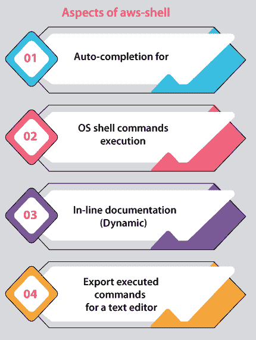
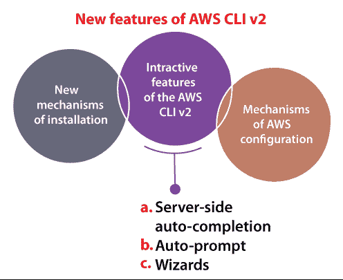
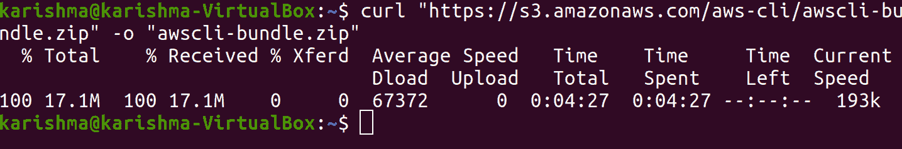
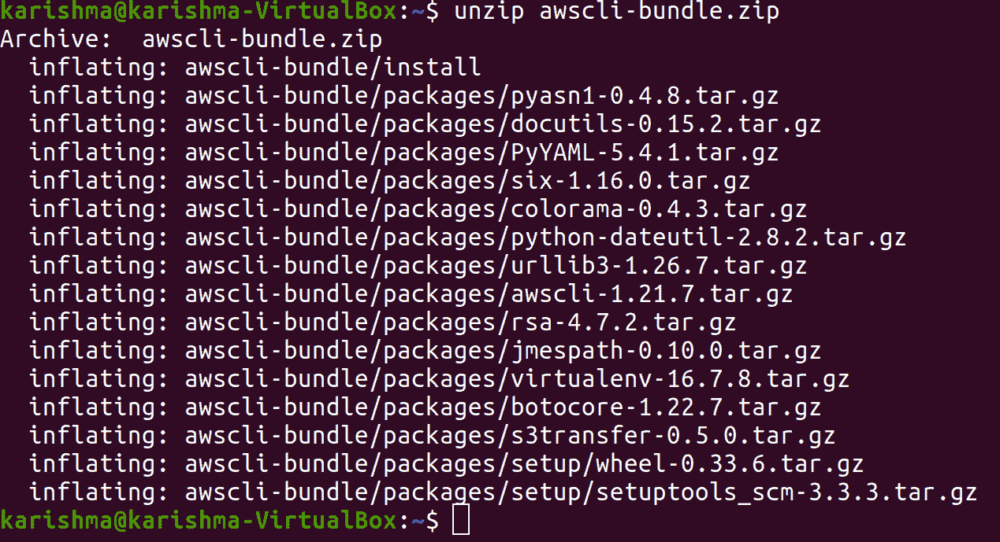
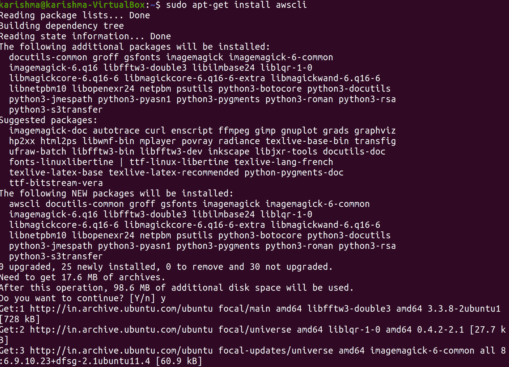
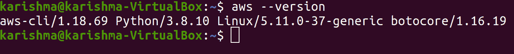
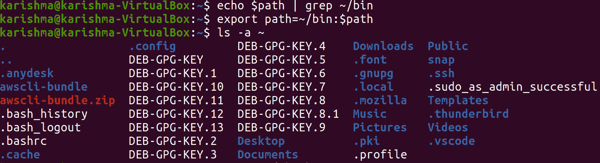
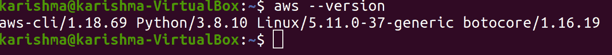
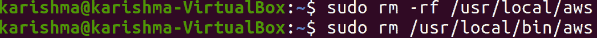

# 安装 AWS 命令行界面 Ubuntu

> 原文：<https://www.javatpoint.com/install-aws-cli-ubuntu>

***AWS CLI*** 是 ***AWS 命令行界面的简称。*** 它是管理我们 AWS 服务的组合工具。我们可以使用命令行管理 AWS 的多个服务，还可以使用脚本自动执行这些服务，只需要一个工具来下载和配置。

***AWS 命令行界面第 2 版*** 提供了各种新功能，包括开发的安装程序和新的配置选项，如几个交互式功能和 ***AWS 单点登录(SSO)。***

这个命令行界面使我们能够借助命令行外壳中的命令与 AWS 的服务进行交互。AWS CLI 使我们能够使用终端程序中的命令提示符，以最少的配置开始运行命令，这些命令运行的功能相当于 ***AWS 管理控制台(基于浏览器)*** 给出的功能:

*   **Linux shell:**这些 shell 是使用 shell 的常用程序如***【tcsh】【zsh】******bash***在 macOS 或 Linux 中执行命令。
*   **Windows 命令行:**它在 Windows 上的 ***PowerShell*** 或 ***Windows 命令提示符*** 中运行命令。
*   **远程:**它使用远程终端的程序在 ***亚马逊 EC2(亚马逊弹性计算云)*** 实例上运行命令，例如 ***AWS 系统管理器、*** 或 ***SSH*** 或 ***PuTTY。***

***【AWS 管理控制台】*** 中的每个 ***IaaS(基础架构即服务)*** AWS 访问、管理和管理功能都存在于 ***AWS CLI*** 和 ***AWS API 中。***AWS IaaS 的新服务和功能可在发布后 180 天内或发布时通过 CLI 和 API 实现 AWS 管理控制台的完整功能。

AWS 命令行界面便于直接访问公共 AWS 服务API。我们可以使用 AWS 命令行界面探索服务的功能，并改进用于管理资源的外壳脚本。AWS 的几个等同于 API 的命令和许多服务为 AWS 命令行界面提供了定制，包括在低级中。定制可以使用服务添加具有复杂API的高级命令。

## 外壳(开发者预览)

***aws-shell*** 可以描述为命令行 shell 的一个程序，提供 ***生产力*** 和 ***便利性*** 功能，支持 AWS CLI 的高级用户和新用户。下面提到一些重要的方面:



1.  **自动完成为:**
    资源标识符 ***亚马逊 SNS 主题名称*** (例如 ***亚马逊 SNS 主题名称、亚马逊 SQS 队列 url、亚马逊 EC2 实例 id)***
    选项(例如 ***-队列 URL、-实例 id)***
    命令(例如 ***创建-队列、描述-实例、ec1***
2.  **OS shell 命令执行:**
    使用 OS 的常用命令，如 ***pipe、cp、ls、*** 和 ***cat*** 输出和输入，无需活壳
3.  **在线文档(动态)**
    选项和命令的文档在我们键入时显示
4.  **为文本编辑器导出已执行的命令**

## AWS 命令行界面的版本

***AWS CLI*** 有两个版本，本指南中的详细信息在两个版本中都有使用。

1.  **2 . x 版本:**一般可用，当前版本 AWS CLI。它旨在用于生产环境中。
2.  **版本 1.x:** 旧版本的 AWS 命令行界面，用于向后功能。

## 关于亚马逊网络服务

*(或 ***【亚马逊网络服务】*** )是一套数字基础设施服务，开发人员可以在集成应用时利用这些服务。这些服务包括 ***数据库、存储、计算、*** 和 ***应用的同步*** ( ***排队*** 和 ***消息传递*** )。AWS 采用服务模式，即 ***【现收现付】。****

 *我们只对我们或我们的应用使用的服务收费。AWS 促进了免费使用层，使 AWS 作为*和 ***原型开发的环境更加方便。*** 我们不需要为服务付费，因为在这一层的特定使用下 ***是免费的*** 。*

 *## 自动气象站命令行界面简介

```

aws [options] <command> <subcommand> [parameters]

```

*   我们可以使用 AWS 命令的帮助来了解特定命令的详细信息。
*   我们可以使用 AWS 的帮助主题来查看已有的帮助主题列表。
*   所有命令的概要显示了它们的用途和参数。
*   可选参数显示在方括号中。

### 选择

*   打开调试日志记录

```

--debug (boolean)

```

用提供的网址重写命令的默认网址

```

--endpoint-url (string)

```

*   如果与 AWS 的服务通信，AWS 命令行界面默认使用 SSL。AWS 命令行界面将为每个 SSL 连接验证 SSL 证书。此选项将覆盖验证 SSL 证书的默认性质。

```

--no-verify-ssl (boolean)

```

*   禁用自动分页。

```

--no-paginate (boolean)

```

*   命令结果的格式化方式。

    *   文本
    *   桌子
    *   数据

```

--output (string)

```

*   用于过滤返回数据的 JMESPath 查询。

```

--query (string)

```

*   使用我们的凭据文件中的特定配置文件。

```

--profile (string)

```

*   要使用的区域。它会覆盖 env/config 的设置。

```

--region (string)

```

*   显示工具的版本。

```

--version (string)

```

*   关闭/打开颜色输出。

    *   汽车
    *   离开
    *   在

```

--color (string)

```

*   不要签署请求。给出此参数时，将不会加载凭据。

```

--no-sign-request (boolean)

```

*   用于验证 SSL 证书的证书颁发机构证书的捆绑包。它会覆盖 env/config 的设置。

```

--ca-bundle (string)

```

*   套接字的最大读取时间以秒为单位。当值固定为 0 时，套接字的读取不会超时，并且会阻塞。默认值为 60 秒。

```

--cli-read-timeout (int)

```

*   套接字的最大连接时间以秒为单位。当值固定为 0 时，套接字的连接不会超时，并且会阻塞。默认值为 60 秒。

```

--cli-connect-timeout (int)

```

## AWS CLI v2 的新功能

***AWS CLI v2*** 提供了各种新功能，如集成安装程序、 ***【单点登录】*** 等配置新选项以及其他几个交互功能。

下面列出并讨论了一些重要特性:



### 1.新的安装机制

AWS 命令行界面第 2 版为 macOS、Linux 和 Windows 提供了预构建的二进制文件。我们不再需要安装 ***Python*** 来应用 AWS 命令行界面。我们不需要担心 Python 的兼容版本、Python 的冲突包或虚拟环境。我们在 Windows 上给出了一个**T5 的 MSI 安装程序 T7 和一个**T9。macOS 上的 pkg 安装程序** 。**

### 2.自动气象站配置机制

AWS CLI v2 引入了各种新机制来配置凭据。他们增加了一个新的命令，即***【AWS 配置导入】*** 来导入带有 ***的凭证。在 ***AWS 控制台内生成的 csv 文件*** 。***

此外，它们还包括对新命令的支持，即***【aws 配置向导】*** ，该命令有助于引导漫游来配置 AWS 的凭据。此版本支持使用新命令从 AWS SSO 中使用和配置凭据，即包含在这些命令中的***【AWS 配置 SSO】***。它将向我们提出一系列问题，帮助我们配置 AWS 命令行界面。

### 3.AWS 命令行界面 v2 的交互功能

这个版本最大的主题之一是增加更多的交互方面来支持客户。AWS 命令行界面既适用于交互式使用，也适用于自动脚本任务，我们希望包括支持用户在终端中交互式执行命令行界面命令的方面。一些新的交互方面包括向导、服务器端自动完成和命令，即***-CLI-自动提示。*T3】**

**a .服务器端自动完成**

我们可以将命令 ***aws_completer*** 应用于命令的选项卡完成和 AWS CLI v1 中的参数名称。

他们升级了 ***自动完成器*** ，用于在 AWS CLI v2 中完成服务器端的资源名称。

**b .自动提示**

***自动完成*** 功能支持我们更高效地输入 CLI 的参数，但有时我们不确定希望提供哪些参数。

新功能***-CLI-自动提示*** 可以支持我们。我们可以将此参数包含在 CLI 的所有内置命令中，CLI 将通过输入参数值来指示我们。

1.  它将首先向我们询问每个必需的参数。
2.  一旦我们输入了每个必需的参数，我们将使用可选参数列表来表示。此外，所有参数都包含文档的初始声明。
3.  我们可以选择 ***【参数输入完成】*** 一旦我们输入了我们想要的每个参数，我们将有一个选项为我们打印命令或 AWS 命令行界面变出命令。

**c .巫师**

在 ***AWS CLI v2、*** 中，新向导的特性指导我们管理 AWS 的几个资源。与***-CLI-自动提示*** 相比，它们是更高层次的抽象，并且结合了 AWS API 的多个调用来创建、更新或删除 AWS 的资源。

它们与 AWS 控制台中的入门工作流相同。他们在 AWS 服务的初始集合中添加了向导。我们可以执行 ***<服务-名称>向导<向导-名称>*** 来访问这些向导。此外，向导支持在向我们询问数据时查询可用资源。他们为***λ、iam、dynamodb、*** 和 ***添加了向导来配置*** 命令。

## 在 Linux Ubuntu 中安装、更新和卸载 AWS 命令行界面版本 1

借助 ***捆绑安装程序*** 或 ***pip 包管理器，我们可以在大多数 Linux 发行版中安装 ***AWS CLI (AWS 命令行界面)版本 1*** 及其依赖项。***

然而，包*存在于像 ***【百胜】*** 和 ***这样的几个包管理器的存储库中。***AWS 不支持、管理或生产这些。我们建议只使用官方 AWS 的分发点来安装这个版本。*

 *### 先决条件

我们的系统中必须安装 2.7 版本的 Python 2 或更高版本，或者 3.6 版本的 Python 3 或更高版本。

### 使用捆绑的安装程序在 Ubuntu 中安装和卸载 AWS 命令行界面版本 1

在 Linux 上的 macOS 上，我们可以应用捆绑的安装程序来安装 AWS CLI 版本 1。捆绑的安装程序包含所有依赖项，可以脱机使用。

***重要提示:**捆绑的安装程序无助于安装包含空格的路径。*

### 使用 sudo 使用捆绑安装程序安装 AWS 命令行界面的第 1 版

以下步骤使我们能够从命令行在所有版本的 macOS 或 Linux 上安装 AWS CLI 的第 1 版。下面是下面提到的安装命令摘要，我们可以将其复制并粘贴为一个命令集来执行。对于最新的 AWS 命令行界面版本，我们可以使用以下命令块:

```

$ curl "https://s3.amazonaws.com/aws-cli/awscli-bundle.zip" -o "awscli-bundle.zip"
unzip awscli-bundle.zip
sudo ./awscli-bundle/install -i /usr/local/aws -b /usr/local/bin/aws

```

对于特定的 AWS CLI 版本，我们可以在文件名中附加一个连字符和版本号。 ***1.16.312*** 版本的文件名将为***AWS chi-bundle-1 . 16 . 312 . zip***出现在以下命令中:

```

$ curl "https://s3.amazonaws.com/aws-cli/awscli-bundle-1.16.312.zip" -o "awscli-bundle.zip"

```

```

unzip awscli-bundle.zip
sudo ./awscli-bundle/install -i /usr/local/aws -b /usr/local/bin/aws

```

以上命令的详细说明:

在捆绑安装程序的帮助下，我们可以使用命令行按照步骤安装 AWS CLI 版本 1。

**1。**在以下方法之一的帮助下，下载 AWS CLI 第 1 版捆绑安装程序。

用命令下载，即 ***收拢。*T3】**

对于最新的 AWS 命令行界面版本，我们可以使用以下命令块:

```

$ curl "https://s3.amazonaws.com/aws-cli/awscli-bundle.zip" -o "awscli-bundle.zip"

```



对于特定的 AWS 命令行界面版本，我们可以使用以下命令块:

```

$ curl "https://s3.amazonaws.com/aws-cli/awscli-bundle-1.16.312.zip" -o "awscli-bundle.zip"

```

**2。**从我们的包中提取这些文件。如果我们不需要解压缩来提取这些文件，我们可以使用 Linux 发行版的内置包管理器来安装它。

```

$ unzip awscli-bundle.zip"

```



**3。**现在，我们可以使用下面提到的命令安装 AWS 命令行界面:

```

$ sudo apt-get install awscli

```



**4。**我们需要验证 AWS CLI 安装是否正确。

```

$ aws --version

```



### 在不使用 sudo 的情况下，使用捆绑的安装程序安装 AWS CLI 版本 1

如果我们没有***【sudo】***的权限，或者希望只为最新的用户安装这个版本，那么我们可以使用旧命令的更改版本。最初的两个命令将是相同的。

对于最新的 AWS 命令行界面版本，我们可以使用以下命令块:

```

$ curl "https://s3.amazonaws.com/aws-cli/awscli-bundle.zip" -o "awscli-bundle.zip"
unzip awscli-bundle.zip
./awscli-bundle/install -b ~/bin/aws

```

对于特定的 AWS CLI 版本，我们可以在文件名中附加一个连字符和版本号。1.16.312 版本的文件名将是 AWS chi-bundle-1 . 16 . 312 . zip，出现在下面的命令中:

```

$ curl "https://s3.amazonaws.com/aws-cli/awscli-bundle-1.16.312.zip" -o "awscli-bundle.zip"
unzip awscli-bundle.zip
./awscli-bundle/install -b ~/bin/aws

```

**为最新用户安装 1 版 AWS CLI**

**1。**借助以下方法之一下载 AWS CLI 捆绑安装程序的第 1 版。

用命令下载，即 ***收拢。*T3】**

对于最新的 AWS 命令行界面版本，我们可以使用以下命令块:

```

$ curl "https://s3.amazonaws.com/aws-cli/awscli-bundle.zip" -o "awscli-bundle.zip"

```

对于特定的 AWS 命令行界面版本，我们可以使用以下命令块:

```

$ curl "https://s3.amazonaws.com/aws-cli/awscli-bundle-1.16.312.zip" -o "awscli-bundle.zip"

```

**2。**在解压命令的帮助下，从我们的包中提取这些文件。如果我们没有解压这些文件的解压命令，我们可以使用 Linux 发行版的内置包管理器来安装它。

```

$ unzip awscli-bundle.zip

```

**3。**执行安装程序。为此，安装程序将在 ***/usr/local/aws*** 目录中安装 AWS CLI，并在一个目录中制作 AWS 符号链接，即 ***/usr/local/bin。*** 该命令将使用参数 ***-b*** 来指定安装程序将放置 symlink aws 文件的目录。我们必须对所描述的文件夹拥有所有写权限。

```

$ ./awscli-bundle/install -b ~/bin/aws

```

它会在 ***~/中安装 AWS CLI。local/lib/aws*** 默认位置并在 ***~/bin/aws 目录中制作一个符号链接(或 symlink)。*** 确保 ***~/bin*** 在环境变量内部，即 ***PATH*** 为工作的符号链接。

```

$ echo $PATH | grep ~/bin 

```

**4。** *((检查 **$PATH** 变量是否包含 **~/bin** (如果不包含，结果将为空))*

```

$ export PATH=~/bin:$PATH 

```

**5。** *(如有必要，包括 **~/bin** 到 **$PATH** 变量)*

**6。**确保 1 版 AWS CLI 的目录是我们的 ***$PATH*** 变量的一部分。

**a.** 在我们的用户文件夹中找到我们 shell 的配置文件脚本。如果我们不确定我们将拥有哪个，执行 ***回声$ SHELL。***

```

$ ls -a ~
. .. .bash_logout .bash_profile .bashrc Desktop Documents Downloads

```



**Tcsh:** 。登录，。或者。文件

**Zsh：** .zshrc

**Bash:** 。bash_login，。个人资料，或者。bash_profile

**b.** 在完成我们的配置文件脚本时包含一个导出命令，该命令与下面的示例相同:

```

export PATH=~./local/bin:$PATH

```

以上命令将插入 ***~。/local/bin*** 路径的起始处可用 ***路径*** 变量在本例中。

**c.** 在当前会话中重新加载概要文件，以使这些修改生效。

```

$ source ~./bash_profile

```

**d.** 验证安装的 AWS CLI 是否正确。

```

$ aws -version

```



## 卸载版本 1 AWS 命令行界面捆绑安装程序

如果我们在捆绑安装程序的帮助下安装了 1 版 AWS 命令行界面，我们需要遵循一些说明。捆绑安装程序不会将任何内容放在安装目录之外，不包括可选的符号链接。因此，卸载就像删除这两个项目一样简单。

```

$ sudo rm -rf /usr/local/aws
$ sudo rm /usr/local/bin/aws

```



* * ****