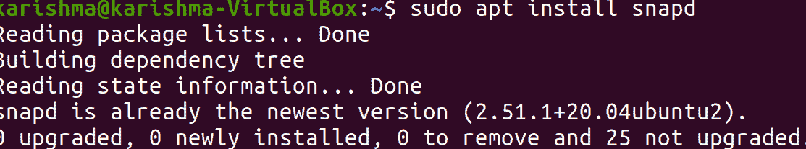
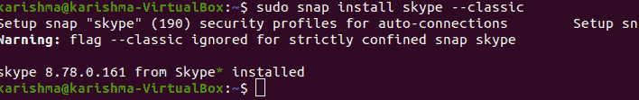
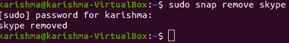

# 安装 Skype Ubuntu

> 原文：<https://www.javatpoint.com/install-skype-ubuntu>

***Skype*** 是全球最著名的通讯应用。它是跨平台的，可以在 macOS、Linux 和 Windows 上使用。我们可以免费拨打在线视频和音频电话，也可以使用 Skype 拨打全球座机和手机。Skype 不是任何 ***开源*** 应用，也不包含在 Ubuntu 的标准存储库中。

虽然 Skype 可以免费使用 Skype 即时消息和通话，但我们必须为使用一些功能付费，如将 Skype 通话至座机或手机号码或发送短信。

#### 注意:默认情况下，Skype 不会安装在 Linux 操作系统上。

在本文中，我们将展示一些在 20.04 版本的 Ubuntu 中安装 Skype 的方法。Skype 可以通过 deb 软件包或 ***Skype 存储库中的 ***Snapcraft*** 商店以快照包的形式安装和下载。***

我们可以选择最适合我们环境的安装方法。

## 什么是 Skype？

***Skype*** 可以描述为 ***专有电信*** 的应用，专门提供 ***基于 VoIP 的视频电话、视频通话、*** 和 ***视频会议。*** 此外，它还具有文件传输、即时消息、基于借记卡拨打移动电话和固定电话(在传统电话网络上)以及各种其他功能。

该应用在视频游戏的多个手机、桌面和控制台平台上可用，由 ***微软*** 部门的***【Skype Technologies】***实现。 ***截至 2020 年 3 月，Skype*** 已被一亿用户每月使用，四千万用户每天使用。

Skype 是与四个爱沙尼亚开发者相关的 Janus Friis T2 T3 和 T4 T5 尼可拉斯·曾斯特罗姆 T7 的建立，最初于 2003 年 8 月发布。2005 年 9 月，易贝以 26 亿美元的价格继承了 Skype。 ***加拿大养老金计划投资委员会、安德里森·霍洛维茨、*** 和 ***银湖*** 宣布由 ***【易贝】*** 以 19 亿美元收购 Skype 65%的股份，这给该组织带来了 29.2 亿美元的市值。

***微软*** 于 2011 年 5 月以 85 亿美元收购了 ***Skype*** ，用 Skype 替代了***Windows Live Messenger***。截至 2011 年，开发的几乎所有团队和事业部 44%的每位员工仍定位于 ***爱沙尼亚、*** 和 ***塔林*** 。

最初， ***Skype*** 提供了一个混合的客户端-服务器和对等系统。整个来说，它在 2012 年 5 月通过微软实施的“T6”“T7”超级节点获得了动力，并在 2017 年通过点对点服务将 Skype 转变为基于 Azure 的整合服务。

#### 注:在新冠肺炎疫情期间，Skype 失去了很大一部分市场份额。

## Skype 功能

*   已注册的 ***Skype*** 用户由 Skype 的特定 ***ID 识别*** ，并可能列在 Skype 的 ***用户名*** 下的 ***Skype 目录内。***
*   *允许注册用户通过 ***【语音聊天】*** 和 ***即时消息进行交流。****
**   ***语音聊天****允许用户对之间的电话呼叫和会议呼叫，并应用专有音频编解码器。***   ***Skype*** 的文字聊天客户端允许存储聊天记录、表情符号、群聊以及编辑旧消息。*   消息(离线)在 ***测试版*** 的***5<sup>版本</sup>*** 中实现，但在几周后被删除，没有任何通知。*   熟悉即时消息使用的常规方面——在线状态指示器、用户配置文件等等——也包括在内。*   ***Skypeln*** 在线号码服务允许 ***Skype*** 的用户在他们的系统上接收由常规电话的用户拨打到 ***Skype*** 电话号码(本地)的呼叫；荷兰、土耳其、瑞士、瑞典、韩国、非洲、罗马尼亚、波兰、新西兰、尼泊尔、墨西哥、日本、爱尔兰、印度、匈牙利、香港、德国、法国、芬兰、爱沙尼亚、多米尼加共和国、丹麦、哥伦比亚、智利、巴西、比利时、澳大利亚、美国和英国都有本地号码。*   ***【Skype】***的用户可以在这些国家拥有许多本地号码，同时拨打该号码的费用与拨打国内固定线路的费用相似。*   ***Skype*** 应用免费为 25 名用户提供视频聊天、电话会议和屏幕共享支持，2019 年 4 月 5 日，该应用扩大到 50 名用户。*   ***Skype*** 不便于拨打 ***紧急号码*** 像 ***112*** 在 ***欧洲，100*** 在 ***尼泊尔*** 和**T21】印度，999** 在 ***英国，*** 和**   截至 2012 年 12 月，芬兰、丹麦、澳大利亚和英国对所有紧急呼叫的支持受到限制。***

 ***美国联邦通信委员会*(简称 ***【联邦通信委员会】*** )裁定***【Skype】***申请不是 ***【互联网络电话提供商】*** 为达到 ***电信法案第 255 条的目的。*** 美国*的 ***国家紧急号码协会*** 因此建议 ***VoIP*** 的每个用户都有一条 ***模拟线路*** 作为 ***备份。*****

 **Skype 提供了一个选项，可以用 2019 年使用软件实现的人工智能算法模糊视频聊天界面内部的背景，而几乎所有网络摄像头都没有摄像头(深度感应)。

## Skype 协议

Skype 采用专有的网络电话(网络电话) 网络，称为***“Skype 协议”。*** 该协议尚未由 Skype 公开开发，所有使用该协议的官方应用也都是专有的。Skype 技术部分依赖于属于 ***公司*** 的 ***全球索引 P2P*** 的协议

标准的 ***VoIP*** 和 ***Skype 客户端*** 之间的主要区别在于，Skype 基于对等概念(最初基于***【Kazaa】***软件)而不是更常规的客户端-服务器概念。

#### 注意:VoIP 非常著名的会话发起协议(SIP 的缩写)概念也是对等的，但是实现通常需要使用服务器注册。

## 将 Skype 安装为快照包

Skype 的 ***快照包由 ***微软维护和分发。*** Snap 是一个独立的软件包，包含执行应用所需的每个依赖项的二进制文件。 ***Snap 包*** 安全易升级。与 deb 的标准包不同，Snap 占用的磁盘空间更大，应用的启动时间也更长。***

快照包可以通过 Ubuntu 软件应用或命令行安装。

***【Snap】***也可以描述为一个打包了所有必需库和依赖项的应用。我们将要求在系统上安装 snap，以便安装任何 snap 包。在 16.04 和更高版本的 Ubuntu 中，已经安装了快照。如果快照包在我们的系统上不可用，那么我们可以在以下命令的帮助下安装它:

```

$ sudo apt install snapd

```



然后，我们需要打开终端并执行以下命令来安装 Skype snap:

```
$ sudo snap install skype -classic

```



就这样。我们已经在 Ubuntu 系统上安装了***【Skype】***应用，我们可以开始使用了。

如果我们不想使用命令行，那么我们需要打开 Ubuntu 软件，找到***【Skype】***，然后在我们的系统上安装该应用。

每当发布任何新版本时，*Skype 套餐都会在后台自动更新。*

 *### 启动 Skype

安装 Skype 后，通过在我们的终端中运行以下命令，我们可以启动 ***Skype*** :

```

$ skype

```


### 删除 Skype

我们将在我们的终端中执行以下命令来删除 ***Skype*** 应用的快照包:

```

$ sudo snap remove skype

```



## 使用 apt 安装 Skype

***Skype*** 应用可以在 ***微软 Apt 的官方存储库中找到。*** 我们需要按照以下步骤将其安装到我们的系统上:

**1。**我们需要打开我们的命令行窗口并下载当前。Skype 的 deb 包通过运行下面的 ***wget*** 命令:

```

$ wget https://go.skype.com/skypeforlinux-64.deb

```

**2。**下载过程完成后，我们将使用 ***sudo*** 权限以 root 用户身份执行以下命令来安装 Skype 应用:

```

$ sudo apt install ./skypeforlinux-64.deb

```

我们将被要求输入我们的密码。

Skype 的官方存储库将在安装过程中添加到我们的系统中。我们可以从桌面的标准工具，即 ***【软件更新】*** 更新我们的 Skype 套餐，或者我们也可以在新版本发布时通过在我们的终端中执行以下命令来更新我们的系统:

```

$ sudo apt update

```

```

$ sudo apt upgrade

```

### 启动 Skype

安装 Skype 后，我们可以通过在终端中运行以下命令来启动 Skype:

```

$ skype

```

### 删除 Skype

我们将在终端中运行以下命令，删除使用 apt 安装的 Skype 应用:

```

$ sudo apt remove skypeforlinux

```

然后系统会提示我们输入密码。我们需要输入我们的 root 密码，然后单击“输入”按钮，之后 Skype 应用将从我们的系统中删除。

## 开始使用 Skype

我们需要在搜索栏内输入***【Skype】***，即 ***活动、*** 并按图标启动应用。

当我们第一次启动*Skype 应用时，会出现一个窗口。*

 *我们可以从这里使用我们的 ***微软账户*** 登录 ***Skype*** 应用，开始与家人和朋友聊天。

* * ********