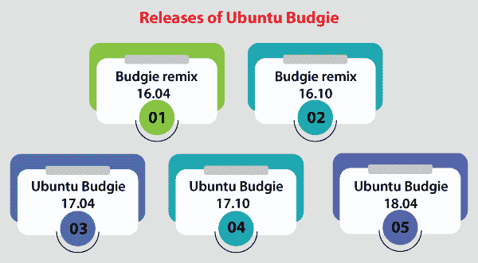
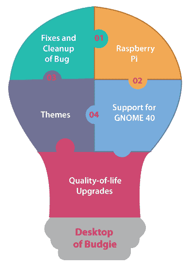
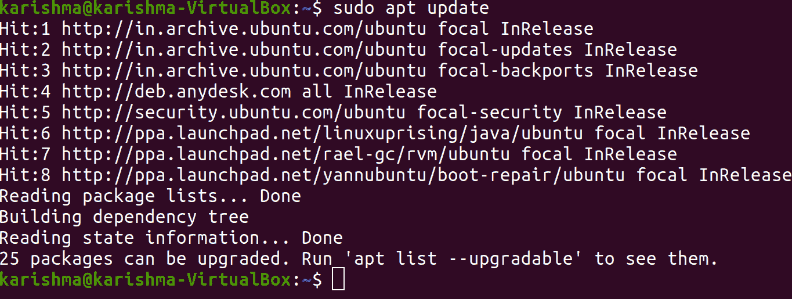
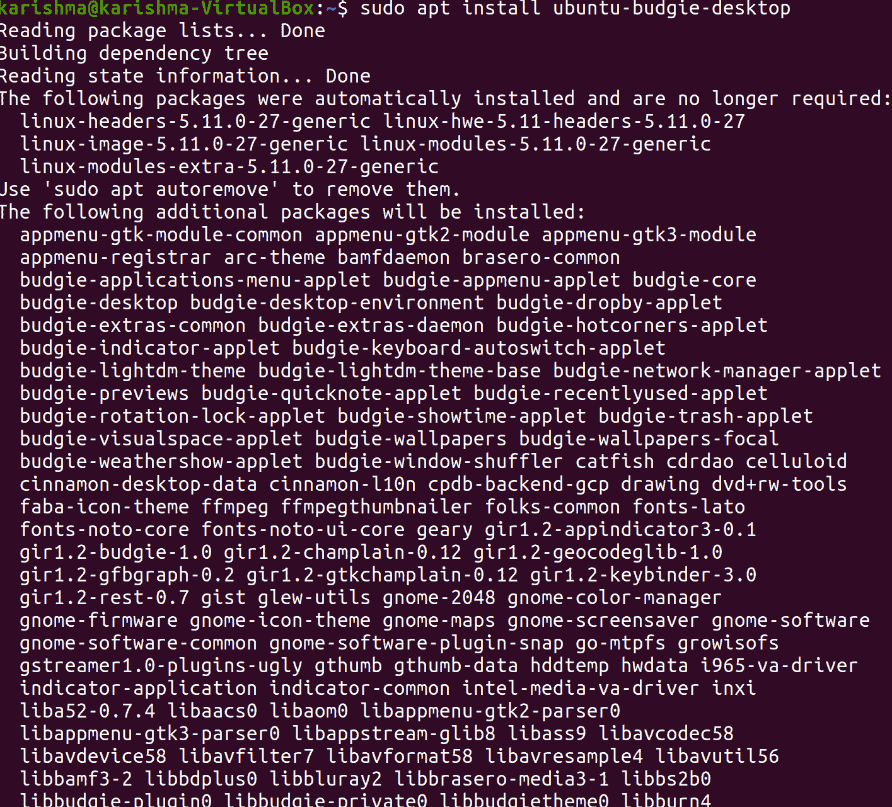
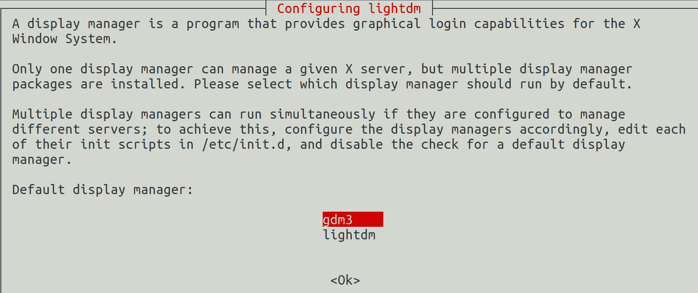
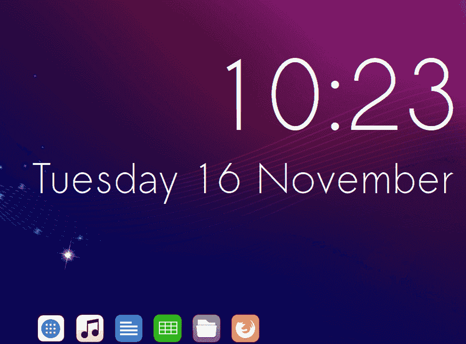
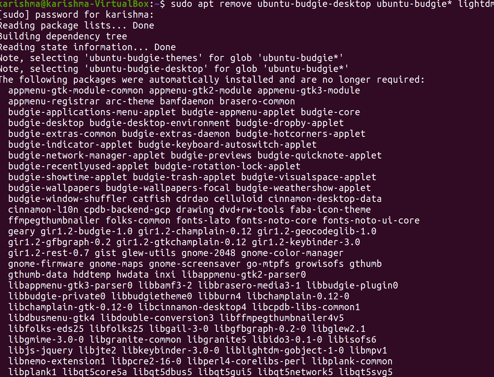
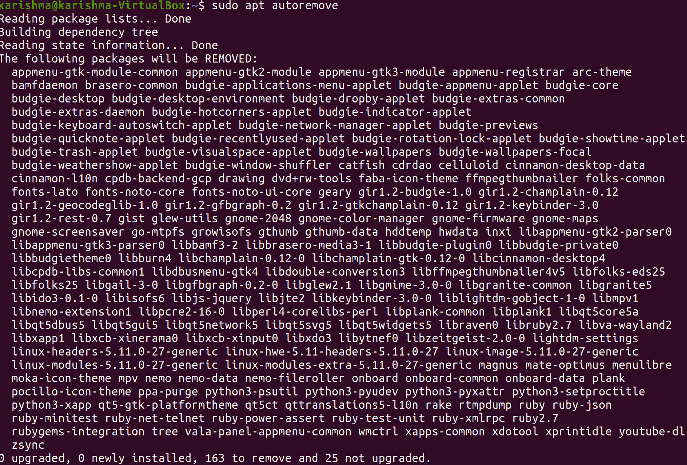

# 乌邦图布吉

> 原文：<https://www.javatpoint.com/ubuntu-budgie>

***Ubuntu budget***可谓是一款 ***官方社区版的 Ubuntu*** 并提供了***budget Desktop。*** 它结合了经过彻底测试和稳定的 Ubuntu Core，以及由 ***Solus 项目集成的传统外观、轻量级和现代桌面。***

Ubuntu budgie 的当前版本是 21.10，于 2021 年 10 月 14 日发布。

## 乌班图鹦鹉的历史

Ubuntu budgie 版本开始时是一个非官方社区的味道，与 16.04 LTS 发布的 Ubuntu 并行，后者被称为***budget-remix。***16.10 版本的 ***鹦鹉混搭*** 后来严格按照 16.10 版本 Ubuntu 的发行时间表出版。

最终，它被确定为乌班图官方社区的一种味道，并被重新命名为 ***乌班图鹦鹉。***17.04 版 ***乌班图虎皮*** 于 2017 年 4 月发布，2017 年 10 月更新为 17.10 版。在 18.10 版本的 ***Ubuntu Budgie、*** 中，对 32 位的支持已经下降。对 32 位的支持也在 Ubuntu MATE 版本中被删除了。

***文森佐·博维诺*** 曾担任公关和新品牌经理。

## Ubuntu 鹦鹉的发布



### 鹦鹉混音 16.04

16.04 版 ***虎皮-混搭*** 于 2016 年 4 月 25 日发布，比 16.04 版 Ubuntu 晚了 4 天。系统包括 10.2.5 版 ***虎皮桌面。*** 它有一个基于 ***【穆特】*** 通知中心设置的窗口管理器，一个可定制的面板。

本次发布采用的主题为***【Arc-GTK+***。 ***Budgie-remix*** 拥有 3.18 版本的 ***鹦鹉螺，*** 与当时的 Ubuntu OS 拥有 3.14 版本的 ***鹦鹉螺*** 相比，16.04 版本的 Ubuntu。

还包括 0.11.1 版本的 ***坞面板木板、*T3】3.18 版本的 ***格迪特、***3.18 版本的 ***GNOME 照片、***3 . 4 . 3 版本的 ***gThumb、***3.3 版本的 ***Rhythmbox、***3.18** 45.0 版 ***Mozilla Firefox、*T35】2.84 版 ***变速箱、*T39】3 . 18 . 9 版 ***GTK+、*T43【11 . 2 . 0 版 ***梅萨、***1 . 18 . 3 版 ***XOrg、*********

### 鹦鹉混音 16.10

16.10 版 ***预算-混音*** 于 2016 年 10 月 16 日发布，比 16.10 版 Ubuntu 晚了三天。该系统包括 10.2.7 版本的 ***贝壳虎皮桌面、***3.22 版本的 ***GTK+、*** 以及 4.8 版本的 ***Linux 内核。***

此版本中实现了各种新功能，例如在安装时支持多种语言、主文件夹加密和全磁盘加密。此外，它还包括 ***Arc GTK+*** 设计主题和一个新鲜的 ***波奇洛*** 主题图标。

***大卫·默罕默德*** (其中一个虎皮鹦鹉混搭开发商)说:

*“这是我们遵循 Ubuntu 发布周期的第一个版本——我们以与 Ubuntu 和其他官方社区相同的方式，努力将我们的 alpha 和两个 beta 版本紧密地联系在一起。根据 16.04.1 的印象、我们从用户那里收到的反馈和建议，新版本附带了许多新功能、修复和优化。”*

### Ubuntu budgie 17.04 版

17.04 版 ***乌班图虎皮*** 于 2017 年 4 月 19 日发布。在 Ubuntu 社区正式共享后，Budgie-remix 更名为这一术语。

该系统包括 10.2.9 版本的 ***Budgie Desktop shell、***4.10 版本的 ***Linux 内核、***17 . 0 . 3 版本的 ***Mesa、*** 以及 1.19.3 版本的 ***Xorg。*** 应用即***Budgie-Welcome***更新并出现对应用指示器的支持，所有声音小程序处理完毕，3.24 GNOME 应用激活， ***GNOME 终端*** 替换为****谷歌 Chrome*** 替换为 ***Chromium、它应用了 ***Arc GTK+*** 设计主题和 ***陆丹蓝*** 图标主题。****

 *在该版本的出版记录中，规定如下:

*“这个开发周期的很大一部分花在了与 Canonical 汇编系统的集成上。关键的可见集成元素是普利茅斯设置，它使用泛在安装程序，处理包来删除“budgie-remix”的身份，并替换为“Ubuntu Budgie”的新身份*

## Ubuntu Budgie 17.10 版

17.10 版 ***乌班图虎皮*** 于 2017 年 10 月 19 日发布。该系统包括 10.4 版本的 Budgie Desktop 外壳和 4.3 版本的 Linux 内核。

Budgie 的桌面环境 10.4 配备了一组原生方面，包含一个新的模式***【Alt+Tab】***，支持将窗口的控制切换到左侧或右侧，支持 Raven 内的***【Spotify】***，支持加密卷，支持小程序添加的 SMB 文件，支持自定义时间和日期的出现。

此外，在 10.4 版本的 ***Budgie Desktop、*** 中也有对右侧或左侧面板的支持，支持在 dock 中转换面板，为每个面板提供动态和透明的自动图像，以及补充底部面板以实现无 ***【跳转】*** 效果的能力。

发布的 17.10 版本乌班图鹦鹉中的其他改进包含 ***咖啡因*** 和 ***夜灯*** 工具、 ***椴树*** 作为终端模拟器(默认)而不是 ***Termix、*** 和支持 ***椴树地震*** 的模式以及 ***F12* 此外，它有新的壁纸和更新的面板图标。**

***【典范】*** 在 10 月份撤回了 Ubuntu 的 17.10 发行版，并在 12 月 20 日隐藏了 2017 年通过该网站下载的链接。原因是联想*笔记本的几个型号和宏碁的一个型号的 ***BIOS*** 损坏的典型 bug。*

 *17.10.1 版本于 2018 年 1 月 12 日发布，其中包括对 17.10 版本中真实问题的更正。

## Ubuntu Budgie 18.04 版

18.04 版 ***乌班图虎皮*** 于 2018 年 4 月 26 日发布。该系统包含 4.15 版本的 ***Linux 内核。*** 可以从网络管理器安装 ***OpenVNC*** 。

出现了几个新的小程序，如通过 USB 设备下载和查看数据的***【DropBy】***、 ***【快速笔记】*** 用于所有笔记、 ***【热点角落】*** 用于将窗口移动到屏幕角落、 ***窗口移动器*** 用于将窗口快速移动到其他虚拟桌面、 ***自动切换*** 用于将键盘布局键入应用、

 **每一个 ***GNOME*** 应用都已经更新到了 3.28 版本，但是 ***鹦鹉螺*** 却有了 3.26 版本。

## 乌班图鹦鹉的最新版本

21.10 版本的 ***【乌班图鹦鹉】*** 是一个通用版本，将支持 9 个月，直到 2022 年 7 月。与标准的九个月版本相比，20.04.3 这样的长期版本有助于长期(三年)的稳定性。

对于 ***Ubuntu Budgie 的每一个受支持的组件，都会发布稳定性和关键修复。*** 这些将由我们自己发起，更广泛的 ***乌班图社区、*** 和 ***典范。***

本发行说明涵盖的一些领域如下:

*   增强功能和新功能
*   从 20.04.3 或 21.04 版本的 Ubuntu Budgie 升级
*   在哪里安装 Ubuntu Budgie
*   升级时已知的问题

## 迷你应用和小程序

修改摘要:

*   许多优秀译者的几个最新翻译
*   如果启用了预览，但最终用户登录到了 ***韦兰*** 桌面的会话中，修复系统日志垃圾邮件
*   修复用于无状态发行版的 ***窗口洗牌机*** 可运行安装路径的布局
*   ***窗口洗牌控制*** 选项已经完全重新设计和修改。
*   现在， ***窗口洗牌机*** 包含一个小程序，用于重新排列和自动移动窗口，可以是一个窗口，也可以是一组窗口。
*   现在， ***洗牌者*** 也包含 ***窗口规则。***
*   ***洗牌窗口*** 的规则允许我们在特定的工作区打开应用窗口。
*   ***应用菜单*** 的 ***计算器*** 现在显示一个视觉提示，将输出复制到布局。
*   通过 ***【网格】*** 到 ***的模式过渡到 ***应用菜单*** 的***列表现在消失，而不是幻灯片动画。
*   有几个主题奇怪地占据了这个类别的列表。现在，我们在 applet 的设置中有用户可配置的覆盖，允许我们管理间距。
*   我们不再安装 ***基本设置的模式。*** 它确保我们不会与万神殿安装冲突。现在，在 budgie 应用的模式中检测到基本模式的条目。
*   ***虎皮日历小程序中的更改:*** 如果使用日期的自定义格式，请正确管理上午/下午的外观。它也支持 20.04 或 20.10 版本。
*   在 ***虎皮日历小程序中的变化:*** 如果打开 popover 选择当前日期。它也支持 20.04 或 20.10 版本。
*   ***虎皮日历小程序中的变化:*** 如何&隐藏最近一周选项。它还支持 20.04 和 20.10 版本。
*   Budgie-indicator-applet 0.7.0 版本已经发布。它对用于显示大图标的应用指示器进行了修复。
*   一个新的小程序被称为***中央处理器温度****，它显示几个传感器的温度。该传感器也已被反推出 20.04、20.10 和 21.04 版本。*
**   ***阿基拉鹦鹉-像素保护程序-小程序*** 现在有几个增强功能，如下所示:
    1.  标题的大量主题化
    2.  拖放以取消最大化
    3.  使用 arc 主题确保工作的更新
    4.  允许标题右对齐
    5.  将可配置标题的宽度增加到 200 像素
    6.  ***【皮克斯萨沃】*** 辅助主题维护者的新风格类
    7.  修改了对窗口控件主题化的支持*

 *现在，这些更改在 20.04 或 21.04 和 21.10 版本中可用。

*   现在，我们显示一个提示，如果我们打开弹出窗口，在面板图标上滚动修改工作空间。
*   现在， ***亮度控制器*** 已经重新实现，可以使用 GNOME 的 ***dbus 控制*** 。因此，它应该是分布友好的，并且它将在 GNOME 设置中反映类似的力量滑块。

## 虎皮鹦鹉桌面

10.5.3 版本的***鹦鹉****是一个小出版物，定义了许多 bug 的所有修复，一些生活质量的发展，以及对 GNOME 40 堆栈的支持。*

*

### 错误的修复和清除

10.5.3 版的 Budgie 为 Budgie 面板小程序、几个 Window 状态跟踪和 Raven 定义了许多解决方案。

1.  ***丢弃队列*** 使用 ***通知查看 ***乌鸦的*** 可取消。***
    1.  与其使用任何队列(反正不是线程安全的)，不如只更新对 ***【通知窗口】*** 的引用，因为我们首先只关心 ***队列*** 头。
    2.  放弃异步像素缩放的可取消使用。在删除 ***【通知窗口】*** 之前的时间内，我们还没有能够缩放图标的场景。
2.  在 ***瑞文的 ***通知组标题*** 中修复不缩放的应用图标。***
3.  修复小程序中未显示***【Virtualbox】***图标的问题，即 ***图标任务列表。***
4.  修复图标中的回归，即 ***鹦鹉桌面设置*** 管理。
5.  现在，***CanGoNext/canoprevous，回放状态，*** 和 ***MPRIS 元数据*** 立即执行，而不是不必要的操作。
6.  现在，通知应用高优先级超时。
7.  现在，通知图标应用稳定的 ***图标大小。对话框*** 而不是 ***图标尺寸。无效的*** 并且当给定的图标还没有达到想要的高度时就缩放。
8.  声音指示器 ***乌鸦*** 和小程序
    1.  使用标准的取消静音和静音方法，修复问题，如使用媒体键静音和试图通过小程序取消静音，这在以前不起作用。
9.  ***虎皮桌面设置*** 防止被拖拽压住，修复了 ***虎皮桌面设置*** 无意中被压住，无法解开的问题。
10.  ***系统托盘*** 小程序
    1.  稳定性方面的一些改进，比如更主动地捕获 X11 错误。
    2.  用 ***Keepass*** 解决问题，导致 ***面板 segfaults。***

### 树莓皮

21.10 版本的修改:

1.  支持 ***计算模块 4 板。*T3】**
2.  增加命令行选项，即 ***-力臂-模式。*T3】**
3.  增加命令行选项，即 ***- force-findpi-mode。*T3】**
4.  增加命令行选项，即 ***-力-模型模型名。*T3】**
5.  增加命令行选项，即 ***-模型 modelname -cpuinfo“要匹配的 CPU 字符串”。*T3】**
6.  通过使用鼠标悬停并在 ***“状态区域”中显示提示，增强了几个选项的可发现性。*T3】**
7.  禁用选项卡上的按钮和方便提示，即 ***【超频】*** 当没有***'/boot/firmware/config . txt。***
8.  禁用按钮并在选项卡上给出提示，即当未检测到***【pibootctl】***时，显示 。

### 主题

1.  已经为 ***【波奇罗】*** 和 ***QogirBudgie GTK*** 主题生成了快照。这意味着现在我们可以拍摄主题照片了。
2.  ***white sur****GTK+4 兼容版本在**T5【改头换面】T6**中推出，并支持 20.04、20.10 和 21.04 版本。它可以在 21.10 版本上安装。*
**   ***QoGirBudgie***GTK+4 兼容版本目前在 ***改头换面。****   ***Vimix 主题*** GTK+4 兼容版本在 ***改头换面*** 中出现，并回到 21.04 版本。它可以在 21.10 版本上安装。*   ***【莫哈韦主题】*** GTK+4 兼容版本在 ***改头换面*** 推出，并支持 21.04 版本。它可以在 21.10 版本上安装。*   ***波奇洛主题*** GTK+4 兼容版本呈现。*   更新图标主题，即 ***WhiteSur*** 新增几个图标。*   更新了图标主题，即 ***默认波奇罗*** 用了几个新图标。*

 *### 对 GNOME 40 的支持

10.5.3 版本的 ***虎皮桌面*** 定义了对 GNOME 40 堆栈的支持。它详细说明了 gnome-shell、gssettings-Desktop-schema 和***mutt***中的一些变化，这些变化影响了在 GNOME 40 堆栈上使用 Budgie Desktop 的能力，或者影响了与 GDM(GNOME 的登录管理器，这有利于 gnome-shell)的联系。

在 GNOME 设置守护程序和 GNOME Shell 40 中，定义了一些修改，这些修改影响了 Budgie 使用像 GNOME-屏保这样的专用屏保的能力。

### 生活质量升级

在 10.5.3 版本的 Budgie 中，有一些生活质量的升级:

1.  WM 和 Mutter 首选模式设置仅用于“鹦鹉学舌”课程。
2.  对应用全屏状态的跟踪被重写，以使用窗口 XIDs 并减少一些未设置标志不会作为全屏应用在被删除的应用中输出的情况。
3.  现在，间距可以在状态小程序中配置。
4.  现在，在 Budgie 中有一个选项，由 Budgie 桌面设置的 ***【窗口】*** 部分公开，如果窗口处于全屏模式，则自动暂停通知，如果不再有任何全屏窗口，则取消通知。它有助于减少观看或游戏内容时的干扰。
5.  如果操作系统上存在***【Xdotool】***，可以按下锁定键小程序来切换 ***锁定*** 和 ***锁定*** 。

## 额外的

1.  现在， ***【尼莫预览】*** 在 ***鹦鹉欢迎*** 中作为建议应用可用，允许我们可视化任何突出显示的文件的内容。我们只需要点击空间来切换尼莫内部的查看器。它也支持 20.04 和 20.10 版本。
2.  对 ***鹦鹉桌面环境*** 的一些修复已经建立，以使 ***鹦鹉桌面*** 对其他应用 dash 作为默认外壳的远程访问或桌面环境更加友好。
3.  在 ***【鹦鹉欢迎】*** 中，***【IRC】***链接现在表明来自乌班图家族的 ***Libera*** 聊天已经完成了与 ***Freenode 的合作。***
4.  ***绘图应用*** 已上传 0.8.3 版本。
5.  现在， ***UB 战队*** 的 21.10 壁纸已经上了每日 ISO。

## 在 Ubuntu 中安装虎皮桌面

***虎皮桌面*** 是现代最新的虎皮桌面，提供优雅且简约的桌面体验，适用于各大 Linux 发行版。它是以这样一种方式创建的，即它可以利用更少的系统资源。

***虎皮鹦鹉桌面*** 包含一个 app 启动器，它是 ***直白的*** 并被称为 ***虎皮鹦鹉菜单*** ，其中包含了几个可供我们使用的应用。它提供了一种快速简单的方法来搜索和启动应用，以及诸如搜索类型和基于类别的过滤选项等功能。此外，Budgie 还包含一个侧边栏，可以通过按下面板最右侧的图标来访问，我们可以在其中看到通知、控制桌面组件的设置和日历。

我们可以在安装和使用虎皮桌面后体验其他几个方面。在本文中，我们将展示如何在 Ubuntu 上下载和安装 Budgie Desktop。

让我们从安装过程开始。没有要求在 Ubuntu 操作系统中安装 PPA，因为 Budgie 是 Ubuntu 官方存储库的一部分。简单地说，我们需要为安装过程执行一个命令。

**第一步:**我们需要按快捷键，即 ***Ctrl+Alt+T*** 来启动终端。之后，我们将在终端中输入以下命令来查看更新:

```

$ sudo apt update

```



**步骤 2:** 现在，我们将在我们的终端中执行以下命令来安装虎皮桌面:

```

$ sudo apt install ubuntu-budgie-desktop

```



**第三步:**安装过程结束后，会出现提示，提示我们需要选择显示管理器。我们将选择 ***lightdm*** 然后点击回车按钮。

完成这个过程需要几秒钟。



**第四步:**我们需要在终端运行以下命令，在进程完成后重启系统:

```

$ sudo reboot

```

重启后，我们会看到下面的登录屏幕。我们将按下桌面底部的图标。

*   从那里，选择选项，即 ***虎皮-桌面。***
    
*   我们将拥有虎皮鹦鹉桌面的默认外观。
*   我们现在可以通过按下桌面最左边的按钮来使用“鹦鹉”菜单。
*   如果我们不再需要 ***虎皮桌面*** 并希望切换回我们常规的 Ubuntu 桌面，那么我们将需要通过在我们的终端中执行以下命令来移除它:

```

$ sudo apt remove ubuntu-budgie-desktop ubuntu-budgie* lightdm

```



```

$ sudo apt autoremove

```



```

$ sudo apt install --reinstall gdm3

```


* * ********