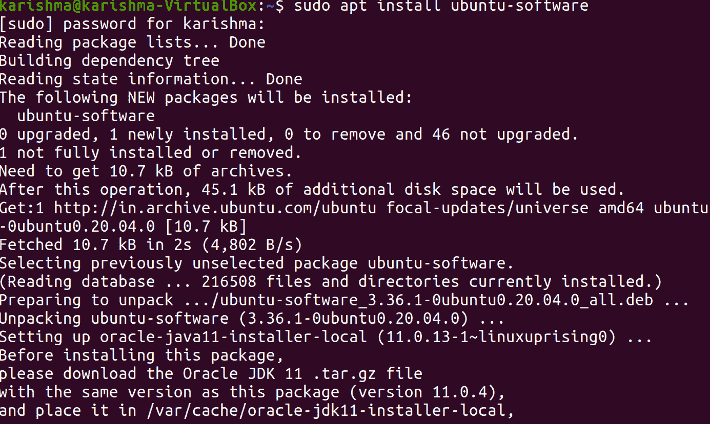
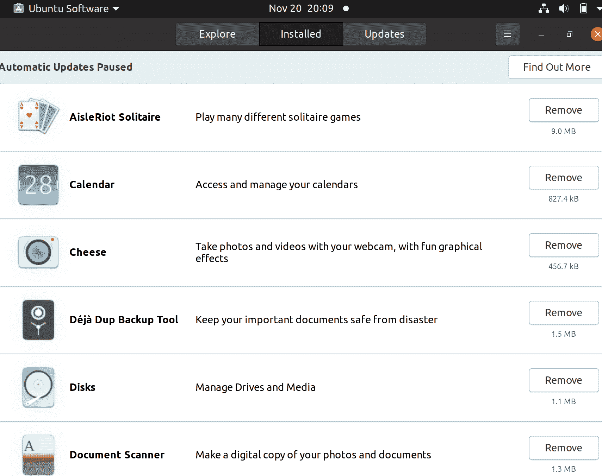
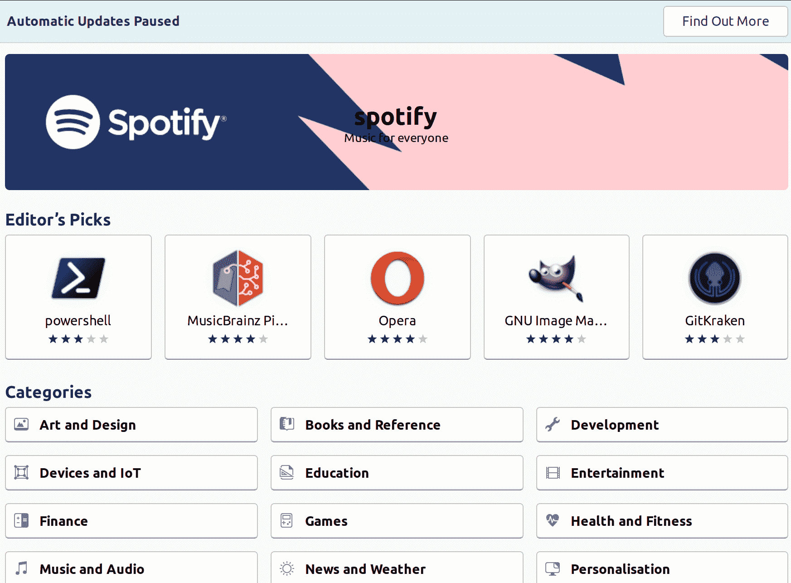

# Ubuntu 软件中心

> 原文：<https://www.javatpoint.com/ubuntu-software-center>

***软件中心*** 或简称 ***Ubuntu 软件中心*** 可以描述为 ***dpkg/APT*** 包管理系统的高级图形化前端。是基于 ***GTK 的***Python PyGObject/PyGTK***中指定的自由软件。***

开发这个程序是为了添加和管理存储库和 PPA(个人软件包档案)。

此外， ***Ubuntu 软件中心*** 允许用户在 Ubuntu 上购买商业应用。开发于 2015 年完成，16.04 LTS 版本的 Ubuntu。它被 GNOME 软件所取代。

## Ubuntu 软件中心发展历史

Ubuntu 的开发人员指出，Ubuntu 中的包管理可以在 2009 年初得到巩固和改进。最近的 Ubuntu 版本，比如 9.04 版本的 Ubuntu***【Jonty Jackalope】***包含了 5 个用于包管理的应用程序，它们利用了空间和一些其他资源，也给许多用户带来了困惑。

可以借助 ***【突触包管理器】*** 或者使用基本的移除/添加应用程序或使用下载应用程序。软件更新程序对计算机看门人进行了更新，安装的软件包清除了所有不再需要的软件包。应用程序 ***【软件来源】*** 允许用户选择包下载的位置。

Canonical 逐渐推出了 ***Ubuntu 软件中心*** 从 9.10 版本的 Ubuntu***(Karmic Koala)***开始，拥有 2011 年 10 月 11.10 版本的 Ubuntu 所期待的全部功能。该计划已于 2011 年 5 月完成。

### 2009 年 10 月-1 . 0 . 2 版本与 9.10 版本的 Ubuntu (Karmic Koala)一起发货

引入了一个简单且新的界面来定位、安装和删除软件，同时具有更好的安全性，该界面基于 ***PolicyKit*** 而不是 ***gksudo。***

### 2010 年 4 月-2 . 0 . 2 版本与 10.04 LTS 版本的 Ubuntu (Lucid Lynx)一起发布

***Ubuntu 软件中心****以更加简化的方式增加了非应用包列表，也方便了 ***个人包档案*** 和应用的子类别。*

 *### 2010 年 10 月-3 . 0 . 4 版本与 10.10 版本的 Ubuntu (Maverick Meerkat)一起发货

允许用户购买软件，并显示购买、删除和安装的历史记录，包括撤销特定修改。

### 2011 年 4 月-4.0 版本与 11.04 版本的 Ubuntu(Natty narwhale)一起发货

增加了用户对软件的评论和评级，以及检查 Ubuntu 其他参与用户的评论和评级的能力。

### 2011 年 10 月-11.10 版本的 Ubuntu (Oneiric Ocelot)

GTK3 中规定的第一个版本***【Ubuntu 软件中心】*** ，开发设计(更好的系统主题改进，更好的应用程序列表，并增加了推广横幅)启动时间也被开发出来。

部分地， ***Ubuntu 软件中心*** 通过增加更大的图标来适应触控。此外， ***软件中心*** 交付了***【Unity Launcher】***集成，该集成按系统要求和应用程序评级排序。集成了一些 ***GDebi*** 技术，以提高管理时的速度。黛比档案。

### 2011 年 12 月 19 日

软件中心的在线版乌班图应用目录已经出版。网络商店显示与软件中心的应用程序类似的内容，并带有一个按钮，即 ***【下载】*** ，该按钮在运行链接时打开应用程序，或者在运行不同操作系统时打开 Ubuntu，用于下载 Ubuntu 操作系统的安装程序。

### 2012 年 4 月-12.04 版本的 Ubuntu(精准穿山甲)

***软件中心*** 获得了新的单色组件。 ***Canonical*** 为开发者打造了一个基于 web 的平台，帮助程序员为 Ubuntu 建立应用。Ubuntu 软件中心新增了 ***【图书杂志】*** 类别，能够显示一个视频演示的多个截图和每个应用的付费应用。它还增加了一个进度条，支持 Ubuntu 软件中心。

《个人电脑世界》的克里斯·霍夫曼(Chris Hoffman)批评了代表“T4”*的应用程序在 2015 年 8 月被跟踪时处理不当。*

 *他特别指出，付费应用程序没有得到适当的支持，Canonical 也没有更新这方面的开发者。尽管如此，该应用程序仍然可以安装和管理自由软件应用程序。

***【Canonical】***在 2015 年 11 月发布的 16.04 LTS 版 Ubuntu 中透露，开发将结束，应用将被 ***GNOME 软件*** 所替代。

## 安装 Ubuntu 软件中心

如果我们正在使用任何 Ubuntu 风格或 Ubuntu，那么我们的系统中已经有了软件中心。如果我们的系统没有软件中心，那么我们可以执行以下命令来安装应用程序:

```

$ sudo apt install ubuntu-software

```



## 启动软件中心

我们需要按照以下步骤启动 ***软件中心:***

1.  我们将进入 ***【应用】*** 菜单。在菜单中搜索***【Ubuntu 软件中心】*** 。
    
    1.  Ubuntu 软件中心可以在 ***启动器里面。*T3】**
    2.  我们可以通过按键找到 Ubuntu 软件中心，即 ***Ubuntu*** 从启动器中删除后。然后，我们需要选择 ***【更多应用】*** 选项，然后选择 ***【已安装查看更多结果】*** 然后向下滚动。
    3.  我们也可以在*搜索栏中找到“软件”。*

 *## 概观

我们可以使用菜单启动 ***软件中心***



正如我们所看到的，有几个可供我们使用的应用程序。

1.  一旦我们了解了如何操作，Ubuntu 软件中心的界面就很容易操作。
2.  最初启动时，将显示不同类型的应用程序类别。简单地说，用户可以按下这些应用程序中的任何一个，该类别中的应用程序列表将填充该区域。选项，即 ***【特色应用】*** 显示了许多在 Ubuntu 社区中很有名的应用。几乎所有的交互都出现在这里。
    
3.  我们在左窗格中看到了不同类型的软件资源。只有 ***【典范伙伴】*** 和 ***【乌班图提供】*** 子选项可用。如果我们添加任何个人包存档，它们也会出现在这里。按下其中一个信号源将过滤掉主窗口中显示的软件，因此它只显示该存储库中的应用程序。该选项，即 ***【已安装软件】*** 也显示了当前系统上安装的每个应用程序，方便查看和删除我们不再使用的软件。
4.  顶部区域主要用于导航。右箭头和左箭头的工作方式类似于网络浏览器中的箭头。右侧区域将带我们进入一个屏幕，左箭头将带我们进入旧屏幕。箭头旁边还有一个面包屑。它是一个导航栏。与我们使用菜单导航时使用箭头相比，这个栏将允许我们更快地在不同的部分之间切换。搜索栏可用于更快地找到应用程序。
5.  最上面是我们的标准菜单: ***【文件】【查看】【编辑】*** 和 ***帮助。***

## 删除软件

如果我们意识到需要删除系统中不再使用的任何软件，Ubuntu 软件中心可以方便地删除应用程序。按下左窗格内的 ***【已安装软件】*** 选项，将显示当前安装在我们系统上的软件。如果我们突出显示其中一个程序，我们将看到一个按钮，即 ***【删除】*** 。

我们只需按下这个按钮，输入我们的密码，软件就会从我们的系统中删除。如果我们希望一次删除多个程序，我们可以选择同时删除所有应用程序，它们将被添加到队列中。软件删除成功后，***【Ubuntu 软件中心】*** 自动跳转到队列中的下一个应用程序。

## 处理软件源

***Ubuntu*** 在 Ubuntu 的官方存储库中，默认为用户提供了几款最好的软件，但有时一些用户希望有更多的选择。Ubuntu 的用户能够访问各种各样的存储库，允许几种不同的软件选项来真实反映 Linux 的行为。

现在， ***软件中心*** 支持包括 ***PPAs 在内的仓库管理。*** 我们需要选择 ***编辑>软件源*** 来编辑我们的系统包含访问的存储库。它会把我们带到软件来源窗口，也可以从 ***系统>管理>软件来源进入。*** 用户可以选择他们想要访问的官方存储库类型以及他们应用的 PPAs 类型。

我们需要看到我们想要应用的库 ***【乌班图软件中心】*** ，关闭那个窗口，并允许它刷新。当我们从类别中搜索或在搜索栏的帮助下搜索时，我们选择的存储库中存在的应用程序将会显示出来。

* * ****