# Ubuntu 主题

> 原文：<https://www.javatpoint.com/ubuntu-theme>

数百个美丽的主题可以在 Ubuntu 上下载和使用，比如 ***【越轨艺术】*** 和 ***GNOME Look。*** 但很容易感觉受到所提供的纯粹选择数量的影响。Ubuntu 以我们的名义从一吨重的 GTK 著名主题中提取出最具视觉效果、最具吸引力和最美丽的引人注目的主题。

## Ubuntu 的热门主题

### 流行 GTK 主题

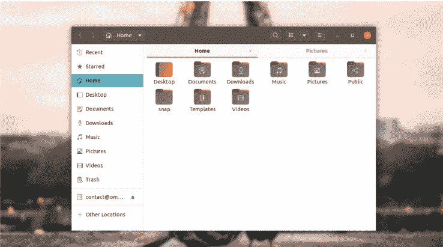

如果我们想要一个现代优雅的外观和实际的活力，流行主题必须适合。

#### 注:流行主题有助于现代和优雅的外观，包括一个实际的活力。

本主题由 Linux 的 ***System76*** 笔记本电脑厂商维护开发，本主题默认应用于基于 Ubuntu 的 Linux 发行版内，即 ***Pop！_OS。***Pop 主题本身是在 ***Adwaita*** 的基础上工作的，后者是 GNOME 的默认主题，有助于确保 GTK 应用程序的外观和功能与预期一致。

尤其是，让 Pop 在 Ubuntu 用户中出名的是它的橙色和棕色。虽然它可能是一个平面主题，但它可以处理多种个性。我们可以直接在 20.04 LTS 版本的 Ubuntu 中安装这个主题，并且不需要 PPA。

#### 注意:如果我们使用的是 18.04 LTS 版本的 Ubuntu，我们会要求下载以前的主题版本的安装程序，我们可以通过 Launchpad 抓取。

### 广告主题

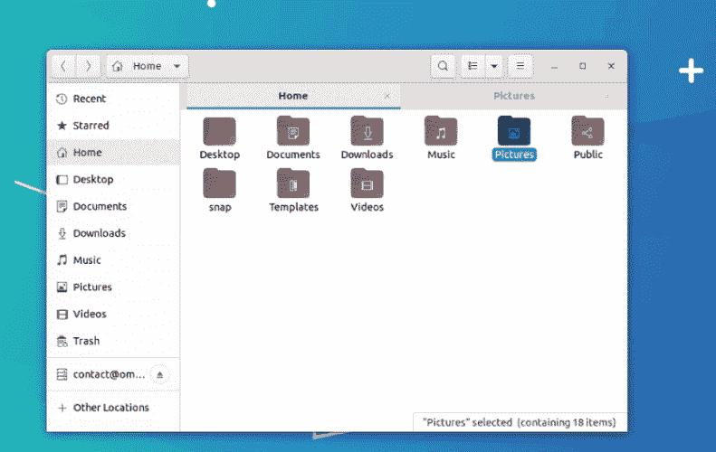

***【阿德威塔】*** 是 ***GNOME*** 的默认主题，在 Fedora 的工作站内开箱即用。它被谦逊地认为是 GTK 应用开发的“参考”主题，也是 Linux 应用开发者希望用户使用的主题。 ***阿德威塔的*** 钢灰色调是其优雅配色方案的一部分，由蓝色配色伴侣凸显。总的来说，感觉是功利的，这个主题没有任何 ***【花架子】*** 的触动。

与本文中提到的其他主题相比,***【Adwaita】***在弹出窗口、菜单和标题栏中的自由填充使用确实意味着它更适合于属于 ***【触摸友好】*** 的设备。众所周知的 GTK 种植作物主题现在建立在 ***阿德韦塔、*** 的头上，包括【Ubuntu】的 ***默认雅鲁藏布江主题和 ***System76 的 ***流行主题*** 。*** 如果我们对 Linux 有一个精确的了解，那么 ***Adwaita*** 主题就是我们想要的。***

#### 注:Adwaita 预装在 18.04 LTS 版 Ubuntu 及以上版本中。

### 拉扬


是针对***【GNOME Shell】******GTK3 桌面*** 的扁平化材质主题设计，并不完全精妙。它定位于类似设计师在其他主题中可用的设计比喻，但它是所有设计比喻中最精致的。

阴影层次感和圆角支持软化什么可以很容易成为压倒性的天赋。还有 ***Layan*** 主题有黑暗、光明和混合版本，所以就是我们这里看到的混合版本。

在 ***鹦鹉螺、*** 中，侧边栏特别提供了一个光滑的视觉处理，类似于 18.04 LTS 版 Ubuntu 中通过*应用的视觉处理。 ***Pair Layan*** 使用颜色互补的图标和壁纸套装，提升整体美感。*

 *### 黑暗极光

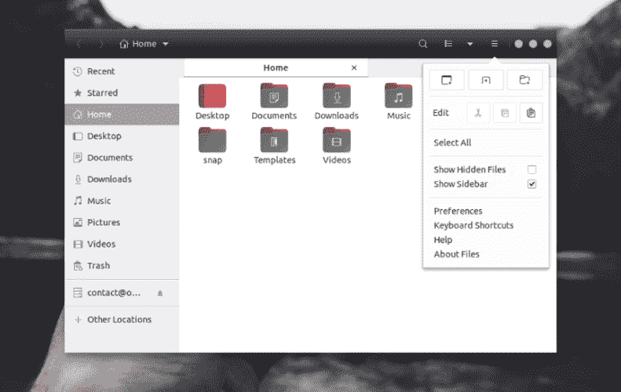

所有平面主题都很流行，但对于那些提供一点优雅和光泽渐变的主题，有一种低调的精致，就像黑暗极光所代表的那样。黑暗极光本身分作 ***【轻松上眼】*** ，它没有让人失望。灰色变体颜色选择不需要关注，而是优雅地作为另一个应用程序的低调背景。

此外，该主题兜售一些最好的窗口边框(当整个窗口镀铬尺寸对我们的口味来说太大时，我们可能更喜欢一个被称为 Borealis 的密集版本)。

如果我们喜欢它的外观，有一种每种颜色都很暗的变体被称为终极暗，但它的亮度较低，而且有多种颜色(不仅仅是灰色)。

### Qogir 主题


使用视觉上引人注目的醒目双色调色板和直线文件管理器背景***【Qogir】***结合起来，以策展一种既有代表性又特别的外观。

但是***【Qogir】***的部分广泛吸引力也来自于其巨大的适应性。

主要主题有三个不同的版本，以及其中的一组子版本(Ubuntu 彩色版本也是如此)。它保证有一个方便每个人的***【Qogir】***主题的变体，排除了他们的特定口味。

在 Ubuntu 中安装这个主题最简单的方法是应用我们可以从 GitHub 页面项目中获得的安装脚本。

### 弧

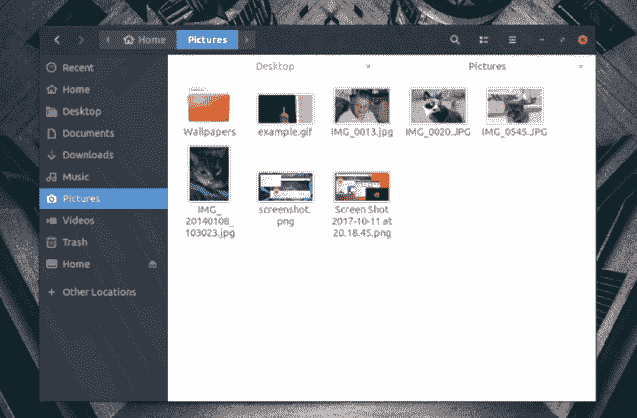

可以说，这个主题是 GTK 与 Linux 用户最著名的主题，在不止一个发行版上赢得了几个粉丝，甚至激发了一些 Windows 定制黑客。

它避开了光泽和渐变，而选择了*(简单明了)。它仍然尽可能晚。这种一致性为窗口、菜单和应用程序提供了现代的最小外观。在窗口元素中(比如 Nautilus 侧边栏)，透明的触摸有助于增加一些质感和活力，这意味着事物永远不会意识到太胖。*

 *GTK 的*弧形主题和其他最新主题一样，有三种变体:深色、浅色和深色(将浅色内容与深色窗口条混合)。*

 *我们可以在 18.04 LTS 版本的 Ubuntu 中安装这个主题，并直接通过回购。如果我们使用的是 20.04 版本的 Ubuntu，我们建议直接从 Gitlab 下载 Arc 的新版本，以获得像素级的完美体验。

### msata 先生

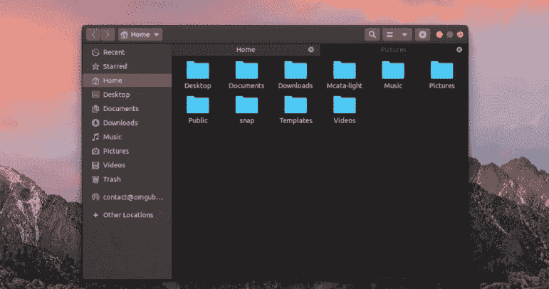

令人惊讶的是，让 Ubuntu 操作系统表现得像一台苹果电脑很容易，之所以如此容易，很大一部分原因是因为有一个顶级的 GTK 主题阵列，它非常准确地模拟了苹果桌面操作系统的外观。

对于 Linux 来说，Mac 的一个绝对伟大的主题是 ***Mcata*** ，它是由***vinceluice***开发的(多产的主题制作者)。

这个主题是作者自己的 ***Mujave 启发的*** 主题的软叉，并且自诩对细节的类似关注，神秘地唤起了 ***苹果的桌面美学的确切感觉和外观。***

但是设计师也处理转换的事情，这使得苹果电脑看起来像苹果电脑，在 Linux 桌面上看起来也很好。作为一个好处，这个主题有浅色和深色两种版本，也有半透明和纯色版本。

我们可以将这个主题与*和 ***操作系统卡特琳娜图标包*** 配对，路人会因为我们没有使用真正的 ***苹果电脑而感到为难。****

 *### 睾丸

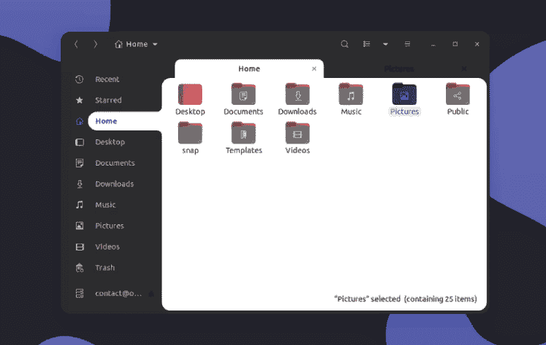

在我们的 Linux 桌面的设置中，简单的菜就能表达出来，那么 Orchis 主题就可以成为一个很好的方式。这个主题主要是深色的，混合了谷歌 的 ***材质设计语言的扁平组件，带有圆角的窗户和触感柔软的调色板。***

本 GTK 主题作品根据 ***娜娜-4*** 开发的 ***本草主题*** 与 ***的其他主题【材料设计】一样。***

Orchis 策划了一个外观，实现了更多的 ***谷歌-y*** 比自己的 ***谷歌的 Chrome OS***如果搭配相同的 ***GNOME Shell*** 主题(由一个类似的作者)这是一个不错的交易。

### 曙光乍现

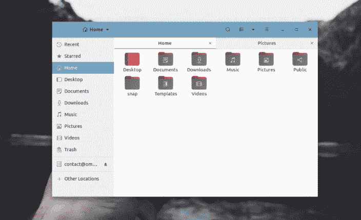

如果戏剧性的视觉陈述或色彩是我们的一杯茶，我们应该注意一下 ***奥罗拉·新 T2***的方式。

新奥罗拉被定义为 ***“粉彩材质设计类似 GNOME 主题”。*** 但这个主题有大量不同的强调色可供选择，对于想要的人来说，还有一个不太扁平的版本。

如果我们喜欢深色 ***【极光】*** 的外观，但又有一点点颜色搭配我们的眼中钉，那么这个主题的咝咝声就会很适合我们(尤其是搭配类似文件夹图标的时候)。

### Numix

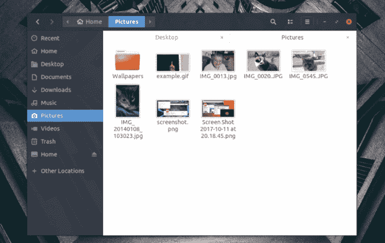

我们可以尝试用*主题来代替 ***弧形主题。******Numix***主题将深色和浅色元素平衡在一起，创造出一个引人注目且丰富的设计，并能自行控制。将红色作为其主要的高光颜色是一个不错的选择，但是它允许***【Numix】***在我们的桌面上留下不同的印象。我们可以使用 ***Ubuntu 软件中心在 Ubuntu 中安装这个主题。****

 *### 适配

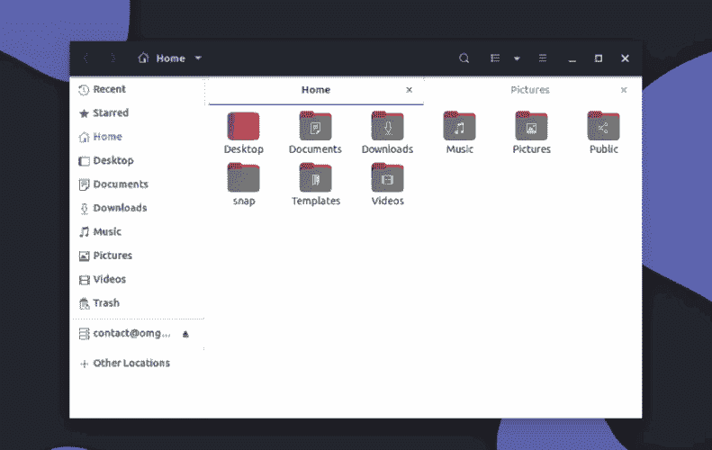

***【adata】***主题(或者更准确地说是借用了***【material】***的主题)在 Linux 的主题制作者(该主题被应用为各种 GTK 主题的基础)和 Linux 用户中都非常有名。

*受到谷歌 ***材质设计语言的鼓励。*** 如果我们是一个 ***安卓审美的粉丝，*** 那么我们会发现这个主题非常有用。这个主题利用了阴影和层次感，良好的对比度，宽敞的填充等等。*

 *虽然，***adata***还有另一个好处:它有一系列快速的版本，包括常见的***adata***主题、被称为***adata-Nokto、*** 的黑暗版本和被称为***adata-ETA 的宽敞旋转版本。*** 大部分也有特定颜色的变体。

如果你希望安装这个主题，那么我们只需要打开终端，添加 PPA(官方)，然后在 18.04 或以上版本的 Ubuntu 中安装这个主题。

```

$ sudo apt-add-repository ppa:tista/adapta -y

```

```

$ sudo apt update

```

```

$ sudo apt install adapta-gtk-theme

```

### 雅鲁色彩

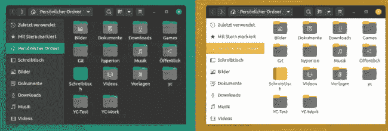

如果我们喜欢 Ubuntu 的 20.04 LTS 默认主题风格，那对我们来说一定很刺激。

我们不再需要坚持过时的橙色配色方案，而是尝试各种各样我们选择的 ***雅茹颜色。*T3】**

此外，它还提供快照支持。因此，如果我们正在使用一个几乎所有其他主题都不起作用的 snap 应用程序，那么我们应该尝试一下。我们也可以修改 Ubuntu 20.0 4 版本中的文件夹颜色。

### 白色太阳

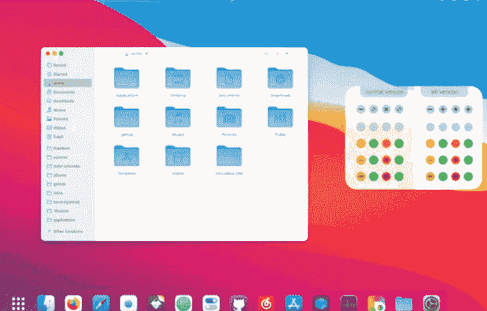

***WhiteSur*** 是为那些希望在 Linux 中拥有类似 ***MacOS 的*** 体验的用户量身定制的。这不是苹果对苹果类型的相似性，尽管它相当令人印象深刻。

此外，如果我们希望让光标主题 看起来像截图中显示的一样好，我们会找到一个 ***光标主题、突进到码头主题、火狐主题、*** 和 ***图标主题。***

### 终极黑暗

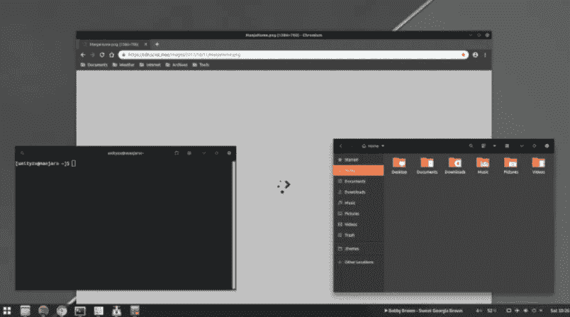

如果我们希望所有的东西都是黑色的，但是在任何主题中都有黑色的变体，那么它对我们的桌面来说都很好看。它必须对我们的眼睛很容易，同时也提供了黑暗模式的良好体验。此外，我们得到了一个梯度和平变在主题包中选择当设置。

### 唯美视觉

***【Vimix】***是现代题材。它通过 ***MacOS 绿色、黄色、*** 和 ***红色*** 按钮，而不直接复制它们，并淡化了主题的活力，成为几乎所有其他主题的单一特定替代方案。 ***Vimix*** 自带各种颜色和三种深色变体可供选择，所以几乎所有人都会得到想要的东西。

### 教授-Gnome-主题

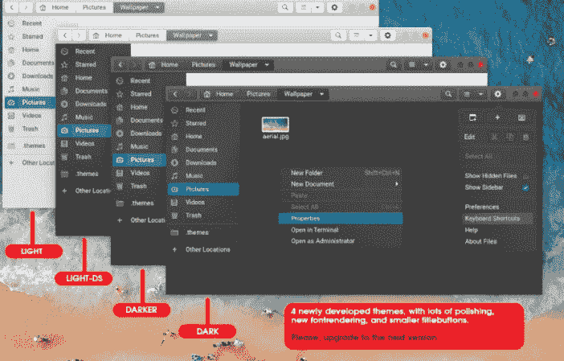

我们会发现各种惊人的黑暗主题。然而，出于一些原因，如果我们不喜欢几乎所有黑暗模式主题中的漆黑阴影，教授-侏儒主题可能是一个很好的选择。

它看起来可能有点过时，但是这个主题有助于区分用户界面不同类型的组件。同样，不难将眼睛连同一个阴影，即 ***暗灰色。*** 它提供了传统的 MacOS 触控，以防对我们来说是一件好事。

### 蚂蚁

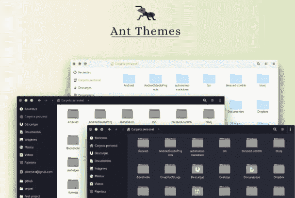

就像***【Vimix】***主题一样，蚂蚁从 MacOS 中获取各种按钮颜色的鼓励，而不直接复制图案或样式。 ***【蚂蚁】*** 为我们桌面上所有看起来梦幻般的颜色提供丰富性，其中 ***Vimix*** 为各种颜色选项调暗色调。这三个选项主题之间的差异非常大，因此可能不适合每个人的口味。

### 平面混音


***【扁平混音】*** 应用橙色、蓝色和红色主题。我们可以在一个主题的顶部添加一个类似于 ***【适应】*** 和 ***弧之间的组合。***

如果我们喜欢这里和那里的颜色，一个粘性的深色主题，和微妙的透明度，那么这个主题就是为我们准备的。

### 纸

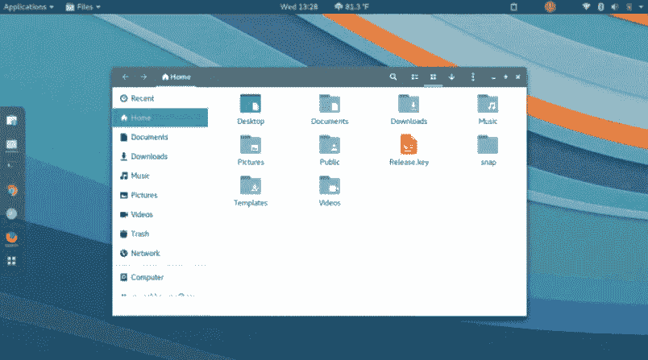

现在，*主题已经全部结束一段时间了。 ***Paper*** 与 GTK 主题相比，其图标包更受欢迎，但这并不意味着这个主题本身不是一个令人惊讶的选项。*

 *### 甜食

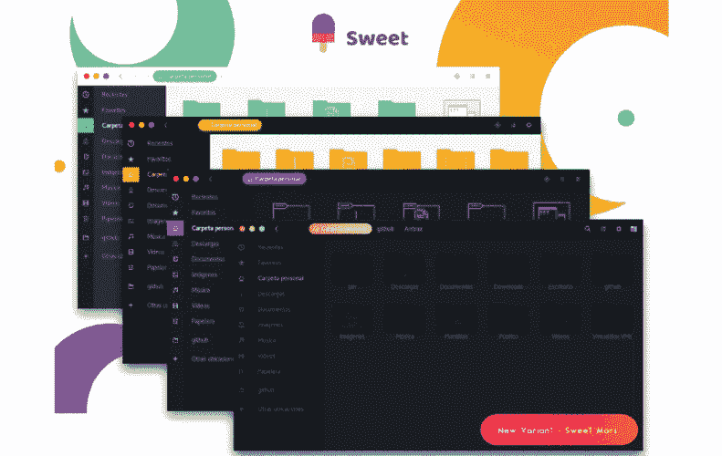

这确实是一个爵士的 GTK 主题，使用了黑暗模式的主题，与几乎所有的东西都融合得很好。它有一个现代和丰富多彩的 GTK 主题，我们应该试一试。

* * ********