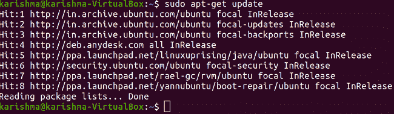
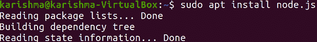
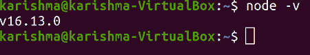
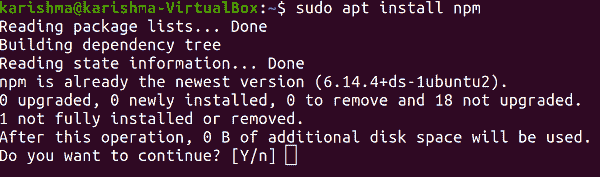

# 更新节点版本 Ubuntu

> 原文：<https://www.javatpoint.com/update-node-version-ubuntu>

***Node.js*** 是一个 JavaScript 的开源运行时环境。因为 Node.js 包含一个活跃的用户社区，所以小的软件更新每隔几周就会出现。我们可能使用 Node.js 作为平均堆栈层，或者在一个不同的 js 框架中。但是，请确保每天更新 Node.js 来维护系统安全，无论我们使用什么方式。

安装 NPM 和 Node.js 的方法有很多，同样，根据我们机器上使用的操作系统，更新 node.js 版本的方法也有很多。

Node.js 是一个著名的跨平台开源服务器端平台，用于构建健壮的应用。平台不断更新，引入新的安全补丁、功能和其他性能改进，因为有一个充满活力的贡献者社区支持它。

因此，更新到 Node.js 的最新版本可以支持我们充分利用这项技术。我们可以决定使用最新版本的 LTS(长期支持)版本来实施，该版本包含最新的方面。

大多数用户通常建议使用 LTS，因为它是一个稳定的版本，有助于可预测的更新版本和较慢的实质性修改引入。

Node.js 从它的生产者那里得到了实质性的改进，要么是关于特性，要么是关于所有新版本的稳定性。它现在非常有名，因为它包含以下方面:

*   在 Chrome 的 V8 JavaScript 引擎上开发的 JavaScript 运行时
*   Node.js 应用了一个非阻塞和事件驱动的输入输出模型
*   它既高效又轻便
*   Node.js 的包生态系统是所有开放系统中最大的生态系统
*   世界各地的源库。
*   由于这些方面，Node.js 很快就非常出名，它是开发 Rest APIs 和构建高扩展性应用的开发人员最喜欢的语言。

## Node.js 概述

***Node.js*** 允许在 ***JavaScript*** 和一组管理许多核心功能的 ***【模块】*** 的帮助下创建网络工具和网络服务器。这些模型是为数据流、加密功能、二进制数据(缓冲区)、网络(UDP、TLS/SSL、TCP、HTTP 或 DNS)、文件系统输入/输出和其他核心功能提供的。Node.js 的模块使用了为减少指定服务器应用的复杂性而设计的API。

JavaScript 语言是 Node.js 本身唯一支持的语言，但是也有几种编译到 js 的语言。因此，Node.js 的应用可以用***【ClojureScript】【TypeScript】【Dart】【coffee script】***等编写。

首先， ***Node.js*** 用于构建网络程序，如网络服务器。PHP 和 Node.js 最重要的一个区别是，PHP 内部的几乎所有函数在完成之前都会阻塞(命令只在旧命令完成之后运行)，而 Node.js 的函数是非阻塞的(命令同时甚至并行运行，并应用回调来发出失败或完成的信号)。

官方说法是，在 macOS、Linux 和 8.1 版本的微软 Windows 和 Server 2012 中支持 Node.js，同时支持 IBM AIX、SmartOS 和对 FreeBSD 的二层支持。此外，OpenBSD 也可以工作，IBM i (AS/400)可以访问 LTS 版本。此外，给定的源代码可能构建在与第三方修改或正式支持的操作系统相同的操作系统上，以支持其他操作系统，如 Unix 服务器和 NonStop 操作系统。

### 平台架构

Node.js 采用了 web 服务器的事件驱动编程，这使得能够在 JavaScript 中快速开发 web 服务器。所有开发人员都可以在不应用线程的情况下建立可扩展的服务器，方法是应用简化的事件驱动编程模型，该模型使用许多回调来表示任务的结束。Node.js 可以将 JavaScript(一种脚本语言)与 Unix 网络编程能力连接起来。

***Node.js*** 是在谷歌 的 ***V8 JavaScript 引擎的基础上开发的，因为它是基于 BSD 许可证开源的。它是通过互联网的基本原理来实现的，如 TCP、DNS 和 HTTPS。此外，JavaScript 是一种非常著名的语言，使得所有的 web 开发社区都可以访问 Node.js。***

### 行业支持

对于 Node.js，有几个开源库可用，大部分都托管在网站上，即***【NPM】***。支持 Node.js 社区的开发人员活动和会议不止一个，包括 Node Summit、Node Interactive、NodeConf 以及几个区域性活动。

开源社区已经改进了 web 框架，以加速应用开发。这样的框架包括 Derby、Meteor、Sails.js、Hapi.js、Koa.js、Feathers.js、Socket。IO、Express.js、Connect 和许多其他工具。此外，还制作了几个包来与运行时环境(如 Microsoft.Net 或其他语言)进行交互。

最新的桌面 ide 为 Node.js 的应用提供调试和编辑功能，这些 ide 包括 Visual Studio Code、Nodeclipse Enide Studio(基于 eclipse)、NetBeans、Microsoft Visual Studio(使用节点定义的 TypeScript 或 Visual Studio 的 Node.js 工具)、JetBrains WebStorm、方括号和 Atom。Node.js 围绕几个云托管平台提供支持，如 Jelastic、Joyent、AWS Elastic Beanstalk、谷歌云平台等。

此外，各种基于网络的在线 IDE 支持 Node.js，如 Koding、Cloud9 IDE、Codenvy、Codeanywhere 以及 Node-RED 中的可视化流编辑器。

## Node.js 的发布

每 6 个月从 GitHub 主分支中删除 Node.js 的新的主要版本。奇数版本的偶数版本在 10 月移除，偶数版本在 4 月移除。当一个新的奇数版本发布时，旧的偶数版本将过渡到 LTS(长期支持)，该版本提供自其指定的 LTS 之日起 18 个月的主动支持。LTS 版本在 18 个月后获得额外 12 个月的维护支持。

一个活跃的版本会在这些变化出现在最新版本中的几个星期后得到非破坏性的改变。维护版本仅获得文档更新和关键修复。 ***长期支持工作组*** 与 ***Node.js 基金会的技术指导委员会*** 一起处理政策和战略。

## Node.js 技术细节

Node.js 是 ***JavaScript*** 的运行时环境，可以在一个循环中处理请求(传入)，这个循环被称为 ***事件循环*** 。


### 相互作用

Node.js 将 ***libuv*** 用于处理异步事件。其中， ***libuv*** 可以描述为基于 ***POSIX 的*** (如 Unix、Linux、NonStop 和 macOS 上的 OSS)和 ***Windows*** 系统上的文件系统和网络功能的抽象层。

### 穿线

Node.js 借助非阻塞 I/O 的多次调用在单线程事件循环上工作，允许它支持多个同时连接，而无需获得线程上下文切换成本。在应用观察者模式的每个请求之间共享一个线程的安排是为了构建应用(高度并发)，其中实现输入/输出的函数必须应用回调。

Node.js 使用 ***libuv*** 的库来容纳单线程事件循环，该循环应用一个线程池(固定大小)，该线程池管理非阻塞异步 I/O 的一些操作

线程池管理 Node.js 中的并行任务执行，主线程任务调用分布式任务队列的 post 函数，可以让线程池内部的线程执行和拉取。像网络这样的非阻塞系统的固有功能转换为内核端套接字(非阻塞)，而像文件输入/输出这样的阻塞系统的固有功能在其线程上以阻塞方式执行。

*   在线程池中，当任何线程完成一项任务时，它会通知主线程，主线程又会收到通知并运行注册的回调。
*   这种单线程方法的一个缺点是，Node.js 不允许在不应用额外模块(如 pm2、StrongLoop Process Manager 或集群)的情况下，通过扩展正在执行的机器的 CPU 内核数量来进行垂直扩展。
*   虽然，开发者可以扩展线程池中的默认线程数，即***【libuv】***。
*   服务器操作系统(操作系统)可能会将这些线程分布在多个内核上。
*   另一个问题是，其他受 CPU 限制的函数和持久的计算会在完成之前冻结整个事件循环。

### V8

***【V8】***可以说是 JavaScript 的一个执行引擎，最初是为 ***谷歌 Chrome*** 开发的。然后在 2008 年被 ***谷歌*** 开源。是用 C++写的。它可以在执行时将 JavaScript 的源代码编译成本机机器码。此外，它包括一个字节码解释器和 2016 年的点火。

### 统一API

***Node.js*** 可以与支持 JSON(如 CouchDB、MongoDB 或 Postgres)和 JSON 数据到统一 JavaScript 开发栈的数据库和浏览器协同工作。

Node.js 允许在服务器端和客户端之间拯救一个类似的服务和模型接口，改变了服务器端的开发模式，比如 MVVM、MVC、MVC 等等。

### 包管理

***npm*** 是 Node.js 服务器平台预装的包管理器，它通过 npm 注册表安装 Node.js 的程序，管理 Node.js 第三方程序的管理和安装，在 npm 注册表中，包的范围可以从像 ***Lodash*** 这样的普通助手库到像 ***Grunt*** 这样的跑路者。

### 事件循环

Node.js 可以向操作系统注册，这样操作系统就会通知它问题，并连接一个回调。所有连接都是 Node.js 运行时中的一个狭窄的堆集合。传统上，重量级的操作系统线程和进程相对管理所有连接。

Node.js 应用事件循环模式来实现可伸缩性，而不是线程或进程。Node.js 的事件循环不需要被其他服务器显式调用(事件驱动)。而是指定回调，服务器在回调定义完成时自动进入事件循环。如果没有其他要实现的回调，Node.js 将退出事件循环。

### WebAssembly

Node.js 提供对 WebAssembly 和实验 WASI 的支持，以及 ***节点 14*** 的 支持。

### 本地绑定

Node.js 给出了一种方法，通过一个被称为 ***的 API(基于 C 的)来制造 ***【附加】*** ，该 API 可以用来制造可导入的(可加载的)。使用 C/C++中指定的源代码的节点模块。模块可以直接导入内存，在 JS 环境中作为 ***CommonJS*** 的简单模块运行。***

N-API 实现依赖于内部 C++/C Node.js 和 V8 对象，这些对象需要用户将 Node.js 特定的头导入到本机源代码中。它会被修改，有时可能会被新版本打破(因此模块需要针对特定的 Node.js 版本进行开发才能正确实现)，因为 Node.js 平台不断地获得 API 兼容性。

第三方已经在 API 头上定义了开源(C++/C)包装器，部分缓解了这个问题。它们澄清了接口，但作为副作用，它们也可能定义了所有维护人员都需要处理的复杂性。尽管如此，Node.js 的核心功能仍然存在于 JavaScript 内置库中，用 C++编写的模型可以用来增强功能和提高所有应用的性能。

需要有必要的头文件和合适的 C++编译器来生成这样的模块(后者通常是用 ***Node.js*** 本身导入的): ***clang，gcc*** ，或者 ***MSVC++*** 。

N-API 与 ***Java 原生接口*** 相同。

## 先决条件

本文假设我们使用的是 Ubuntu 20.0 4 版本。在开始之前，我们应该在系统中拥有一个用户的非根帐户以及***【sudo】***的特权。

## 使用带有 APT 的默认存储库安装 node.js

Ubuntu 的 20.04 版本在其默认存储库中包含一个 node.js 版本，可用于提供跨多个系统的理性体验。

#### 注意:包含在 20.04 版本的 Ubuntu 中的 Node.js 版本，也就是 10.19 版本，现在是未维护且不受支持的。我们不应该在生产中使用它，请参考任何其他部分来安装更最新的节点版本。

我们将使用包管理器，即，易于获得节点版本。我们需要首先通过输入以下命令来刷新本地包的索引:

```

$ sudo apt-get update

```



输入上述命令后，我们将在以下命令的帮助下安装 Node.js 版本:

```

$ sudo apt install node.js

```



我们将通过考虑节点的版本号来检查安装是否成功完成:

```

$ node -v

```



如果包符合我们在存储库中的需求，这就是我们使用 Node.js 所需要做的。

在大多数情况下，我们还希望安装 Node.js 包管理器(npm)。我们可以通过在 apt 命令的帮助下安装软件包来做到这一点，即***【NPM】***:

```

$ sudo apt install npm

```



上面的命令将允许我们安装应用于 Node.js 的包和模块

* * *