# 在 Ubuntu 中安装 pip

> 原文：<https://www.javatpoint.com/install-pip-in-ubuntu>

## 什么是 pip？

**Pip** 可以说是安装 **Python** 包的工具。我们可以使用 **Python 包索引**(简称 **PyPI** )和包的其他索引 **pip** 来下载、搜索和安装很多包。 **pip** 用于安装和管理 Python 软件包。如果安装任何软件包，pip 将首先解决依赖关系，确定它们是否已经安装，然后安装它们，如果它们没有安装在我们的系统上。这个过程方便了 Python 所有软件包的安装和管理，就像 **Python 包索引**(简称 **PyPI** 中提到的那些一样。

**Pip** 也可以描述为**“Pip 安装软件包”的抽象。Pip** 是一个通过命令行实现的**包管理系统**。Ubuntu 的使用可以通过使用 pip 使用 Python 包索引轻松安装几个包。此外，如果我们是软件开发人员，它使我们能够为 Python 项目安装不止一个 Python 包和模块。

*   它是一个包安装工具，用于通过 **PyPI** 和多个存储库获取包。
*   它可以简化软件包的管理和安装过程。
*   它是 Python 项目多环境的包管理器，可以帮助处理依赖项和库。
*   在 Ubuntu Linux 上，pip 安装是一个简单快捷的过程。
*   它链接到一个名为 **Python 包索引**的在线公共包存储库。
*   此外，pip 可以配置为连接到各种包存储库(远程或本地)，假设它们符合 Python 增强提案 503。
*   大多数 Python 发行版都带有预安装的 pip。python 的 2.7.9 和更高版本(python2 系列)以及 Python 的 3.4 和更高版本默认包含 pip。

在本文中，我们将解释如何在 20.04 版本的 Ubuntu 中为 Python 2 和 Python 3 安装 pip。此外，我们将浏览安装基础知识，并使用 pip 处理 Python 包。

## 皮普的历史

2008 年， **Pip** 由 **Ian Bicking** (即 **virtualenv** 包创建者)首次宣布为 **pyinstall** ，作为 **easy_install 的替代品。画中画**是从创作者在他的博客文章中获得的许多推荐中选择的一个新名字。

根据**伊恩·比克**自己的说法，标题是**“Pip 安装软件包”**的递归合成。

**蟒蛇包装管理局**(简称 **PyPA** )是为了从 2011 年由**詹尼斯·莱德尔、【布雷恩·罗斯纳】**和**卡尔** **迈耶**领导的比肯手中接管 virtualenv 和 Pip 维护而开发的。随着 6.0 pip 版本的发布，版本的命名过程被切换为将版本设置为 **X.Y 格式**，然后从版本标签中删除前面的 1。

## 开始之前

**Python** 有两个版本，包括 **Python 3** 和 **Python 2** 。从 20.04 版本的 Ubuntu 开始，Python 3 包含在基本系统安装中，而在另一边，Python 2 通过宇宙存储库进行安装。

有几个用户有动力转向 Python 3。在全局安装 Python 的模块时，强烈建议使用 apt 工具安装模块的 deb 包，因为它们经过测试可以在所有 Ubuntu 系统上正确实现。Python 3 的包用 **python3-** 预固定，Python 2 的包用 **python2-** 预固定。

只有当某个特定模块没有 deb 包时，我们才应该全局首选 pip 来安装该模块。我们应该只在虚拟环境中使用 pip。Python 的虚拟环境允许我们将 Python 的模块安装在特定项目的单独位置，而不是全局安装。这样，我们就不需要担心影响 Python 的其他项目。

## 先决条件

在开始之前，我们需要一个拥有 **sudo** 用户的 Ubuntu 20.04 版本的实例。如果我们还没有任何人，那么我们可以很容易地使用一个全面管理和高性能的**云虚拟专用网**只需 3.71 美元。

## 在 Ubuntu 20.04 中安装 pip

我们可以使用 python 包的官方网站( **PyPI** )获得每个兼容包的列表。此外，我们可以在这个网站的帮助下获得关于安装过程的支持。

例如，如果我们希望安装一个软件包，如**“scrapy”**，这是应用于网刮的软件包。此外，为了更好地理解，我们可以获得包的文档。

为了安装画中画文件，我们需要输入下面提到的命令:

```

$ sudo apt install python3-pip

```

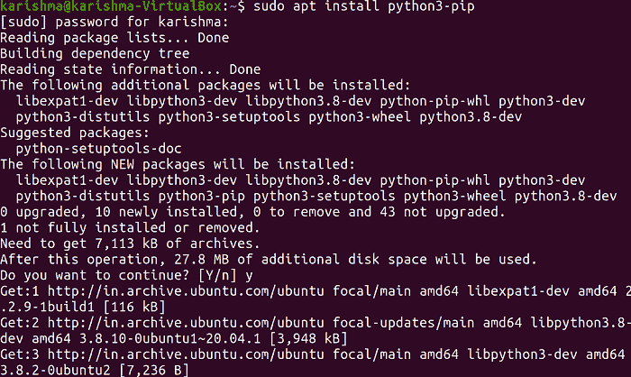

这个命令会提示我们，并询问我们是否要安装(y/n)，其中我们需要点击***【y】***进行安装过程，如下图截图所示:

安装的 pip 版本可以通过下面提到的命令来识别:

```

$ pip --version

```

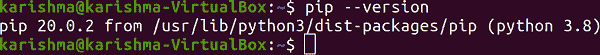

现在，如果我们想知道如何应用 pip 命令和其他可用功能，我们可以通过在我们的终端中输入下面提到的命令来检查它们:

```

$ pip --help

```

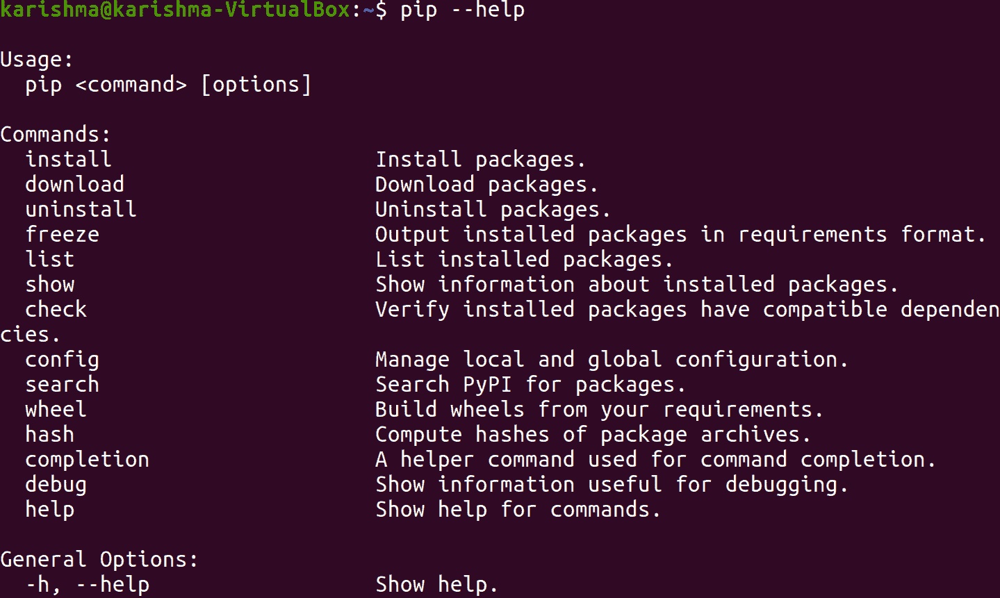

现在，我们可以使用上面的截图进行检查，第一个命令用于安装软件包。那么，让我们举一个安装 python 包的例子，即*。我们可以通过输入下面提到的命令来实现:*

```

$ pip3 install scrapy

```

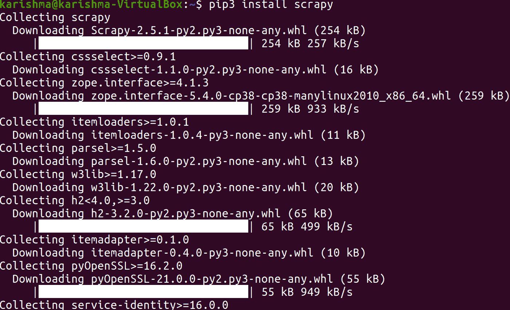

此外，我们可以通过追求完全相似的语法来安装我们选择的其他包。

通过在我们的终端中输入下面提到的命令，我们可以看到在安装过程之后是否安装了软件包:

```

$ pip3 list

```

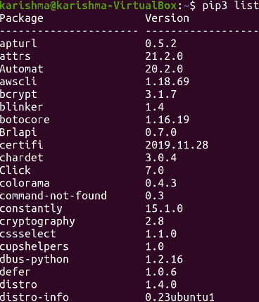

上面的命令将向我们显示每个已安装软件包的列表，我们可能需要向下滚动来检查我们已安装的软件包。

### 使用 pip 升级软件包

我们可以使用以下命令将已经安装的软件包升级到当前版本:

```

$ pip3 install --upgrade package_name

```

### 卸载 Python 包

我们可以通过输入下面提到的命令来卸载已安装的任何旧软件包:

```

$ pip3 uninstall scrapy

```

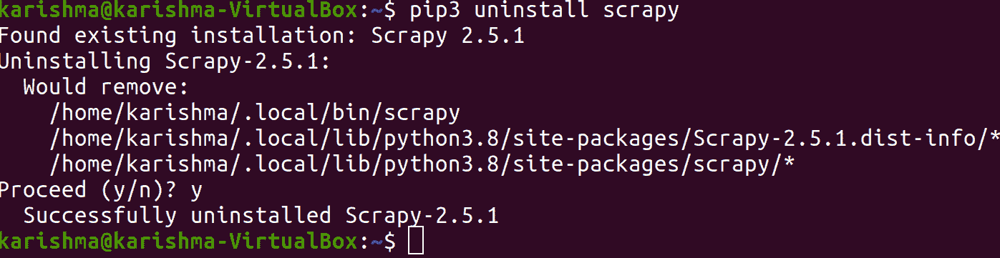

## 为 Python 2 安装 pip

对于 Python 2，pip 包可以在宇宙存储库中找到。但是，如果我们的系统中没有它，那么我们可以借助终端中的以下命令来安装它:

```

$ sudo add-apt-repository universe

```

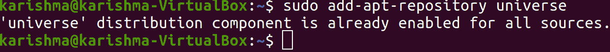

为了更新包列表，我们可以输入下面提到的命令:

```

$ sudo apt update

```

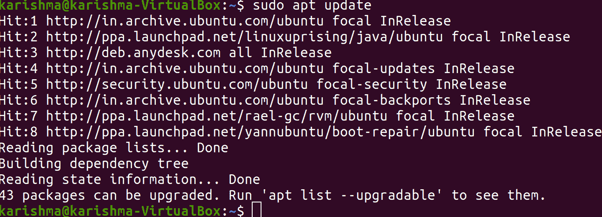

首先，我们将安装 Python 2 的最小包:

```

$ sudo apt install python2-minimal

```

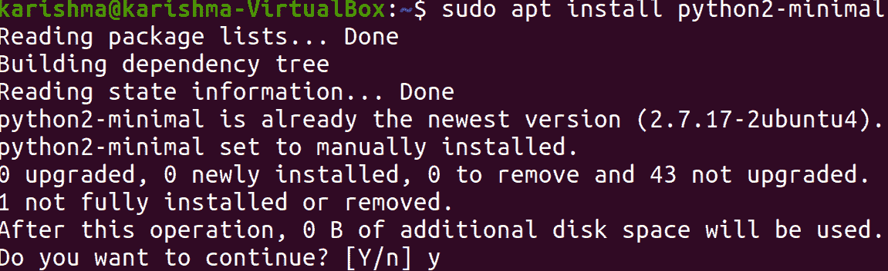

对于 Python 2，20.04 版本的 Ubuntu 中不包含 pip 包。所以，我们需要应用 pip 的安装脚本。该命令如下所述:

```

$ curl https://bootstrap.pypa.io/pip/2.7/get-pip.py -o get-pip.py

```

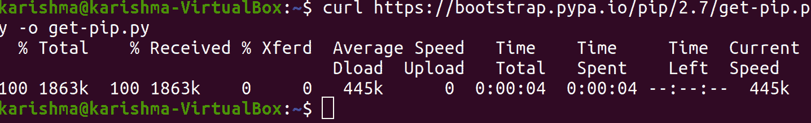

然后，我们需要运行 Python 脚本和 python2，以便在我们的系统上安装 pip。为此，我们可以使用以下命令:

```

$ sudo python2 get-pip.py

```

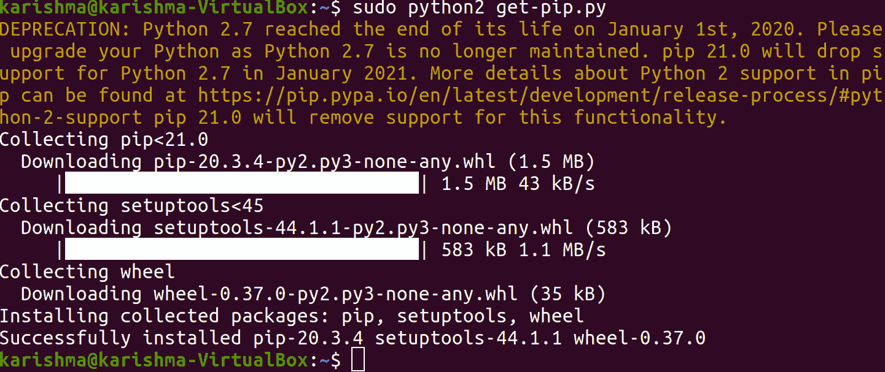

我们可以通过输入以下命令在安装过程后检查 pip 版本:

```

$ pip2 --version

```

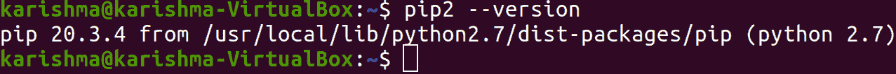

### 如何在 Ubuntu 中用 pip2 检查已安装的包

我们可以在终端中使用以下命令，使用 pip2 列出每个已安装的包:

```

$ pip2 list

```

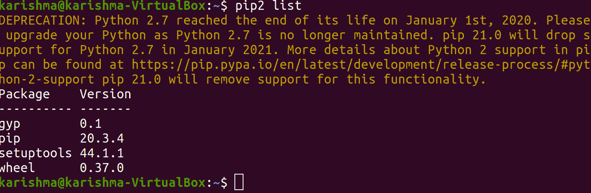

我们可以看到结果显示了使用 pip2 安装的包:

### 用 Ubuntu 中的 pip2 升级软件包

此外，我们可以使用 pip2 命令升级已安装的软件包。我们可以使用以下语法升级任何软件包:

```

$ pip2 install --upgrade [package_name]

```

### 在 Ubuntu 中卸载带有 pip2 的包

如果您希望从我们的 Ubuntu 系统中卸载任何软件包，我们可以使用 pip2 命令中的选项，即 ***【卸载】*** 。使用 pip2 卸载软件包的语法如下:

```

$ pip2 uninstall [package_name]

```

### 在 Ubuntu 20.04 中卸载 Pyhton3 的 pip

对于 python3，如果我们希望卸载一个 pip 包，那么我们可以通过在终端中输入下面提到的命令来完成:

```

$ sudo apt purge python3-pip

```

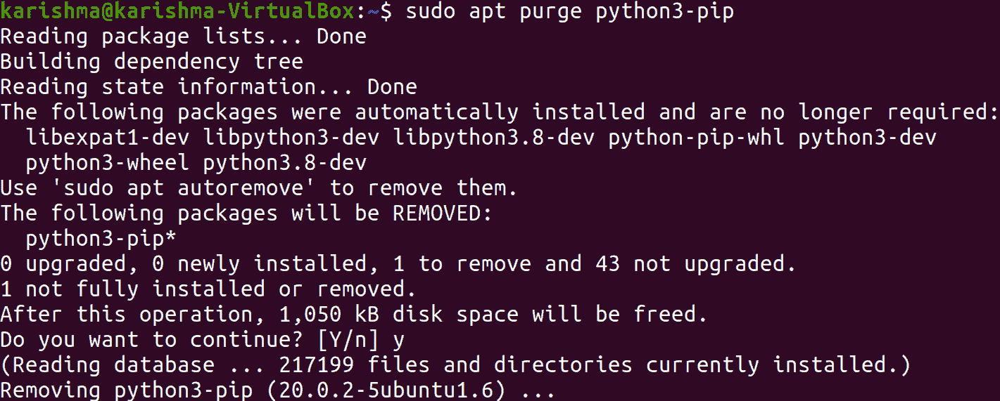

## 结论

python 的代码运行速度更快，并且有几个模块需要实现以增强程序的功能。Python 是最容易学习和简化的编程语言之一。在本文中，我们学习了如何在 20.04 版本的 Ubuntu 操作系统中安装 python 3 和 python 2 的 pip 包。此外，我们还学习了如何卸载 pip 和包。

* * **