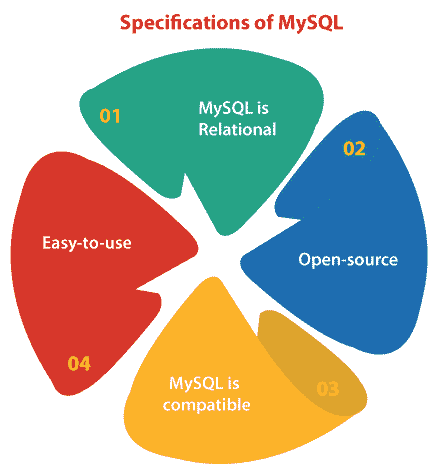
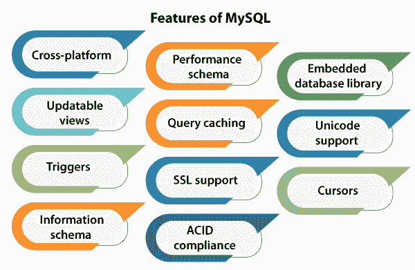
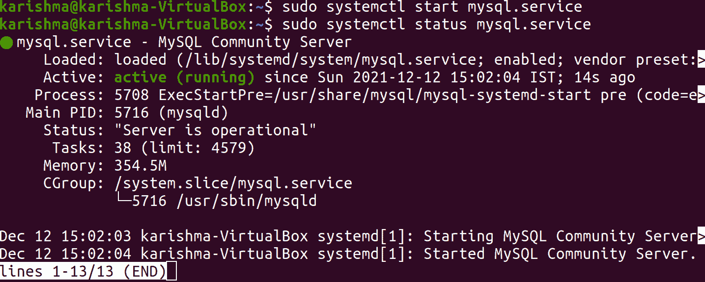
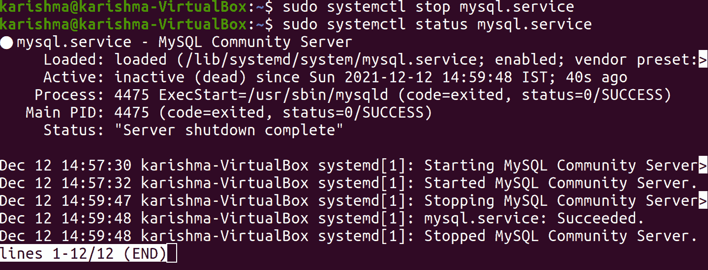
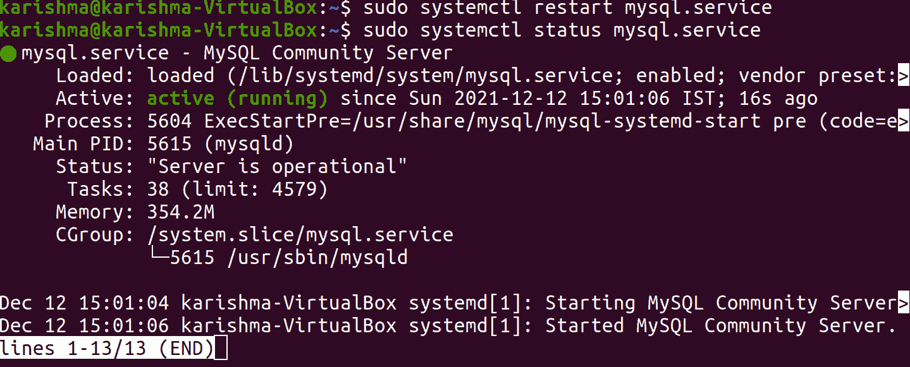

# 重启 MySQL Ubuntu

> 原文：<https://www.javatpoint.com/restart-mysql-ubuntu>

**MySQL** 可以描述为一个数据库管理系统(开源)，一般安装为著名的 **LAMP** 的一部分(Linux、Apache、MySQL、Perl/PHP/Python)栈。它应用结构化查询语言(SQL 的缩写)并操作关系模型来管理其数据。
这是最新大数据生态系统中最知名的技术。通常被认为是最著名的数据库，目前无论生产如何都有效且广泛使用。很明显，任何涉及一般信息技术或企业数据的人至少应该以熟悉 MySQL 为目标。
任何刚接触或不熟悉关系系统的人都可以用 **MySQL** 构建强大、安全、快速的数据存储系统。 **MySQL** 的编程接口和语法也是进入其他著名的结构化数据存储和查询语言的巨大世界的理想网关。

## MySQL 概述

[**MySQL**](https://www.javatpoint.com/mysql-tutorial) 是用 [**C++**](https://www.javatpoint.com/cpp-tutorial) 和 [**C**](https://www.javatpoint.com/c-programming-language-tutorial) 写的。MySQL 的 SQL 解析器是用 **yacc** 编写的，不过它应用的是一个自酿词法分析器。MySQL 在各种系统平台上实现，包括 Tru64、Sanos、SCO UnixWare、SCO OpenServer、SunOS、Symbian、Oracle Solaris、QNX、OS/2 Warp、OpenSolaris、OpenBSD、Novell NetWare、NetBSD、Microsoft Windows、macOS、Linux、IRIX、IBM i、eComStation、ArcaOS、HP-UX、FreeBSD、BSDi 和 AIX。此外，还提供了一个到 OpenVMS 的 MySQL 端口。
MySQL 的客户端库和服务器软件本身采用双授权的分发方式。它们是根据第二版 GPL 或专有许可证提供的。官方手册可以提供支持。此外，免费支持以独特的 IRC 形式和渠道提供。甲骨文通过其 **MySQL 企业产品**促进付费支持。此外，它们在服务范围和价格上也有所不同。此外，还有第三方组织提供服务和支持。
MySQL 获得了各种积极的评价，这些评价者注意到它“在一般情况下实现得非常好”，并且“开发人员的接口在那里，文档也在那里”。此外，它已被检查为一个真正的多用户，稳定，快速的多线程数据库服务器的 SQL。

## MySQL 的规范



### MySQL 是关系型的

主要因素是如何在高水平上管理数据，从而通过其他数字存储范围来区分关系数据库。许多数据库，如 MySQL，包括高度编码的、独立的和多个表中的记录，而不是一个无所不包的非结构化或半结构化文档的集合或存储库。

*   它允许关系数据库系统更好地利用更新信息、数据检索等操作，或者更复杂的操作，如聚合。
*   在数据库的每个内容上指定一个逻辑模型，例如指定单个列中允许的值、视图和表的特征，或者如何从两个不同的表中关联索引。
*   几个关系模型因各种原因而出名。
*   它们鼓励用户使用声明性和直观的编程语言，本质上是用语言告诉数据库希望什么样的结果。
*   它将工作转移到 SQL 和 RDBMS 引擎中，以更好地节省和执行宝贵的人力和资源的逻辑规则。

### 开源的

任何企业和个人都可以自由扩展、发布、修改和使用甲骨文的开源 MySQL 代码库。该软件发布在 **GNU GPL(通用公共许可证)**上。

*   对于要求包含或集成到商业应用中的 MySQL 代码(或者当开源软件不是优先考虑的事项时)，许多企业可以从甲骨文购买商业许可版本。
*   如果企业决定使用 **MySQL** 实施，这些替代方案为企业提供了额外的灵活性。
*   开源版本的社区和基于公共的性质丰富了 MySQL 的在线支持和文档文化，同时也确保了新开发或持续的功能永远不会与用户需求相差太远。

### MySQL 是兼容的

MySQL 被开发为与其他架构和技术兼容，尽管经常与 web 服务或互联网应用协作。关系数据库管理系统运行在每一个主要的计算环境中，包括基于 Unix 的操作系统，比如无数的 Linux 发行版、Windows 和 T2 macOS。
**MySQL**的**客户端-服务器架构**规定它也可以支持一系列后端和不同的编程接口。由于语言和架构的相似性，数据可以通过 MySQL 迁移到它的分叉( **MariaDB** )和大多数其他关系数据库管理系统。

*   既定的第三方迁移和甲骨文工具进一步允许 MySQL 将数据移动到大量公共存储系统并通过这些系统，但是，这些系统是基于云或内部开发的。
*   MySQL 可以在集中式或分布式虚拟化环境中使用，甚至可以作为库来学习小型的、测试用途的应用。
*   MySQL 与其他软件和系统的广泛兼容性使其在大多数情况下成为关系数据库管理系统的实用选择。

### 易于使用

也许，表范例是最直观的，并且允许更高的可用性，尽管 **MySQL** 的关系性质和严格的存储结构可能看起来是限制性的。事实上， **MySQL** 通过标准但丰富的时间类型、日期、字母数字、数字和逻辑到更高级的地理空间或 JSON 数据，做出了多项确认，以支持可能的巨大数据结构范围。

*   除了昂贵的内置功能集合和简单的数据类型，MySQL 的生态系统还包含一系列工具，可以简化从服务器管理到数据分析和报告的一切。
*   不管关系数据库管理系统的总体架构如何，用户都可以找到一个 MySQL 方面，允许他们按照自己的意愿对数据进行编码和建模。
*   MySQL 仍然是最容易使用和学习的数据库技术。

## MySQL 的特性

**MySQL** 提供了两个不同的版本:**专有企业服务器**和**开源 MySQL 社区服务器。MySQL 企业服务器**由一个专有的扩展系列分开，该扩展系列像服务器插件一样安装，但它分发版本的编号系统，并使用类似的代码库开发。
MySQL 5.6 版本的一些主要特性解释如下:



*   跨平台支持
*   一个 **ANSI SQL 99** 广泛的子集和扩展。
*   过程语言几乎遵循 PSM/SQL 的存储过程。
*   可更新视图
*   光标
*   扳机
*   信息模式
*   如果应用了 **InnoDB** 存储引擎，则在线**数据定义语言**(简称 **DDL** )。
*   性能模式，它收集和组合有关查询性能和服务器执行的统计信息，以进行监控。
*   一组用于控制运行时行为的 SQL 模式选项，例如遵守 SQL 标准的严格模式。
*   如果应用了 **InnoDB** 存储引擎，事务的保存点(默认)。此外，NDB 集群存储引擎支持事务。
*   查询缓存
*   SSL 支持
*   **如果使用 NDB 和 **InnoDB 集群存储引擎**，则符合 ACID 标准**。
*   子选择(例如**嵌套选择**)
*   内置复制支持
    *   **虚拟同步:** MySQL 服务器支持多主的自管理组可以使用组复制的内置插件或者**T3】Galera 集群 T5 来实现。**
    *   **同步复制:**多主复制在 ***MySQL 集群*** 提供。
    *   **半同步复制:**在这种类型中，是指主机等待复制的从机复制。
    *   **异步复制:**在这种类型中，从单个主设备到多个从设备的从设备到多个主设备到单个从设备的从设备。
*   全文搜索和索引
*   嵌入式数据库库
*   优化器中的分区表和分区修剪
*   Unicode 支持
*   MySQL 集群中的无共享集群
*   多个存储引擎，允许一个引擎选择最适合应用中所有表的存储引擎。
*   许多本地存储引擎，包括 NDB 集群、黑洞、CSV、归档、联合、内存(堆)、合并、InnoDB 和 MyISAM。
*   提交分组，从多个连接中收集多个事务，以增加每秒提交数。

### MySQL 的局限性

当使用除***【InnoDB】(默认)*** 之外的一些存储引擎时，MySQL 不符合一些已实现功能(如外键引用)的完整 SQL 标准。此外，在 8.0.15 版本的 MySQL 之前，每个存储引擎都可以解析但避免检查约束。
触发器在 MySQL 5.7 版本之前被限制为每次定时/动作一个，这意味着最多可以指定一个触发器在一个操作之后运行，即***【INSERT】***和一个在相似表上的***【INSERT】***之前的触发器。无法在视图上指定触发器。
2038 年 1 月 19 日，***【UNIX _ 时间戳】*** 等 MySQL 数据库内置函数在 ***03:14:07 UTC*** 后返回 0。最近有人试图解决这个被指定在内部队列中的问题。

### MySQL 的部署

***MySQL*** 可以使用源代码手动安装和构建，但更基本的是使用二进制包安装，除非需要独特的定制。包管理系统可以用最少的努力获得和安装 MySQL，在大多数 Linux 发行版上，调整优化和安全设置通常需要进一步的配置。

### 高可用性应用

***Oracle MySQL*** 通过混合使用各种工具提供高可用性应用，包括 ***MySQL shell*** 和 ***MySQL 路由器*** 。它们基于开源工具和组复制。与其他产品相比，MariaDB 提供了同样的优惠。

## 如何重启 MySQL 服务器？

我们可以使用命令，即“ ***【服务】*** 在 Ubuntu 中执行启动、停止、重启 MySQL 服务器等常见操作。首先，我们需要登录到我们的 web 服务器并输入以下命令之一。
我们可以输入下面的命令来启动 Ubuntu 中的 MySQL 服务器:

```

$ sudo systemctl start mysql.service
$ sudo systemctl status mysql.service

```



我们可以输入以下命令来停止 Ubuntu 中的 MySQL 服务器:

```

$ sudo systemctl stop mysql.service
$ sudo systemctl status mysql.service

```



我们可以输入以下命令来重启 Ubuntu 中的 MySQL 服务器:

```

$ sudo systemctl restart mysql.service

```

我们可以输入下面的命令来检查 Ubuntu 中 MySQL 服务器的状态(无论它是否在运行):

```

$ sudo systemctl status mysql.service

```



* * *