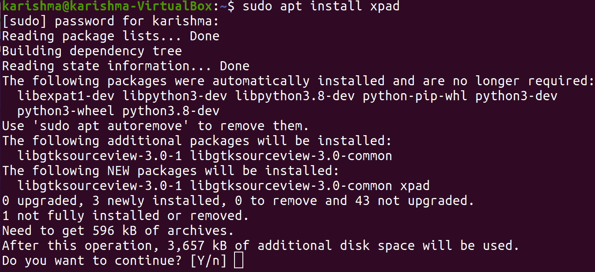
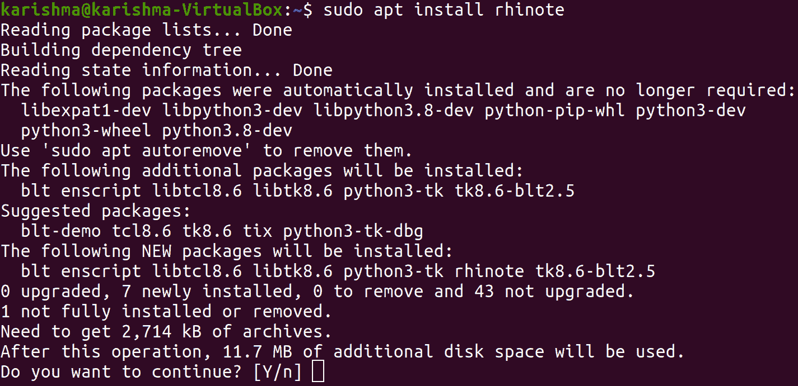
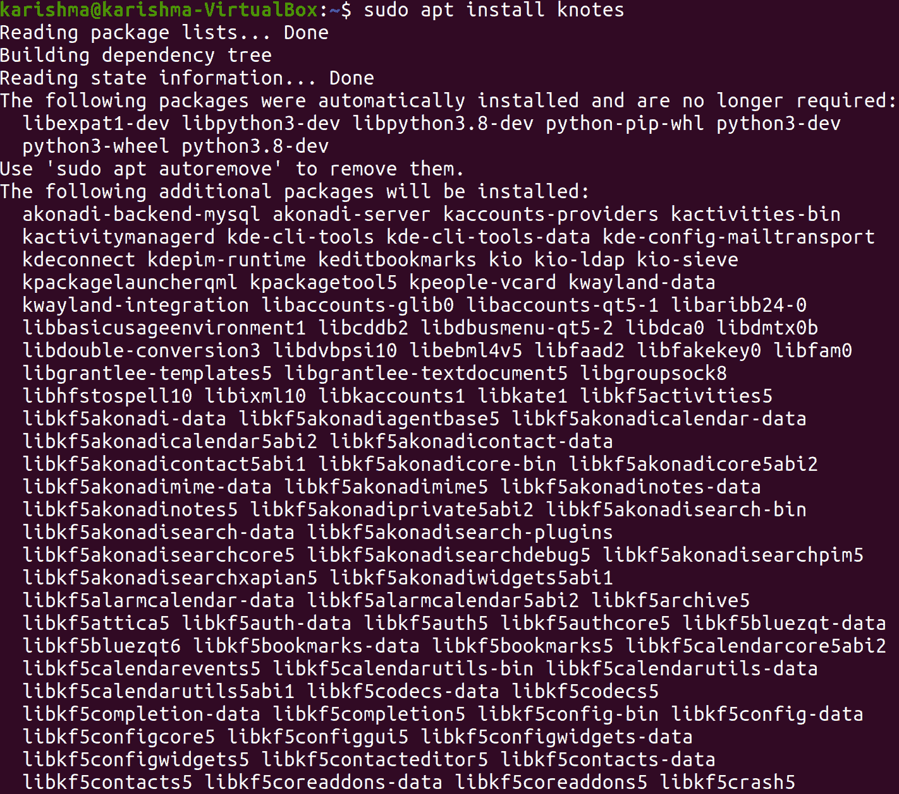
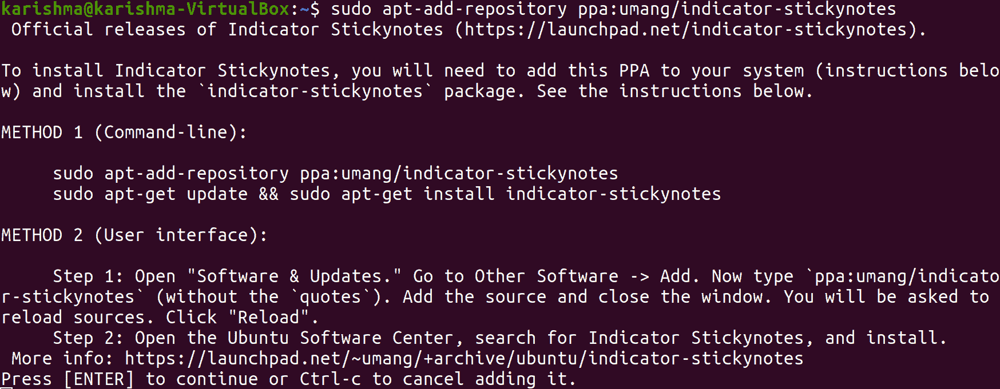
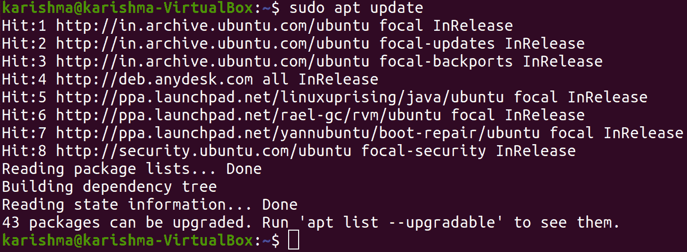
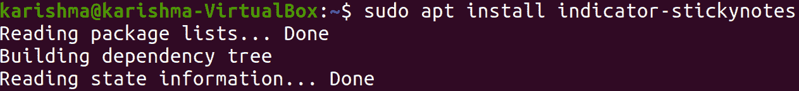
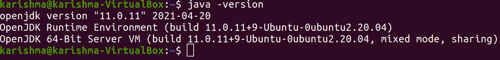
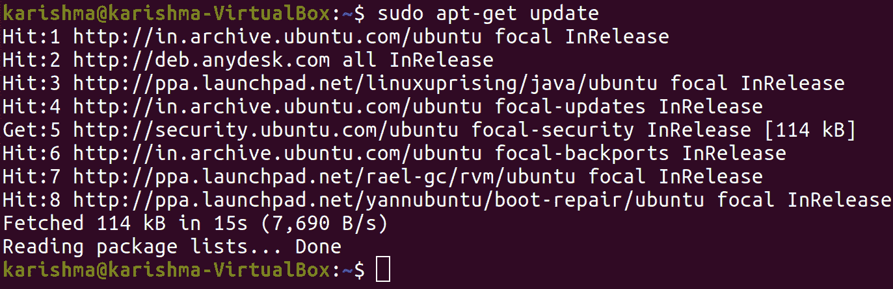
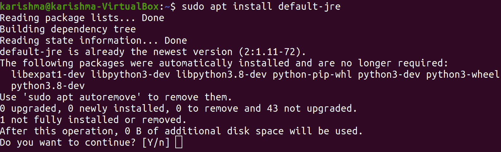

# Ubuntu 的便利贴

> 原文：<https://www.javatpoint.com/sticky-notes-for-ubuntu>

## 什么是便利贴？

***便利贴*** 可以描述为 Windows 10、Windows 8、Windows 7 中包含的桌面便利贴软件。该应用程序加载速度非常快，所有用户都可以在桌面上的便利贴(如 Windows)的帮助下快速抓取笔记。

2002 年，便利贴来自 ***Windows XP 平板版*** ，作为 Windows 侧边栏的任意小工具被包含在 ***Windows Vista*** 中。根据微软的数据，截至 2016 年 4 月，每月有 800 万便利贴用户。它是由微软团队在 Outlook.com 开发的。

*   ***【便利贴】*** 则在用户的水桶中划过更长的时间。
*   这一有用的工具最初是以硬拷贝的形式提供的，现在随着数字化的出现而变得可用。
*   此外， ***便利贴*** 已经在手机和计算设备中出名。
*   全球各地的人们都可以从便利贴中获益，不管他们的职业是什么。
*   ***例如*** 读书人或学生可以使用此工具标记自己的书籍页面，网络助手或 PC 用户可以将其用作电缆识别器，并将其与任何电缆绑在一起，以方便识别乱七八糟的任何电缆。
*   让我们进入这个工具的数字化版本:如果我们从 Windows 操作系统切换到任何 Linux 发行版，尤其是 Ubuntu 操作系统，我们可能会意识到缺少 Windows 支持的几个工具，比如便利贴(内置)。
*   这并不意味着我们不能受益，因为 Ubuntu 支持各种各样的便利贴应用，我们可以使用***【Ubuntu 软件中心】*** 或者我们可以从互联网上手动下载。

## 便利贴的发展

正宗的 ***便利贴*** 被称为带有 ***视窗 Vista 的 ***小工具*** 。*** 这些小工具在 Windows 7 中得到了扩展，使用便利贴本身就变成了在 Win32 平台上开发的独立应用程序，可以在启动时继续运行。这个版本不支持笔直接输入。提供了其他五种颜色，但黄色是默认颜色。便利贴有任务栏预览和跳转列表，在堆栈中显示便利贴。便笺会自动保存。这个版本在微软的第 8 个版本和 Windows 10 的初始版本中被重用。

*   在 Windows 10 周年更新中宣布了在 ***通用 Windows 平台*** 上建立的新便利贴版本，并于 2016 年发布。
*   它可以作为 Windows Ink 工作区的一部分或一个独立的应用程序启动。
*   后一种技术导致音符后面的空间变得模糊。
*   新版本直接接受笔输入，可以识别手写文本、图片和基本文本格式中的字母和单词。
*   它被制作成粘在桌面上或四处移动。
*   新鲜的便利贴提供股票信息，如果写了或打了股票代码，如果写了或打了航班号，它会提供航班信息。
*   它包括 ***Cortana 集成*** ，可以使用包含日期的笔记进行提醒。
*   这个版本的 ***任务栏预览*** 显示一个 ***股票图像*** 而不是用户做的笔记，不像 Windows 7 版本。
*   最初，它没有任何跳转列表，但是，它在 2017 年 2 月 6 日被重新包含在 1.6.2 版本中。

## 跨平台

***便利贴*** 可以在多台设备上同步便利贴，不仅可以同步到 Windows 10 设备，还可以同步到 ***【安卓】*** 和 ***iOS*** 设备，以及执行***Windows Outlook***和 ***Microsoft OneNote。*** 此外，在 OneNote 的网站上，在模糊的位置，即[onenote.com/sticky](https://www.onenote.com/?404&public=1)笔记，可以使用用于编辑便笺的网络客户端。微软启动器可以在安卓设备上显示与 OneNote 应用本地实例同步的便笺。

在这篇文章中，我们将列出一些由 Ubuntu 提供的流行的 ***便利贴应用程序*** 。

## Ubuntu 趋势便利贴应用

***便利贴*** 的应用有几个方面的帮助。我们可以自发地获得关键点或想法，并可以存储起来供记忆以备将来使用。这一部分包括一些我们可以在我们的 ***Ubuntu 操作系统中使用的流行应用程序。***

### XPD

这是一个在 Ubuntu 中广泛使用的简单的便签应用程序。它很容易出现在***【Ubuntu 软件中心】*** 上，或者我们可以通过命令行窗口获得这个应用程序。这些黄色的 ***便利贴*** 包含三个字段:一个 ***工具栏、*** 一个 ***文本区、*** 和一个 ***标题栏。*** 右键点击一个注释的文本区域将代表上下文菜单，在其中我们将获得 ***首选项菜单。*** 当我们启动 Linux 时，我们可以使用 ***【启动】*** 选项卡来确保 ***Xpad*** 自动加载。以前的笔记将被恢复，但请记住，当笔记关闭时，它们将会消失。

#### 注意:如果 Xpad 没有出现在我们的应用程序菜单中，我们可以使用命令行手动启动。

该工具是一个易于使用的便签应用程序，在 Linux 中可用，对所有便签都有各种格式选项。*(基于任务)支持颜色编码，允许我们设置音符特定的颜色。*

 *#### 注意:在某些情况下，Xpad 可能已经预装在我们的 Linux 计算机上，因此在安装应用程序之前请进行检查。

### XPD 下一个

该应用的一些突出方面如下所述:

*   多个窗口支持
*   立即存储内容
*   自定义字体颜色、字体样式和背景颜色。
*   为详细的字体定制、注释大小、背景颜色等提供隔离窗口。
*   调整笔记窗口的大小，也可以将其拖过电脑窗口。

### 他妈的

*的一些重要缺点如下:*

 **   一些笔记应用程序允许密码保护，但 Xpad 不提供此功能。
*   电子邮件和网络网址无法识别。

### 如何在我们的 Ubuntu 操作系统上安装 Xpad？

我们可以使用 ***Ubuntu 软件中心*** 或 ***终端获得 ***Xpad*** 应用。*** 如果我们不想使用 Ubuntu 软件中心安装这个应用程序，那么我们只需要打开我们的终端，执行下面的命令来安装应用程序:

```

$ sudo apt install xpad

```



### 犀牛

***犀牛*** 是便利贴的一个重要应用，目前为 Ubuntu 提供。与上面提到的应用程序相比，它在界面和功能方面是一个非常常见的应用程序。此外，该工具在 ***【乌班图软件中心】*** 中可用，我们也可以在 ***终端*** 的帮助下轻松安装 ***犀牛*** 。该工具的一些独特之处如下。

### 鼻特特征

它支持一些非常常见的功能，比如移动便笺的窗口，调整它的大小，以及我们可以将它保存为文本文件。

### 犀牛监狱

由于 ***【犀牛】*** 非常通用的特性和界面支持，它有很多缺点，下面会提到:

*   我们需要手动保存文件，因为它不提供即时保存选项。
*   没有更多的字体样式。
*   它没有为字体或笔记窗口提供丰富多彩的界面。

### 如何在 Ubuntu 中安装犀牛？

在 Ubuntu 中安装犀牛有两种不同的方法。这两种方法解释如下:

1.  我们可以使用 ***Ubuntu 软件中心安装 ***犀牛*** 。*** 要做到这一点，我们需要在 Ubuntu 软件上找到 ***【犀牛】*** 。
2.  第二种方法是，我们需要打开终端窗口并运行以下命令:

```

$ sudo apt install rhinote

```



### 结结结结结结结结结结结结结结结结结结结结结结结结结结结结结结结结结结结结结结结

它是笔记客户的另一个有用的工具。但是，它的界面非常经典。该工具具有一系列特性，可减少 ***KNotes 的界面问题。*** 这个工具是为 ***KDE 台式机、*** 开发的，但也兼容其他几款台式机。

此外， ***KNotes*** 支持 ***拖放功能，*** 同时支持我们配置背景和字体颜色的选择。 ***例如，*** 我们可以做一个笔记，通过将它放入邮件的正文中来发送。或者，我们可以将它拖到 KDE 日历应用程序中，以阻塞一个时隙。

该工具的许多值得注意的展示解释如下:

### KNotes 的优点

*   它支持朗读文本和拼写检查功能。
*   我们可以打印和发送便利贴。
*   我们可以自定义字体和笔记背景颜色的样式。
*   它为我们想要写的所有东西提供自动插入时间和日期。
*   它便于为便笺设置提醒。
*   我们可以找到任何一张纸条，然后把这些纸条钉在其他窗户的头上。
*   此外，笔记可以打印。

### 结结结结结结结结结结结结结结结结结结结结结结结结结结结结结结结结结结结结结结结结结结结结结结结结结结结结结结结

*   它不提供密码保护选项。
*   无法识别电子邮件地址或超链接。

### 如何在 Ubuntu 中安装 KNotes？

在 Ubuntu 中，我们可以通过在终端运行命令来安装应用程序，如下所述:

```

$ sudo apt install knotes

```



安装完成后，我们可以使用 ***附件菜单执行*。**** *它将与我们桌面面板系统托盘部分的图标一起启动。*

 *### 指示器指针

这个便利贴应用程序是开源的，可用于 Ubuntu 的发行版。这个应用程序非常适合普通用途。此外，它提供了更少或更多的功能，如 ***Xpad。*** 此工具提供 ***每注*** 设置和格式。很快，我们可以做一个笔记，并修复它的格式和类别。

生成的注释便于在我们的桌面周围重新定位。我们应该在 Linux 的包管理器中看到 ***指示灯不变*** 。

### 指示器指针的优点

指标粘性的几个方面如下:

*   它支持多个窗口，可以将所有笔记保存为不同的类别。
*   用户可以为许多类别自定义笔记窗口的字体颜色、字体样式和背景色。
*   它启用锁定模式，以避免任何意外修改。
*   它包括一个导出和导入功能，我们可以将其应用于存档笔记或将其与其他计算机同步。

### 指标坚持缺点

除了下面提到的这些方面，这个工具还有一些缺点:

*   它无法访问桌面环境之外的笔记。
*   没有电子邮件或网址识别。

### 如何在 Ubuntu 中安装指示器 stickynotes？

安装 ***【指示器粘贴】*** 在 Ubuntu 中获得应用有几个前提条件。首先，我们需要在我们的 Ubuntu 计算机中包含***【PPA】***并安装它。

我们需要打开我们的 ***Ubuntu 终端*** 并执行下面提到的命令:

```

$ sudo apt-add-repository ppa:umang/indicator-stickynotes

```



```

$ sudo apt update

```



```

$ sudo apt install indicator-stickynotes

```



### GloboNote

它是一个基于****Java 的*** 便利贴应用。它提供了多种多样的音符类型。日志、提醒、待办事项和其他便利贴可以被建立并协调成组。此外，添加了一个有用的搜索工具来帮助我们查找以前的笔记。*

 *### 如何安装 GloboNote？

我们可以从安装 ***JRE (Java Runtime)*** 开始，使用终端安装 ***GloboNote。*** 首先检查以确保我们没有安装 Java 版本。

我们可以在终端中使用以下命令检查 Java 版本:

```

java -version

```



接下来，我们需要更新存储库的信息:

```

$ sudo apt-get update

```



然后，我们可以使用以下命令安装最新版本的 Java:

```

$ sudo apt install default-jre

```



* * *****