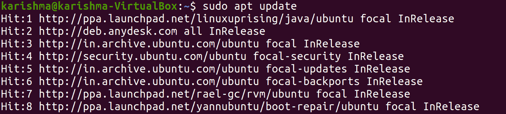
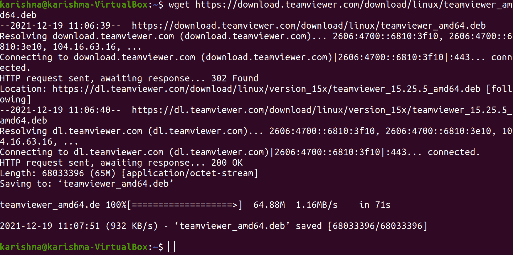
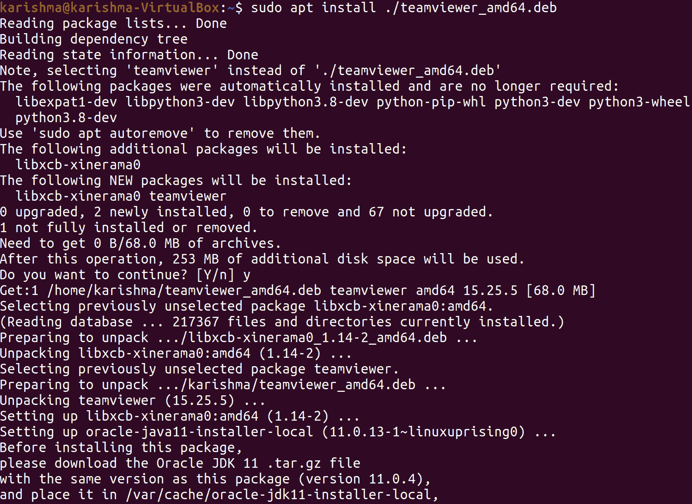
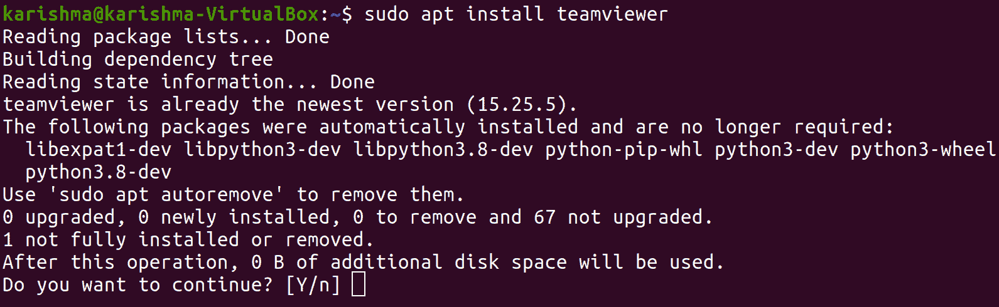
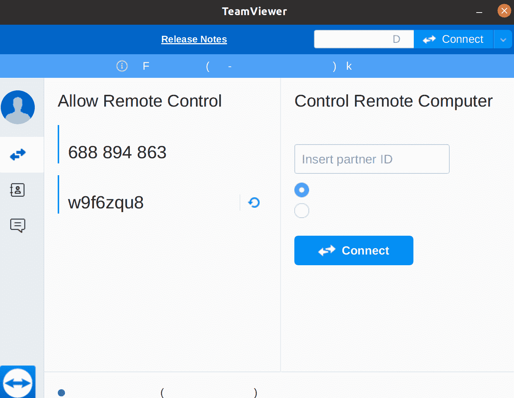
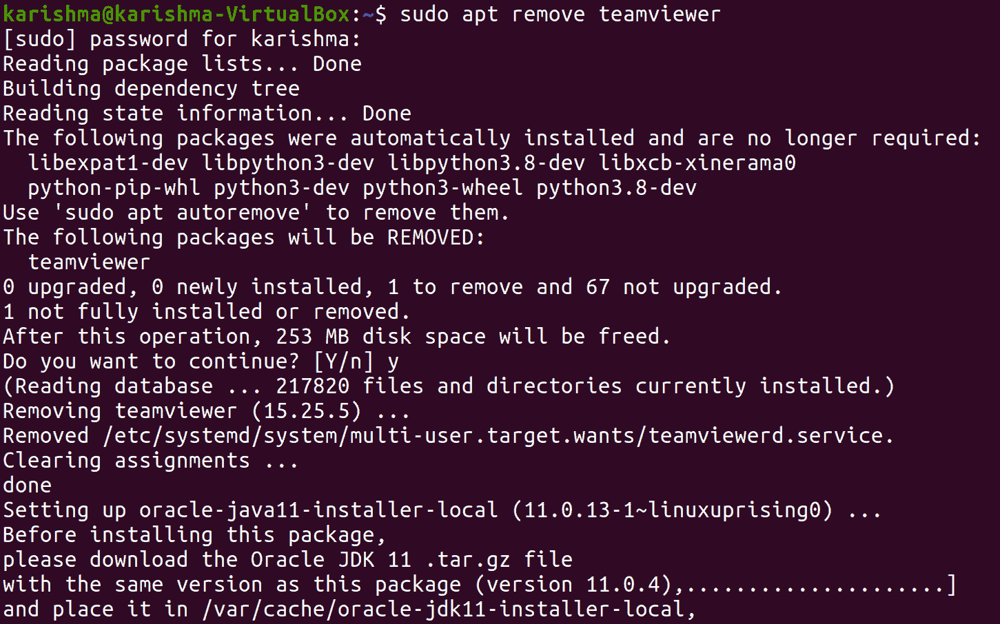

# TeamViewer 下载 Ubuntu

> 原文：<https://www.javatpoint.com/teamviewer-download-ubuntu>

## 什么是团队查看器？

***【TeamViewer】***可以描述为远程控制和远程访问计算机软件，允许维护系统和其他设备。2005 年第一次发布，功能一步步增加。该计算机软件是专有的，但不需要任何注册，非商业用途免费。TeamViewer 已经安装在超过 20 亿台设备上。它是开发者 TeamViewer AG 的核心商品。

## 团队查看器的历史

2005 年， ***Rossmanith GmbH*** 发布了 TeamViewer 软件的第一个版本。当时还在 ***VNC 项目*** 的基础上工作。信息技术服务提供商打算忽略对用户不必要的访问，并实施远程安装软件等任务。开发成功并提供了 ***TeamViewer GmbH*** ，现在实现为 ***TeamViewer 德国 GmbH*** ，是 ***TeamViewer AG*** 的一部分。

## 团队查看器的功能

### 操作系统

***TeamViewer*** 与基本操作系统(如 Windows Server、微软 Windows 和苹果的 macOS)一起出现在每台台式电脑上。此外，还有许多用于各种 Linux 衍生产品和发行版的包，例如 Fedora Linux、红帽、Ubuntu 和 Debian。此外，还有一个树莓皮操作系统，它是树莓皮的 Debian 版本。

此外，***【TeamViewer】***适用于运行苹果或安卓操作系统的 iPadOS 的平板电脑和智能手机，在基于 Linux 的操作系统上功能非常有限。在微软不支持 Windows Mobile 和 Windows Phone 这两个操作系统后，对这两个操作系统的支持已经终止。

### 团队查看器功能

***【团队查看器】功能*** 因变体和设备或软件版本而异。团队查看器的核心是对系统、系统维护和控制以及其他端点的远程访问。创建连接后，远程屏幕在用户的另一个端点是清晰的。例如，这两个端点都可以接收文件、发送文件以及访问分布式剪贴板。此外，一些功能提供团队协作，如使用 IP 电话的视频和音频传输。

近年来，软件功能得到了增强，特别是在许多大公司的应用中。为此，开发了 ***团队查看器张量*** 企业变体。TeamViewer 通过 ***TeamViewer Pilot*** 销售带有增强现实元素的远程支持程序。TeamViewer 方便了与其他服务和应用程序的接口，例如，来自***【service now】、Salesforce*** 和 ***的微软(teams)*** 。该解决方案几乎存在于每个国家，支持 30 多种语言。

### 团队查看器的许可策略

许多出于非商业目的优化团队查看器的私人用户可能会免费优化软件。应该为软件的财务使用付费。企业和其他金融用户应注册订阅。由于从许可证模式转变为订阅模式，应用程序购买(一次性)不再可行。软件的使用量也根据客户数量和同时进行的会话数量进行调整。每个用户的更新每月发布一次。

### 团队查看器的安全性

本地网络和互联网可以实现传出和传入连接。如果需要，团队查看器可以作为窗口系统的一项服务来执行，这允许团队查看器进行无人值守的访问。此外，该软件还有一个便携式版本，无需完全安装即可执行，例如通过一个通用串行总线数据载体。

使用自动生成的 ***唯一密码*** 和 ***身份证*** 创建连接。在所有连接之前，团队查看器的网络服务器会检查两个端点的标识有效性。 ***指纹*** 增加了安全性，允许用户提供远程设备身份的额外证明。与暴力攻击相比，用户的所有密码都受到保护，特别是通过增加指数级连接尝试的等待时间。TeamViewer 提供了额外的安全方面，如允许和阻止列表、双因素身份验证等。

*   在建立连接之前，TeamViewer 软件首先检查网络和设备的配置，以检测任何防火墙和其他安全系统施加的限制。
*   通常可以创建直接的 ***UDP/TCP 连接*** ，这样就不需要打开额外的端口。
*   否则，团队查看器会退回到其他路径，如 HTTP 隧道。
*   无论选择何种连接类型，数据都只使用安全数据通道发送。
*   TeamViewer 包含 ***端到端加密*** ，其基于 ***AES*** (256 位)和 ***RSA*** (4096 位)。
*   根据制造商的说法， ***中间人攻击*** 是不可能的。
*   它是由两个密钥对签署的密钥交换承诺的。

## 滥用团队查看器

### 帐户访问

在 ***【中国】*** 中，TeamViewer 的许多用户报告称，他们的系统在 2016 年 6 月被未经授权的地址授权，并盗用了银行账户。TeamViewer 将结果应用于用户的 ***【不小心使用密码】*** 并否认了所有责任，解释*“TeamViewer 既没有被黑客攻击，也没有安全漏洞，TeamViewer 使用安全，有适当的安全措施到位。我们的证据指出粗心使用是报告问题的原因，一些额外的步骤将防止潜在的滥用”*。

### 支持骗局

***【TeamViewer】***软件和其他类似软件可能会因许多技术支持骗局而被滥用。攻击者假定自己是知名公司的用户，以便在此过程中控制受害者的计算机。然后他们用借口通过受害者获得金钱。***talktalktalk(英国互联网提供商)*** 为此暂时封锁了软件的数据流量。 ***TeamViewer*** 谴责每一种形式的软件误用，提供更安全使用的提示，并给出调查相应事件的方法。

## 在 Ubuntu 中安装团队查看器

***【TeamViewer】***是一个跨平台的平台，用于桌面共享、网络会议、远程控制和计算机之间的文件传输。它允许用户远程访问用户的另一个桌面。这是服务台支持人员中的一个著名应用程序，在支持无法获得有价值帮助的远程用户时很容易使用。

在 Ubuntu 中安装***【TeamViewer】***有两种不同的方法。或者，我们可以使用 TeamViewer 的 ***TeamViewer repo*** 或 ***DEB 包*** 手动安装 ***TeamViewer。此外，它还提供了一个类似 freemium 的模型。我们可以免费使用团队查看器，用于非营利和个人用途。专业使用需要订阅。***

在本文中，我们将解释如何在 Ubuntu 中安装 ***【团队查看器】*** 。

### 先决条件

我们需要以根用户或用户身份登录，并通过*访问在我们的 Ubuntu 系统上安装软件包。*

 *## 安装过程

***【TeamViewer】***是一个计算机软件，但是它并不包含在 Ubuntu 的存储库中。我们将下载并获得**T5【团队查看器】T6**的包。

### 安装团队查看器的 DEB 包

在 Ubuntu 中安装***【TeamViewer】***是推荐的方法。我们可以使用***Linux TeamViewer***的 ***下载页面*** 下载这个**T5】DEB 包** 。

下载过程完成后，我们可以借助***【APT】***命令安装 ***TeamViewer DEB 包*** 。然后，我们需要在 Ubuntu 终端中运行下面的命令:

```

$ sudo apt update

```



```

$ sudo apt install ./teamviewer_15.9.4_amd64.deb

```


如果我们遵循这种方法，团队查看器将自动配置团队查看器的 APT 报告。

```

$ sudo apt update

```


### 使用团队查看器报告安装团队查看器

我们将在此方法中手动添加 ***TeamViewer repo*** ，并让 ***APT*** 来实现其余部分。它比旧的稍微复杂一点。

我们需要先添加 TeamViewer 的 ***GPG 键*** 。我们需要在终端中执行以下命令:

```

$ wget https://download.teamviewer.com/download/linux/teamviwer_amd64.deb

```



然后我们将添加团队查看器的报告。下面的回购是针对 TeamViewer 的 ***稳定版*** 的。

```

$ sudo apt install ./teamviewer_amd64.deb

```



然后，我们需要使用以下命令更新 APT 缓存:

```

$ sudo apt update

```


现在，我们将在终端窗口中借助以下命令最终安装 TeamViewer:

```

$ sudo apt install teamviewer

```



## 如何使用 TeamViewer？

安装应用程序后，可以使用命令行窗口或按下 ***应用程序菜单*** 中的图标来启动它。

我们只需要在终端中执行以下命令，就可以从命令行窗口开始使用 TeamViewer 应用程序:

```

teamviewer

```



我们需要进入**“活动概述”**，找到**团队查看器**，然后启动它，使用桌面图形用户界面启动它。

**TeamViewer** 将在首次运行时根据许可协议启动。我们需要选择**“接受许可协议”**才能继续。

TeamViewer 将显示我们机器的**密码**和 **ID** 。凭证是强制性的，以防任何其他人希望链接到我们的系统。

#### 注意:凭据是临时的。

## 如何卸载团队查看器？

我们需要以 **sudo 用户**的身份输入以下命令，以便从系统中卸载**团队查看器**，而不删除我们可能已经进行的任何配置:

```

$ sudo apt remove teamviewer

```



系统会提示我们一个 ***是/否*** 选项开始卸载程序。我们需要输入 ***Y*** ，点击回车开始。然后， ***TeamViewer*** 将从我们的系统中删除。

如果我们做了任何配置，我们可以在下面命令的帮助下删除*和每一个:*

```

$ sudo apt purge teamviewer

```

## 结论

***【TeamViewer】***同时是一个健壮但简单的应用。配置和使用它不需要太多的努力。现在，我们可以连接到我们的客户或朋友的机器，并立即提供帮助。

* * ***