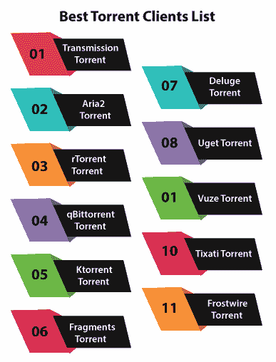
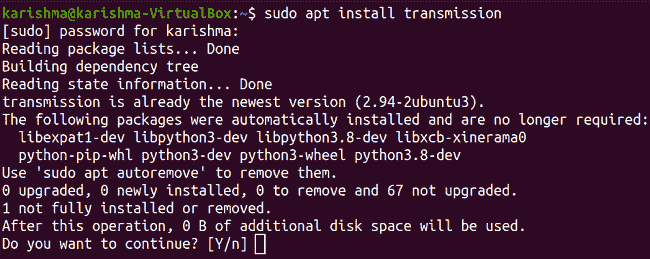
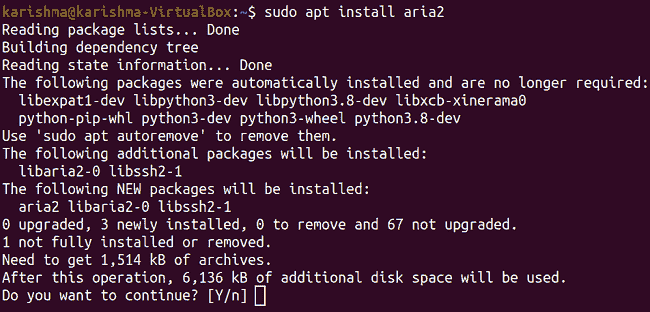
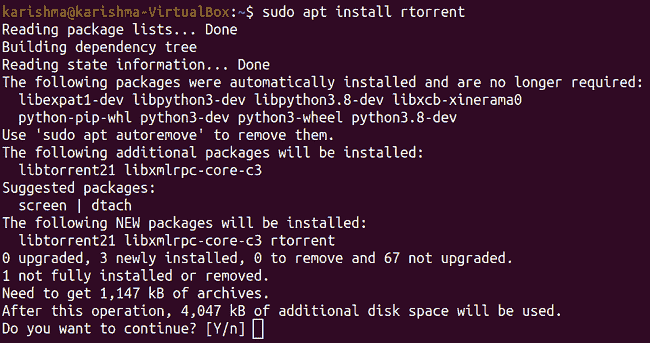
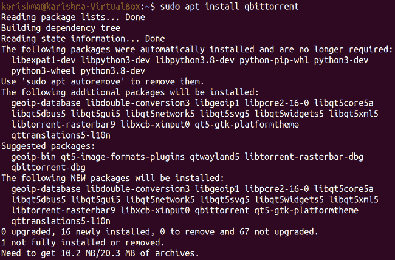
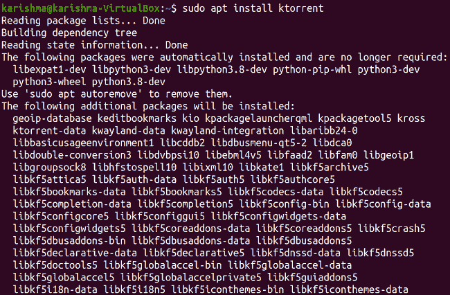
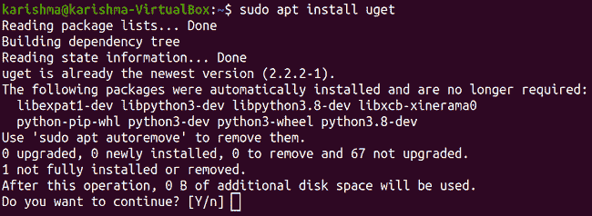
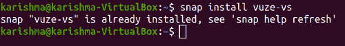
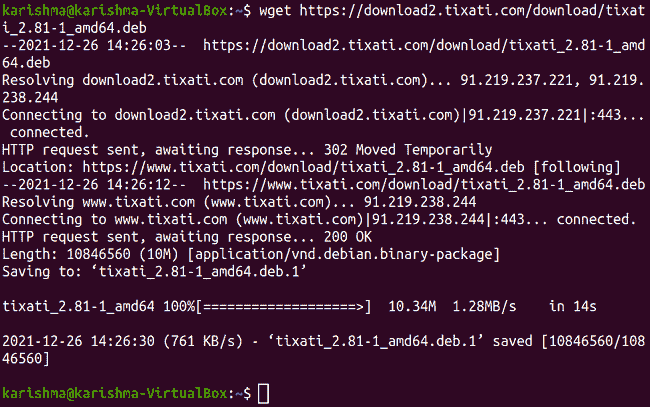
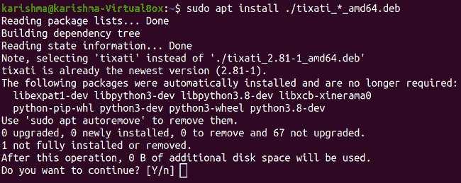

# Ubuntu Torrent

> 哎哎哎:# t0]https://www . javatppoint . com/Ubuntu-torrent

***BitTorrent 协议*** 应用于点对点文件分发，是多人共享和下载文件的高效方式。而带有 ***BitTorrent*** 的文件分发则与电视剧集或电影等视频文件相关联。此外，对于 Linux 的开发人员来说，为他们的发行版提供种子下载是很常见的。

*是下载大文件的理想选择，因为它们被分成更小的块，并且它们是从洪流中的多个对等点下载的***【swarm】***。同时，能够从几个不同的来源下载意味着我们的下载带宽已经完全饱和，这导致了大文件的快速下载。自动地，当每个文件块完成下载时，文件被重建。*

 *我们要求在我们的系统上下载并安装任何 ***种子客户端*** ，以便使用 ***BitTorrent*** 进行下载。Ubuntu 的 ***20.04 焦窝*** 版本中有一些选项可以选择。有些有图形界面，有些只是在终端窗口上工作，但它们都有各自的怪癖和优势。

*   *允许我们同时从多个来源下载文件。*
**   此外，它从 Ubuntu 的官方镜像中删除了一些片段，所以我们通过使用种子群下载一个国际标准化组织的图像来支持它们。*   如果我们希望在下载过程完成后继续支持，我们可以在我们的种子客户端选择离开 Ubuntu 种子，并将其 ***【种子】*** 启用给其他下载者。*   在*过程中，大文件被分解成许多部分，并且它一次自动从多个主机获取这些部分。***   此外，它还与他人分享我们已经下载的这些部分，以便任何人都可以受益和分享。*   这是下载 Ubuntu ISO 版本的好方法，尤其是如果常规版本网站非常慢，因为如果有几个用户同时共享和下载，速度会更快。*   ***BitTorrent*** 的几个软件在 Linux 和 Ubuntu 上运行的很完美。*   Ubuntu 自带 ***BitTorrent*** 客户端，被称为 ***Transmission*** ，大概是不错，但不是那种好。*   Linux 有各种各样的种子客户端。但是搜索哪一个带有最好的功能组是一个挑战。**

 **在这篇文章中，我们将讨论一些最好的 Ubuntu 种子客户端，这样我们就不需要浪费宝贵的时间来逐一检查和安装这些种子客户端。

## 最佳种子客户端列表

下面提到了一些最好的 torrent 客户端:



### 传输洪流

***Transmission*** 是一个 BitTorrent 的客户端，在后端跨平台的头部提供一系列用户界面。传输洪流客户端是 ***自由软件*** ，根据 ***GNU GPL(通用公共许可证)*** 以及 ***麻省理工学院许可证*** 下的部分条款获得许可。

**变速器的优点**

*   磁铁链接、PEX、分布式哈希表和完全加密支持。
*   本地对等点发现
*   Daemon 非常适合无头使用、嵌入式系统和服务器。
*   这些都可以由终端和网络客户端远程控制。
*   本机 Mac、Qt 图形用户界面和 GTK+客户端
*   与其他客户端相比，应用发热资源。

**如何在 Ubuntu 上安装传输客户端？**

我们可以使用终端窗口中的命令安装传输种子客户端。该命令如下所述:

```

$ sudo apt install transmission

```



### 空气 2 Torrent

***Aria2*** 是一个轻量级的 ***多源*** 和 ***多协议下载实用程序*** 的命令行。支持 ***Metalink、BitTorrent、HTTP/HTTPS、SFTP*** 、 ***FTP*** 。这个 Torrent 客户端可以使用内置的 ***XML-RPC*** 和 ***JSON-RPC 接口*** 进行操作。

**阿里亚 2** 的优点

*   **远程控制:**支持 RPC 接口，用于控制 aria2 的进程。
*   已启用金属链接。
*   **全功能 BitTorrent 客户端:**在 BitTorrent 客户端中，每个功能都可用:UDP 跟踪器、本地对等点发现、选择性下载、网络播种、磁铁 URI、加密、PEX 和 DHT。
*   **轻量级:**不需要太多的 CPU 时间和内存。如果磁盘缓存被禁用，物理内存的使用量为 4 Mib 到 9 MiB。每秒 2.8 兆字节的 CPU 使用率约为 6%。
*   **多连接下载:** Aria2 Torrent 可以从多个协议/源下载任何文件，并尝试使用下载的最大带宽。

**如何在 Ubuntu 上安装 Aria2 客户端？**

我们可以使用终端窗口中的命令安装 aria2 Torrent 客户端。该命令如下所述:

```

$ sudo apt install aria2

```



### Torrent 下载作业

这个 BitTorrent 客户端应用 ***ncurses*** ，它非常适合与 ***dtach、tmux*** 和 ***屏幕*** 一起使用。 ***0.9.7+版本*** 备选包含一个破坏用户界面的守护进程内置模式，我们只需通过 ***XMLRPC*** 即可控制。此外，它支持 ***会话保存*** ，允许用户添加、删除种子等。

**电流的优点**

*   我们能找到的最大的终极洪流之一
*   可以同时执行数千个种子
*   非常小
*   可以在终端执行

**如何在 Ubuntu 上安装实时客户端？**

我们可以使用终端窗口中的命令安装*种子客户端。该命令如下所述:*

 *```

$ sudo apt install rtorrent

```



### qBittorrent Torrent

***qBitTorrent*** 项目旨在促成一款 ***开源软件*** ，替代 ***的*** 。 ***qBitTorrent*** 客户端在各大平台(Windows、OS/2、macOS、Linux、FreeBSD)上执行并提供类似功能。它基于***libtorrent-rasterbar***和 ***Qt 工具包库*** 。

**qBitTorrent 的优点**

*   没有广告
*   像 ***一样的精致用户界面***
*   可扩展且集成良好的搜索引擎
    *   特定类别的查找请求(例如， ***软件、音乐、书籍*** )
    *   在 Torrent 的几个搜索站点同时搜索
*   集成下载过滤器(包括正则表达式)的 RSS 提要支持
*   支持各种 BitTorrent 扩展:
    *   加密连接
    *   私人种子
    *   本地对等点发现、对等点交换协议(PEX)、分布式哈希表
    *   磁铁链
    *   以及其他等等...
*   使用由 AJAX 指定的网络用户界面进行远程控制
    *   与普通图形用户界面非常相似
*   按顺序下载(按顺序下载)
*   对种子、对等体和追踪器的集成控制
    *   种子内容优先排序和选择
    *   洪流优先化和排队
*   有 70 多种语言版本
*   适用于各种平台:Windows、OS/2、macOS、Linux、FreeBSD
*   支持符合 IPv6 的端口转发的 NAT-PMP/UPnP
*   IP 过滤( ***PeerGuardian*** 和 ***eMule*** 格式兼容)
*   工具可用于种子创建
*   带宽调度程序

**如何在 Ubuntu 上安装 qBitTorrent 客户端？**

我们可以使用终端窗口中的命令安装***qBitTorrent***Torrent 客户端。该命令如下所述:

```

$ sudo apt install qbittorrent

```



### Whorrent Torrent

它是由*KDE 开发的一个 BitTorrent 应用程序，允许我们使用 ***BitTorrent*** 协议下载文件。它使我们能够一次执行多个种子。此外，它提供了扩展的方面，使其成为 BitTorrent 的一个功能齐全的客户端。*

 ***科托伦特的优点**

*   来自代理的连接
*   支持系统托盘的跟踪器认证集成
*   进程间管理由 ***D-Bus 接口*** 提供，脚本支持由 ***Kross*** 提供
*   支持 ***网络种子***
*   ***UPnP*** 支持通过局域网自动转发端口以及动态主机
*   支持分布式哈希表
*   支持创建无跟踪器种子
*   协议加密支持(与***【azure us】***一致)
*   支持对等交换证书
*   支持私人种子和追踪器。
*   对 UDP 跟踪器的支持
*   使用额外的 IP 过滤器对话框禁止/踢对等方，以便编辑/列出
*   选择性下载多个文件 Torrent
*   导入完全或部分下载的文件
*   某些文件类型(音频和视频)的预览
*   Torrent 速度的 Per 和全局限制
*   洪流排队

**如何在 Ubuntu 上安装 Ktorrent 客户端？**

我们可以使用终端窗口中的命令安装 Ktorrent 客户端。该命令如下所述:

```

$ sudo apt install ktorrent

```



### 碎片洪流

对于***【GNOME】***的桌面环境来说，是一款易用的 BitTorrent 客户端。用 BitTorrent 协议接收文件很有帮助。此外，它使我们能够为许多 Linux 发行版传输大型文件，如安装图像或视频。

**碎片的优点**

*   简单的
*   开源的
*   烘焙的每个强制性方面

**碎片的缺点**

*   我们要求通过 ***Flathub*** 启用 ***Flatpak*** 进行安装。

### 洪流

***大洪*** 是 ***Python*** 中指定的 BitTorrent 开源、跨平台、免费客户端。它采用了一种后端和前端架构，其中 ***libtorrent*** (提供应用程序网络逻辑的 ***C++*** 中指定的软件库)链接到几个前端中的一个，包括图形桌面界面、web 界面和使用来自项目 Python 建筑的 GTK 的文本控制台。 ***泛滥*** Torrent 专注于成为用户的轻量级选择。

**洪水的优点**

*   插件系统
*   软件工程师
*   完全加密

**如何在 Ubuntu 安装大洪洪流？**

在 Ubuntu 中，我们可以使用终端窗口中的命令安装大洪种子。该命令如下所述:

```

$ sudo apt install deluge

```


我们还可以使用以下命令来使用控制台模式:

```

$ sudo apt install deluge-console

```

### 种子锈菌

这个种子客户端是一个功能齐全的下载管理器。它可以应用多线程连接来加速文件的下载过程。此外，它还支持种子，为我们提供了完整的软件套件 来下载每一种类型的文件。

**Uget 的优点**

*   **YouTube 视频:**它在 YouTube API 的帮助下提供了通过 YouTube 下载视频的能力，因此不需要依赖管理。
*   **浏览器集成:**它通过支持 Opera、Chrome、Google Chrome、Vivaldi 和 Firefox 的扩展提供浏览器集成。
*   **多连接下载:**我们可以分几段下载很多文件，提高下载速度。这个 Torrent 客户端同时支持每次下载多达 60 个连接。

**如何在 Ubuntu 中安装 Uget Torrent？**

在 Ubuntu 中，我们可以使用终端窗口中的命令安装***【Uget】***Torrent。该命令如下所述:

```

$ sudo apt install uget

```



### Torrent 检视

这个 BitTorrent 客户端用于通过 BitTorrent 协议传输文件。之前是 ***【天青】*** 。用 ***Java*** 编写，应用 Azureus 的 ***引擎。除了下载链接到。torrent 文件， ***Azureus*** 允许用户查看、发布和共享原始高清和 DVD 质量的视频内容。***

内容由包含系列、视频游戏、电影、音乐视频、电视节目和其他内容的频道和几个类别表示。此外，如果用户喜欢发布他们的真实内容，他们可以使用这个种子客户端赚钱。

它提供元搜索、视频播放器、内置视频转换器、网络远程、种子下载订阅等。另外，我们可以借助相当多的插件来扩展***【Vuze】***的功能，甚至可以订阅付费计划来访问更酷的功能。

**武泽的优点**

*   许多功能
*   稳定的
*   安全的

**Vuze 的缺点**

*   少数可以看到武泽的慢速度。

**如何在 Ubuntu 中安装 Vuze Torrent？**

在 Ubuntu 中，我们可以使用终端窗口中的命令安装***【Vuze】***Torrent。该命令如下所述:

```

$ snap install vuze-vs

```



**滴灌种子**

除了经典的 BitTorrent 客户端分发功能外， ***Tixati*** 还提供 ***积分聊天室*** 以及 ***频道聊天*** 以及高度加密的私人消息。根据***Tixati****的支持页面， **Tixati** 的通道特性特别好地展示了如何构建一个分散的网络应用程序，该应用程序支持非常高的吞吐量，同时在 100%分散的环境中保持加密安全。它包括一个线性网络编码的分散式媒体流特性，该特性由同态哈希函数和椭圆曲线签名(第一个成功实现的系统)保护。*

所有聊天室可以是秘密的，也可以是公开的。用户可以选择分发网址或磁铁链接的列表，这些列表可以在用户连接的每个频道上搜索。还支持浏览用户的特定共享列表。此外，这些频道允许流媒体视频和音频。

**Tixati**的优点

*   不要胡说
*   没有广告
*   没有间谍软件
*   磁铁链接、PEX 和敦豪支持
*   简单易用

**Tixati**的缺点

*   没有快照安装
*   没有合适的安装

**如何在 Ubuntu 中安装 Tixati Torrent？**

在 Ubuntu 中，我们可以使用终端窗口中的命令安装***【Tixati】***Torrent。该命令如下所述:

```

wget https://download2.tixati.com/download/tixati_2.81-1_amd64.deb

```



```

$ sudo apt install ./tixati_*_amd64.deb

```



### 霜之洪流

***Frostwire*** 是 BitTorrent 的一个适应性很强的开源客户端，我们可能希望尝试一下。它不仅仅是一个普通的 Torrent 客户端。它不仅仅局限于 Linux 操作系统，它也适用于许多其他设备，比如安卓，我们可以用它来使用无线网络共享文件。

此外，它也适用于苹果电脑和视窗系统。

我们可以在应用程序中找到下载的种子，并在应用程序中享受它们。它可以浏览我们的本地媒体，并在播放器中组织它们以包含到下载的文件中。同样的事情也适用于任何版本的安卓。

一个额外的特点是，它还提供了许多艺术家创作的基础音乐。我们可以免费下载和欣赏。

**如何在 Ubuntu 安装霜之洪流？**

我们可以找到 ***。*T3 或**T5。deb 文件** 从官方 ***下载网页*** 的 ***Frostwire*** 。这个 Torrent 客户端在 ***Ubuntu 软件中心*** 是没有的，我们需要用官方网站下载。**

* * ******