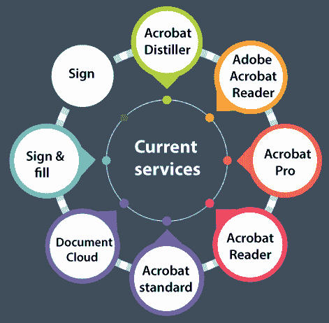
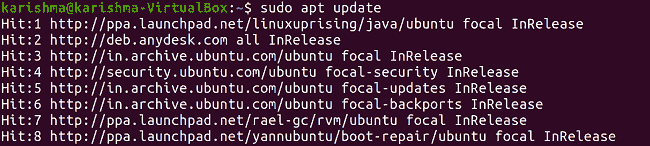
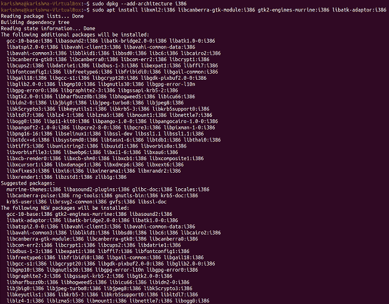

# Adobe Reader Ubuntu

> 原文：<https://www.javatpoint.com/adobe-reader-ubuntu>

***Adobe Acrobat Reader***是由 ***Adobe Inc.*** 开发的一系列网络服务和应用软件，用于查看、创建、操作、打印和管理 ***便携式文档格式***(PDF*)文件。*

 *家族包含 ***杂技朗读者*** (原名 ***朗读者*** )杂技朗读者(原名交流)和***Acrobat.com。*** 常见的***Acrobat Reader***是一款 ***免费软件*** ，可用于各种移动和桌面平台。

它支持注释、打印和查看 PDF 文件。此外，*服务也可以通过付费订阅获得。***【Acrobat.com】***聚合了一系列文件托管服务和企业内容管理。商业专有的 Acrobat 还可以转换、编辑、创建、数字签名、发布、导出和加密 PDF 文件，并且仅适用于 macOS 和微软视窗。*

 *## Adobe Reader 的用途

Adobe Reader 的主要功能是编辑、查看和创建 PDF 文档。此外，它可以导入著名的图像和文档格式，并将其存储为 PDF。可以导入扫描仪、Windows 剪贴板内容或网站的输出。

然而，在创建 PDF 文档时，由于 PDF 的性质，其原始流程和组织无法进行有意义的修改。Adobe Reader 旨在更改图像和段落的内容，但这样做不会重新检查整个文档，以适应较短或较长的文档。Acrobat 可以更改 PDF 页面的顺序，裁剪它们，操作超链接，添加注释，对 PDF 文件进行数字签名，编辑许多 PDF 文件部分，并确保其对 PDF/A 等标准的忠诚度。

## Adobe Acrobat 阅读器系列产品

### 当前服务



*   ***Acrobat Distiller*** 是一款将文档从 ***PostScript*** 格式转换为 Adobe PDF 格式的应用软件，该格式是 Adobe Acrobat Reader 系列产品的原生格式。
*   ***Adobe Acrobat Reader***是由 ***Adobe Inc.*** 开发的一系列网络服务和应用软件，用于查看、创建、操作、打印和管理便携式文档格式。目前，它仅面向拥有 Adobe ID 和网络浏览器的用户。
*   Acrobat 的完整专业版为 ***Acrobat Pro*** ，由 ***Adobe Inc.*** 开发，用于编辑、创建、操作、打印和管理 PDF 格式的文件。目前，它仅适用于苹果电脑和视窗用户。
*   免费软件 Acrobat 版本为 ***Acrobat Reader*** ，由 ***Adobe Inc.*** 开发，用于查看、创建、填充、打印和格式化 PDF 格式的文件。目前，它仅适用于安卓、iOS、macOS 和 Windows 用户。
*   Acrobat 的完整标准版为 ***Acrobat 标准*** ，由 ***Adobe Inc.*** 开发，用于编辑、创建、操作、打印和管理 PDF 格式的文件。目前，它仅适用于 Windows 用户。
*   ***【文档云】*** 可以描述为 Acrobat 家族的一个组成部分，该家族由 ***Adobe Inc.*** 开发，用于查看、创建、在线保存、打印和格式化便携式文档格式。目前，它仅适用于拥有 ***Adobe ID*** 和 ***网络浏览器*** 的用户。
*   ***Sign & fill*** 是 Acrobat 家族的一个组成部分，由 ***Adobe Inc.*** 开发，用于 PDF 格式文件的填充、签名和管理。目前，它仅适用于安卓、iOS、macOS 和 Windows 用户。
*   ***Sign*** (原称 ***eSign*** 和 ***EchoSign*** 是 Acrobat 家族的一个组成部分，由 ***Adobe Inc.*** 开发，用于 PDF 格式文件的填充、签名和管理，目前仅适用于安卓和 iOS 用户。

### 停止的服务


*   ***Acrobat Business*** 的工具是 Acrobat 家族的停产元素，由 ***Adobe Systems*** 共享，具有文档审阅和协作功能。
*   ***Acrobat 批准*** 允许用户部署基于 Acrobat PDF 的电子表单。
*   ***Acrobat Capture*** 是来自 ***Adobe Systems*** 的文档处理实用程序，适用于 ***窗口*** ，可以将纸质文档的扫描与来自 ***OCR*** 技术的可选文本一起转换为便携式文档格式文件。
*   ***Acrobat Element*** 是由 ***Adobe Systems 发布的 Acrobat 家族非常常见的版本。*** 与 ***Acrobat Reader(免费)*** 相比，它的主要功能优势是能够通过 ***微软办公应用创建责任 PDF 文件。***

## 本地化和国际化

***Adobe Acrobat Reader***提供多种语言版本，包括乌克兰语、土耳其语、瑞典语、西班牙语、俄语、罗马尼亚语、葡萄牙语、波兰语、挪威语、韩语、日语、意大利语、匈牙利语、希伯来语、希腊语、德语、法语、芬兰语、英语、荷兰语、丹麦语、繁体中文、简体中文、捷克语和阿拉伯语。 ***希伯来语*** 和 ***阿拉伯语*** 版本来自 ***温软国际、***Adobe Systems 的本地化和国际化合作伙伴。

在 Adobe Acrobat Reader DC 之前，单独的 ***【希伯来语】*** 和 ***【阿拉伯语】*** 版本是专门为这些语言开发的，通常从右向左书写。这些版本包含独特的 ***TouchUp*** 属性，用于管理从右到左的 ***中东*** 文字(如 ***波斯语、希伯来语、*** 和 ***阿拉伯语*** 以及标准的从左到右的 ***印第安语*** 文字(如 ***古 JIRA 特语】***

***网页抓取*** 方面可以将一个网页或整个网站转换成 PDF 格式文件，同时保留内容的原始文本编码。此外，Acrobat 可以将 ***希伯来语*** 和 ***阿拉伯语*** 的文本以其实际编码复制到系统的 ***剪贴板*** 中，如果目标软件也对文本编码感到满意，文本将以正确的脚本出现。

## 安全

几乎所有 Adobe 产品和相应版本的安全公告的广泛列表都发布在它们的咨询页面和安全公告以及其他相应的地方。Adobe Acrobat Reader 每个版本的详细安全更新历史记录已特别公开。

*   ***Acrobat Reader*** 从 3.02 版本开始就包含了对 ***JavaScript*** 的支持。
*   该功能允许 PDF 文档创建者包含在文档被读取时运行的代码。
*   试图攻击安全漏洞的恶意 PDF 文件可能会被攻击到网页上的链接或作为电子邮件附件共享。
*   另一方面，*是在没有直接授权给文件系统的情况下开发的，以使其成为 ***【安全】*** 并且有报道称该漏洞存在滥用，比如从 Acrobat 程序中分发恶意代码。*

 *在 2009 年最后一个季度，Adobe 的应用已经成为攻击者最著名的客户端软件攻击目标。 ***迈克菲*** 预计 Adobe 软件，尤其是*和 ***Reader*** 将是 2010 年软件攻击的主要目标。*

 *### 1.2006 年 9 月的警告

***大卫·基尔兹诺斯基*** 在 2006 年 9 月 13 日提供了示例 PDF 文件，指出了 ***JavaScript*** 的漏洞。 ***JavaScript*** 可以显示嵌入的 URL 和首选项菜单，被安全警告对话框拦截，阻止或允许网站激活。

### 2.2009 年 2 月警告

2009 年 2 月 19 日，Adobe 发布了一份安全公告，披露了 Adobe Acrobat 和 Reader 第 9 版及更早版本中的 JavaScript 漏洞。 ***US-CERT*** 建议停用 Adobe 受影响产品内的 JavaScript，取消使用 web 浏览器和 Windows shell 的开发(同时进行***【Internet Explorer】***去集成的已开发版本)，停用 Adobe 的索引服务，避免通过外部来源获取每一个 PDF 文件，作为解决此问题的方法。

### 3.2013 年 2 月警告

Adobe 已识别出适用于 ***【麦金塔】*** (9.5.3 及更早的 9.x 版本)和 Windows 的 ***Adobe Acrobat XI*** 和 ***Reader*** 中的关键漏洞。这些漏洞会导致应用崩溃，并可能允许攻击者控制受影响的系统。有许多报道称，这些漏洞被滥用来欺骗窗口用户点击电子邮件中发送的恶意 PDF 文件。Adobe 建议用户更新他们产品的安装。

### 4.2016 年 1 月警告

Adobe 已经发布了针对 ***Adobe Reader*** 和 ***Acrobat*** 针对 ***Macintosh*** 和 ***Windows 的安全更新。*** 这些更新表明存在关键漏洞，可能允许攻击者控制受影响的系统。

## 在 Ubuntu 上安装 Adobe Acrobat 阅读器

PDF 是个人和公司用于共享文件的现有文件格式。当我们在线下载任何文档时，都有很多机会以 PDF 格式接收文档。与其他文件格式相比，PDF 格式具有许多优势，包括支持大量内容，包括图像和文本、文档安全性和图形完整性保护。

***Adobe Acrobat Reader***是市面上最常用的 PDF 阅读器之一。它允许用户在 PDF 格式的文档中进行注释、打印、查看和执行高级编辑选项。***Adobe Acrobat Reader***在 ***高级版*** 和 ***免费版中都有。******高级版*** 具有文件转换、扫描、编辑和数字签名等额外功能。

### 步骤 1:更新系统

有必要确保我们的系统包已经更新到当前版本。我们可以在终端窗口中使用以下命令来更新我们的系统:

```

$ sudo apt update

```



### 步骤 2:包括 i368 架构

Adobe Acrobat Reader 需要许多 i386 软件包，这些软件包在 Ubuntu 20.04 版本(以前的版本)中默认不会安装。我们要求在我们的 Ubuntu 系统上启用 32 位 架构。为此，我们可以在终端窗口中使用以下命令来包含 ***i386 架构:***

```

$ sudo dpkg --add-architecture i386

```

### 步骤 3:安装软件依赖项

在 20.04 版本的 Ubuntu 中，我们需要许多额外的包来执行***【Adobe Acrobat Reader】***。我们需要运行以下命令来安装必要的依赖项:

```

$ sudo apt install libxml2:i386 libcanberra-gtk-module:i386 gtk2-engines-murrine:i386 libatk-adaptor:i386

```



### 第四步:获取 Adobe Acrobat Reader 的二进制包

我们需要下载 Acrobat Reader 的当前 Debian 二进制包以及安装的依赖项。为此，我们需要在终端窗口中运行以下命令:

```

$ wget -o ~/adobe.deb ftp://ftp.adobe.com/pub/adobe/reader/unix/9.x/9.5.5/enu/AdbeRdr9.5.5-1_i386linux_enu.deb

```

### 步骤 5:安装 Adobe Acrobat 阅读器

现在我们已经成功下载了阅读器，我们可以使用以下命令安装它:

```

$ sudo dpkg -i /AdbeRdr9.5.5-1_i386linux_enu.deb

```


### 步骤 6:启动 Adobe Acrobat Reader

现在，我们需要进入活动菜单，找到 Adobe Acrobat Reader。然后，只需按下图标。

我们可以使用以下命令从终端窗口启动 ***Acrobat Reader*** :

```

$ acroread

```

* * *****