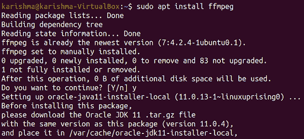
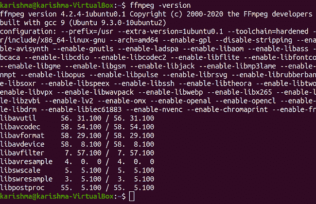
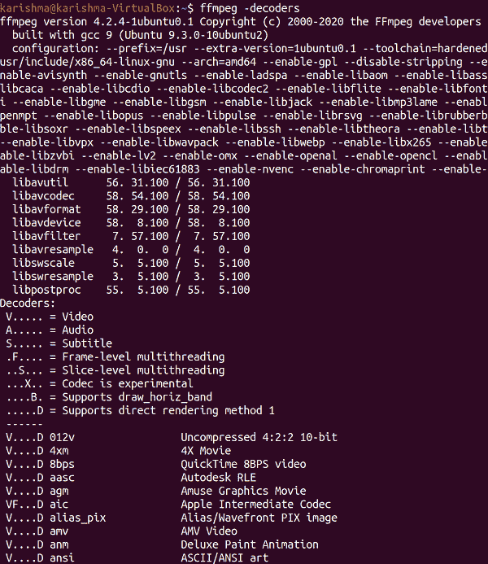
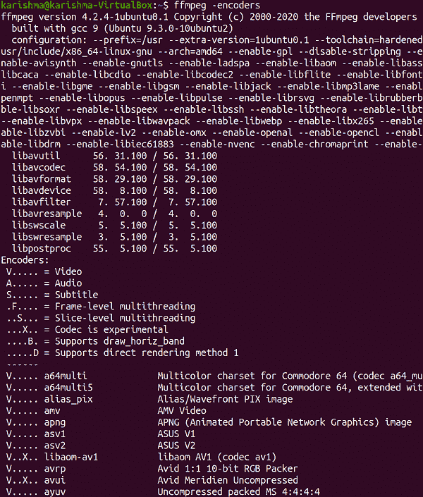

# 安装 FFmpeg Ubuntu

> 原文：<https://www.javatpoint.com/install-ffmpeg-ubuntu>

## 什么是 FFmpeg？

**FFmpeg** 是一个开源的自由软件项目，由一套处理音频、视频和其他多媒体流和文件的程序和库组成。其核心是命令行工具本身，即 **ffmpeg** ，旨在处理音频和视频文件。它广泛用于视频缩放、基本编辑(拼接和修剪)、格式转码、视频后期制作标准和效果合规性(ITU、SMPTE)。

此外， **FFmpeg** 还包括其他一些工具，比如 **ffplay** ，这是一个普通的媒体播放器， **ffprobe** ，这是一个命令行工具，用来显示媒体信息。添加的库之间是 **libavcodec** ，一个由多个自由和商业软件产品使用的视频/音频编解码器库， **libavformat** ，一个视频/音频 **demux 库，**和**容器 mux** ，以及 **libavfilter** ，一个从**类似 Gstreamer 的 filtergraph** 增强和编辑滤镜的库。

它是其他几个软件项目的工作流程的一部分，所有的库都是像 VLC 这样的软件媒体播放器的核心部分，它已经被添加到**哔哩哔哩**和 **YouTube** 的核心处理中。添加了几种视频和音频文件格式的解码器和编码器，这对于不常见和常见媒体文件的转码非常有帮助。 **FFmpeg** 是在 **GPL-2.0 或更高版本**或 **LGPL-2.1 或更高版本**下发布的，具体取决于启用了哪个选项。

## FFmpeg 的历史

该项目由**法布里斯·贝拉**于 2000 年启动，由**迈克尔·尼德迈尔**于 2004 年至 2015 年执导。此外， **FFmpeg** 的一些开发者是 **MPlayer** 项目的一部分。

项目名称源自 **MPEG 视频标准组**，与代表**“快进”**的**“FF”**同步良好。它的**标志**应用了**之字形图案**，显示了 MPEG 的视频编解码器如何管理熵编码。

**谷歌**的两名员工宣布，通过 2014 年 1 月 10 日的**模糊测试**，在过去两年中 **FFmpeg** 已经解决了 1000 多个 bug。

一个命令行程序，即 **FFmpeg** 的长时间元素 **ffserver** ，在 2018 年 1 月被删除。之前，开发人员已经否决了这个程序，因为它的内部API使用了大量的维护工作。

该项目每三个月发布一个新版本。而已发布的版本可从网站下载。 **FFmpeg** 的开发者建议用户从源代码 GIT 版本控制系统使用当前版本的源代码使用软件。

### 编解码器的历史

在 **FFmpeg** 项目中，开发了两种带有相关编解码器的视频编码格式和一种容器格式。这两个视频编解码器分别是**无损 FFV1** 和**有损白雪**和**无损编解码器**。Snow 的开发被推迟了，而它的比特流格式还没有最终确定，这使得它从 2011 年开始试验。被称为 **NUT** 的多媒体容器的格式没有被积极开发，但仍然是有组织的。

FFmpeg 的开发者，大卫·康拉德，罗纳德·布尔杰，菲奥娜·格雷泽，在 2010 年夏天宣布了 **ffvp8** 的解码器。他们通过测试决定 **ffvp8** 比**谷歌**的 **libvpx** 解码器更快。从 0.6 版本开始， **FFmpeg** 也支持 **VP8** 和 **WebM** 。

## FFmpeg 的组成部分

### 命令行工具

*   **ffmpeg** 是一个命令行工具，可以转换视频或音频格式。此外，它可以像电视采集卡一样，从多个软件和硬件来源实时编码和捕获。
*   **ffprobe** 是一个命令行工具，用于显示媒体信息(JSON、XML、CSV 和文本)。
*   **ffplay** 是一个普通的媒体播放器，它使用的是 **FFmpeg** 库和 SDL。

### FFmpeg 库

*   **libswresample** 是一个包含音频重采样例程的库。
*   **libavresample** 是一个包含使用 **Libav** 项目的音频重采样例程的库，与 **libswresample** 到 **ffmpeg** 相同。
*   **libavcodec** 是一个包含 **FFmpeg** 的每个本地视频/音频解码器和编码器的库。大多数编解码器都是从头开始创建的，以确保高代码重用性和最佳性能。
*   **libavformat** 是一个包含**复用器**和**解复用器**的库，用于视频/音频容器格式。
*   **libalvutil**可以被描述为一个助手库，包括几个对不同的 **FFmpeg** 通用的例程。这个库包含 **Base64 解码器/编码器、LZO 解压缩器、密码**和**散列函数**。
*   **lib 餐后处理**是一个包含先前基于 **263 的**视频后处理例程的库。
*   **libswscale** 是一个包含视频像素格式/色彩空间和图像缩放转换例程的库。
*   **libavfilter** 是 **vhook** 的替代品，允许在编码器和解码器之间检查或修改音频/视频。所有过滤器都已从多个项目中移植，包括 A **visynth** 和 **MPlayer** 。
*   **libavdevice** 是一个包含来自外部和内部设备的视频/音频 io 的库。

## FFmpeg 支持的硬件

### 中央处理器（central processing units 的缩写）

**FFmpeg** 封装了音频和视频解压缩和压缩算法的软件实现。这些指令可以在不同的指令集上编译和执行。FFmpeg 提供了几种广泛的指令集，包括 MIPS、SPARC、DEC Alpha、ARM、PPC PowerPC 和 x86 (x86-64 和 IA-32)。

### 专用硬件

有一系列用于视频/音频解压缩和压缩的专用集成电路(专用集成电路的简称)。这些可以通过主机 CPU 完全或部分卸载计算过程。该API只需要像**专用集成电路**一样使用，而不是算法的完全实现。

### 使用 FFmpeg 实用程序应用

内部硬件的加速解码通过选项激活，即 **-hwaccel** 。通常，它会开始解码，但当在硬件中找到可解码的流时，解码器会为该硬件创建每一个重要的处理，从而加速解码过程。

硬件加速将被跳过，它仍将在软件中被解码，而当没有找到可解码的流时(就像在不支持的编解码器配置文件中发生的那样)。当硬件需要一个特定的设备来运行时，特别是当存在各种图形卡时，使用选项 **-hwaccel_device** 。

## 支持的格式和编解码器

### 图像格式

**FFmpeg** 支持几种不常见的和几种常见的图像格式。图像格式，即 **PGMYUV** 是二进制(P5) PGM Netpbm 格式的自制版本。此外，它支持 PPM 和 PGM 16 位深度格式，以及不带或带 alpha 通道的二进制(P7) PAM 格式，深度 16 位或 8 位适用于 pix_fmts rgb64be、rgba、ya8、rgb48be、rgb24、gray16be、gray、monob。

### 多路复用器

FFmpeg 中的结果格式(许多容器格式和其他创建结果流的方式)被称为**“多路复用器”**。下面列出了一些由 **FFmpeg** 支持的**muxer**:

*   伊法夫
*   AVI 和输入也通过 AviSynth
*   格式
*   英国电影学会
*   猫白血病病毒
*   货价加运价
*   GIF 格式
*   代表 HTTP 直播
*   GXF(代表通用交换格式)
*   敌我识别系统(Identification Friend or Foe)
*   Matroska(带 WebM)
*   基于国际标准化组织的媒体文件格式(带 MP4、3GP 和 QuickTime)
*   Maxis XA
*   MPEG 节目流
*   MPEG-DASH
*   MPEG 传输流(带 AVCHD)
*   MSN 网络摄像头流
*   MXF(代表材料交换格式)
*   Ogg
*   坚果
*   RL2
*   orderlymarketingagreement 有秩序的市场销售协定
*   用于创建分段视频流的片段
*   WTV
*   数据发送
*   平滑流

### 像素格式

FFmpeg 提供了对几种像素格式的支持。其中一些格式仅作为许多输入格式受到支持。不支持 Log RGB、RGBE、CYMK、AI44、IMC1-IMC4 等格式。此外，它还不支持 ARGB 2:10:10:10、1:5:5:5 或其他不常用的 BMP 位域格式。

## **FFmpeg 支持的协议**

### 开放标准

*   IETF RFC：
    *   一点点
    *   用户数据报协议(User Datagram Protocol)
    *   三氯苯酚
    *   坦克激光瞄准镜（Tank Laser-Sight 的缩写）
    *   SRT(SRT)
    *   社会民主党
    *   流控传输协议
    *   流媒体
    *   实时位置（Real-TimePosition 的缩写）
    *   安全超文本传输协议
    *   超文本传送协议
    *   流媒体
    *   谷佛
    *   文件传送协议
*   IETF I-Ds：
    *   SFTP （by libssh）
*   SRT 联盟标准:
    *   SRT
*   OASIS 标准:
    *   AMQP 0-9-1(依 libliblibliblbitmq)
*   灰姑娘:
    *   SAT>IP
*   微软操作系统：
    *   超文本传输协议彩信(WMSP)
    *   超文本传输协议彩信(MMSP)
    *   中小企业/CIFS(由 libsmbclient 提供)

### 事实标准

*   RIST(自由主义者)
*   zeromq _bylibzmq)
*   RDT/RTSP 实际媒体
*   Adobe RTMP、RTMPS、RTMPE 和 RTMPTE
*   Icecast 协议
*   TLS 上的 RTSP

## 支持的接口和介质

FFmpeg 通过外部库支持以下设备:

### 物理接口

*   IEEE1394(也叫火线；libraw1394 和 libdc1394 仅输入)
*   Brooktree 视频采集芯片(由 bktr 驱动；仅输入)
*   甲板链接
*   IEC 61883(由 libiec61883 仅输入)

### **媒体**

*   光盘(由 libcdio 制作；仅输入)

### 音频输入输出

*   开放式音响系统(开放源码软件的简称)
*   高级 Linux 声音架构(ALSA 的简称)
*   脉冲二极管(PulseAudio)
*   OpenAL(仅输入)
*   Sndio
*   插孔音频连接套件(插孔；仅输入)
*   音频核心(macOS)
*   音频工具箱(仅输出)
*   AVFoundation(仅输入)

### **视频 IO**

*   安卓相机(仅输入)
*   Windows DirectShow
*   视窗视频(仅输入)
*   Video4Linux2

### 屏幕输出和捕捉

*   内核模式设置(通过 libdrm 仅输入)
*   十.视频扩展(十五；由 Xlib 仅输出)
*   x 窗系统(X11XCB；仅输入)
*   图形设备接口；仅输入)
*   Linux 帧缓冲区(fbdev)
*   OpenGL(仅输出)
*   简单直接媒体第 2 层(仅输出)

### 其他人

*   ASCII 艺术(由 libcaca 仅输出)

## FFmpeg 支持的过滤器

FFmpeg 支持以下过滤器:

### 声音的

*   重采样
*   停止/通过过滤器
    *   巴特沃斯带阻滤波器(带阻)
    *   巴特沃斯带通滤波器(带通)
    *   全通滤波器(全通)
    *   高通滤波器
    *   低通滤波器(低通)
*   任意无限脉冲响应滤波器
*   任意有限脉冲响应滤波器
*   均衡器
    *   双二阶滤波器
    *   f.i.r 均衡器
    *   xbox 360 rqulizer
    *   高倾斜过滤器
    *   低倾斜过滤器
    *   切比雪夫/巴特沃斯 1 型/2 型多频带均衡器
    *   峰值均衡器

### 录像

*   转换
    *   换位
    *   旋转(旋转)
    *   衬垫
    *   缩放(比例)
    *   褪色(褪色)
    *   种植
*   其他:
    *   透视校正
    *   OpenCV 过滤
    *   镜头校正
*   时间编辑
    *   修剪(修剪)
    *   循环
    *   帧速率(帧速率、fps)
*   过滤
    *   模糊(smartblur、sab、avgblur、gblur、boxblur)
    *   卷积滤波器
    *   反锐化掩模
    *   普雷维特过滤器
    *   索贝尔滤波器
    *   边缘检测
    *   盘旋

### 支持的测试模式

*   EBU 彩条(pal100bars 和 pal75bars)
*   SMPTE 颜色条(smptehdbars 和 smptebars)

### 支持的 LUT 格式

*   潘多拉 m3d
*   达芬奇解决数据
*   Adobe After Effects 3dl
*   伊里达斯 cube
*   cineSpace LUT 格式

## FFmpeg 的应用

### 法律方面

**FFmpeg** 包括 **100+编解码器**，几乎所有的编解码器都应用了这样或那样的压缩方法。几种这样的压缩方法可能受制于对应于软件专利的法律权利要求。这些主张在一些国家可能是可执行的，如**美国**，这些国家已经获得软件专利，但在一些**欧盟**成员国被审查为无效或不可执行。

几个旧编解码器的专利，像所有 MPEG-2 和 MPEG-1 编解码器和 AC3，已经结束。FFmpeg 是根据 LGPL 许可证授权的，但是，如果特定的 FFmpeg 构建是针对 GPL 库连接的，那么整个二进制文件是根据 GPL 授权的。

### 带有 FFmpeg 的项目

FFmpeg 由 FFmpeglnterop、OpenMAX IL、Perian 和 Gstreamer FFmpeg 插件应用，用于扩展相应多媒体平台的解码和编码能力。

**FFmpeg** 由 MPC-HC、VirtualDub fork、VirtualDub2、YouTube、手刹、Blender、Kodi、Plex、Cinelerra-GG 视频编辑器、Shotcut、xine、VLC 媒体播放器等软件应用。它管理谷歌 Chrome 和火狐 Linux 版本中的音频和视频播放媒体。对于 FFmpeg，图形用户界面前端已经与 XMedia Recode 集成在一起。

作为美国宇航局**火星 2020 任务的一部分，FFmpeg** 由**毅力号火星车**在**火星**上应用，用于视频和图像压缩，然后传输回地球。

## 我们如何在 Ubuntu 中安装 FFmpeg？

FFmpeg 是一个开源的免费的命令行工具，可以对多媒体文件进行转码。它包括一组共享的视频和音频库，如 libavutil、libavformat 和 libavcodec。我们可以在几种视频和音频格式之间转换，调整视频大小，并使用 FFmpeg 设置采样率。

这是一个非常著名的软件项目，它是一组库和程序，用于处理视频和音频文件转换，记录多媒体的其他文件，以及流。它是命令行中的工具箱，用于转换、流式传输和操作多媒体内容。

在本文中，我们将解释如何在 20.04 版本的 Ubuntu 中安装 FFmpeg。

## 安装过程

在 20.04 版本的 Ubuntu 中安装 FFmpeg 有好几天的时间，比如使用 Ubuntu 的官方包存储库安装，使用源代码，使用 snap store。

安装稳定的 FFmpeg 版本最方便最简单的方法就是使用 APT 的包管理器来安装。

我们将安装和 FFmpeg 的 4.2.4 版本，它可以在 Ubuntu 的 APT 包存储库中找到。

1.我们需要首先更新系统的 APT 缓存库来安装它。下面提到的命令用于更新系统:

```

$ sudo apt update

```


2.在更新系统的 APT 缓存存储库后，我们可以在下面提到的命令的帮助下安装 FFmpeg 软件:

```

$ sudo apt install ffmpeg

```



3.它可能会要求为安装过程占用额外的磁盘空间，我们需要键入***【y】***并点击回车键。

4. ***FFmpeg*** 现已安装在我们 20.04 LTS 版的 Ubuntu 上。

5.接下来我们应该做的是在批准其安装后，在命令的帮助下检查 FFmpeg 版本。该命令如下所述:

```

$ ffmpeg -version

```



### 打印/查看解码器和编码器

我们需要在终端窗口中输入以下命令来打印/查看 FFmpeg 中可用的解码器和编码器:

```

$ ffmpeg -decoders

```



```

$ ffmpeg -encoders

```



FFmpeg 完美地工作并安装在我们的系统上。让我们尝试一些其他任务，例如提取文件的信息、使用视频文件进行音频以及将音频或视频文件转换为其他格式。

### 提取文件信息

我们可以在终端窗口中使用以下命令来获取 20.04 LTS 版本的带有 FFmpeg 的 Ubuntu 系统中任何媒体文件的所有信息:

```

$ ffmpeg -i audio_file.mp3

```

确保用我们的视频或音频文件名替换***“audio _ file _ MP3”***。我们可以借助上面提到的同一个命令来获取视频文件的信息。

### 使用视频文件提取音频

我们可以在终端窗口中使用以下命令，使用任何带有 ffmpeg 的视频文件提取音频:

```

$ ffmpeg -i video_file.mp4 -vn audio_file.mp3

```

借助上述命令，我们可以使用任何视频文件获取音频。我们需要将***【video _ file _ MP4】***替换为我们的视频文件的名称，稍后给出我们将要提取的新音频文件的名称。

### 将任何媒体文件转换为其他格式

如果我们希望将视频或音频文件转换为我们要求的另一种格式，我们可以通过在终端窗口中输入以下命令来实现。 ***比如*** ，要转换一个视频(MP4 格式) ***WEBM*** 格式，这样说吧。

```

$ ffmpeg -i input_video.mp4 output_video.webm

```

它是我们将媒体文件转换成其他文件格式的方法。

该命令类似于上面的命令，用于将音频文件转换为任何其他格式。我们需要首先给出我们希望转换到的文件名，然后用文件格式给出该文件的新名称。

* * *