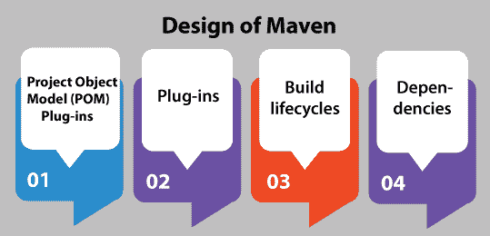
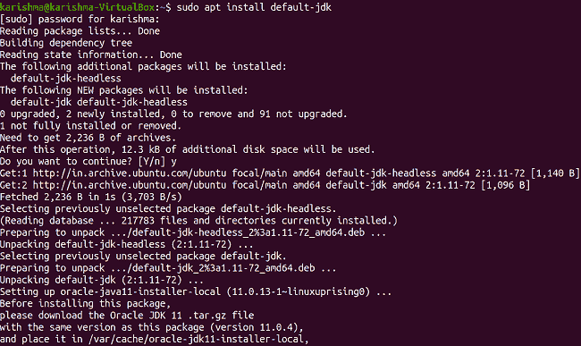
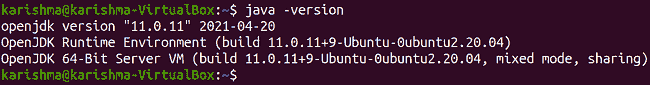
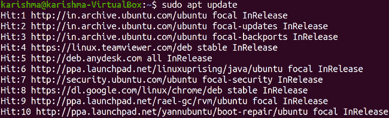
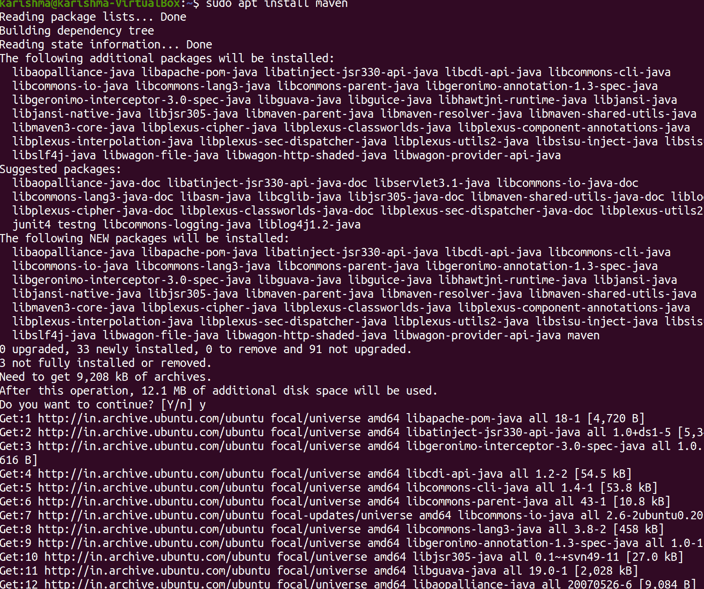
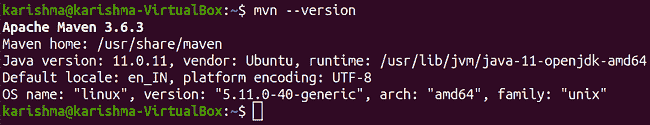

# 在 Ubuntu 中安装 Maven

> 原文：<https://www.javatpoint.com/install-maven-in-ubuntu>

## 什么是 Maven？

Maven 是一个主要用于 Java 项目的构建自动化工具。此外，它还可以用于构建和管理用 is **Scala、Ruby** 、C#和其他语言编写的项目。马文的项目通过**阿帕奇软件基金会**托管，它是**雅加达项目**的一部分。

Maven 定义了建立软件的两个方面:软件是如何建立的以及它的依赖关系。它为建立过程应用约定，不像早期的工具，如 Apache Ant。只需要描述例外情况。XML 文件定义了正在建立的软件项目及其对许多其他外部组件和模块、构建目录、顺序和所需插件的依赖。它提供预定义的代码和包装。

*   动态地，Maven 从多个存储库中下载 Maven 插件和 Java 库，如 **Maven 2 中央存储库**，并将它们保存在本地缓存中。
*   此外，这个已安装工件的本地缓存可以用本地项目生成的许多工件来更新。
*   此外，公共存储库也可以更新。
*   Maven 是用**插件架构**创建的，该架构允许它使用可从标准输入控制的应用。
*   **C/C++** 的原生插件是为 **Maven 2** 组织的。
*   许多替代技术，如 **sbt** 和 **Gradel** ，因为构建工具不依赖于 XML，但是具有 Maven 引入的关键概念。
*   开发了一个依赖关系管理器，支持 Maven 和 Apache Ivy 的存储库。

## Maven 的设计



### 项目对象模型

一个 ***项目对象模型*** 方便了一个项目的每一个配置。基本的配置包括项目的名称、它的依赖项以及它在其他项目上的所有者。此外，还可以配置一个构建过程的单个阶段，作为插件。 ***例如，*** 人们可以构建编译器插件，用于使用 1.5 版本的 Java 进行编译，或者描述项目打包，即使当一些单元测试失败时。

更大的项目应该分成许多子项目和模块，每个子项目和模块都有自己的*。然后，可以指定一个根 POM，从该 POM 可以用一个命令编译每个模块。此外，聚甲醛可以从任何其他聚甲醛获得配置。默认情况下，每个 POM 都从其超级 POM 中获取。 ***超级 POM*** 给出了默认插件、默认源目录等默认配置。*

 *### 外挂程式

***Maven*** 的大部分功能都在 ***插件*** 里面。一个插件给出一组目标，可以在 ***mvn【插件-名称】:【目标-名称】*** 命令的帮助下运行。 ***例如，*** 通过执行 ***mvn 编译器:编译*** 命令，可以用编译器插件的编译目标编译一个 Java 项目。

有许多 Maven 插件可以构建、测试、运行网络服务器、源代码管理、生成 Eclipse 项目文件等。这些插件在 ***pom.xml*** 文件的 ***<插件>*** 部分进行了配置和介绍。

默认情况下，一些基本插件会添加到所有项目中，它们有逻辑默认设置。然而，如果打包、测试和构建软件项目的原型构建序列需要手动执行所有相应的目标，这将是不方便的:

*   mvn 编译器:编译
*   mvn surefire:测试
*   mvn jar:jar

Maven 的生命周期概念管理这个问题。

插件是扩展 Maven 的主要方式。集成一个 Maven 插件可以通过扩展一个类来实现，即***org . Apache . Maven . plugin . Abtractmojo***。

### 构建生命周期

这是一个命名的阶段列表，可以用来给目标实现排序。Maven 的标准生命周期之一是默认生命周期，它有一些特定顺序的阶段，如下所述:

*   **生命周期 1:** 验证
*   **生命周期 2:** 生成源
*   **生命周期 3:** 流程来源
*   **生命周期 4:** 生成资源
*   **生命周期 5:** 流程-资源
*   **生命周期 6:** 编译
*   **生命周期 7:** 过程-测试-来源
*   **生命周期 8:** 流程-测试-资源
*   **生命周期 9:** 测试编译
*   **生命周期 10:** 测试
*   **生命周期 11:** 套装
*   **生命周期 12:** 安装
*   **生命周期 13:** 部署

插件给出的目标可以与不同的生命周期阶段联系起来。例如 ***编译器:编译*** 目标默认与相位相连，即 ***编译*** ，而 ***定火:测试*** 目标与相位相连，即 ***测试*** 。当命令，即 ***mvn 测试*** 运行时，Maven 执行与所有阶段相关的每个目标，直到并添加 ***【测试】*** 阶段。

Maven 执行目标，即 ***资源:与阶段相连的资源*** ，即 ***进程-资源*** ，然后 ***编译器:编译*** 等，直到最终执行目标，即***surefire:test***。

此外，Maven 包含清理项目和生成项目站点的标准阶段。如果清理是默认的生命周期部分，项目将在创建时一直被清理。这是不可取的，因此清洁已经提供了它的生命周期。

### 属国

依赖管理是 Maven 的一个核心方面。Maven 的依赖处理机制是通过一个坐标系来组织的，这个坐标系识别单个工件，比如软件模型或库。

## 在 Ubuntu 20.04 中安装 Maven

Apache Maven 是创建通常对应于 Java 的项目的独家高级工具。这是一个开源工具，它使用包含 XML 文件的项目对象模型来存储项目的关键信息，最终得到与艺术项目、配置文件及其依赖关系相关的信息。

为了在 20.04 版本的 Ubuntu 上有效地安装 Maven，我们需要对 Linux 的命令和工作、sudo 命令识别以及根用户权限有共同的了解。创建该工具是为了帮助用户通过熟练地报告和记录有关信息的中心项目来创建项目。

Maven 是最适合管理 Java 项目的工具。此外，它包含用于处理代码组合和包的内置对象命令。

### 马文的安装过程

Maven 的安装过程由三个基本步骤组成。在开始这三个步骤之前，我们可以利用 Maven 的每一个有益方面来管理我们 Ubuntu 系统上的 Java 项目。

**第一步:包装升级**

**第二步:Apache Maven 安装**

**第三步:验证**

### 先决条件

为了执行 Maven 命令，必须在我们的服务器上安装包含 JRE 和 JDK 开发工具包的 Java。如果我们的系统中没有安装 Java，那么我们可以在终端窗口中运行以下命令:

```

$ sudo apt install default-jdk

```



此外，我们可以在以下命令的帮助下验证 Java 系统安装及其工具包:

```

$ java -version

```



### 第一步:包装升级

首先，我们需要在 sudo apt 命令的帮助下更新现有的包。在 Ubuntu 系统上安装任何服务器或工具之前，更新我们现有的包是非常重要的。该命令如下所述:

```

$ sudo apt update

```



此外，我们可以在安装 Java 工具包之前执行这个命令。系统包将通过这种方式用 ***Java 工具包*** 安装进行更新。

### 步骤 2: Apache Maven 安装

首先，在我们的系统中有两种方法可以获得 Maven。我们可以使用 apt 命令下载，也可以直接从 ***wget*** 命令下载。

我们需要在终端窗口中运行以下命令来安装 Maven:

```

$ sudo apt install maven

```



### 第三步:验证

此外，我们可以借助终端窗口中的以下命令来验证 Maven 安装:

```

$ mvn --version

```



* * **