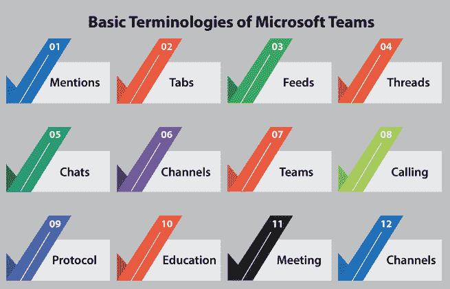
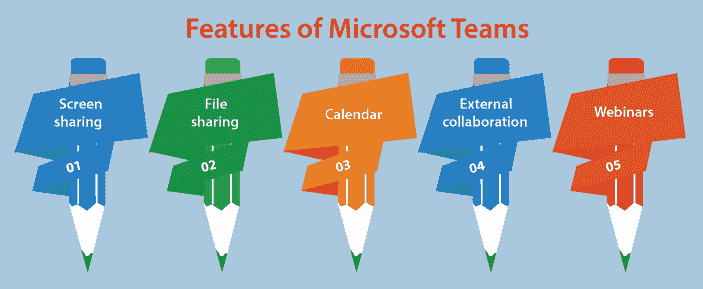
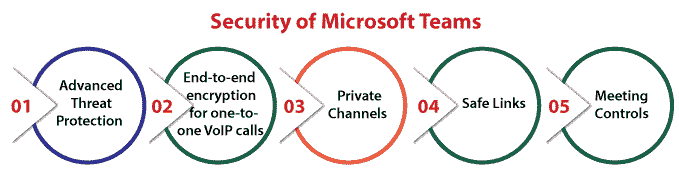

# Ubuntu 的微软团队

> 原文：<https://www.javatpoint.com/microsoft-teams-for-ubuntu>

## 微软团队简介

***微软 Teams*** 可以说是微软作为微软 365 家族众多产品的一部分，集成的一个专有的商业交流平台。团队主要通过相同的服务 Slack 来完成，提供工作区聊天、应用集成、文件存储和视频会议。

团队正在用微软运营业务的其他协作和消息平台取代，包括微软课堂和 Skype for Business。

在 ***期间，新冠肺炎·疫情、*** 微软团队和许多其他软件，如 ***谷歌会议*** 和 ***Zoom、*** 获得了兴趣，因为一些会议已经切换到虚拟环境。截至 2021 年，它每月包含约 2.5 亿用户。

微软团队主要有助于远程协作，因为它让分散在各处的员工团队保持沟通和联系。通常，它部署在整个组织中，而不仅仅是公司的某些部门。在某些情况下，团队可以用电子邮件代替员工之间的内部组织沟通。

## 微软团队的历史

***微软*** 在纽约的一场活动中宣布 ***Teams*** ，并于 2017 年 3 月 14 日在全球范围内发布了该服务。它是在公司总部内部 ***黑客马拉松*** 的时候开发的，目前由 ***布莱恩·麦克唐纳*** 执导(微软公司副总裁)。微软团队是一个桌面应用(基于网络)，使用 GitHub 集成在 Electron 框架的头部，GitHub 整合了 ***Node.js JavaScript 平台*** 和 ***Chromium 渲染引擎。***

微软于 2007 年 8 月 29 日购买了***【Parlano】***和 ***MindAlign*** (其恒群聊天产品)。

微软曾在 2016 年 3 月 3 日审查了对 Slack 80 亿美元的投标，但比尔·盖茨(Bill Gates)反对这笔收购，宣布该组织应专注于开发商业 Skype。 服务和应用的 EVP***(陆弃)*** 在采购 ***懈怠方面占据主导地位。*** 在陆于当年晚些时候 离职后，微软于 2016 年 11 月 2 日宣布 Teams 为 Slack 竞争对手。

## 微软团队的基本术语

微软团队的用户界面与屏幕左侧的其他团队协作软件相同，带有团队列表。聊天协作可以在屏幕中间进行。大多数团队协作工具使用相同的术语来标识用户界面的某些特定部分。

团队的一些术语如下:

### 提及

所有用户都可以利用提及来提醒和通知其他用户。这个术语使用了一个符号，即 ***@*** 后接人名。还有，用户可以***@提*** 全渠道全团队。

### 制表符

所有通道的顶部都是选项卡，它们连接到服务、应用和文件。选项卡的一些常见名称包括用户已传输的消息的*和用户已在频道中开始的文档的 ***文件*** 。*

 *### 饲料

此活动提要提供团队渠道中发生的提及、回复、消息和其他活动的摘要。它可以通过未读提及、消息和其他划分以及用户自己的活动来细化。

### 线

消息序列建立了一个线程。回复任何消息的用户应选择选项，即 ***【回复】*** ，而不是建立新的线索和对话。随着同事们的来回聊天，线程可能会变长。此外，用户可以在支持促进上下文通信的线程中排列视频和语音会议。

### 聊天

团队允许用户通过聊天进行交流。在团队中，聊天是持续的，因此用户不需要检查对话的历史记录，这与商业 Skype 不同。团队允许用户在聊天时使用表情符号格式化文本。用户可以选择将邮件标记为重要或紧急。重要信息会显示在红色边上。

### 通道

成员可以在团队中建立渠道。*是允许团队成员在不使用群组短信(短信)或电子邮件的情况下进行交流的对话主题。用户还可以回复带有文本、图像、定制图像宏和 gif 的帖子。*

 *直接消息允许用户向特定用户而不是一组用户发送私人消息。第三方服务和连接器可以向通道提交数据。一些连接器是必应新闻、PowerBI、推特、脸书页面和 MailChimp。

### 组

***团队*** 允许团队、团队或社区从团队所有者或管理员传送的特定网址或邀请中加入。对于教育，团队允许教师和管理员为员工、专业学习社区、班级和每个人建立一个特定的团队。

### 打电话

视频会议、网络语音和客户端软件中的即时消息为呼叫功能提供了便利。此外，团队为公共交换电话网络会议提供支持，允许用户通过客户端拨打任何电话号码。

### 草案

微软团队基于几个特定于微软的协议。许多视频会议都是通过消费者版 Skype 中的 MNP24 协议完成的。从 Skype 开始，用于商务的 MS-SIP 协议不再用于连接团队的客户端。

基于 H.323 和 SIP 的视频会议和 IP 语音的客户端需要独特的网关来连接微软团队的服务器。当无法使用 ***交互式连接建立进行对等连接时，超出限制性防火墙和网络地址转换的客户端也可以进行连接。*T3】**

### 教育

微软团队允许教师在“作业”标签的帮助下对团队上交的学生作业进行评分、提供反馈和分发，并呈现给 office 365，供许多教育订阅者使用。此外，利用 ***办公室表格，可以给任何一个发展阶段的学生分配测验。*T3】**

### 会议

可以为临时安排的会议创建几个会议，用户可以访问该频道，以检查会议当前是否正在进行。此外，Teams 还包含一个插件 ***【微软 Outlook】***，用于邀请 Teams 会议中的其他人。它支持几个可以通过会议链接连接的用户。

### 团队现场活动

它将 ***Skype 会议广播*** 替换为用户在 ***微软 Stream、Yammer、*** 或 ***团队上广播多达 10000 名参与者的能力。***

## 微软团队的特点

*   **屏幕共享:**比较老，但是典型的能力是团队协作工具中的一个基本特性。顾名思义，屏幕共享使每个用户都能在视频会议和团队通话期间实时共享桌面屏幕，如文件。
*   **文件共享:**远程团队在这个文档管理方面可以在 Team 中编辑、存储、共享文件。用户还可以在团队中实时协作处理类似的文档。
*   **日历**:团队，如微软 Outlook 电子邮件，提供全面的日历，这样每个用户都可以跟踪他们的会议、工作周和其他日常任务。团队日历和 Outlook 日历几乎没有集成。
*   **外部协作:**在 Microsoft Teams 中，来宾访问方面使用户能够邀请其企业之外的用户连接内部渠道进行文件共享、会议和消息传递。这种能力支持提供企业对企业的项目管理。
    外部协作的另一个特色，即 ***Teams Connect*** ，预计 2021 年上市。它使不同的组织能够在共享工作区的团队中会面、聊天和编辑文档。
*   **网络研讨会:**该功能指定 Microsoft Teams 为 1000 多人的交互式网络研讨会和会议提供支持。许多功能包括主持人审核控制和实时反应，用于禁用与会者的视频、音频和聊天。团队的网络研讨会可以在仅观看的广播中容纳 10，000 名用户。
    为了在 ***新冠肺炎疫情、*** 期间容纳多个远程用户，从 2021 年完工起，可提供 2 万次用户广播。与会者的报告还会显示谁参加了会议以及参加了多长时间。

微软还可以快速频繁地更新平台的功能，因为 Teams 是一个基于云的软件。因此，微软团队的功能在不断发展。

## 微软团队的整合

*   微软团队可以与 Office 365 和微软 365 套件中的其他应用集成，如 Word、SharePoint、PowerPoint、OneDrive 和 Excel。
*   此外，团队可以与许多外部应用集成，如 Zoom、思科 Webex Meetings 和 Box，以提高工作效率。
*   微软团队的 ***应用工作室*** 使企业和开发人员能够创建将与团队一起实施的定制应用。
*   微软团队可以将许多硬件组件集成到软件集成中。虽然视频通话可以在笔记本电脑和台式机上的团队中完成，但微软已经与保利、罗技和快思聪等视频会议硬件供应商合作，将团队与设备集成在一起。
*   微软团队在 Windows、macOS、iOS 和安卓设备和系统上工作。此外，它还在微软边缘、Safari、火狐和 Chrome 网络浏览器上运行。然而，Safari 和 Firefox 网络浏览器不支持一些团队会议和呼叫功能。

## 微软团队的定价计划

微软团队是免费的。然而，免费版本并不是微软商业应用套件的一部分。微软团队的付费版本提供了更多的优势和与各种微软应用的集成。企业和企业的许多计划都是可行的。虽然，对于包含 Teams 的计划，微软使用的是***【Office 365】******微软 365*** 的品牌名称。

微软专注于各种垂直行业及其产品。

该供应商特别关注团队的教育、一线员工和医疗保健。许多政府计划也是可用的，例如 ***【政府 G5、G3、*** 和 ***微软 365、*** 以及为期一个月的免费试用、非营利定价、附加服务。

与成本较低的计划相比，成本较高的计划将包含更多的好处。 ***例如，*** 该计划，即 ***Office 365 E3*** 包括每个用户每月 20 美元的更多存储，并且与每个用户每月 5 美元的微软 365 业务计划相比，还可以包含更多的会议参与者。

此外，更昂贵的计划将包含许多呼叫功能。然而，这些功能只是作为附加服务出现在成本较低的计划中。许多合规性和安全性功能要么可用，要么作为依赖于支付计划的附加服务。更昂贵的计划将包含更先进的安全功能。

## 微软团队的安全性

微软为 Teams 中的许多安全功能提供了便利，例如*(简称***【SSO】)、双因素身份验证(2FA)***和 ***传输中的数据加密*** 。团队的工作流可以利用微软其他集成应用的安全方面，如 SharePoint 加密。*

 *据微软称，供应商无法访问客户上传的内容。客户信息由客户控制，微软不会出于与服务无关的任何目的扫描团队或内容。

Teams 包含以下几个安全特性:

*   **高级威胁防护:**简称 ***ATP*** 。高级威胁防护功能是一项可选服务(基于云)，使企业能够决定内容是在团队中有害，还是通过用户访问来限制内容。
*   **一对一 VoIP 通话的端到端加密:**对于组织有意识在线对话的企业来说，这是一个即将推出的安全选项。信息技术部门将管理谁可以在企业中应用***【E2ee】***服务。该功能将在 2021 年上半年向商业客户预览。
*   **私人渠道:**私人渠道可以跟踪 Teams 内许多用户之间的私人对话，并与更大的团队分开。只有私人频道的成员和所有者才能使用该频道。如果任何用户需要一个区域来讨论有意识的信息，比如预算，那么私人渠道会非常有帮助。
*   **安全链接:**该功能已于 2021 年 3 月推出。它支持在用户点击 Office 应用中的任何链接时保护企业免受恶意网站的攻击。
*   **会议控制:**这是一个重要的功能，应该会增加像****视频*** 选项这样的会议管理。禁用视频将允许会议组织者断开所有或单个与会者的视频连接。该功能，即 ***【仅限邀请】*** 将候选人送到会议大厅，如果他们没有被直接邀请参加该会议的话。*

 *## 要点

关于团队，我们应该知道一些关键点。这些要点讨论如下:

### 1.更好的治理和更高的数据可见性

团队为业务领导者提供了对其组织中实施的工作的更深入的了解和可见性。由于团队中的每一次对话都是持续的，因此对话成为微软 365 的管理和治理工具可用的有益信息资产。

### 2.团队在外部和内部提供安全的协作

微软团队提供微软 365 套件的每一个安全方面。在团队中，数据符合 ISO 27001、SOC 2 和 SOC1 合规性。可以计划满足行业数据的几个严格的安全标准。例如，患者数据限制，即医疗保健中的***【HIPAA】***。

团队可能是安全的，被锁定的，但这并不妨碍我们轻松地进行外部和内部协作。我们的管理员可以在微软 365 团队管理中心创建来宾帐户，这是与客户、承包商、业务合作伙伴或我们希望参与的其他利益相关方进行渠道电话合作的绝佳方式。

### 3.团队包含强大的微软办公集成选项

Teams 与微软 365 高度集成。客户可以在其渠道中创建和处理 OneNote、PowerPoint、Excel 和 Word 文件，并使用其团队的 SharePoint 网站中的其他内容进行操作。

### 4.广泛的第三方集成

微软去年成立了第三方集成团队。很多提供商迅速加入，包括***【calendar hero】【Polly】【Asana】***和 ***ZenDesk。***Team 的用户可以在他们的日历、渠道中使用这些应用，最重要的是，在现场会议期间。

* * *****