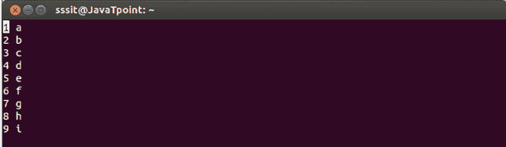
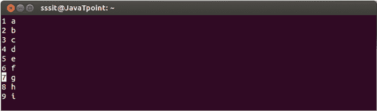
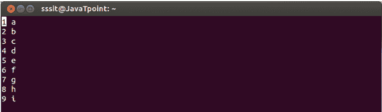
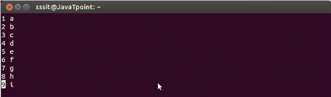
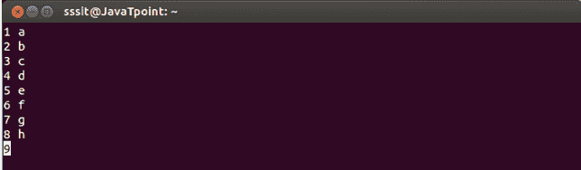
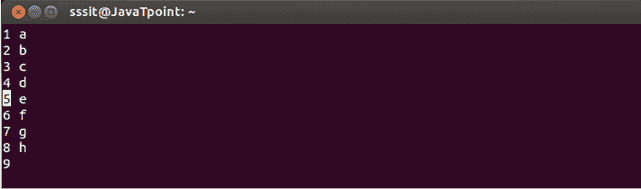
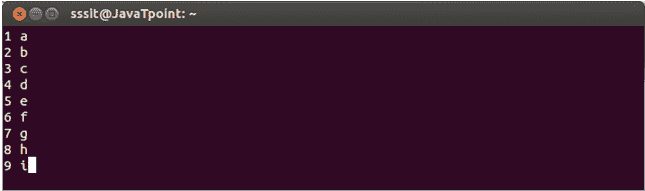

# 跳下去了

> 原文：<https://www.javatpoint.com/linux-vi-jump>

当你在文件中移动时，你需要从一行切换到另一行。虽然你可以用 j，k 键或者箭头键来完成。但是当你的文件太大的时候，可以使用 **G** 命令。如果你在 G 之前键入一个数字，那么你将被指引到键入的行号。如果你只输入 G，那么你将被引导到文件的最后一行。

vi 编辑器中的一个重要命令是**(`)。**它会帮助你回到文件中较早的位置。例如，如果您在第 4 行，通过使用 10G 命令，您将到达第 10 行。但是你忘了编辑第 4 行的内容，想回到第 4 行，这里你可以使用` `,它将把你重定向到第 4 行。

不

这里 n 表示一个数字。你可以在 G 之前输入一个数字，跳到一个特定的行。

**示例:**

7G

看上面的快照，我们的光标在第 1 行，我们想转到第 7 行。

看看上面的快照，在命令模式下输入 7G 后(你将无法在屏幕上看到输入的命令 7G)，我们在第 7 行。

**G**

如果你在 G 之前不键入任何数字，那么你将被引导到文件的最后一行。

看上面的快照，我们的光标在第 1 行。

看上面的快照，按下 G 后，我们就到了文件的最后一行。

``

这个命令允许我们移动到文件中的前一个位置。

**示例:**

看上面的快照，我们在第 **9 行。**

看上面的快照，我们在第 **5** 行，但是忘了在第 9 行写点东西。

看上面的快照，在输入``之后，我们回到第 9 行。