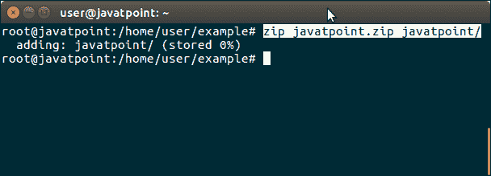
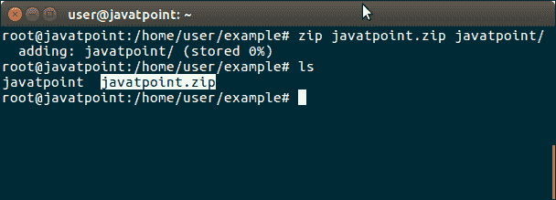
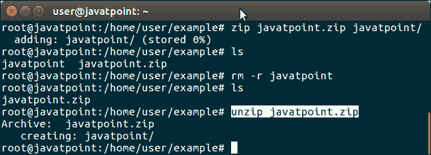
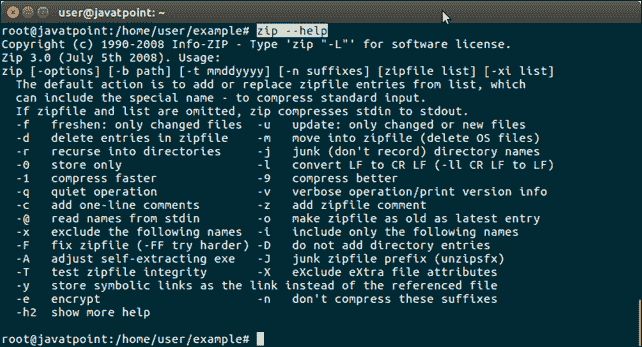

# 如何在 Ubuntu 中压缩和解压缩文件夹

> 原文：<https://www.javatpoint.com/how-to-zip-unzip-folder-in-ubuntu>

Zip 是一种存档文件格式，用于存储压缩数据。我们可以用这种压缩技术存储任意数量的文件。这种格式最初是由菲利普·卡兹在 1989 年创建的。

在本教程中，我们将使用 Ubuntu 终端压缩和解压缩目录。

首先，查看当前目录中存在的目录数量。


目前，我们有一个 **javatpoint** 目录，我们将在下一步压缩它。

* * *

## 压缩目录

使用以下命令压缩 **javatpoint** 目录。

```

$ zip javatpoint.zip javatpoint 

```



请再次查看当前目录中存在的目录数量。现在，我们又有了一个创建为 zip 文件的目录。



像 zip 一样，我们可以解压 zip 目录。就像我们下面做的那样。

* * *

## 解压缩目录

使用以下命令解压缩压缩目录。

```

$ unzip javatpoint.zip

```



### 额外信息

zip 命令有各种标志来设置 zip 文件的属性。有关这些标志的更多信息，请寻求帮助。

```

$ zip --help

```

