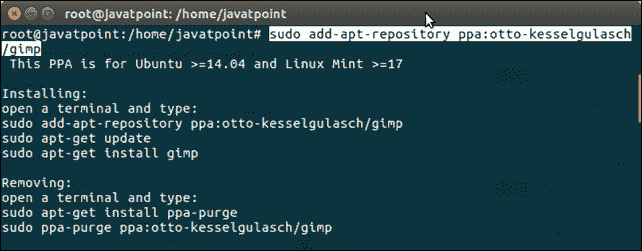
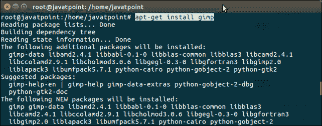
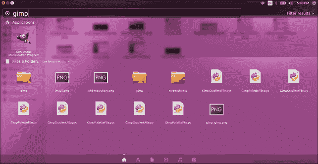
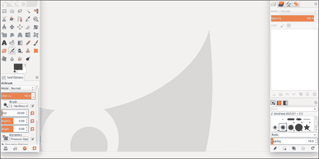

# 如何在 Ubuntu 16.04 LTS 上安装 GIMP？

> 原文：<https://www.javatpoint.com/how-to-install-gimp-in-ubuntu>

### 介绍

GIMP 是一个流行的，广泛使用的图像编辑程序。用于平面设计和绘图等。它是由斯潘塞·金博尔创建的，并在 GPLv3+许可下发布，可用于 Linux、Windows 和 Mac。

在本教程中，我们将使用终端在 Ubuntu 16.04 上安装 GIMP。该安装过程包括以下步骤。

### 先决条件

*   人的本质
*   在终端中以 root / sudo 用户身份登录

* * *

## GIMP 安装

1) **添加 PPA 库**

```

$ sudo add-apt-repository ppa:otto-kesselgulasch/gimp

```



2) **更新 APT 库**

使用以下命令更新本地存储库。

```

$ apt-get update

```

3) **安装最新 GIMP**

使用此命令安装最新版本的 GIMP 软件。

```

$ sudo apt-get install gimp

```



4) **运行 GIMP**



**应用预览**

GIMP 应用程序如下所示。



嗯，我们已经成功安装了 GIMP。现在，我们可以轻松操纵图像。