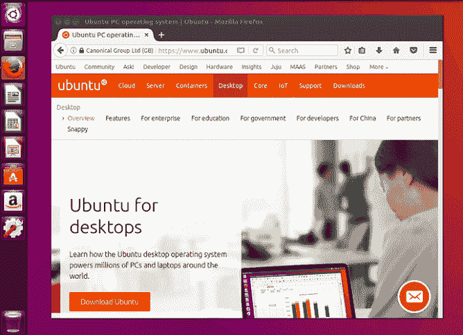
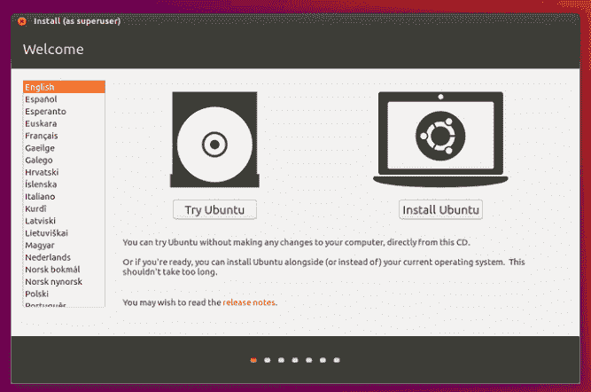
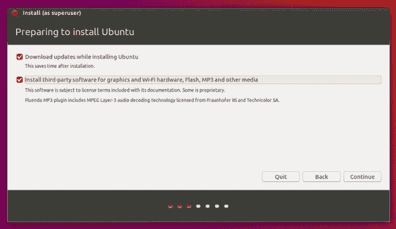
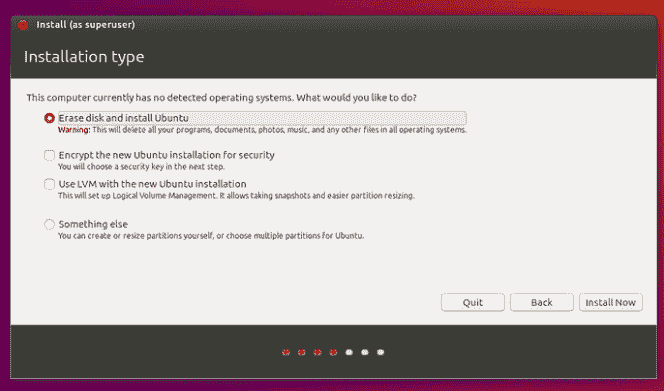
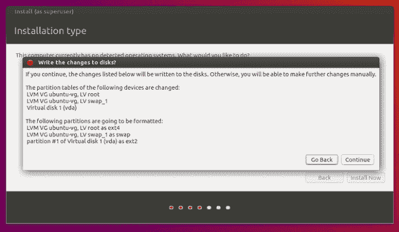
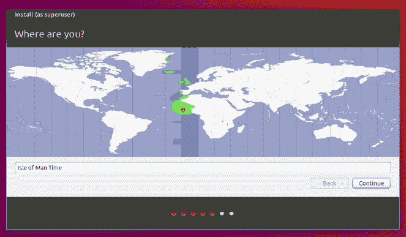
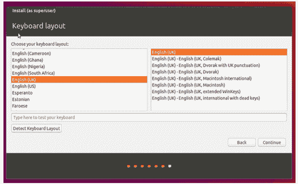
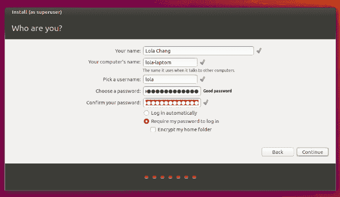
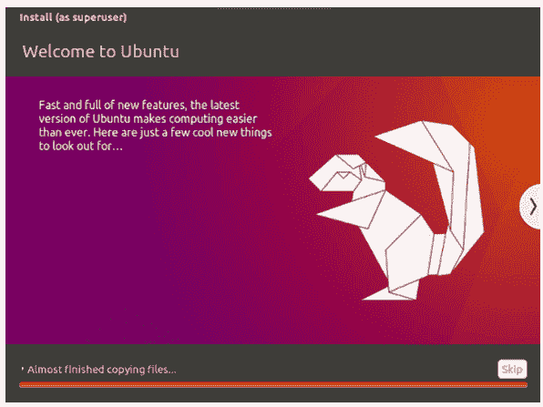
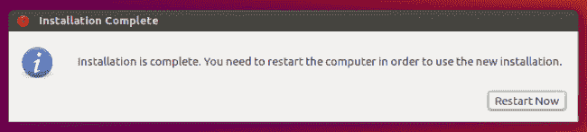

# 如何下载和安装 Ubuntu 16.04

> 原文：<https://www.javatpoint.com/how-to-download-and-install-ubuntu-16-04>

## 1.概观

Ubuntu 桌面易于安装，易于使用，包含我们执行组织、企业、家庭或学校任务所需的一切。另外，它是免费下载的，**可访问，安全，**和**开源**。

在本主题中，我们将使用电脑的 u 盘或 DVD 驱动器在电脑上安装 Ubuntu 版。

### 2.要求

在继续安装之前，我们需要遵循以下步骤:

*   将我们的笔记本电脑连接到任何电源。
*   确保我们至少有 5GB 的数据可用存储空间。
*   确保我们可以访问 u 盘或 DVD 驱动器，包括我们想要安装的 Ubuntu 版本。
*   确保我们有数据的最新备份。当任何事情都有可能出错时，我们无论如何都不能准备得太充分。

### 3.从 DVD 启动

用 DVD 下载 Ubuntu 很容易。以下是我们需要做的事情:

*   把 DVD 放入我们的 DVD/光驱。
*   重启我们的电脑。

几次之后，我们会在桌面加载后看到一个欢迎窗口。从这里，我们将使用左侧的列表选择我们的语言，并选择要么首先选择桌面(如果我们喜欢我们看到的，我们也可以通过这个模式安装 Ubuntu)要么直接安装 Ubuntu。

### 4.使用 u 盘引导

大多数电脑将从 USB 自动启动。简单地插入我们的 u 盘，或者**重启**我们的电脑，或者**打开**它。我们应该注意到类似的欢迎窗口，我们在过去的步骤中看到，即从 DVD 安装，激励我们选择我们的语言，或者尝试或安装 Ubuntu 桌面。

如果我们的电脑没有使用 USB 自动启动，请尝试按住 **F12** 键，就像您最初启动电脑一样。它将允许我们在大多数机器上通过系统特定的引导菜单来选择通用串行总线设备。

F12 键是调出我们系统开机菜单最基本的键，但是 F10 和 F2 还是基本的替代品。如果我们不确定系统是否启动，请寻找一条短消息-它通常会通知我们点击哪个键来调出引导菜单。

### 5.准备安装 Ubuntu

通过欢迎窗口选择安装 Ubuntu 后，我们会被询问第三方软件和更新。

*   我们建议同时启用**安装第三方软件**和**下载更新。**
*   保持与网络的连接，这样我们就可以在安装 Ubuntu 时接收最新的更新。
*   如果我们没有连接到互联网，我们将被要求选择任何无线网络(如果存在)。建议在安装时连接，这样我们可以确保我们的机器是最新的。

### 6.驱动器空间的分配

应用复选框来选择您是否希望用另一个操作系统安装 Ubuntu，删除我们现有的操作系统，并用 Ubuntu 替换它，或者如果我们是高级用户，选择 ***【其他】*** 选项。

Ubuntu 需要大约 4.5 GB 的数据用于任何最小的安装。但是，我们需要空间来存放数据和安装额外的应用。

### 7.开始安装

配置存储后，按下**“立即安装”**按钮。您选择的存储概述选项旁边会出现一个小窗格，当详细信息不准确时，您可以返回。

按下**“继续”**将这些修改固定到位，并开始安装过程。

### 8.选择我们的位置

如果我们连接到网络，我们的位置将被自动找到。检查位置是否准确，然后向前按继续。

如果我们不确定自己的时区，请输入城市或当地城镇的名称，或者应用地图选择位置。

如果我们在连接网络时遇到问题，请使用右上角的菜单来选择网络。

### 9.选择首选键盘布局

要告诉 Ubuntu 我们键盘的布局，按下语言选项，我们需要被我们特定的键盘布局所追求。如果我们不确定，请选择**“检测键盘布局”**按钮来帮助。

在安装过程之后，键盘布局总是可以通过桌面进行修改和补充布局。

### 10.登录详细信息

键入我们的名称，然后安装程序会自动推荐用户名和计算机名。如果我们愿意，这些很容易修改。计算机的名称是我们的计算机如何在网络上运行，那时我们的用户名是帐户和登录名。

之后，输入一个强密码。然后，安装程序会让我们知道它是否太弱。

此外，我们可以选择启用个人文件夹加密和自动登录。如果我们的机器紧凑，我们建议启用加密并保持自动登录禁用。当机器被盗或丢失时，它应该阻止用户访问我们的文件。

如果我们选择了个人文件夹加密，但忘记了密码，我们将无法检索存储在个人文件夹中的数据。

### 背景安装

现在，安装程序将在安装窗口时在后台完成，告诉我们 Ubuntu 有多不可思议。安装过程只需几分钟，具体取决于我们的网络连接和机器速度。

### 12.安装完成

在所有配置和安装完成后，会出现一个小窗口，要求我们重新启动机器。按下**“立即重启”**按钮，出现提示时丢弃 u 盘或 DVD。

现在，我们已经成功安装了世界上最著名的 Linux 操作系统。

* * *