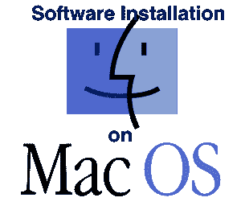

# 苹果操作系统中的软件安装

> 原文：<https://www.javatpoint.com/software-installation-on-mac>

这里列出了 35 个以上可以安装在苹果操作系统上的软件。所有安装页面都有先决条件和图像，以便您可以轻松了解安装过程。

## 苹果操作系统中的编程语言

[Install Java](how-to-install-java-on-mac)
[Install Php](how-to-install-php-on-mac)
[Install Python](how-to-install-python-on-mac)
[Install Swift](how-to-install-swift-on-mac)
[Install Ruby](how-to-install-ruby-on-mac)

## 苹果操作系统中的数据库

[Install MySQL](how-to-install-mysql-on-mac)
[Install MariaDB](how-to-install-mariadb-on-mac)
[Install MongoDB](how-to-install-mongodb-on-mac)
[Install CouchDB](how-to-install-couchdb-on-mac)
[Install Cassandra](how-to-install-cassandra-on-mac)

## 苹果操作系统中的网络服务器

[Install Apache](how-to-install-apache-on-mac)
[Install Nginx](how-to-install-nginx-on-mac)
[Install GlassFish](how-to-install-glassfish-on-mac)
[Install XAMPP](how-to-install-xampp-on-mac)

## 苹果操作系统中的开发工具

[Install phpMyAdmin](how-to-install-phpmyadmin-on-mac)
[Install Eclipse](how-to-install-eclipse-on-mac)
[Install NetBeans](how-to-install-netbeans-on-mac)
[Install Google Chrome](how-to-install-google-chrome-on-mac)
[Install VIM](how-to-install-vim-on-mac)
[Install InteliJ Idea](how-to-install-intelij-idea-on-mac)
[Install PyCharm](how-to-install-pycharm-on-mac)
[Install Atom](how-to-install-atom-on-mac)
[Install Sublime Text 2](how-to-install-sublime-text-on-mac)
[Install OpenOffice](how-to-install-openoffice-on-mac)
[Install Composer](how-to-install-composer-on-mac)
[Install Bluefish](how-to-install-bluefish-on-mac)
[Zip Unzip Directory](how-to-zip-unzip-folder-on-mac)

## 苹果操作系统中的网络框架

[Install Wordpress](how-to-install-wordpress-on-mac)
[Install Node.js](how-to-install-nodejs-on-mac)
[Install Drupal](how-to-install-drupal-on-mac)
[Install CodeIgniter](how-to-install-codeigniter-on-mac)
[Install Zend](how-to-install-zend-on-mac)
[Install CakePHP](how-to-install-cakephp-on-mac)
[Install Laravel](how-to-install-laravel-on-mac)
[Install Magento](how-to-install-magento-on-mac)
[Install YII](how-to-install-yii-on-mac)

## 苹果操作系统中的多媒体

[Install GIMP](how-to-install-gimp-on-mac)
[Install VLC](how-to-install-vlc-on-mac)