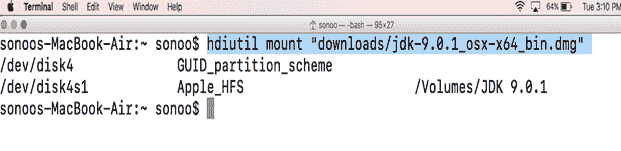
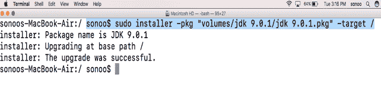
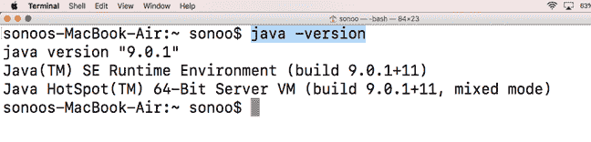

# 如何在苹果电脑上安装 Java

> 原文：<https://www.javatpoint.com/how-to-install-java-on-mac>

### 介绍

Java 是最广泛使用的通用、安全、健壮、面向对象的语言，由太阳微系统公司于 1990 年开发。Java 是可移植的，这意味着它遵循写一次运行在任何地方的范式。最新版本是 2017 年 9 月 21 日发布的 java9。在本教程中，我们将学习 Java 在 MacOS 上的安装过程。

### 先决条件

*   苹果
*   以管理员身份登录终端

* * *

## 装置

在 MacOS 上安装 Java 有以下步骤。

1) **下载最新版本**

我们只需在浏览器的搜索栏中粘贴链接即可访问甲骨文的官方网站:[http://www . Oracle . com/tech network/Java/javase/downloads/JDK 9-downloads-3848520 . html](http://www.oracle.com/technetwork/java/javase/downloads/jdk9-downloads-3848520.html)下载 MAC 操作系统的磁盘镜像文件。

2) **挂载 dmg 文件**

下载的文件在**中。dmg** 格式即磁盘镜像文件。在 Mac 操作系统上，我们不能使用安装程序命令来安装 **dmg** 文件。

Installer 命令用于包格式的文件。要获得所需格式的文件，我们需要使用以下命令装载文件。

```

$ sudo hdiutil mount downloads/jdk-9.0.1-osx_x64_bin.dmg

```



**Hdiutil** 命令与选项**-挂载**一起使用，以挂载磁盘映像文件。当我们运行这个命令时，我们将获得一个同名的挂载文件，但是在**中。pkg** 格式。该文件位于卷目录中。

3) **安装包装**

Installer 命令用于安装软件包。这可以如下所示完成。

```

$ sudo installer ?pkg "Volumes/jdk 9.0.1/jdk 9.0.1.pkg" -target /

```



此命令与目标选项一起使用，目标选项表示要安装软件包的位置。在这种情况下，我们将软件包安装在根目录中。要运行安装程序命令，我们必须拥有超级用户权限。为此，使用 sudo 提示用户填写管理员密码。该命令在我们的 MacOS 上安装全新的 Java 9。

4) **检查 java 版本**

为了确认计算机上是否安装了 java，我们可以使用如下所示的 **java -version** 命令。



5) **卸载磁盘镜像文件**

**Hdiutil** 命令配合**卸载**选项用于卸载磁盘镜像文件。卸载释放了我们安装软件包时用来存储软件包的卷。

```

$ hdiutil unmount "Volumes/jdk 9.0.1"

```

现在，如果我们在卷目录中搜索 **pkg** 文件，那么我们将找不到它。

* * *

## 额外信息

要使用 java 编译器，我们只需在终端中键入 **javac** 。要执行 java 文件，我们可以使用 java 工具，只需输入， **java <文件名>** 。

这就是我们如何在通过终端安装的 MacOS 上使用 java。