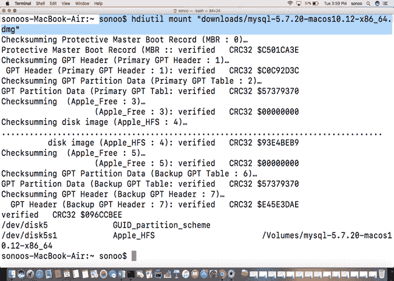
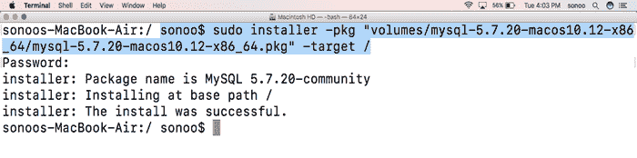
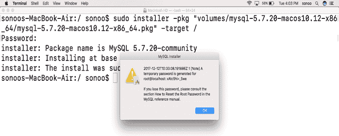
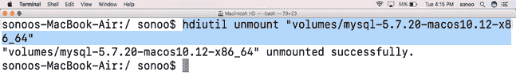
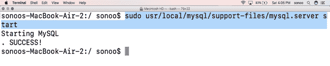
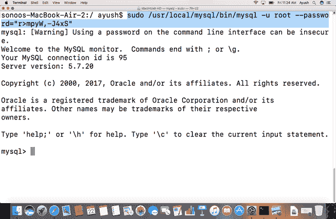
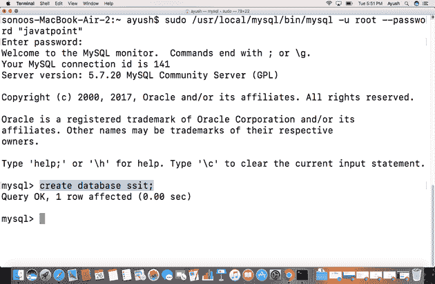
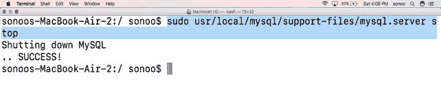

# 如何在 MacOS 上安装 MySQL

> 原文：<https://www.javatpoint.com/how-to-install-mysql-on-mac>

### 介绍

MySQL 是一个开源的关系数据库管理系统。它的名字是两个单词的组合 **My + SQL** 其中 My 是联合创始人 **Michael Widenius 的**女儿的名字，SQL 是**结构化查询语言的缩写。**

MySQL 作为数据库系统被广泛应用于各种知名公司，如谷歌和脸书。在本教程中，我们将学习在 MacOS 上安装 MySQL 服务器的过程。

### 先决条件

*   苹果
*   以管理员身份登录终端。

* * *

## 装置

以下步骤用于在 MacOS 上安装 MySQL。

1) **下载最新版本**

从其官网下载最新版本的 MySQL 社区服务器即 5.7.20，或者简单复制粘贴[https://dev.mysql.com/downloads/file/?id=473576](https://dev.mysql.com/downloads/file/?id=473576)到我们的浏览器搜索栏。该文件将以磁盘映像格式下载，首先安装在我们的卷目录中。

2) **挂载磁盘镜像文件**

**Hdiutil** 与挂载选项一起使用，将磁盘镜像文件挂载到根目录的卷目录中。

```

$ hdiutil mount "downloads/mysql-5.7.20-macos10.12-x86_64.dmg

```



3) **使用安装程序安装 MySQL 包**

该命令将 MySQL 社区服务器安装到根目录。在安装过程中，它还设置了 root 访问 MySQL 的默认密码。

```

$ sudo installer -pkg "Volumes/mysql-5.7.20-macos10.12-x86_64/mysql-5.7.20-macos10.12-x86_64.pkg" -target /

```



当我们在 MacOS 上安装 MySQL 时，会创建一个默认的用户名和密码，并在安装时显示给用户。



4) **卸载磁盘镜像文件**

需要卸载装载在卷目录中的 MySQL 包。 **Hdiutil** 与卸载选项一起使用。

```

$ hdiutil unmount "volumes/mysql-5.7.20-macos10.12-x86_64 

```



5) **启动 MySQL**

在 MacOS 上，所有的支持文件都位于 **/usr/local/MySQL。支持-文件**包含 **MySQL.server** ，它实际上是在我们需要访问数据库时启动的。为了启动 MySQL，我们必须有 MySQL 服务器的路径信息。我们必须拥有超级用户权限才能启动和停止 MySQL 数据库。

```

$ sudo usr/local/mysql/support-files/mysql.server start

```



6) **在 MySQL 命令行上工作**

1.**从命令行访问**

要从命令行运行 MySQL，我们需要先启动 MySQL 服务器。然后，将执行以下命令。

```

$ sudo /usr/local/mysql/bin/mysql -u root ?password="r>mpyW,-J4xS"

```

其中 root 是用户名，密码是 r>mpyW，-J4xS。



2.**创建数据库**

为了创建数据库，我们需要执行一个 SQL 查询，如下所示。

```

$create database ssit

```



7) **停止 MySQL**

要停止数据库，请使用以下命令。

```

$ sudo usr/local/mysql/support-files/mysql.server stop

```

