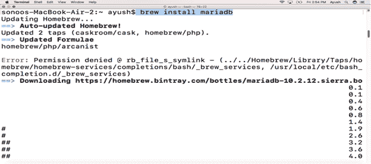
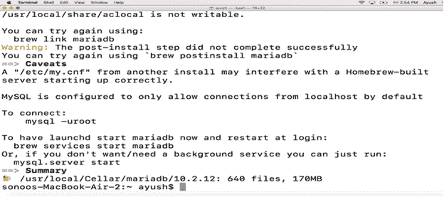
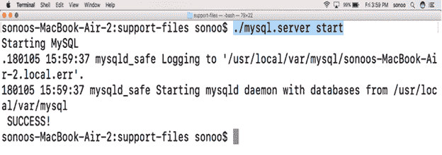
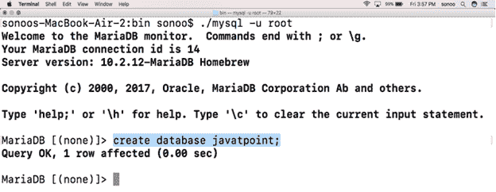
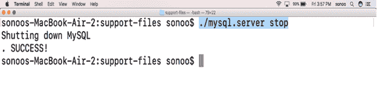

# 如何在 MacOS 上安装 MariaDB？

> 原文：<https://www.javatpoint.com/how-to-install-mariadb-on-mac>

### 介绍

MariaDB 是一个开源的数据库管理系统。MariaDB 打算保持与 MySQL 的高兼容性。它是世界上最受欢迎的数据库之一。玛利亚数据库是以其创始人 T2 的小女儿玛利亚的名字命名的。在本教程中，我们将学习在 MacOS 上安装 MariaDB 过程中涉及的步骤。

### 先决条件

1.  苹果
2.  以管理员身份登录终端

## 装置

安装包括以下步骤。

1) **更新自制包安装程序的本地库索引**

可以执行以下命令来更新自制程序的本地存储库索引。

```

$ brew update

```

2) **用家酿**安装

MariaDB 可以通过使用自制软件包安装程序来安装。执行以下命令来安装 MariaDB。

```

$ brew install mariadb 

```




3) **启动 MariaDB**

要启动 MariaDB，需要启动 MySQL.server，该服务器位于**/usr/local/Cell/Mariadb/10 . 2 . 12/支持文件**内。我们可以使用以下命令启动服务器。

```

$ ./mysql.server start 

```

要执行该命令，我们需要将工作目录更改为**usr/local/Cell/Mariadb/10 . 2 . 12/support-files**或通过编辑**更改 **PATH** 变量。bash_profile** 。



4) **在命令行工作**

要开始使用 MariaDB shell，可以执行以下命令。

```

$ ./mysql -u root

```

为此，请将工作目录更改为**/usr/local/cell/mariadb/10 . 2 . 12/bin**或编辑**。bash_profile** 。



**创建数据库**命令负责在记录中创建名为 **javatpoint** 的数据库。

5) **停止 MariaDB**

要停止 MariaDB 服务器，我们运行以下命令。

```

$ ./mysql.server stop  

```



因此，我们已经安装并开始使用 MariaDB。