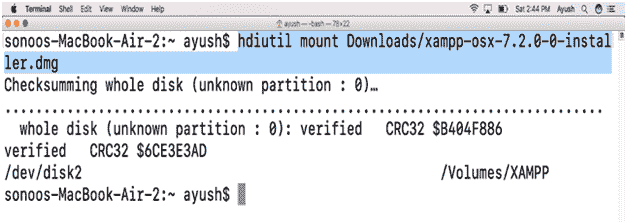
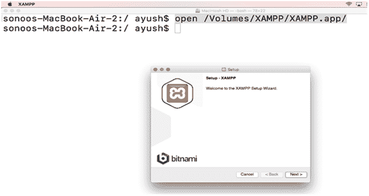
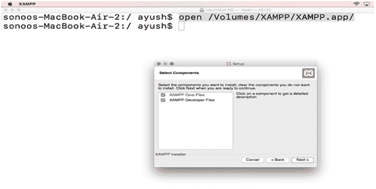
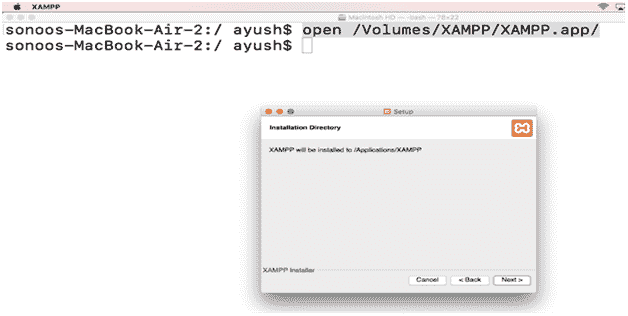
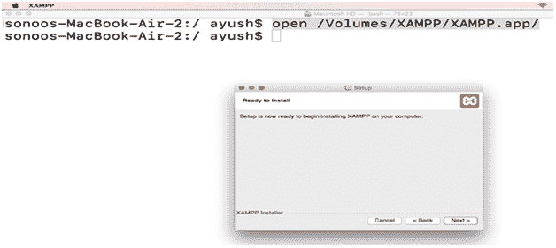
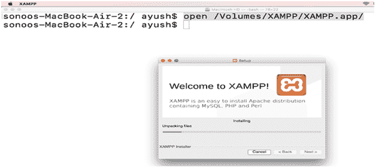
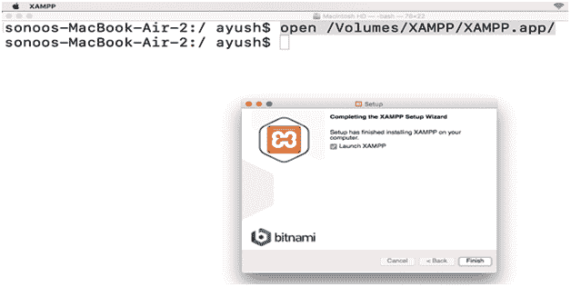
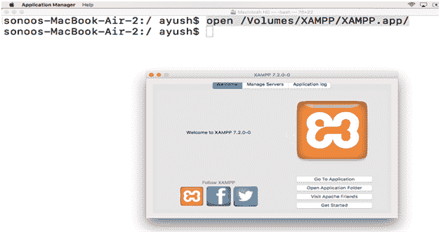
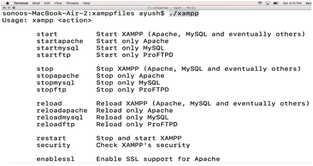

# 如何在苹果电脑上安装 XAMPP

> 原文：<https://www.javatpoint.com/how-to-install-xampp-on-mac>

## 介绍

**XAMPP** 是由 Apache Friends 开发的免费开源、跨平台的 web 服务器解决方案栈。XAMPP 支持大多数操作系统，包括 Windows、MacOS 和 Ubuntu。它代表跨平台(X)、Apache、MySQL、MariaDB、PHP 和 Perl，这些也是栈包的主要组成部分。在本教程中，我们将在 MacOS 上安装 XAMPP。

### 先决条件

1.  苹果
2.  以管理员身份登录终端

## 装置

安装包括以下步骤。

1) **下载最新版本**

为了在 MacOS 上安装 XAMPP，我们必须通过访问 XAMPP 的官方网站或通过在浏览器的搜索栏中粘贴链接[https://www . Apache friends . org/xampp-files/7 . 2 . 0/xampp-OSX-7 . 2 . 0-0-installer . dmginto](https://www.apachefriends.org/xampp-files/7.2.0/xampp-osx-7.2.0-0-installer.dmginto)来下载最新版本的。

2) **挂载 dmg 文件**

下载的文件以磁盘映像格式存在，需要安装到**卷**目录。为此，可以使用以下命令。

```

$ hdiutil mount Downloads/xampp-osx-7.2.0-0-installer.dmg

```



3) **打开申请文件**

在**/卷/XAMPP/** 中创建一个应用程序文件。这需要使用以下命令打开。

```

$ open /Volumes/XAMPP/XAMPP.app

```



点击**下一步**按钮，进入下一步。



该步骤提示我们选择要安装的组件。我们选择所有给出的选项，然后点击**下一步**



这一步只是告诉 XAMPP 将被安装的位置。点击**下一步**继续安装。







4) **卸载文件**

我们的系统上安装了 XAMPP，现在我们需要卸载安装程序。以下命令可用于此目的。

```

$ hdiutil unmount /Volumes/XAMPP

```

### 额外信息

名为 **XAMPP** 的可执行文件位于**/应用程序/XAMPP/XAMPPfiles/** 中，需要执行该文件才能在命令行上执行 xampp。各种命令可以与 **xampp** 一起使用。



该命令的输出显示了该命令的用法和选项。

因此，我们已经在 MacOS 上安装并开始使用 XAMPP。