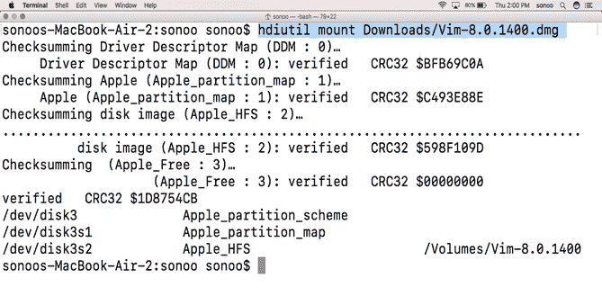
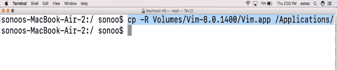
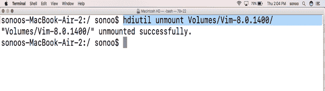
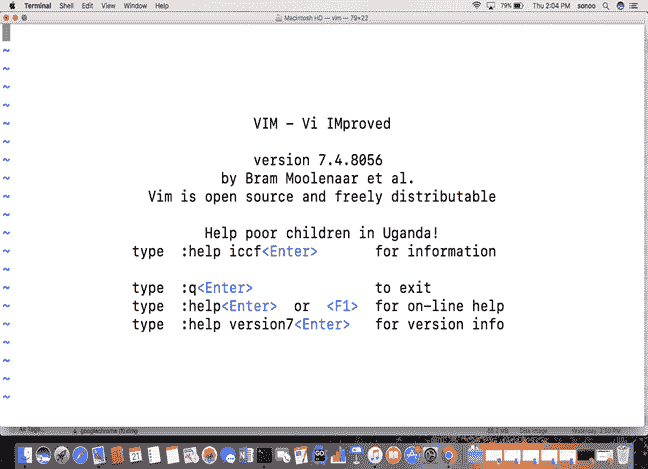

# 如何在 MacOS 上安装 Vim

> 原文：<https://www.javatpoint.com/how-to-install-vim-on-mac>

### 介绍

代表 vi 改进的 Vim 是一个文本编辑器和 vi 编辑器的改进版本，设计用于在 **CLI** (命令行界面)和 **GUI** (图形用户界面)上运行。

它是由布莱姆·米勒于 1991 年在 T2 开发的。这是一个自由和开放源码的软件，是在许可证下发布的，其中包括一些软件条款。

在本教程中，我们将学习在 MacOS 上安装 Vim 所涉及的步骤。

### 先决条件

*   苹果
*   以管理员身份登录终端。

* * *

## 装置

以下步骤用于在 MacOS 上安装 Vim。

1) **下载最新版本**

要在 MacOS 上安装 Vim 编辑器，我们必须通过访问官方网站即[https://vim.sourceforge.io/download.php](https://vim.sourceforge.io/download.php)下载其最新版本

2) **挂载磁盘镜像文件**

存储在 **Downloads** 文件夹中的下载文件(在我的例子中)是一个**磁盘映像文件**，它需要安装到 Volumes 目录中。挂载需要如下简单命令。

```

$ hdiutil mount Downloads/Vim-8.0.1400.dmg 

```



3) **将申请文件复制到申请**

文件作为 **Vim.app** 挂载，这是一个存储在卷目录中的可执行应用文件。该文件需要复制到安装应用的**应用**目录。这将通过下面给出的简单命令来完成。

```

$ cp ?R Volumes/Vim-8.0.1400/Vim.app /Applications/

```



4) **卸载文件**

我们已经完成了在我们的 MacOS 上安装 vim。下一步需要做的是卸载文件。这将通过使用 **hdiutil** 命令的**卸载**选项来完成。



5) **与 Vim 一起工作**

一旦我们在苹果电脑上安装了 Vim，我们就可以用它来编程任何语言或编辑任何文档。要开始使用 vim，我们要么在命令行上简单地键入 **vim** ，要么双击应用中显示的 Vim 图标，通过图形用户界面打开它。Vim 在终端打开，如图所示。



嗯，我们已经成功地在 MacOS 上安装并开始使用 VIM 编辑器。