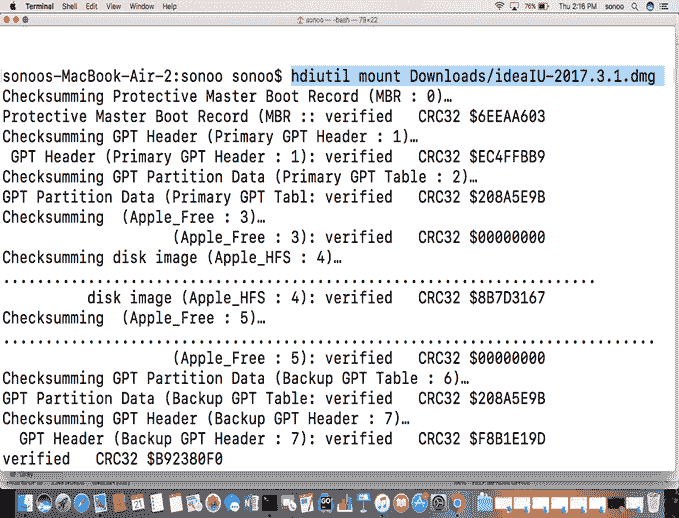
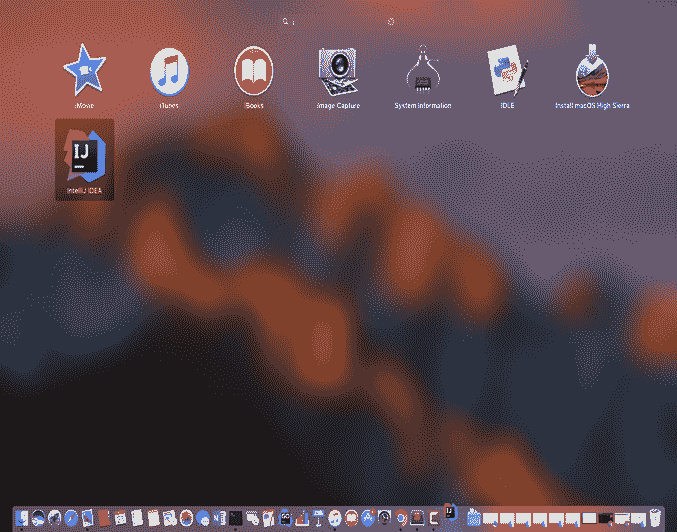
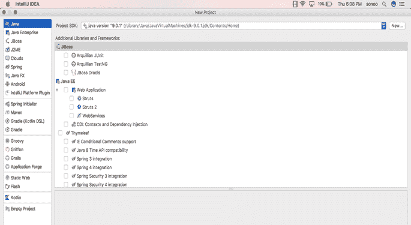

# 如何在 macos 上安装 intellij idea

> 原文：<https://www.javatpoint.com/how-to-install-intelij-idea-on-mac>

### 介绍

InteliJ Idea 是一个用于开发计算机软件的 Java 集成开发环境。它是由**喷气大脑**开发的。它是在**阿帕奇 2 授权社区版**下发布的。它的第一个版本于 2001 年 1 月在**发布。它发布时是第一个也是唯一一个可用于 Java 开发的 IDE。**

在本教程中，我们将在 MacOS 上安装 InteliJ Idea。

### 先决条件

*   苹果
*   以管理员身份登录终端。

* * *

## 装置

以下步骤用于在 macos 上安装 intellij idea。

1) **下载最新版本**

要在 MacOS 上安装 InteliJ Idea，我们会先通过访问其官网即[https://www . jet brains . com/Idea/download/download-thanks . html 下载最新版本？platform=mac](https://www.jetbrains.com/idea/download/download-thanks.html?platform=mac) 文件将以**磁盘映像**格式下载，需要先挂载该文件才能安装应用。

2) **安装应用**

下载的文件需要装载到卷目录中。这将通过 hdiutil 命令来完成。

```

$ hdiutil mount Downloads/ideaIU-2017.3.1.dmg 

```



3) **将应用复制到应用目录**

装载的文件需要安装到应用目录中。这将通过将卷目录中创建的应用文件复制到应用目录来完成。这也可以通过简单地将应用文件拖放到应用中来完成。


4) **卸载应用**

安装后需要卸载应用。这可以通过下面给出的简单命令来完成。

```

$ hdiutil unmount Volumes/InteliJ\ Idea 

```

5) **开始使用 intellij 理念**

嗯，英特尔智能理念安装在我们的系统上。现在我们必须开始了。如果我们在应用中搜索，我们会发现如下图标。



双击图标启动应用。这看起来像下面这样。



嗯，我们已经成功地在我们的苹果电脑上安装了英特尔智能手机。